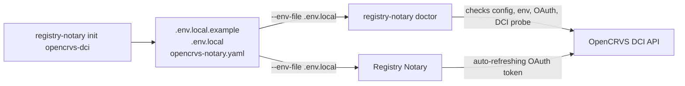

# OpenCRVS DCI Setup Simplification Spec

Status: Superseded by the generic `init dci` approach

Decision update: Registry Notary no longer carries an OpenCRVS-specific
initializer or built-in OpenCRVS DCI preset. The implemented direction is a
generic `registry-notary init dci` starter plus explicit DCI config fields.
OpenCRVS-specific values live in tutorial/config text, not code. Sections below
that discuss `init opencrvs-dci`, `opencrvs_birth_dci`, or preset expansion are
historical context from the earlier design and should not be used as current
implementation guidance.

Owner: Registry Notary

## Problem

The current OpenCRVS DCI demo works, but setup is too complex for an operator
who only wants to prove that Registry Notary can evaluate OpenCRVS evidence and
issue a demo VC.

The tutorial currently asks the user to understand and manage:

- a Registry Notary binary or source build
- OpenCRVS OAuth client credentials
- OpenCRVS OAuth client credentials for source authentication
- local Registry Notary API key material
- a derived local API key hash
- an audit hash secret
- a demo issuer JWK
- local shell-specific environment loading
- DCI-specific search fields and response paths
- claim definitions and credential profile wiring
- evaluate-before-issue sequencing for VC issuance

Most of these are legitimate concepts, but they are exposed too early. The
product should make the first successful run boring, then let advanced users
inspect and customize the underlying pieces.

## Review Position

The requested direction is sound: OAuth source auth and a `doctor` command are
the right first investments. They remove the two largest causes of operator
failure without narrowing Registry Notary into an OpenCRVS-only product.

The main change I would make to the requested ordering is to treat environment
loading and local secret generation as part of the P0/P1 experience, not as
documentation details. A generated `.env.local` is only useful if `doctor` and
the server can load it consistently, or if the generated quickstart gives one
copy-paste-safe command that exports it. Otherwise setup remains shell-specific
and fragile.

I would also avoid adding runtime shortcuts like `issuer_key: demo`. Demo issuer
keys should be generated explicitly by `init` and stored in the local secret
file. That keeps production behavior boring and auditable.

## Goal

Make the OpenCRVS DCI path easy to configure, diagnose, and operate without
removing Registry Notary's ability to support custom sources and custom claims.

The implementation must be generic first. OpenCRVS is the first packaged preset
and tutorial path, not a special runtime mode. Core capabilities such as
`source_auth`, `doctor`, `--env-file`, config explanation, credential issuance
diagnostics, preset expansion, and schema export must work for any Registry
Notary source or claim configuration. OpenCRVS-specific behavior belongs only in
versioned presets, generated starter files, and documentation examples.

The target first-run experience should be:

```bash
registry-notary init opencrvs-dci
registry-notary doctor --config opencrvs-notary.yaml --env-file .env.local --live
registry-notary --config opencrvs-notary.yaml --env-file .env.local
```

Then the user can call:

```bash
curl -X POST http://127.0.0.1:4255/claims/evaluate ...
curl -X POST http://127.0.0.1:4255/credentials/issue ...
```

## Non-Goals

- Do not remove generic DCI support.
- Do not hard-code OpenCRVS as the only DCI-compatible registry.
- Do not add OpenCRVS-only branches to the runtime request, source-auth,
  diagnostic, credential issuance, or config-validation paths.
- Do not implement citizen-wallet-bound issuance in this simplification slice.
- Do not require Docker for the standalone path.
- Do not log or print live tokens, client secrets, issuer private keys, UINs, or
  full credentials.

## Current Friction

### Binary Acquisition

The source build expects sibling repositories beside `registry-notary`. That is
acceptable for contributors, but confusing for an operator.

### Credential Model

The user has to distinguish between inbound local Registry Notary credentials
and outbound OpenCRVS credentials:

- local `x-api-key` authenticates the user to Registry Notary
- OpenCRVS OAuth bearer token authenticates Registry Notary to OpenCRVS

That distinction is correct, but the setup does not currently guide the user
through it.

### Legacy Static Token Refresh

Legacy static-token demos can still use `source_connections[].token_env`, but
the simplified OpenCRVS path uses OAuth `source_auth` with
`type: oauth2_client_credentials`. Registry Notary fetches source tokens as
needed, caches them in memory, refreshes before expiry, and retries once after a
source `401`. The tutorial should not ask operators to fetch or persist an
`OPENCRVS_DCI_TOKEN`.

### Verbose OpenCRVS Config

The OpenCRVS demo config exposes low-level DCI details:

- `search_path`
- `query_type`
- `registry_type`
- `registry_event_type`
- `records_path`
- field paths
- claim source bindings
- credential profile bindings

Those fields are useful, but a default OpenCRVS birth-record setup should not
require the user to learn all of them first.

### Weak Diagnostics

The current feedback loop is "start the server and try curl." Errors such as
missing env vars, invalid API key hashes, expired OpenCRVS tokens, unsupported
DCI request shape, and unknown response paths are discovered late.

### VC Issuance Wiring

Issuing a VC requires more than adding a credential profile. The operator must
align:

- top-level `evidence.credential_profiles`
- each claim's `formats`
- each claim's `credential_profiles`
- profile `allowed_claims`
- profile `signing_key` references
- signing key env vars
- request-time evaluation format and disclosure

This is correct from a policy perspective, but error-prone for a first-run demo.
Diagnostics should point at the missing cross-link rather than returning a
generic credential issuer error.

### Environment Loading

The standalone binary reads environment variables from the process environment.
The proposed `init` flow creates `.env.local`, so `doctor` and server startup
need either first-class `--env-file` support or generated shell commands that
source the file safely. First-class `--env-file` is preferable because it makes
local runs, CI, and tutorials consistent.

## Target Shape



## Priority Order

### P0: Env File Loading For Local Runs

Add optional env-file loading to the binary and diagnostic commands.

This is a generic Registry Notary capability. It must not assume OpenCRVS env
var names or OpenCRVS file layouts.

Command shape:

```bash
registry-notary doctor --config opencrvs-notary.yaml --env-file .env.local
registry-notary --config opencrvs-notary.yaml --env-file .env.local
```

Behavior:

- Load key-value pairs before config validation resolves env-backed secrets.
- Do not override already-set environment variables unless `--env-file-override`
  is supplied.
- Support simple dotenv syntax used by generated files.
- Reject malformed lines with line numbers.
- Never print loaded values.
- Apply the same behavior to `doctor`, server startup, and future config
  explanation commands.

Acceptance criteria:

- The `init` output can be used without shell-specific `set -a` or `source`
  instructions.
- Missing env var diagnostics identify whether the variable was absent from the
  process and from the env file.
- Tests cover env-file loading, non-overwrite behavior, malformed input, and
  redacted diagnostics.

### P0: Source OAuth Client Credentials

Add first-class OAuth client-credentials support for source connections.

This removes the biggest operational problem: manual OpenCRVS token fetch and
restart.

This is a generic source authentication feature. OpenCRVS supplies one concrete
configuration, but the model must support other HTTP-backed source connections
that use OAuth2 client credentials.

Implemented config shape:

```yaml
source_connections:
  opencrvs_crvs:
    base_url: https://dci-crvs-api.farajaland-integration.opencrvs.dev
    source_auth:
      type: oauth2_client_credentials
      token_url: https://dci-crvs-api.farajaland-integration.opencrvs.dev/oauth2/client/token
      client_id_env: OPENCRVS_DCI_CLIENT_ID
      client_secret_env: OPENCRVS_DCI_CLIENT_SECRET
      request_format: json
      scope: ""
      refresh_skew_seconds: 60
```

Compatibility:

- Keep existing `token_env` support for static bearer-token demos and non-OAuth
  sources.
- Reject configs that set both `token_env` and `source_auth` for the same source
  unless an explicit migration mode is added.

Runtime behavior:

- Fetch a source access token on first use or startup validation.
- Cache the token in memory.
- Refresh before expiry using `expires_in` when returned.
- If the token response has no expiry, use a conservative short cache lifetime.
- On OpenCRVS `401`, refresh once and retry the source call once.
- Guard concurrent refreshes so many simultaneous requests do not stampede the
  token endpoint.
- Apply the same outbound URL safety policy to `token_url` as to source
  `base_url`; private-network escape hatches must remain explicit.
- Support at least JSON request bodies for OpenCRVS and form-encoded bodies for
  generic OAuth2 client-credentials deployments. Basic-auth client credentials
  can be P1 unless OpenCRVS requires it.
- Redact client secrets and access tokens from logs, errors, traces, metrics,
  and debug output.

Acceptance criteria:

- A source connection can authenticate to OpenCRVS using only client id and
  client secret env vars.
- A long-running Registry Notary process keeps working after the initial source
  token expires.
- One `401` from OpenCRVS triggers one refresh and one retry.
- Failed token refresh returns `source.unavailable` without exposing secrets.
- Tests cover token caching, refresh before expiry, refresh-on-401, concurrent
  refresh coalescing, and redaction.
- Tests cover token endpoint URL policy and JSON/form request serialization.

### P0: `doctor` Command

Add a diagnostic command that validates configuration and external reachability
before the user starts the server.

`doctor` is a generic diagnostics framework. OpenCRVS-specific probes are
selected only when the config uses an OpenCRVS preset or DCI settings.

Command:

```bash
registry-notary doctor --config opencrvs-notary.yaml --env-file .env.local
```

Checks:

- YAML parses and validates.
- Required env vars are present.
- Local API key hashes parse as `sha256:<64 hex>`.
- Demo issuer JWK parses when configured.
- Source auth is valid.
- OAuth token can be fetched when `source_auth` is OAuth.
- DCI search request can be constructed for a sample subject or dry-run mode.
- Optional live probe can reach OpenCRVS.
- `records_path` exists in a live sample response when a sample UIN is supplied.
- Credential profile cross-links are complete for VC-capable claims.
- For each VC profile, every `allowed_claims` entry references an existing claim
  and every referenced claim opts into the profile and format.
- `Data-Purpose` handling is represented in example requests and live probes.
- Replay, audit hash, credential status, and issuer-key env vars are present
  when enabled.

Supported modes:

```bash
registry-notary doctor --config opencrvs-notary.yaml
registry-notary doctor --config opencrvs-notary.yaml --env-file .env.local
registry-notary doctor --config opencrvs-notary.yaml --env-file .env.local --live
registry-notary doctor --config opencrvs-notary.yaml --env-file .env.local --live --subject-id "$UIN" --subject-id-type UIN
registry-notary doctor --config opencrvs-notary.yaml --env-file .env.local --issue-demo-vc --subject-id "$UIN"
```

Output requirements:

- Human-readable checklist.
- Non-zero exit code on failure.
- No secret values in output.
- For each failure, include a concrete next action.

Example output:

```text
OK   config parsed
OK   REGISTRY_NOTARY_API_KEY_HASH is present and valid
OK   OpenCRVS OAuth token fetched
OK   opencrvs_birth_summary_sd_jwt can issue opencrvs-birth-record-exists
FAIL OpenCRVS DCI search returned 400
     Next action: check dci.registry_event_type and pagination.page_number support.
```

Acceptance criteria:

- Operators can detect missing env vars without starting the server.
- Operators can confirm OpenCRVS OAuth credentials without printing tokens.
- Operators can confirm local VC issuance config without issuing a live
  credential unless `--issue-demo-vc` is supplied.
- Operators get actionable messages for the known setup failures from the
  tutorial.

### P1: Generic DCI Presets And The OpenCRVS Birth Preset

Use a generic preset mechanism that supplies known source defaults before config
validation. The OpenCRVS birth preset supplies the known DCI defaults for
birth-record search.

Presets are a generic extension mechanism. `opencrvs_birth_dci` is the first
built-in preset, not a one-off branch in runtime logic.

Implemented config shape:

```yaml
source_connections:
  opencrvs_birth_records:
    preset: opencrvs_birth_dci
    base_url: https://dci-crvs-api.farajaland-integration.opencrvs.dev
    source_auth:
      type: oauth2_client_credentials
      token_url: https://dci-crvs-api.farajaland-integration.opencrvs.dev/oauth2/client/token
      client_id_env: OPENCRVS_DCI_CLIENT_ID
      client_secret_env: OPENCRVS_DCI_CLIENT_SECRET
```

Preset expands to:

```yaml
dci:
  search_path: /registry/sync/search
  sender_id: registry-notary
  query_type: idtype-value
  registry_type: ns:org:RegistryType:Civil
  registry_event_type: birth
  records_path: /message/search_response/0/data/reg_records
```

Rules:

- Presets are versioned. Example: `opencrvs_birth_dci@2026-05`.
- The unversioned name points to the current default, but `doctor` prints the
  resolved version.
- Explicit fields override preset defaults, and `doctor` reports every
  override.
- Presets may provide DCI defaults and claim templates, but must not include
  secrets or live subject identifiers.

Acceptance criteria:

- Users can configure OpenCRVS birth evidence without writing low-level DCI
  fields.
- Explicit config values can override preset defaults.
- The expanded config is visible through `registry-notary explain-config
  --config opencrvs-notary.yaml --env-file .env.local`, with secrets redacted.
- Tests prove preset defaults match the known OpenCRVS-compatible request shape.
- Tests prove unknown preset ids fail before startup with a suggested list of
  known presets.

### P1: `init opencrvs-dci`

Add a guided initializer that creates starter files for the common OpenCRVS
demo.

Command:

```bash
registry-notary init opencrvs-dci
```

Generated files:

- `opencrvs-notary.yaml`
- `.env.local.example`
- optionally `.env.local` when `--write-local-secrets` is set
- `README.opencrvs-dci.md` with the exact next commands for the generated
  paths

Generated local values:

- local Registry Notary API key
- local Registry Notary API key hash
- audit hash secret
- demo signing key, if demo issuance is enabled
- stable correlation id prefix for tutorial commands, if useful for logs

Options:

```bash
registry-notary init opencrvs-dci
registry-notary init opencrvs-dci --output ./opencrvs-notary-demo
registry-notary init opencrvs-dci --demo-issuer
registry-notary init opencrvs-dci --claims birth-summary
registry-notary init opencrvs-dci --with-env-file
```

Safety requirements:

- Do not overwrite existing files without `--force`.
- Do not print generated secrets to stdout unless `--print-secrets` is supplied.
- Write local secret files with restrictive permissions where supported.
- Put explanatory comments in generated `.env.local.example`, not in generated
  secret files.
- Make the generated config runnable without editing YAML for the common birth
  summary demo.
- Keep OpenCRVS client id and client secret unset or placeholder-only unless the
  user supplies them interactively or through flags.

Acceptance criteria:

- A user can generate a runnable OpenCRVS demo skeleton without copying a long
  YAML block from documentation.
- The generated config works with `doctor`.
- The generated local API key hash matches the generated local API key.
- The generated quickstart commands use `--env-file` and do not depend on
  shell-specific exports.

### P1: Built-In API Key Hash Utility

Add a command to derive Registry Notary API key fingerprints.

Command:

```bash
registry-notary hash-api-key
registry-notary hash-api-key --stdin
```

Behavior:

- Generate a random API key when no input is supplied.
- Print the plaintext key and hash only when the user explicitly asks for both.
- Support `--hash-only` for automation.

Acceptance criteria:

- Documentation no longer needs OpenSSL commands for API key hashing.
- The hash output matches the runtime verifier.
- The command refuses empty input.

Recommendation:

- Include this utility even if `init` generates local credentials. It remains
  useful when an operator brings their own API key or rotates a key without
  reinitializing the whole demo.

### P2: Demo Issuer Convenience

Reduce VC demo setup friction by making demo issuer material explicit and
optional.

Implemented command paths:

- `registry-notary init opencrvs-dci --demo-issuer` writes a generated issuer
  JWK to `.env.local`.
- `registry-notary demo-issuer-key` generates an Ed25519 JWK.

Rejected approach:

- Do not add implicit runtime config such as `issuer_key: demo`, even when
  `server.bind` is loopback. It creates a production footgun and makes the
  actual signing key less visible. Generate explicit local key material instead.

Acceptance criteria:

- Users do not copy a static private JWK from docs for a local smoke test.
- Production configs cannot accidentally use an implicit demo issuer.
- The tutorial clearly separates "prove issuance works" from
  "configure a production issuer."

### P2: Config Explanation And Schema Export

Add commands that help users understand generated config.

Commands:

```bash
registry-notary explain-config --config opencrvs-notary.yaml --env-file .env.local
registry-notary schema > registry-notary.schema.json
```

Acceptance criteria:

- Users can see which env vars are required by a config.
- Users can see which claim uses which source connection.
- Schema validation can run in editors or CI.
- Secret env var names may be shown, but secret values are never shown.
- Expanded config output redacts secret values and clearly marks preset-derived
  fields versus user-authored fields.

### P2: Credential Issuance Diagnostics

Add targeted diagnostics for the common VC setup mistakes.

Examples:

- Claim supports `application/dc+sd-jwt` but references no credential profile.
- Credential profile allows a claim, but the claim does not reference the
  profile.
- Claim references a missing profile.
- Requested disclosure is not allowed by the claim or the credential profile.
- Issuer JWK env var is missing or cannot sign with the advertised algorithm.
- Holder proof is missing when `holder_binding.mode = did`.

Acceptance criteria:

- `/credentials/issue` errors distinguish "evaluation was not VC-capable" from
  "profile missing" and "holder proof invalid."
- `doctor` reports all local VC wiring errors in one pass.
- Tests cover each diagnostic path without requiring live OpenCRVS.

### P2: Safe Sample Subject Strategy

The live OpenCRVS check needs a way to probe without encouraging users to paste
real identifiers into logs or docs.

Options:

- Require `--subject-id` for record-level live probes and redact it in output.
- Support a demo-only discovery mode when OpenCRVS exposes seeded demo records.
- Allow `--live oauth-only` for token and endpoint checks that do not query a
  citizen record.

Acceptance criteria:

- `doctor --live` without a subject does not imply that evidence claims are
  working end to end.
- Any subject id shown in terminal output is redacted or hashed.
- Live probe artifacts, if written, redact UINs and credentials by default.

### P3: Packaged Distribution

Make the zero-start path avoid source builds.

Options:

- Release binary archives.
- Container image with example config templates.
- Homebrew or equivalent package.

Acceptance criteria:

- The tutorial starts from "download this artifact" instead of "clone three
  repositories" for non-developers.
- Release artifacts include a version command and build metadata.
- The build includes OpenCRVS-compatible DCI search support.
- Release notes identify which preset versions and OpenCRVS demo versions were
  smoke-tested.

### P3: Optional DCI Request Signing

The current OpenCRVS integration works with unsigned DCI search requests. If
OpenCRVS enforces DCI request signatures, Registry Notary needs source request
signing.

Proposed config:

```yaml
evidence:
  signing_keys:
    opencrvs-dci-sender:
      provider: local_jwk_env
      alg: EdDSA
      kid: did:web:example.gov#dci-sender-key-1
      status: active
      private_jwk_env: OPENCRVS_DCI_SIGNING_JWK

dci:
  signing:
    signing_key: opencrvs-dci-sender
```

Acceptance criteria:

- Registry Notary can sign DCI request envelopes.
- Signing keys are redacted from logs and debug output.
- `doctor --live` can distinguish authentication failure from signature failure.

## Recommended Implementation Sequence

1. Implement P0 env-file loading for `doctor` and server startup.
2. Implement P0 source OAuth client credentials and refresh.
3. Implement P0 `doctor` with local checks, env-file support, OAuth token probe,
   and VC wiring checks.
4. Add the P1 OpenCRVS birth DCI preset.
5. Add P1 `init opencrvs-dci` using the preset.
6. Add P1 `hash-api-key` if `init` does not already cover enough of the local
   API key flow.
7. Rework the standalone tutorial into a short quickstart plus "understand it"
   section.
8. Add P2 demo issuer convenience.
9. Add P2 config explanation and schema export.
10. Add P2 credential issuance diagnostics.
11. Add P2 safe sample subject strategy if live demos remain part of the
    primary tutorial.
12. Add P3 packaged distribution.
13. Add P3 DCI request signing when OpenCRVS requires it.

## Documentation Impact

The standalone tutorial now follows this generated quickstart:

1. Install Registry Notary.
2. Run `registry-notary init opencrvs-dci --with-env-file --demo-issuer`.
3. Put OpenCRVS client id and secret into `.env.local`.
4. Run `registry-notary doctor --config opencrvs-notary.yaml --env-file .env.local --live`.
5. Start Registry Notary with `--env-file .env.local`.
6. Evaluate claims.
7. Issue the demo VC.

The detailed diagrams, config anatomy, and security notes should move after the
quickstart so the user gets one success before reading the deeper explanation.

## Decisions

- OAuth source tokens are fetched lazily on first source use in the server, then
  cached and refreshed before expiry. `doctor --live` fetches immediately as an
  explicit diagnostic probe.
- `doctor --live` defaults to OAuth and endpoint reachability only. Record-level
  probes require `--subject-id`; output must redact or hash the supplied subject.
- OpenCRVS presets live in code as versioned built-ins. `init` may render those
  presets into generated YAML, but runtime and `doctor` must use the same
  generic built-in preset expansion path. Adding another registry preset must
  not require changes to source-auth, credential issuance, or doctor core logic.
- Demo issuer keys are persisted only when the user opts in with
  `init opencrvs-dci --demo-issuer` or an equivalent key-generation command. VC
  issuance is opt-in during `init`.
- Source OAuth supports generic `json` and `form` client-credentials request
  modes in the first implementation. Basic-auth client credentials are deferred
  until a concrete source requires them.
- `--env-file` is accepted by commands that resolve env-backed config:
  server startup, `doctor`, `explain-config`, and future smoke/probe commands.
  It is not needed for `openapi`, `schema`, or commands that only generate
  standalone output.
- `doctor` is terminal-only by default. Redacted support artifacts are written
  only when `--write-artifacts <dir>` is supplied.
- Preset expansion happens before config validation as an internal transform.
  `init` may generate concrete YAML for readability, but generated YAML is not
  the only supported preset path. Preset expansion must be registry-neutral and
  keyed by preset metadata, not by hard-coded OpenCRVS checks.
- `/credentials/issue` should echo the selected `credential_profile` in the
  response. This is non-secret metadata and makes clients, smoke tests, and
  support diagnostics less ambiguous.

## Definition Of Done And Delivery Plan

### Overall Definition Of Done

This work is done only when all of the following are true:

- A fresh operator can run the documented OpenCRVS path from generated files:
  `registry-notary init opencrvs-dci`, edit only OpenCRVS client id/secret,
  `registry-notary doctor --config opencrvs-notary.yaml --env-file .env.local --live`,
  start the server with `--env-file .env.local`, evaluate a birth-summary claim,
  and issue a demo `application/dc+sd-jwt` VC.
- The path does not require manual OpenCRVS bearer-token fetching or process
  restart after token expiry.
- Generic source-auth, env-file, doctor, preset expansion, and VC diagnostics
  work from config metadata and tests include at least one non-OpenCRVS fixture
  or unit test path for each generic capability.
- Every generated or documented command avoids printing API keys, client
  secrets, access tokens, issuer private keys, UINs, and full credentials.
- `doctor` reports all local config/env/VC wiring failures with non-zero exit
  codes and concrete next actions before server startup is required.
- OpenCRVS preset expansion, source OAuth, env-file loading, init generation,
  API-key hashing, and VC diagnostics have focused automated tests.
- The standalone tutorial is updated to the new quickstart and verified against
  the implemented commands.
- `cargo fmt --all -- --check`, relevant `cargo clippy ... -- -D warnings`,
  focused tests for touched crates, and at least one end-to-end OpenCRVS smoke
  path pass in CI or a recorded release checklist.

### Wave 1: Foundations

Parallel work:

- Worker A: implement `--env-file` loading for server startup and config-aware
  subcommands.
- Worker B: implement `source_auth.type = oauth2_client_credentials`, token
  caching, refresh skew, refresh-on-401, URL policy, and redaction.
- Worker C: add config model validation and unit tests for `source_auth`,
  `token_env` conflicts, and env-file parsing.

Done for Wave 1:

- `registry-notary --config ... --env-file .env.local` starts with secrets
  loaded from the file and does not override existing env without an explicit
  override flag.
- Static `token_env` configs still work unchanged.
- OAuth source calls fetch, cache, refresh, and retry once on 401 without
  logging token material.
- Tests cover env-file success/failure, OAuth JSON/form requests, expiry,
  refresh-on-401, concurrent refresh coalescing, URL policy, and redaction.

Review checkpoint:

- Code review must include config compatibility, secret redaction, concurrency,
  and security review of outbound token URL policy before Wave 2 starts.

### Wave 2: Diagnostics

Parallel work:

- Worker A: implement `registry-notary doctor --config ... --env-file ...`.
- Worker B: add OAuth probe, DCI dry-run/live probe, and records-path checks.
- Worker C: add VC wiring diagnostics for claim formats, profile cross-links,
  signing key envs, disclosure compatibility, and holder binding requirements.

Done for Wave 2:

- `doctor` exits 0 only when all requested checks pass and exits non-zero when
  any check fails.
- Missing env vars, invalid hashes, invalid issuer JWKs, OAuth failures, DCI
  request/response mismatches, and VC wiring errors each produce a named failure
  plus a concrete next action.
- `doctor --live` can run OAuth-only without a subject, and record-level probes
  redact or hash subject identifiers in output.
- Tests assert output status, failure names, exit codes, and redaction.

Review checkpoint:

- Code review must include UX review of failure text and a negative-test audit.
  No diagnostic is accepted unless it has a failing test that proves the message
  is actionable and secret-safe.

### Wave 3: Preset And Init

Parallel work:

- Worker A: implement `opencrvs_birth_dci` preset expansion and
  `registry-notary explain-config`.
- Worker B: implement `registry-notary init opencrvs-dci` file generation.
- Worker C: implement `registry-notary hash-api-key` and demo signing key
  generation commands.

Done for Wave 3:

- `init opencrvs-dci --with-env-file --demo-issuer` creates a runnable
  directory without overwriting files unless `--force` is supplied.
- Generated local secret files have restrictive permissions where supported and
  contain no explanatory comments.
- Generated example files contain placeholders, not live secrets.
- Preset defaults match the known OpenCRVS birth-record DCI request shape, and
  explicit overrides are visible in expanded config.
- `hash-api-key` refuses empty input and produces hashes accepted by runtime
  authentication tests.

Review checkpoint:

- Code review must run the generated quickstart from an empty temp directory.
  The wave is not done until generated files pass `doctor` after only
  OpenCRVS client id/secret are supplied.

### Wave 4: End-To-End Product Slice

Parallel work:

- Worker A: update the standalone tutorial and OpenCRVS docs.
- Worker B: add or update OpenCRVS smoke tests for evaluate and
  `/credentials/issue`.
- Worker C: add release/checklist notes for binary/container distribution
  expectations and preset versions.

Done for Wave 4:

- The tutorial quickstart matches the implemented commands exactly.
- A fresh generated config can evaluate the configured OpenCRVS claim and issue
  a demo SD-JWT VC without manual token fetch.
- Smoke artifacts redact UINs, access tokens, API keys, issuer private keys, and
  full credentials by default.
- Full verification commands named in the overall definition of done pass, or
  any external-service skip is recorded with the exact blocker and last passing
  local substitute.

Review checkpoint:

- Final code review must include a clean-machine walkthrough, docs review,
  security review, and test-result review. No feature is marked complete if it
  lacks tests, docs, or an executed verification command covering its user path.
