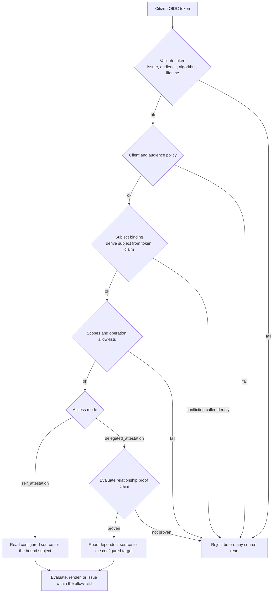

# Self-Attestation Operator Guide

> **Page type:** How-to · **Product:** Registry Notary · **Layer:** credential · **Audience:** operator

Self-attestation lets a citizen use their own OIDC token to evaluate, render, or
issue only the claims that policy allows. In direct mode, the subject is bound to
the token. In delegated mode, the authenticated requester may ask about a
configured dependent target only after a configured relationship proof claim
passes. This guide is for operators configuring those flows with an identity
provider, source registries, and relying-party or wallet clients.

Use [`oid4vci-wallet-interop.md`](oid4vci-wallet-interop.md) when the caller is
a wallet using the OID4VCI facade. Use this guide for the shared
self-attestation policy that sits underneath wallet and non-wallet citizen
flows.

## Security Goal

The core guarantee is:

> A citizen token can only be used for the exact self or dependent subject
> authorized by policy, and only for explicitly allowed claims, purposes,
> formats, disclosures, and credential profiles.

Notary validates the token, checks client and audience policy, checks subject
binding, checks scopes and operation allow-lists, then reads sources. Source
reads must not happen before those gates pass. Delegated requests add a
relationship configuration check and a proof claim that must evaluate before the
dependent claim reads its source.



*Self-attestation gates a request through token validation, client and audience
policy, subject binding, and scope and operation allow-lists. Any gate failure
rejects the request before a source is read. Delegated mode also gates dependent
source reads on a configured proof claim.*

For `/v1/evaluations`, citizen callers do not need to send their own target
identity. Registry Notary derives `requester`, `target`, and
`relationship: self` from the verified subject-binding token claim. Conflicting
caller-supplied identity context is rejected before any source read.

For delegated self-attestation, the caller sends only the dependent `target`.
Registry Notary derives `requester`, `relationship`, and `on_behalf_of` from the
authenticated principal and scoped authorization details. Caller-supplied
`requester`, `relationship`, or `on_behalf_of` fields are rejected before any
source read.

## When To Use It

Use self-attestation when:

- A citizen portal evaluates eligibility from the citizen's own token.
- A wallet flow issues a credential for the token-bound subject.
- A parent, guardian, caregiver, or similar requester needs a configured
  dependent attestation and the source owner has approved the relationship proof
  source.
- The identity provider can provide a stable, reviewed subject-binding claim.
- The source owner accepts citizen-initiated reads for the configured purpose.

Do not use it when:

- The token has no trustworthy subject identifier.
- The same endpoint needs to evaluate arbitrary subjects for a case worker or
  service. Use machine auth for that.
- Claims require batch evaluation. Batch evaluation is not supported for self-attestation.
- The source owner has not approved citizen-token driven access.

## Identity Provider Requirements

Before enabling the flow, confirm with the identity-provider owner:

- Access tokens are JWTs Notary can verify through a JWKS URL.
- Tokens have a stable issuer and audience.
- The wallet or citizen client has a stable client id or audience.
- The token carries a claim that exactly identifies the registry subject.
- The token signing algorithm is explicit and stable. Configure the algorithm
  your provider actually uses, such as `EdDSA` or `RS256`, and do not mix
  symmetric and asymmetric algorithms in one deployment.
- Token lifetime, auth age, assurance, and clock skew can satisfy your policy.
- External scopes can be mapped to the Notary scopes you require.

Avoid using `sub` as a civil identifier unless the identity-provider owner has
confirmed it is the right identifier for source lookups. If you do use `sub`,
set `allow_sub_as_civil_id: true` so the config records that decision.

## OIDC Auth Config

Self-attestation requires `auth.mode: oidc`:

```yaml
auth:
  mode: oidc
  oidc:
    issuer: https://idp.example.gov
    jwks_url: https://idp.example.gov/.well-known/jwks.json
    audiences:
      - registry-notary-citizen
    allowed_clients:
      - citizen-portal
    allowed_algorithms:
      - EdDSA
    allowed_token_types:
      - JWT
    scope_claim: scope
    scope_separator: " "
    scope_map:
      citizen.attest:
        - registry_notary:self_attest
    principal_claim: sub
    leeway: 60s
```

When OIDC mode is active, static `api_keys` and `bearer_tokens` must be empty.
Use a separate deployment or config if you need machine clients with API keys.

## Subject Binding

Subject binding is the most important part of the config:

```yaml
self_attestation:
  subject_binding:
    token_claim: civil_id
    claim_source: access_token
    request_field: subject_id
    id_type: UIN
    normalize: exact
```

Rules:

- `token_claim` must be present in the configured token source.
- `claim_source` is `access_token` by default. Use `userinfo` only when
  `auth.oidc.userinfo_endpoint` is configured and reviewed. The pre-authorized-code
  flow resolves the same binding claim from its own RP login, so when
  `claim_source: userinfo` it additionally requires
  `oid4vci.pre_authorized_code.esignet.userinfo_url` (the callback fetches the
  userinfo JWS with the eSignet access token).
- `request_field` is currently `subject_id`.
- `id_type` should match the source lookup identifier type.
- `normalize` must be `exact`.

Exact matching is deliberate. Do not rely on case folding, punctuation removal,
or local identifier normalization unless that behavior is implemented and
reviewed as part of the product.

## Citizen Client Policy

Restrict which OIDC clients can use the flow:

```yaml
self_attestation:
  citizen_clients:
    allowed_client_ids:
      - citizen-portal
    allowed_audiences:
      - registry-notary-citizen
```

At least one client id or audience is required. Any allowed audience must also
appear in `auth.oidc.audiences`. If `auth.oidc.allowed_clients` is nonempty,
each self-attestation client id must also be listed there.

## Token Policy

Set explicit policy ceilings:

```yaml
self_attestation:
  token_policy:
    required_acr_values:
      - urn:example:loa:substantial
    assurance_claim_source: access_token
    max_auth_age_seconds: 600
    max_access_token_lifetime_seconds: 900
    max_evaluation_age_seconds: 300
    max_credential_validity_seconds: 31536000
    max_clock_leeway_seconds: 60
```

Guidance:

- Keep access-token lifetime short for public citizen flows.
- Keep evaluation age short so a credential is issued from fresh evidence.
- Set credential validity to the period the issuing agency wants verifiers to
  accept the wallet-held VC. Use credential status or another lifecycle surface
  for long-lived credentials.
- Keep clock leeway small and ensure `auth.oidc.leeway` does not exceed
  `max_clock_leeway_seconds`.
- Use `required_acr_values` when the identity provider can represent assurance
  level reliably.

## Allowed Operations And Claims

Every self-attestation surface is allow-listed:

```yaml
self_attestation:
  allowed_operations:
    evaluate: true
    render: false
    issue_credential: true
    batch_evaluate: false
  allowed_purposes:
    - wallet_credential_issuance
  allowed_claims:
    - birth-record-exists
  allowed_formats:
    - application/dc+sd-jwt
  allowed_disclosures:
    - value
    - redacted
  credential_profiles:
    - birth_record_sd_jwt
```

Rules:

- Enable only operations the citizen flow actually needs.
- `batch_evaluate` must remain false; batch evaluation is not supported.
- `allowed_claims` must reference existing claims.
- `credential_profiles` must reference existing profiles.
- Credential profiles must use DID holder binding, proof of possession, and
  `did:jwk`.
- Claims and profiles must agree that the credential profile can issue that
  claim.

## Delegated Self-Attestation

Delegated self-attestation is optional and disabled by default. Enable it only
when the source owner has approved a relationship proof claim and the identity
provider or transaction-token issuer can scope the requester to the delegated
access mode.

```yaml
self_attestation:
  delegation:
    enabled: true
    allowed_relationships:
      - relationship_type: guardian
        proof_claim: guardian-link-established
        target_id_type: UIN
        allowed_claims:
          - dependent-person-is-alive
        allowed_purposes:
          - dependent_attestation
        allowed_formats:
          - application/vnd.registry-notary.claim-result+json
          - application/dc+sd-jwt
        allowed_disclosures:
          - predicate
          - redacted
        credential_profiles:
          - dependent_status_sd_jwt
```

Rules:

- `delegation.enabled: false` requires `allowed_relationships` to be empty.
- `delegation.enabled: true` requires at least one relationship.
- Each `relationship_type` must be unique.
- `proof_claim` must reference an existing claim that reads a relationship
  source binding.
- At least one source binding for `proof_claim` must bind both `requester.*` and
  `target.*` inputs.
- Each delegated claim in `allowed_claims` must declare `depends_on` for the
  `proof_claim`.
- `target_id_type` defaults to `subject_binding.id_type` when omitted.
- `allowed_purposes`, `allowed_formats`, `allowed_disclosures`, and
  `credential_profiles` are scoped to the relationship.

Runtime behavior:

- The token-bound subject is the requester.
- The request target is the dependent subject.
- The relationship type and proof claim come from scoped authorization details,
  not from caller-supplied request fields.
- Notary stores keyed hashes for the requester subject binding and dependent
  target, then rechecks them before delegated source reads.
- The dependent claim is not read unless the proof claim evaluates to boolean
  `true`.
- Render and credential issuance from a stored delegated evaluation recheck the
  current scoped authorization details against the stored metadata.
- OID4VCI credential issuance rejects delegated transaction tokens in this
  version. Use direct self-attestation for wallet issuance.

## Scope Policy

Use scope policy to require citizen tokens to carry an explicit permission:

```yaml
self_attestation:
  scope_policy: required
  required_scopes:
    - registry_notary:self_attest
```

`scope_policy` values:

- `required`: required scopes must be present.
- `optional`: scopes may be present, but policy still records what is expected.
- `disabled`: no required scopes; `required_scopes` must be empty.

Prefer `required` for shared or public deployments. Use `disabled` only for
controlled demos where client and audience policy are sufficient.

## Wallet Origins

For browser-based wallets or portals, list exact HTTPS origins:

```yaml
self_attestation:
  allowed_wallet_origins:
    - https://wallet.example.gov
```

Wildcards are rejected. HTTP origins are rejected. Empty origins are acceptable
for non-browser or backend-mediated flows where CORS is not part of the path.

## Rate Limits

The implemented limiter is in-process:

```yaml
self_attestation:
  rate_limits:
    mode: in_process
    invalid_token_per_client_address_per_minute: 20
    per_principal_per_minute: 30
    subject_mismatch_per_principal_per_hour: 5
    per_holder_per_hour: 20
    credential_issuance_per_principal_per_hour: 10
```

All values must be greater than zero. In-process limits are useful guardrails,
but public deployments should also use gateway and identity-provider controls,
especially when more than one Notary process is serving traffic.

## Source And Purpose Review

Self-attestation still reads configured source registries. Before launch:

- Confirm each source owner accepts citizen-token driven reads.
- Confirm `required_scope` on source bindings matches the policy.
- Confirm claim `purpose` or request purpose values are stable and auditable.
- Confirm source fields are minimized.
- Confirm missing and ambiguous source records produce acceptable user-facing
  behavior.

Use [`source-claim-modeling-guide.md`](source-claim-modeling-guide.md) to review
claim boundaries and source bindings.

## Rollout Checklist

- OIDC issuer, JWKS, audience, and client id are stable.
- The subject-binding claim is reviewed and present in test tokens.
- `normalize: exact` is acceptable for the identifier format.
- `scope_policy: required` is used unless there is a documented reason not to.
- All allow-lists are narrow and reference existing claims and profiles.
- Batch is disabled.
- Credential profiles use DID holder binding with proof of possession.
- Wallet origins are exact HTTPS origins, or empty for non-browser flows.
- Gateway and identity-provider rate limits are in place.
- Redis replay storage is configured when multiple processes can serve holder
  proof or nonce traffic.
- `doctor` passes, then a controlled self-attestation test passes with a test
  subject.
- Delegated claims depend on the configured proof claim, and the proof claim
  source binding uses both requester and target inputs.

## Troubleshooting

| Symptom | Likely cause | Check |
| --- | --- | --- |
| Config validation fails | OIDC mode is not enabled or static auth is still present | `auth.mode`, `auth.api_keys`, `auth.bearer_tokens` |
| Token rejected | Issuer, audience, client id, algorithm, or scope mismatch | Token header and claims, `auth.oidc`, `scope_map` |
| Subject mismatch | Token claim is missing or caller-supplied identity context conflicts with the derived subject | `subject_binding.token_claim`, token claims, request body identity fields |
| Userinfo subject not found | `claim_source: userinfo` without a usable endpoint or issuer | `auth.oidc.userinfo_endpoint`, `userinfo_issuers` |
| Delegated relationship denied | Delegation is disabled, relationship type is not configured, authorization details do not name the configured proof claim, or caller supplied requester/relationship context | `delegation.enabled`, `allowed_relationships`, token authorization details, request body |
| Delegated relationship unproven | The proof claim failed or returned anything other than boolean `true` | `proof_claim`, relationship source data, proof claim rule |
| Credential issuance denied | Profile or claim missing from allow-lists | `allowed_claims`, `credential_profiles`, claim/profile cross references |
| Batch request denied | Batch evaluation is not supported for self-attestation | Keep `batch_evaluate: false` |
| Works locally but fails active-active | In-process rate limits or replay state are not shared | Add gateway limits and Redis replay storage |
