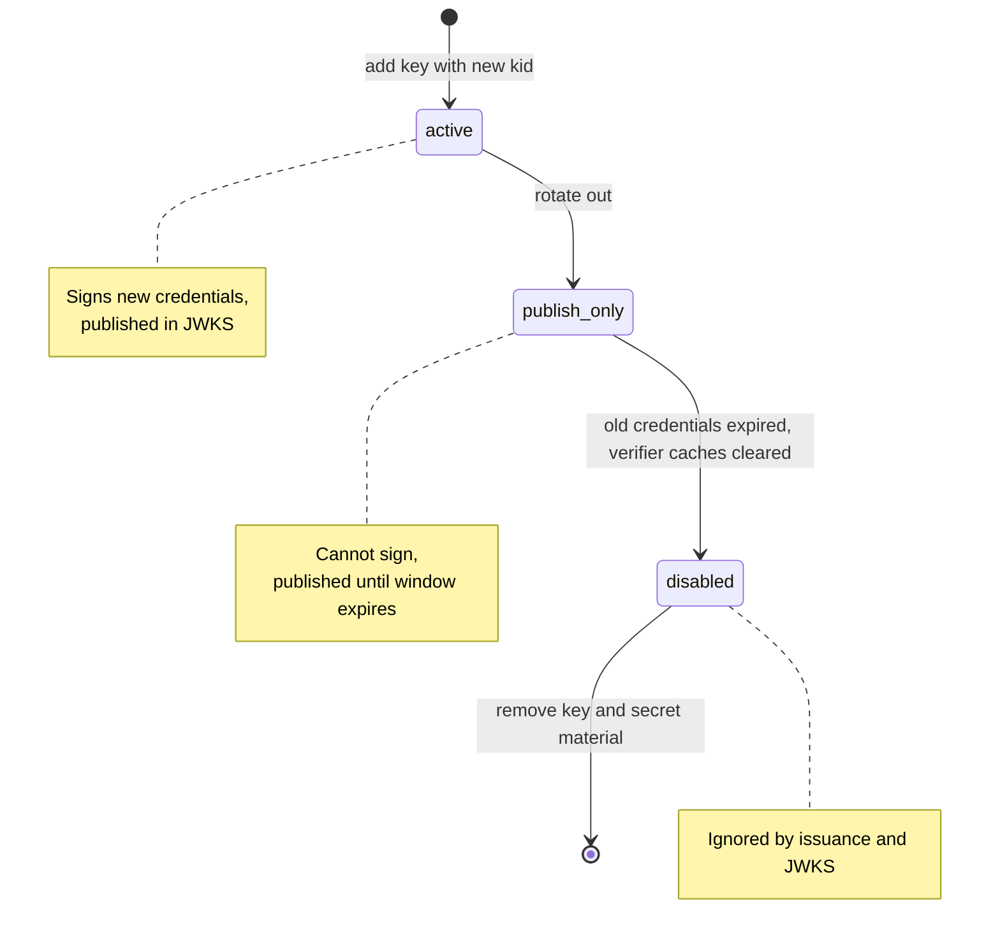

# Signing Key Provider Configuration

> **Page type:** How-to · **Product:** Registry Notary · **Layer:** credential · **Audience:** operator

Registry Notary signs SD-JWT VC credentials and federation response JWTs through
named signing keys under `evidence.signing_keys`. Credential profiles and
federation config reference those keys by id. This keeps profile policy,
federation policy, and key storage separate while making rotation explicit.

Only Ed25519 EdDSA is supported. Other algorithms are rejected at config
validation time.

## Runtime Contract

- `active` keys can sign new credentials and are published in
  `/.well-known/evidence/jwks.json`.
- `publish_only` keys are published in JWKS while
  `publish_until_unix_seconds` is absent or still in the future, but cannot be
  used by a credential profile. Use them for old verification keys during
  rotation.
- `disabled` keys are ignored by issuance and JWKS publication.
- Published `kid` values must be unique across active and publish-only keys.
- Credential profile issuers must match the signing key `kid` DID when the key
  uses a `did:web` `kid`.
- Federation response signing uses `federation.signing.signing_key`, which must
  reference an active named signing key.
- Private key material is read only at startup for active local keys. Rotated
  publish-only keys use public JWK material only.
- Startup fails closed if an active signing provider cannot be constructed or
  cannot pass its sign/verify self-test.

The public JWKS endpoint is intentionally unauthenticated for wallet and
verifier discovery. It publishes public verification keys only; private JWK
members such as `d` are rejected on public-key inputs and never emitted.

## Provider Fields

| Provider | Status | Required fields | Forbidden fields |
| --- | --- | --- | --- |
| `local_jwk_env` | `active` | `private_jwk_env`, `alg`, `kid` | PKCS#11 and PKCS#12 fields |
| `local_jwk_env` | `publish_only` | `public_jwk_env`, `alg`, `kid` | `private_jwk_env`, PKCS#11 and PKCS#12 fields |
| `file_watch` | `active` | `path`, `alg`, `kid` | env-backed JWK, PKCS#11, and PKCS#12 fields |
| `pkcs11` | `active` | `module_path`, `token_label`, `pin_env`, `key_label`, `key_id_hex`, `public_jwk_env`, `alg`, `kid` | local JWK and PKCS#12 fields |
| `pkcs11` | `publish_only` | `public_jwk_env`, `alg`, `kid` | HSM lookup fields, local JWK and PKCS#12 fields |
| `local_pkcs12_file` | any | none | all runtime use is rejected |

## Local JWK Active Key

Use this for local development, tests, and simple mounted-secret deployments.

```yaml
evidence:
  signing_keys:
    issuer-2026:
      provider: local_jwk_env
      private_jwk_env: REGISTRY_NOTARY_ISSUER_JWK
      alg: EdDSA
      kid: did:web:issuer.example#issuer-2026
      status: active
  credential_profiles:
    civil_status_sd_jwt:
      format: application/dc+sd-jwt
      issuer: did:web:issuer.example
      signing_key: issuer-2026
      vct: https://issuer.example/credentials/civil-status
      allowed_claims: [person-is-alive]
```

The private JWK must be an Ed25519 private JWK. If it contains `kid` or `alg`,
those values must match the configured key. Startup signs and verifies a fixed
self-test payload before the key is accepted.

Generate a local demo key with:

```sh
registry-notary demo-issuer-key
```

The generated private JWK belongs in the environment variable named by
`private_jwk_env`, not inline in the YAML config.

## Local JWK Rotation Key

Use `publish_only` for old verification keys that must remain in JWKS but must
not sign new credentials. Publish-only local keys use public metadata only.

```yaml
evidence:
  signing_keys:
    issuer-2025:
      provider: local_jwk_env
      public_jwk_env: REGISTRY_NOTARY_ISSUER_2025_PUBLIC_JWK
      alg: EdDSA
      kid: did:web:issuer.example#issuer-2025
      status: publish_only
      publish_until_unix_seconds: 1772592000
```

`publish_until_unix_seconds` is optional metadata and valid only for
`publish_only` keys. Expired publish-only keys are omitted from JWKS and from
restricted posture `notary.signing_keys.publish_only`. Publish-only keys cannot
be referenced by `credential_profiles.*.signing_key`.

Governed signed config apply can remove expired publish-only keys with change
class `signing_key_cleanup` once they are no longer active signing references.
Cleanup before `publish_until_unix_seconds` has elapsed is rejected before
anti-rollback advances.

## Federation Response Signing

Federation response JWTs use the same provider abstraction as credential
issuance. The federation block references an active key by id:

```yaml
evidence:
  signing_keys:
    federation-response:
      provider: local_jwk_env
      private_jwk_env: REGISTRY_NOTARY_FEDERATION_RESPONSE_JWK
      alg: EdDSA
      kid: agency-a-fed-1
      status: active

federation:
  enabled: true
  signing:
    signing_key: federation-response
```

For HSM-backed federation response signing, configure the referenced key with
`provider: pkcs11`. The JWT `kid` is taken from the provider's configured
public key id.

## Rotation Procedure

1. Add the new key as `active` with a new `kid`.
2. Move credential profiles to the new `signing_key`.
3. Move the old key to `publish_only` and configure only `public_jwk_env`.
4. Set `publish_until_unix_seconds` to the end of the verifier window, or omit
   it for an indefinite manual window.
5. After the verifier window ends, remove the old key with governed
   `signing_key_cleanup`, or change it to `disabled` during the next local-file
   deploy when running without signed apply.

Do not reuse a `kid` for new key material. Verifiers cache keys by `kid`, and
reuse creates ambiguous verification behavior.



*Signing key status through a rotation. The notes restate the runtime contract
for each status; the numbered steps above walk the same transitions.*

## PKCS#11 Active Key

Enable the server feature `pkcs11` to use an HSM-backed Ed25519 signing key.
Published product binaries and container images compile this feature, but they
do not bundle vendor PKCS#11 modules or token state.

```yaml
evidence:
  signing_keys:
    issuer-hsm:
      provider: pkcs11
      module_path: /opt/homebrew/lib/softhsm/libsofthsm2.so
      token_label: registry-notary
      pin_env: REGISTRY_NOTARY_PKCS11_PIN
      key_label: issuer-signing-key
      key_id_hex: 01ab23cd
      public_jwk_env: REGISTRY_NOTARY_ISSUER_PUBLIC_JWK
      alg: EdDSA
      kid: did:web:issuer.example#issuer-hsm
      status: active
```

Startup loads the PKCS#11 module, finds exactly one token by `token_label`,
checks CKM_EDDSA support, finds exactly one private key by `key_label` and
`key_id_hex`, then signs and verifies a self-test payload against
`public_jwk_env`.

Each provider enforces a five-second end-to-end signing timeout and allows only
one in-flight sign call at a time. These limits affect capacity planning: a slow
or stuck HSM call blocks subsequent signing requests for that provider until the
timeout elapses. Startup opens a session, authenticates, locates the private
key, and runs a bounded sign-and-verify self-test. That session is reused for
subsequent signatures. If a sign call fails, the provider reopens the session
and retries once before returning an error. PIN values are read from the
environment and are not logged.

PKCS#11 module calls cannot be cancelled once the module is executing.
Production HSM deployments must configure vendor driver network, session, and
request timeouts below the five-second service-level signing timeout, so a stuck
module call returns before that deadline. If Registry Notary reaches its own
timeout first, the provider is marked unhealthy and `/ready` fails for that
process so traffic can drain while the vendor call finishes or the process is
restarted.

### SoftHSM Smoke Setup

The test suite verifies the PKCS#11 path with SoftHSM when `softhsm2-util` and
`openssl` are available:

```sh
cargo test -p registry-notary-server --no-default-features --features pkcs11 \
  pkcs11_signing_key_signs_with_softhsm_when_available -- --nocapture
```

For local manual setup:

```sh
export SOFTHSM2_CONF=/path/to/softhsm2.conf
softhsm2-util --init-token --free \
  --label registry-notary --so-pin 123456 --pin "$REGISTRY_NOTARY_PKCS11_PIN"
openssl genpkey -algorithm ED25519 -out issuer-ed25519.pem
softhsm2-util --import issuer-ed25519.pem \
  --token registry-notary --pin "$REGISTRY_NOTARY_PKCS11_PIN" \
  --label issuer-signing-key --id 01ab23cd --force
```

The public JWK in `public_jwk_env` must match the public half of the imported
key and must contain the configured `kid` and `alg`.

## PKCS#11 Rotation Key

Old HSM-backed verification keys can be published without HSM access.

```yaml
evidence:
  signing_keys:
    issuer-hsm-2025:
      provider: pkcs11
      public_jwk_env: REGISTRY_NOTARY_ISSUER_2025_PUBLIC_JWK
      alg: EdDSA
      kid: did:web:issuer.example#issuer-hsm-2025
      status: publish_only
      publish_until_unix_seconds: 1772592000
```

## Disabled Keys

Disabled keys are ignored by issuance and JWKS publication.

```yaml
evidence:
  signing_keys:
    retired:
      provider: local_jwk_env
      alg: EdDSA
      kid: did:web:issuer.example#retired
      status: disabled
```

## PKCS#12

`local_pkcs12_file` is intentionally rejected. It is present in the config enum
only to reserve the provider name until a real, tested implementation exists.

## Verification Checklist

After changing signing configuration or provider code, run the test suite as described in
[Verification in the workspace README](../README.md#verification).

Note: some server tests bind local sockets and may need to run outside strict network sandboxes.

## Limits

- No vendor HSM is certified by this repository yet. SoftHSM verifies the
  PKCS#11 integration path, not vendor-specific behavior.
- PKCS#12 is not implemented.
- Ed25519 EdDSA is the only supported issuer signing algorithm.
