# Registry Witness Scenario Catalog

This catalog describes practical places where Registry Witness can help. It is
not a protocol spec. It is a product and demo guide for deciding which flows are
already supported, which are demo-only, and which need more runtime work.

The scenarios use five status labels:

| Status | Meaning |
| --- | --- |
| Supported | Works in Registry Witness runtime and has focused tests or existing product coverage |
| Lab-supported | Can be shown with demo scripts or config, but is not a complete runtime feature |
| Partial | Important pieces exist, but named product gaps remain |
| Planned | Captured in specs or roadmap, not implemented yet |
| Out of scope | Not a Registry Witness responsibility |

## Personas

Scenario stories use the same small cast so examples stay easy to follow:
Alice is usually the citizen, resident, farmer, household representative, or
holder; Bob is the case worker or service operator; Carol is the registry
steward; Dave is the auditor or security operator; Erin is the program
administrator; Charlie is a child or dependent person Alice may be authorized
to represent; the Rivera household is a collective subject Alice may represent.

| Persona | What They Need | Examples |
| --- | --- | --- |
| Citizen or resident | Share only the proof needed to access a service | Parent applying for child support, farmer applying for a voucher |
| Case worker | Make an evidence-backed decision without seeing unnecessary registry data | Benefits officer, enrollment officer |
| Program administrator | Define eligibility policy, evidence requirements, and acceptable issuers | Social protection ministry, agriculture program team |
| Registry steward | Protect source registry data while answering authorized evidence questions | Civil registry, farmer registry, health facility registry |
| Auditor or oversight body | Verify decisions and data exchanges were lawful, minimized, and replay-protected | Internal audit, data protection authority |
| Wallet or client app operator | Help users present proofs or receive credentials | Mobile wallet, service portal, case-management app |

## Systems

| System | Role |
| --- | --- |
| Source registry | Operational system of record. It is not exposed directly to consumers |
| Registry Relay | Read-only gateway and metadata publisher for source registry data |
| Registry Witness | Evaluates claims, signs results, issues credentials, enforces evidence policy, and emits audit |
| Registry Manifest | Public metadata and discovery artifact for capabilities, profiles, and evidence offerings |
| Registry Platform | Shared crypto, HTTP, OIDC, SD-JWT, DID/JWK, replay, and audit primitives |
| Service portal or case system | Starts a service workflow and consumes evidence or decisions |
| Holder wallet or client app | Stores credentials, presents proofs, and receives issued credentials |
| Trust bundle or trust registry | Later-stage signed trust metadata. It is not an MVP allowlist |
| Audit store | Local audit trail for evaluations, issuance, denials, and federation exchanges |

## Reusable Patterns

### Local Evaluation

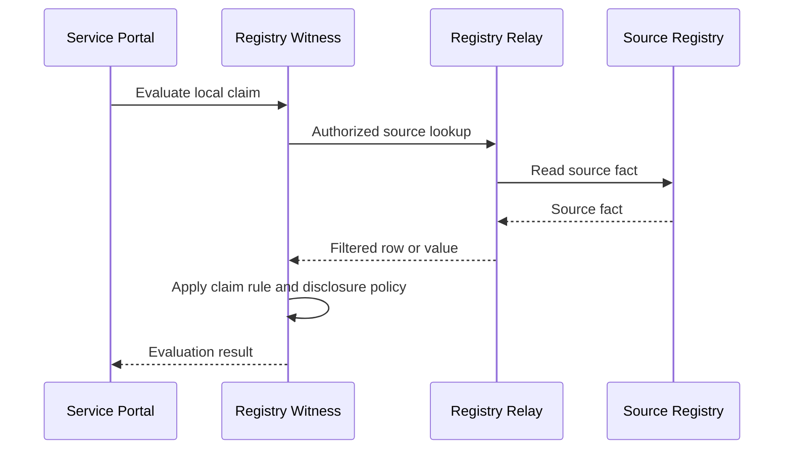

### Delegated Evaluation

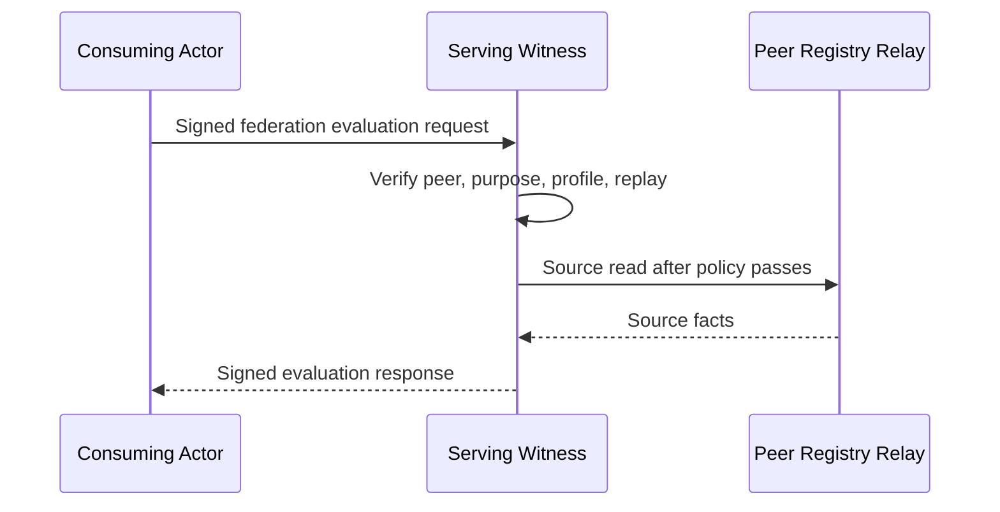

### Outbound Composition

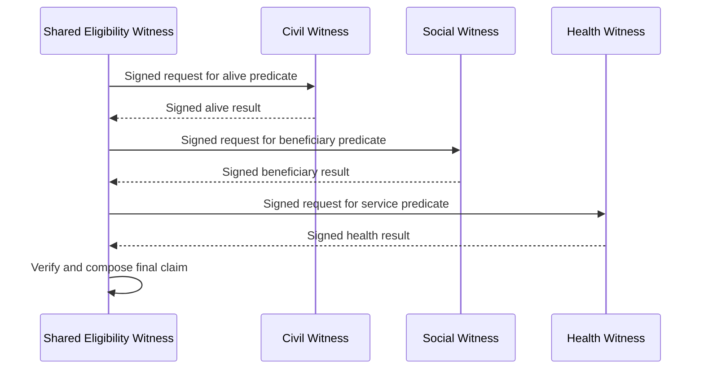

### User-Presented Proof

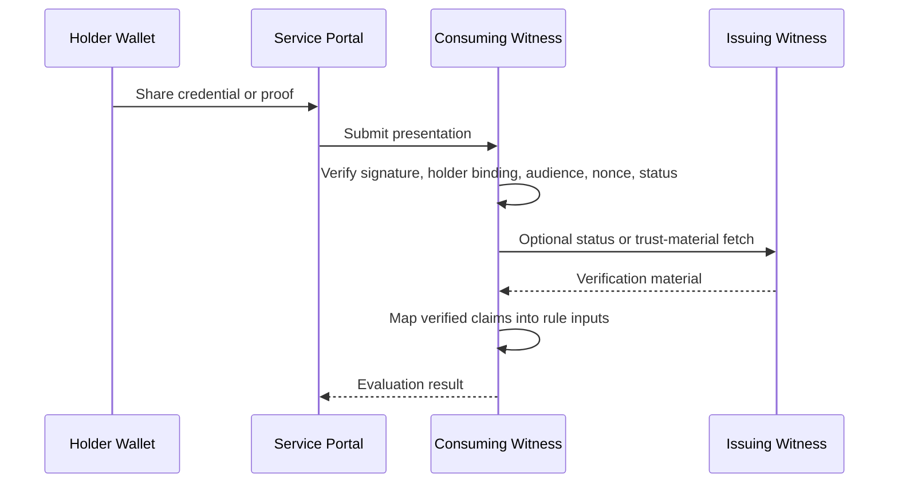

### Credential Issuance

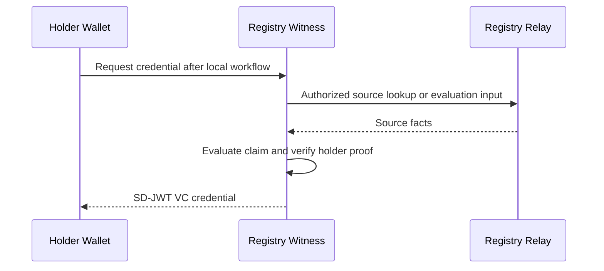

## Scenario Matrix

| # | Scenario | Pattern | Status | Main Gap |
| --- | --- | --- | --- | --- |
| 1 | Civil alive predicate | Local evaluation | Supported | None for configured local sources |
| 2 | Age or date-of-birth evidence | Local evaluation | Supported | None for configured local sources |
| 3 | Program enrollment active | Local evaluation | Supported | None for configured local sources |
| 4 | Health facility service available | Local evaluation | Supported | None for configured local sources |
| 5 | Agriculture voucher eligibility | Local evaluation | Supported | None for configured local sources |
| 6 | Livestock movement permit eligibility | Local evaluation | Supported | None for configured local sources |
| 7 | Benefits agency asks Civil Witness for alive predicate | Delegated evaluation | Partial | Product can serve inbound, but has no outbound Witness connector |
| 8 | Benefits agency asks Social Witness for active beneficiary predicate | Delegated evaluation | Partial | Product can serve inbound, but has no outbound Witness connector |
| 9 | Health-linked child support across civil, social, and health | Outbound composition | Planned | Needs outbound connector and runtime composition |
| 10 | Municipality verifies residency with a national registry steward | Delegated evaluation | Partial | Needs demo/client wiring and metadata publication |
| 11 | Citizen presents civil-status proof to a benefits service | User-presented proof | Planned | Needs proof profiles and verifier runtime |
| 12 | Farmer presents landholding or farmer-registration proof | User-presented proof | Planned | Needs proof profiles and status/freshness policy |
| 13 | Health worker presents professional credential for service eligibility | User-presented proof | Planned | Needs proof profiles and issuer trust policy |
| 14 | Parent or guardian requests a service for a child or dependent | Representation plus proof | Planned | Needs actor/subject separation and representation authority policy |
| 15 | Household or group representative requests a service | Representation plus proof | Planned | Needs collective subject model and representative authority policy |
| 16 | Civil Witness issues date-of-birth or alive credential | Credential issuance | Supported | Local wallet ceremony is still demo-grade |
| 17 | Agriculture Witness issues voucher eligibility credential | Credential issuance | Supported | Local wallet ceremony is still demo-grade |
| 18 | Shared Eligibility Witness issues combined-support credential | Credential issuance plus composition | Partial | Credential issuance exists, but peer-result composition is missing |
| 19 | Consuming service helps holder obtain credential from remote Witness | Federated credential issuance | Planned | Needs holder-binding ceremony, nonce ownership, and relay rules |
| 20 | Replay and emergency peer/key denial | Governance | Supported | Shared replay store is still needed for active-active production |
| 21 | Auditor verifies minimized decision evidence | Governance | Partial | Signed results and audit exist, checkpoints are planned |
| 22 | Peer audit checkpoint monitoring | Governance | Planned | Needs checkpoint publisher, Merkle builder, and peer monitor |

## Scenarios

### 1. Civil Alive Predicate

Pattern: Local evaluation  
Status: Supported  
Priority: High

Story: Bob is reviewing Alice's application and only needs to know whether the
civil registry still records her as alive. The Civil Witness checks the source
through the Civil Relay and returns a signed predicate, so Bob gets the answer
without receiving Alice's full civil record.

Personas: case worker, registry steward, auditor  
Systems: service portal, civil Witness, civil Relay, civil registry, audit store

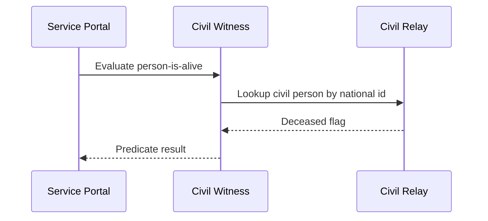

Supported today:

- Claim configuration with Registry Data API or DCI source connectors.
- Predicate disclosure.
- Redacted audit event.

Missing:

- No product gap for configured local sources.

### 2. Age Or Date-Of-Birth Evidence

Pattern: Local evaluation  
Status: Supported  
Priority: High

Story: Alice needs to prove that she meets an age requirement, but she should
not have to expose more civil data than necessary. Bob asks the Civil Witness
for a date-of-birth value or an age predicate, and the Witness applies the
configured disclosure policy before returning the result.

Personas: citizen, case worker, registry steward  
Systems: service portal, civil Witness, civil Relay, civil registry

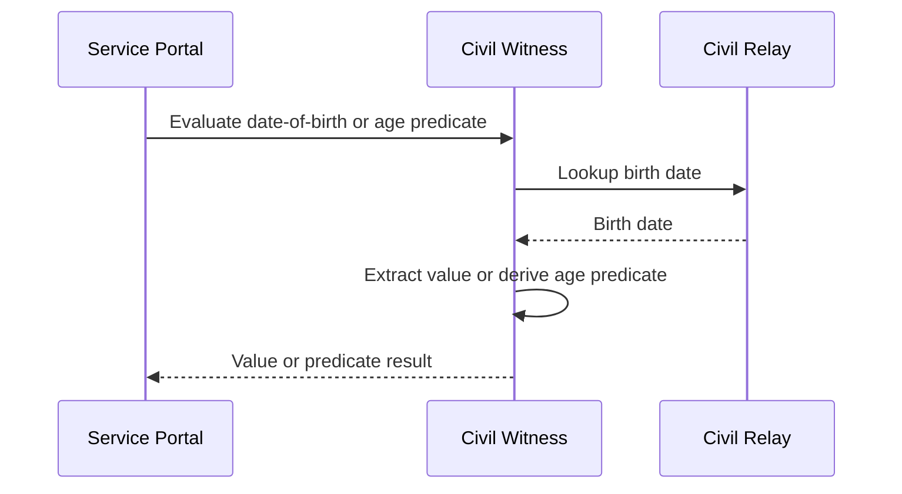

Supported today:

- Value and predicate disclosure modes.
- SD-JWT VC issuance for configured credential profiles.

Missing:

- No product gap for configured local sources.

### 3. Program Enrollment Active

Pattern: Local evaluation  
Status: Supported  
Priority: High

Story: Bob wants to confirm that Alice is actively enrolled in a social
program before approving a linked benefit. The Social Protection Witness checks
the program enrollment record and returns only the active-beneficiary evidence
that the workflow needs.

Personas: case worker, program administrator, registry steward  
Systems: social protection Witness, social protection Relay, source registry

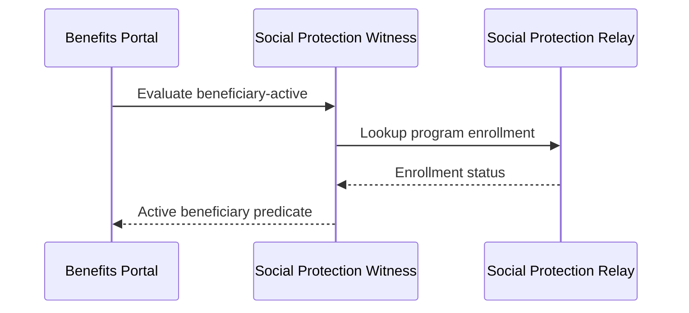

Supported today:

- Local claim dependencies and CEL rules.
- Predicate or value result formats.

Missing:

- No product gap for configured local sources.

### 4. Health Facility Service Available

Pattern: Local evaluation  
Status: Supported  
Priority: Medium

Story: Bob is processing a service request that depends on whether a nearby
facility is licensed and ready to provide care. The Health Witness evaluates
the facility facts behind the Health Relay and gives Bob a service-availability
predicate instead of raw facility rows.

Personas: case worker, program administrator, registry steward  
Systems: health Witness, health Relay, health facility registry

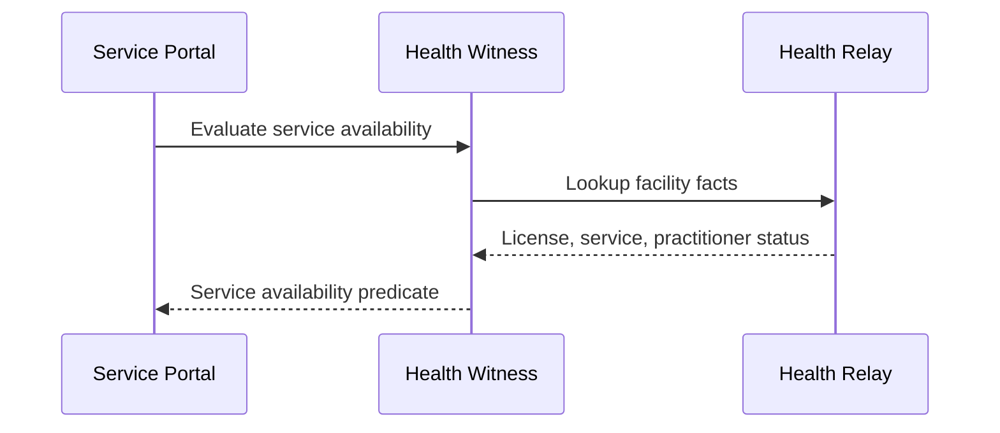

Supported today:

- Multi-field source bindings.
- CEL rules over filtered source facts.

Missing:

- No product gap for configured local sources.

### 5. Agriculture Voucher Eligibility

Pattern: Local evaluation  
Status: Supported  
Priority: High

Story: Alice is a farmer applying for a climate-smart input voucher. The
Agriculture Witness checks the farmer, parcel, and redemption facts needed for
Erin's program rules, then returns an eligibility result and reason without
handing the portal all of Alice's registry records.

Personas: farmer, case worker, agriculture program administrator  
Systems: agriculture Witness, agriculture Relay, farmer and parcel registries

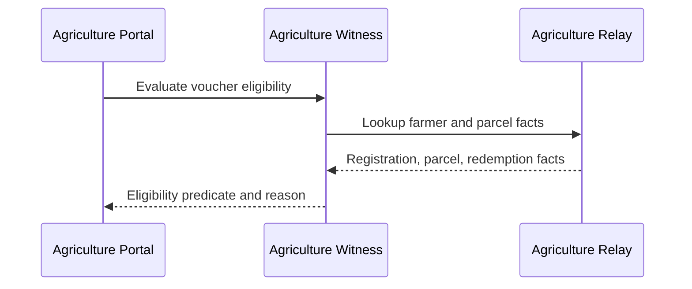

Supported today:

- Demo configuration can evaluate voucher eligibility.
- Reason-code style companion claims can explain denials.
- Local SD-JWT VC issuance can represent successful eligibility.

Missing:

- No product gap for configured local sources.

### 6. Livestock Movement Permit Eligibility

Pattern: Local evaluation  
Status: Supported  
Priority: Medium

Story: Alice needs permission to move livestock between districts. The
Agriculture Witness evaluates herd, vaccination, and quarantine facts and gives
Bob a permit predicate plus a reason code when the movement should be denied.

Personas: farmer, case worker, veterinary registry steward  
Systems: agriculture Witness, agriculture Relay, livestock registry

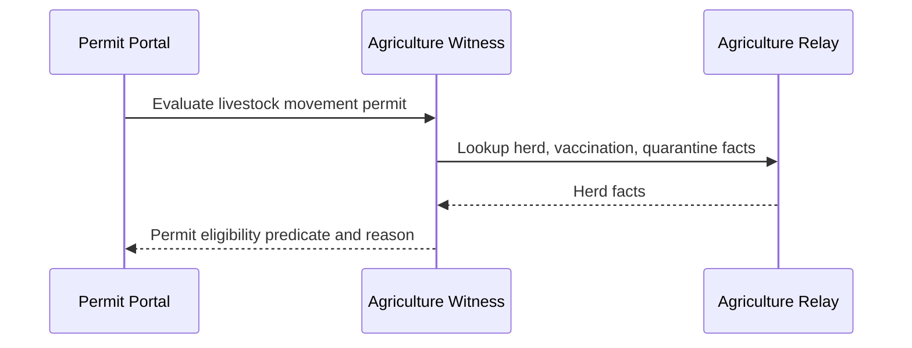

Supported today:

- Local multi-claim evaluation.
- Predicate results and reason-code claims.

Missing:

- No product gap for configured local sources.

### 7. Benefits Agency Asks Civil Witness For Alive Predicate

Pattern: Delegated evaluation  
Status: Partial  
Priority: High

Story: Bob works for the benefits agency, while Carol's civil registry owns the
source facts. Instead of giving Bob direct read access to the civil registry,
the benefits actor sends a signed request to Carol's Civil Witness and receives
a signed alive predicate back.

Personas: case worker, registry steward, auditor  
Systems: benefits portal or peer Witness, civil Witness, civil Relay

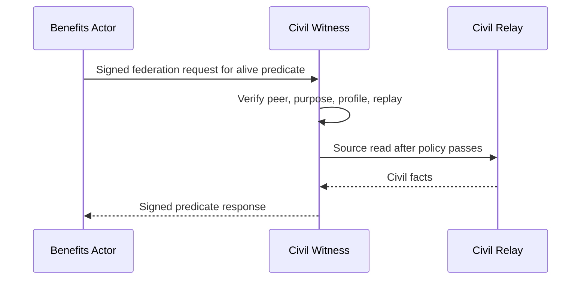

Supported today:

- Inbound `POST /federation/v1/evaluations`.
- Static peer policy, request verification, replay rejection, signed response.

Missing:

- Product outbound Witness-to-Witness connector.
- Lab client scenario that signs and verifies the full flow end to end.

### 8. Benefits Agency Asks Social Witness For Active Beneficiary

Pattern: Delegated evaluation  
Status: Partial  
Priority: High

Story: Bob needs to know whether Alice is an active beneficiary in another
agency's program. The benefits actor asks the Social Protection Witness for a
signed active-beneficiary predicate under a specific purpose, keeping the
social registry steward in control of the source data.

Personas: case worker, program administrator, auditor  
Systems: benefits portal or peer Witness, social protection Witness, social Relay

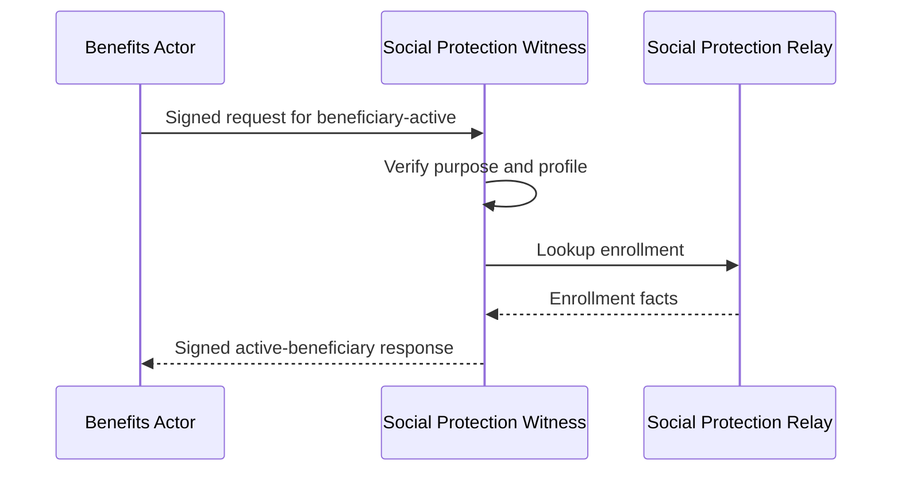

Supported today:

- Serving Witness side of delegated evaluation.
- Purpose and profile policy checks.

Missing:

- Product requester/runtime connector.
- Demo fixture wiring for social federation profile metadata.

### 9. Health-Linked Child Support Across Three Authorities

Pattern: Outbound composition  
Status: Planned  
Priority: High

Story: Alice applies for health-linked child support, and no single agency owns
all the facts. A Shared Eligibility Witness would ask Civil, Social, and Health
Witnesses for signed predicates, verify them, and compose one final eligibility
claim for Bob to review.

Personas: citizen, case worker, registry stewards, auditor  
Systems: shared eligibility Witness, civil Witness, social Witness, health Witness

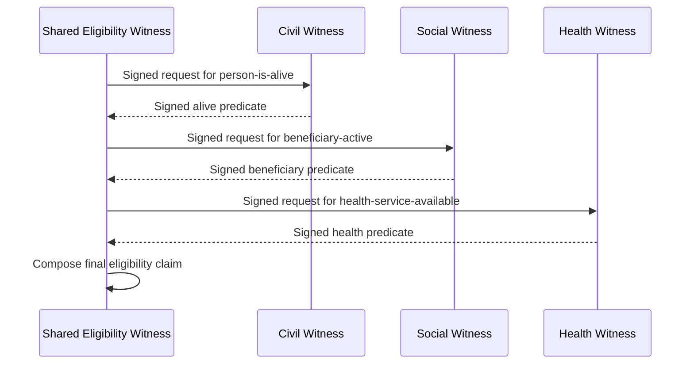

Supported today:

- Each domain claim can be evaluated locally.
- Inbound delegated evaluation exists.

Missing:

- `registry_witness_federation` source connector.
- Runtime mapping of signed peer responses into CEL inputs.
- Deterministic failure mapping for peer denial, stale source, and timeout.

### 10. Municipality Verifies Residency With A National Steward

Pattern: Delegated evaluation  
Status: Partial  
Priority: Medium

Story: Bob works at a municipality and needs to confirm Alice's residency
without receiving a national population record. The municipal service asks the
national Witness for a residency predicate, and Carol's national registry keeps
control of what can be answered and audited.

Personas: citizen, municipal case worker, national registry steward  
Systems: municipal portal, national civil or population Witness

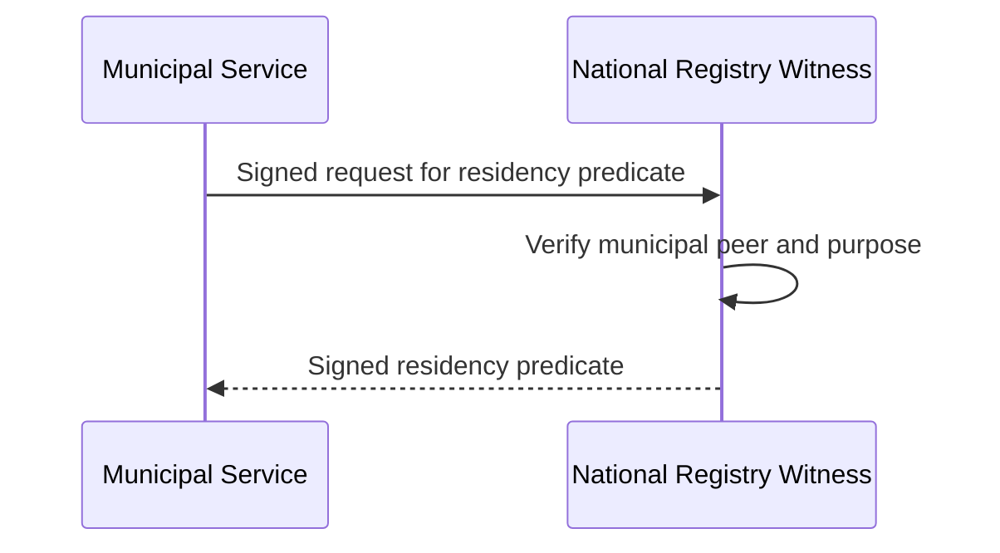

Supported today:

- Inbound serving pattern is supported.
- Static peer policy can restrict profile and purpose.

Missing:

- Residency profile fixtures.
- Outbound requester support in Registry Witness if the municipal service is
  itself a Witness workflow.

### 11. Citizen Presents Civil-Status Proof To Benefits Service

Pattern: User-presented proof  
Status: Planned  
Priority: High

Story: Alice already has a civil-status credential in her wallet and wants to
share it with a benefits service. Bob's Benefits Witness verifies the
presentation, holder binding, audience, freshness, and status policy before
using the disclosed claims as evidence.

Personas: citizen, case worker, registry steward  
Systems: holder wallet, benefits portal, benefits Witness, civil Witness

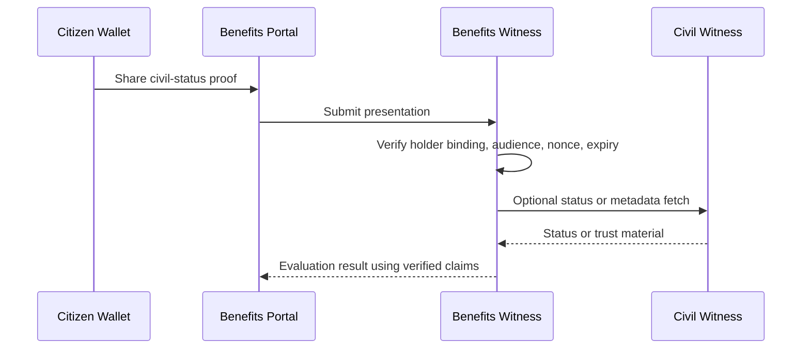

Supported today:

- SD-JWT VC issuance primitives exist.

Missing:

- User-presented proof verifier profile.
- Mapping verified disclosures into local rule inputs.
- Presentation replay and status policy.

### 12. Farmer Presents Landholding Or Registration Proof

Pattern: User-presented proof  
Status: Planned  
Priority: Medium

Story: Alice has a farmer-registration or landholding credential from a
trusted authority. Rather than asking a service portal to read the underlying
farm registry, Alice presents the proof and the Agriculture Witness maps the
verified claims into the voucher eligibility workflow.

Personas: farmer, agriculture case worker, registry steward  
Systems: farmer wallet, agriculture portal, agriculture Witness

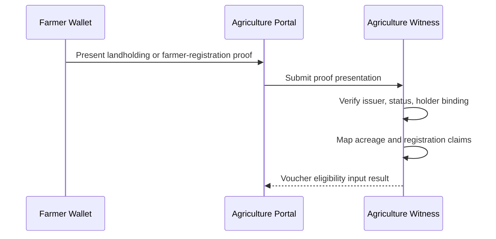

Supported today:

- Local agriculture eligibility can be evaluated against Relay sources.

Missing:

- Proof profile for accepted landholding or farmer-registration credentials.
- Freshness and revocation policy for agricultural proofs.

### 13. Health Worker Presents Professional Credential

Pattern: User-presented proof  
Status: Planned  
Priority: Medium

Story: Alice is a health worker whose professional status affects whether a
facility can satisfy a service rule. She presents her professional credential,
and the consuming Witness verifies issuer trust and holder binding before using
that status in the local decision.

Personas: health worker, program administrator, auditor  
Systems: holder wallet, service portal, benefits or health Witness

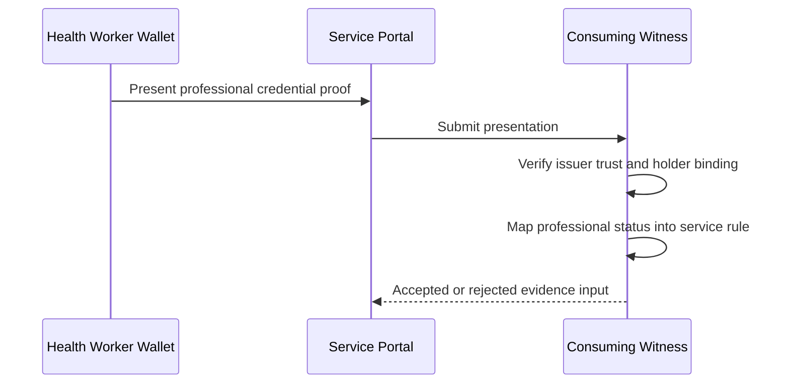

Supported today:

- Credential issuance and verification primitives exist in platform-adjacent
  crates.

Missing:

- Witness runtime proof intake.
- Issuer trust policy and status policy for professional credentials.

### 14. Parent Or Guardian Requests A Service For A Child Or Dependent

Pattern: Representation plus proof  
Status: Planned  
Priority: High

Story: Alice is applying for a child benefit on behalf of Charlie. Bob needs
evidence about Charlie, but Alice is the person interacting with the portal, so
the Benefits Witness must verify both Charlie's eligibility evidence and
Alice's authority to act for Charlie.

Personas: citizen or resident, case worker, registry steward, auditor  
Systems: holder wallet, service portal, benefits Witness, civil Witness, social Witness

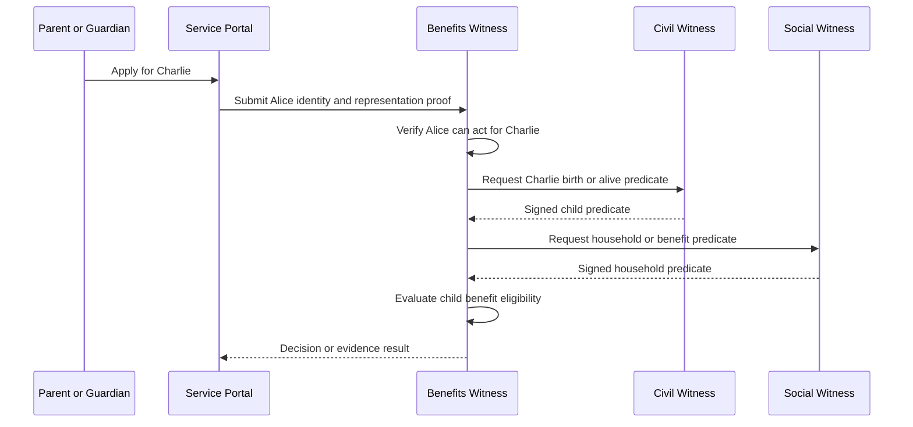

Supported today:

- Local and delegated claim evaluation can represent some child-related facts.
- User-presented proof is planned as the mechanism for representation evidence.

Missing:

- Actor and subject separation in request and audit models.
- Representation proof profiles for parentage, guardianship, power of attorney,
  case delegation, or social-worker assignment.
- Policy rules for whether Alice may request, receive, or hold evidence about
  Charlie.
- Redacted audit fields that record "Alice acted for Charlie" without exposing
  raw identifiers.

### 15. Household Or Group Representative Requests A Service

Pattern: Representation plus proof  
Status: Planned  
Priority: High

Story: Alice is the registered representative for the Rivera household, a farm
group, or a cooperative. Bob needs to evaluate a service for that collective
subject, so the Witness must verify Alice's authority to act for the household
or group before it evaluates household, member, parcel, or program facts.

Personas: citizen or resident, case worker, program administrator, auditor  
Systems: holder wallet, service portal, benefits Witness, social Witness, agriculture Witness

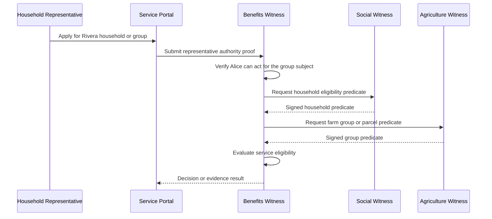

Supported today:

- Local claim evaluation can target non-person entities when configured.
- Delegated evaluation can request predicates about configured subject types.

Missing:

- Collective `subject_ref` model for households, groups, cooperatives, farms,
  and legal entities.
- Representation proof profiles for household head, group officer,
  cooperative representative, business officer, or delegated agent.
- Policy rules for whether the actor may request, receive, or hold evidence
  about the collective subject and its members.
- Audit fields that distinguish actor, collective subject, represented members
  when relevant, and representation proof without logging raw identifiers.

### 16. Civil Witness Issues Date-Of-Birth Or Alive Credential

Pattern: Credential issuance  
Status: Supported  
Priority: High

Story: Alice wants a reusable civil credential so she does not need a fresh
registry lookup for every service. The Civil Witness evaluates the configured
claim, verifies Alice's holder proof, and issues a holder-bound SD-JWT VC.

Personas: citizen, registry steward, wallet operator  
Systems: holder wallet, civil Witness, civil Relay

```mermaid
sequenceDiagram
  participant Wallet as Holder Wallet
  participant Witness as Civil Witness
  participant Relay as Civil Relay

  Wallet->>Witness: Request credential with holder proof
  Witness->>Relay: Evaluate configured civil claims
  Relay-->>Witness: Civil facts
  Witness->>Witness: Bind credential to holder DID
  Witness-->>Wallet: SD-JWT VC
```

Supported today:

- Local SD-JWT VC issuance for configured credential profiles.
- Holder binding with `did:jwk`.

Missing:

- Production wallet interoperability hardening is outside this catalog.

### 17. Agriculture Witness Issues Voucher Eligibility Credential

Pattern: Credential issuance  
Status: Supported  
Priority: High

Story: Alice qualifies for an agriculture voucher and wants portable proof of
that result. After the Agriculture Witness evaluates the voucher rules, it can
issue a holder-bound credential that Alice can present to a payment or voucher
system.

Personas: farmer, program administrator, wallet operator  
Systems: holder wallet, agriculture Witness, agriculture Relay

```mermaid
sequenceDiagram
  participant Wallet as Farmer Wallet
  participant Witness as Agriculture Witness
  participant Relay as Agriculture Relay

  Wallet->>Witness: Request voucher eligibility credential
  Witness->>Relay: Evaluate voucher eligibility
  Relay-->>Witness: Farmer and parcel facts
  Witness-->>Wallet: Holder-bound SD-JWT VC
```

Supported today:

- Lab agriculture flow can produce a demo credential after successful evaluation.
- Runtime credential profiles support SD-JWT VC issuance.

Missing:

- Full production wallet ceremony and status profile.

### 18. Shared Eligibility Witness Issues Combined-Support Credential

Pattern: Credential issuance plus composition  
Status: Partial  
Priority: High

Story: Alice's combined-support eligibility depends on facts held by multiple
authorities. The future Shared Eligibility Witness would verify peer-signed
predicates, compose a final claim, and issue Alice a credential that points
back to the remote evidence decisions without exposing raw source data.

Personas: citizen, case worker, auditor  
Systems: shared eligibility Witness, peer Witnesses, holder wallet

```mermaid
sequenceDiagram
  participant Shared as Shared Eligibility Witness
  participant Civil as Civil Witness
  participant Social as Social Witness
  participant Wallet as Holder Wallet

  Shared->>Civil: Request signed civil predicate
  Civil-->>Shared: Signed civil result
  Shared->>Social: Request signed social predicate
  Social-->>Shared: Signed social result
  Shared->>Shared: Compose combined-support claim
  Shared-->>Wallet: Combined-support credential
```

Supported today:

- Local credential issuance exists.
- Local composed claims can depend on local claim results.

Missing:

- Peer-result composition inside Witness runtime.
- Audit links from issued credential to remote evaluation response ids.

### 19. Service Helps Holder Obtain Credential From Remote Witness

Pattern: Federated credential issuance  
Status: Planned  
Priority: Medium

Story: Alice needs a credential from Carol's issuing Witness while starting
from Bob's service journey. Bob can help Alice discover the issuer or relay
bytes transparently, but Carol's Witness must still own the nonce, audience,
holder-proof verification, and issued credential.

Personas: citizen, wallet operator, registry steward  
Systems: holder wallet, consuming Witness, issuing Witness

```mermaid
sequenceDiagram
  participant Wallet as Holder Wallet
  participant Consumer as Consuming Witness
  participant Issuer as Issuing Witness

  Consumer->>Issuer: Discover credential profile
  Consumer-->>Wallet: Return issuer offer
  Wallet->>Issuer: Present holder proof to issuer
  Issuer->>Issuer: Verify nonce, audience, holder key
  Issuer-->>Wallet: Credential response
```

Supported today:

- Local issuance exists.
- Broader spec defines discovery/handoff and transparent byte relay constraints.

Missing:

- Holder-binding ceremony for federated issuance.
- Nonce ownership, transparent relay rules, substitution defenses, and tests.

### 20. Replay And Emergency Peer Or Key Denial

Pattern: Governance  
Status: Supported  
Priority: High

Story: Dave sees suspicious activity from a peer key and needs the serving
Witness to fail closed immediately. Replay protection blocks reused requests,
and the emergency denylist lets the operator reject a compromised node or key
while the incident is investigated.

Personas: registry steward, auditor, security operator  
Systems: serving Witness, peer Witness, audit store

```mermaid
flowchart TD
  Request["Signed federation request"]
  Replay["Replay store"]
  Denylist["Emergency node/kid denylist"]
  Policy["Peer policy"]
  Result["Allow or deny"]
  Audit["Audit event"]

  Request --> Replay
  Request --> Denylist
  Replay --> Policy
  Denylist --> Policy
  Policy --> Result
  Result --> Audit
```

Supported today:

- Static peer policy.
- Replay protection for request ids.
- Emergency denylist configuration for peers and keys.

Missing:

- Shared replay store for active-active production deployments.

### 21. Auditor Verifies Minimized Decision Evidence

Pattern: Governance  
Status: Partial  
Priority: High

Story: Dave reviews Alice's benefit decision months later and wants confidence
that Bob used minimized evidence. The signed predicate result and redacted
audit event show which profile and purpose were used without disclosing raw
registry rows.

Personas: auditor, registry steward, program administrator  
Systems: service portal, Witness, audit store

```mermaid
flowchart TD
  Decision["Service decision"]
  Predicate["Signed predicate result"]
  Audit["Redacted audit event"]
  Policy["Profile and purpose policy"]
  Report["Audit report"]

  Decision --> Predicate
  Predicate --> Audit
  Policy --> Audit
  Audit --> Report
```

Supported today:

- Signed evaluation responses for federation.
- Redacted local audit events.
- Predicate disclosure avoids raw source rows by default.

Missing:

- Signed audit checkpoints and inclusion proofs.
- Standard audit report shape for cross-organization review.

### 22. Peer Audit Checkpoint Monitoring

Pattern: Governance  
Status: Planned  
Priority: Medium

Story: Dave monitors whether Carol's Witness audit trail is continuous over
time. Signed checkpoints let Dave detect root or sequence regressions without
asking Carol to share every underlying audit event.

Personas: auditor, security operator, registry steward  
Systems: publishing Witness, monitoring Witness, audit store

```mermaid
sequenceDiagram
  participant Publisher as Publishing Witness
  participant Monitor as Monitoring Witness
  participant Audit as Audit Store

  Publisher->>Audit: Append local audit events
  Publisher->>Publisher: Build Merkle checkpoint
  Monitor->>Publisher: Fetch latest checkpoint
  Publisher-->>Monitor: Signed checkpoint
  Monitor->>Monitor: Detect root or sequence regression
```

Supported today:

- Audit fields and spec direction exist.

Missing:

- Merkle checkpoint builder.
- Checkpoint publisher.
- Peer monitor and historical checkpoint semantics.

## Capability Gaps Surfaced

- Outbound `registry_witness_federation` source connector.
- Mapping verified peer responses into local claim rule inputs.
- User-presented proof verifier profiles.
- Representation authority profiles, actor/subject separation, and collective
  subject support.
- Credential status and freshness policy for remote proofs.
- Federated credential issuance holder-binding ceremony.
- Shared replay store for active-active deployments.
- Signed audit checkpoints and peer monitoring.
- Registry Lab federation scenario scripts and fixture metadata.
