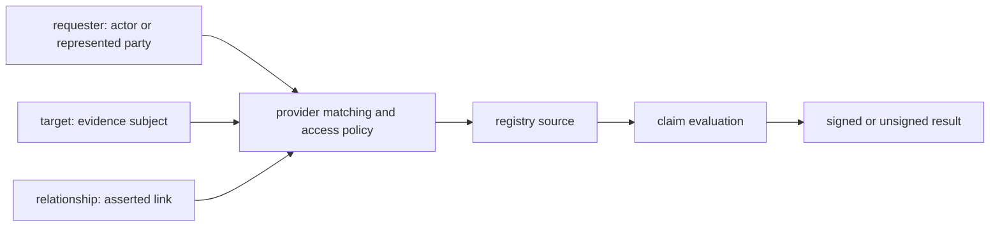

# Evidence Request Subject Model Spec

## Status

Draft. Do not freeze this schema until the contract blockers called out in this
spec are resolved or explicitly deferred with replacement behavior. In
particular, the request break must land with matching response, audit,
self-attestation, and federation decisions.

## Purpose

Define the breaking Registry Notary request model for evidence evaluation when
the caller does not already know the provider's local subject identifier.

The current API centers evaluation on:

```json
{
  "subject": {
    "id": "NID-1001",
    "id_type": "national_id"
  }
}
```

That shape is too narrow for provider-side identity and record matching. It
also makes non-person evidence awkward: land parcels, animals, businesses,
farms, licenses, facilities, and households are not people, even when a person
is requesting evidence about them.

This spec replaces the identifier-only subject shape with an evidence request
context made of:

- `requester`: the authenticated actor or party on whose behalf the request is
  made.
- `target`: the entity, record, or resource the requested evidence is about.
- `relationship`: the asserted or requested relationship between requester and
  target, when relevant.
- `on_behalf_of`: reserved optional representation context for future
  multi-party authorization profiles.
- `claims`: the claims to evaluate.
- `purpose`: the declared purpose for the evaluation.

## Delivery Commons Principle Alignment

This spec is a design record for the Registry Notary `evaluation` layer, with
handoffs to the `credential` and `federation` layers where evaluation output is
issued or delegated. It deliberately keeps Registry Notary in the minimized
evidence role: Notary evaluates configured claims and returns disclosure-filtered
results, not general registry rows, candidate records, eligibility decisions, or
source browsing APIs.

The public contract changes are product-owned application API changes under
`/v1`, with federation kept as a separate `/federation/v1` compatibility or
migration decision and wallet-facing behavior kept behind OID4VCI-owned
protocol surfaces. The canonical handoffs are typed request and response
schemas, OpenAPI artifacts, SDK bindings, claim/profile configuration, redacted
audit events, and optional signed credentials.

The weakest sufficient disclosure level for this surface is a claim result or
credential. The API must not expose raw source rows, corrected registry values,
candidate matches, near-match diagnostics, raw identifiers in logs or audit, or
private source binding details in public artifacts. Examples in this spec are
synthetic documentation values and must not be replaced with production data.

Standards usage is explicit:

- W3C VC, DID, PROV, DPV, and PublicSchema are references or vocabulary
  mappings for the native Notary model, not claims that evaluation requests are
  JSON-LD, Verifiable Credentials, or RDF.
- OOTS and eIDAS are reference or profile inputs only. Core does not claim OOTS
  interoperability.
- OID4VCI and SD-JWT VC remain protocol-owned credential surfaces where those
  standards control route, proof, media type, and holder-binding behavior.
- HTTP errors use Problem Details as the product error envelope, except where a
  protocol-owned surface requires its own error shape.

Before implementation, the unresolved profile config, audit pseudonym,
federation, and retention decisions in this spec must be recorded here or linked
as reviewed design notes. Implementation is complete only when validation,
OpenAPI, SDK, redaction, stale-contract, and focused behavior tests prove the
contract.

## Design Direction

Registry Notary should take inspiration from OOTS identity and record matching,
especially the idea that the evidence provider performs final matching under
its own policy. Registry Notary must not copy OOTS or eIDAS as its core model.
Those frameworks carry EU-specific authentication, level-of-assurance, and
identifier constraints that do not apply cleanly to every deployment country or
registry sector.

The core API should instead be W3C-inspired:

- Use the W3C Verifiable Credentials Data Model as conceptual inspiration for
  claims about arbitrary subjects, not only people.
- Allow, but do not require, W3C Decentralized Identifiers.
- Use W3C PROV concepts for provenance and audit vocabulary where useful.
- Treat privacy and purpose metadata as extensible, with W3C DPV as a useful
  vocabulary option where deployments need machine-readable privacy semantics.

Primary standards references:

- W3C Verifiable Credentials Data Model 2.0:
  <https://www.w3.org/TR/vc-data-model/>
- W3C Decentralized Identifiers 1.0:
  <https://www.w3.org/TR/did-core/>
- W3C PROV-O:
  <https://www.w3.org/TR/prov-o/>

Related references:

- OOTS Identity and Record Matching v2.0.0:
  <https://ec.europa.eu/digital-building-blocks/sites/spaces/TDD/pages/952470336/2.1+-+Identity+and+Record+Matching+v2.0.0+March+2026>
- W3C Data Privacy Vocabulary:
  <https://w3c.github.io/dpv/2.3/dpv/>
- OpenID Connect Core standard claims:
  <https://openid.net/specs/openid-connect-core-1_0-18.html#StandardClaims>
- PublicSchema:
  <https://publicschema.org/>

Future policy references:

- W3C ODRL Information Model:
  <https://www.w3.org/TR/odrl-model/>

This request model is not a Verifiable Credential and is not JSON-LD. The rough
mapping is:

- VC `credentialSubject` is closest to Registry Notary `target`.
- VC issuer is closest to the eventual Notary credential issuer, not the
  requester. For holder-bound SD-JWT VC issuance, the credential holder subject
  can be the holder DID while the matched evidence target remains represented
  by a separate claim or reference.
- `requester`, `relationship`, `identifiers[]`, and `assurance` are request
  context fields with no direct VC equivalent.
- Registry Notary treats `id` as an opaque string. DID resolution happens only
  when an explicit profile requires it.

## Goals

- Support provider-side identity and record matching without turning OpenSPP or
  another requester into a central identifier-mapping hub.
- Support evidence about people and non-person targets with one coherent model.
- Let providers receive the minimum context needed to match a target and decide
  whether the requester is allowed to receive evidence about it.
- Preserve strong privacy defaults: no raw identity bundles in logs, no raw
  target identifiers in audit by default, and stable public error codes.
- Make batch evaluation use the same per-item request model as single
  evaluation.
- Provide an implementation path that can start with one demo provider matching
  a person by name and birth date.

## Non-Goals

- Implement the full OOTS wire protocol.
- Require eIDAS, DIDs, JSON-LD processing, RDF, ODRL policy engines, or VC
  issuance for evaluation requests.
- Define a global ontology for every registry sector.
- Define fuzzy matching algorithms in Registry Notary core.
- Expose candidate records, near matches, or raw matching diagnostics to
  requesters.
- Support guardianship, multi-hop delegation, joint ownership, customary group
  rights, household membership, or organization-officer representation in the
  first implementation. Those need a separate multi-party authorization model.

## Conceptual Model



### Requester

The `requester` is the actor, organization, or represented party whose identity
or authority matters to the evidence request.

Examples:

- a citizen requesting evidence about themselves;
- a caseworker acting under delegated program authority;
- a farmer requesting evidence about a farm holding;
- a legal representative acting for a cooperative;
- an upstream government service making a machine-to-machine request.

### Target

The `target` is the entity the requested claim is about.

Examples:

- a person in a civil registry;
- a land parcel in a cadastral registry;
- an animal in a livestock registry;
- a household in a social registry, after a dedicated group profile exists;
- a business in a company registry;
- a license, credential, facility, farm, vehicle, or program enrollment.

For person-centered evidence, `requester` and `target` may refer to the same
person, but the API should still model them separately so non-person evidence
does not become a special-case patch later.

### Relationship

The `relationship` describes why the requester is allowed to ask about the
target, or what relationship the provider should verify.

Examples:

- `self`;
- `owner`;
- `guardian`;
- `holder`;
- `representative`;
- `caseworker`;
- `program_authority`.

Relationship verification is provider policy. Registry Notary core validates
shape and routes context to adapters. It does not decide that a person owns a
parcel or represents a company unless a configured adapter or upstream service
returns that result under policy.

## HTTP API Changes

This is a breaking change.

### Public Contract Versus V1 Semantics

Because this API is still pre-adoption, the wire contract should be shaped for
the cases we can already see: person matching, non-person targets, wallet
self-attestation, and later representation. That does not mean the first
implementation has to support every semantic path.

The public request envelope is:

- `requester`: optional entity object. Present when the caller needs to supply
  requester context beyond the authenticated principal. Wallet and ordinary
  machine-client flows may derive requester from authentication instead.
- `target`: entity object. Machine-client evaluation requires it. Citizen
  self-attestation omits it by default because Registry Notary derives the
  target from the verified token binding.
- `relationship`: optional object. Kept as an object, not a string, so later
  profiles can add evidence, validity windows, or relationship-specific
  attributes without another wire break.
- `on_behalf_of`: optional object reserved for future representation,
  guardianship, legal-person officer, and delegated-authority profiles. V1
  profiles should reject it with `profile.unsupported`.
- `claims`: required claim reference list. This keeps the existing name and
  existing string-or-versioned-object `ClaimRef` semantics.
- `purpose`: required effective purpose, either per request or per batch item.

V1 implementation may support only:

- one `target` per item;
- no caller-supplied requester matching;
- relationship types without relationship evidence;
- no `on_behalf_of` semantics;
- person name and birthdate matching demo;
- land parcel identifier matching demo;
- wallet self-attestation where requester and target are derived from trusted
  token claims.

Fields that are present in the public schema but unsupported by a configured
profile must fail closed. Precedence is:

- structural JSON, type, unknown-field, content-type, and missing required body
  failures return `request.invalid`;
- unsupported profile, unsupported public-envelope fields for that profile, or
  unsupported target/requester types return `profile.unsupported`;
- disallowed purpose returns `purpose.not_allowed`;
- matching, target state, and relationship outcomes return the profile's
  granular or collapsed matching code.

Clients should treat `evidence.not_available` as the portable superset for
non-disclosing matching, state, and relationship failures. Do not silently
ignore unsupported requester, relationship, `on_behalf_of`, assurance, or
attribute fields.

### Single Evaluation

`POST /v1/evaluations` request body becomes:

```json
{
  "requester": {
    "type": "Person",
    "identifiers": [
      {
        "scheme": "national_id",
        "value": "NID-1001",
        "issuer": "civil_registry"
      }
    ],
    "attributes": {
      "given_name": "Amina",
      "family_name": "Diallo",
      "birthdate": "1984-02-10"
    },
    "assurance": {
      "method": "national_eid",
      "level_scheme": "local",
      "level": "substantial",
      "verified_at": "2026-05-31T10:00:00Z"
    }
  },
  "target": {
    "type": "Person",
    "attributes": {
      "given_name": "Amina",
      "family_name": "Diallo",
      "birthdate": "1984-02-10"
    }
  },
  "relationship": {
    "type": "self"
  },
  "claims": ["person-is-alive"],
  "purpose": "benefit_eligibility_check",
  "disclosure": "predicate",
  "format": "application/vnd.registry-notary.claim-result+json"
}
```

The old `subject`, `subject.id`, and `subject.id_type` fields are removed from
the canonical request. `claims` remains the canonical claim list. If subject
aliases are wanted for SDK ergonomics, they belong in client helpers, not the
wire contract.

### Batch Evaluation

`POST /v1/batch-evaluations` request body becomes:

```json
{
  "items": [
    {
      "requester": {
        "type": "Person",
        "attributes": {
          "given_name": "Amina",
          "family_name": "Diallo",
          "birthdate": "1984-02-10"
        }
      },
      "target": {
        "type": "LandParcel",
        "identifiers": [
          {
            "scheme": "cadastral_reference",
            "value": "PARCEL-8891",
            "issuer": "land_registry"
          }
        ]
      },
      "relationship": {
        "type": "owner"
      },
      "purpose": "benefit_eligibility_check"
    }
  ],
  "claims": ["land-parcel-is-registered"],
  "disclosure": "predicate"
}
```

Each item has the same requester, target, relationship, and purpose shape as a
single evaluation. A batch-level `purpose` MAY act as a default, but each item
must resolve to exactly one effective purpose. If both item and batch purpose
are present, they must match exactly or the item fails with `request.invalid`.
If neither is present, the item fails with `request.invalid` before policy or
source reads. Purpose values are exact strings; no case folding, whitespace
normalization, or alias substitution is applied by core.

`claims` preserves the existing claim reference semantics: each entry
may be a plain claim id string or a version-pinned object.

The public route path may remain `/v1/evaluations` and
`/v1/batch-evaluations` even though the body shape breaks. The route cleanup
record already treats `/v1` as the stable operation family, not a promise that
request bodies never change before production adoption.

Malformed JSON, wrong content type, unknown fields, or old request shapes must
produce RFC 9457 Problem Details with `code = request.invalid` using the shared
product convention for `type`, `title`, `status`, `detail`, `code`, and
`request_id` or `trace_id`. Axum's default JSON extractor currently rejects
these before handlers run, so implementation should use a custom extractor or
equivalent rejection mapper for syntax, content-type, and deserialize failures.
Bare plaintext 400, 415, or 422 responses are not acceptable final contracts.

### Idempotency And Retry Semantics

The request model break must preserve or explicitly replace existing
retry-safety behavior. Any route that persists an evaluation result, starts a
render, issues a credential, or records a durable batch operation must document
whether retries return the existing result, create a new artifact, or fail with
a conflict while work is in flight.

Where `Idempotency-Key` is supported, records must be scoped by caller, route,
method, and a fingerprint over the canonical request shape, including
`requester`, `target`, `relationship`, `on_behalf_of`, `claims`, `purpose`,
`disclosure`, and `format` after profile-controlled derivation. Unsupported
idempotency keys must fail explicitly rather than being silently ignored.

## Data Structures

### EvidenceEntity

`requester` and `target` both use the same base entity shape.

```json
{
  "type": "Person",
  "id": "urn:example:person:123",
  "identifiers": [
    {
      "scheme": "national_id",
      "value": "NID-1001",
      "issuer": "civil_registry",
      "country": "ML"
    }
  ],
  "attributes": {
    "given_name": "Amina",
    "family_name": "Diallo",
    "birthdate": "1984-02-10"
  },
  "assurance": {
    "method": "national_eid",
    "level_scheme": "local",
    "level": "substantial",
    "verified_at": "2026-05-31T10:00:00Z"
  },
  "profile": "openspp-demo-v1"
}
```

Fields:

- `type`: required. A compact type such as `Person`, `Organization`,
  `LandParcel`, `Animal`, `FarmHolding`, `Vehicle`, or
  deployment-defined value. Future JSON-LD profiles may use IRIs.
- `id`: optional. A stable identifier for the entity when the requester has one.
  DIDs are allowed but not required.
- `identifiers`: optional. Domain identifiers that can be used for matching.
- `attributes`: optional. Attribute bundle used for matching or policy.
- `assurance`: optional. How the attributes or identifiers were obtained or
  verified.
- `profile`: optional. Names the profile used to interpret type, identifiers,
  and attributes.

At least one of `id`, `identifiers`, or `attributes` MUST be present for
`target`. An empty target fails with `target.attributes_insufficient` unless a
more specific profile error applies. An id-only target is valid JSON but may
still fail profile validation when the configured provider does not accept that
id.

For `requester`, the object SHOULD be present, but the identity bundle may be
empty for machine-to-machine clients when authorization is fully represented by
the authenticated credential and configured policy.

### EvidenceIdentifier

```json
{
  "scheme": "cadastral_reference",
  "value": "PARCEL-8891",
  "issuer": "land_registry",
  "country": "ML"
}
```

Fields:

- `scheme`: required. Local or profile-defined identifier scheme.
- `value`: required. Identifier value.
- `issuer`: optional. Issuer, registry, or authority responsible for the
  identifier.
- `country`: optional ISO 3166-1 alpha-2 code when relevant.

Identifier values are sensitive. They MUST NOT be logged raw.
The `country` field is only country-level context. It must not be used for
subdivisions, districts, or eIDAS cross-border prefixes embedded inside an
identifier value.

### EvidenceAssurance

```json
{
  "method": "national_eid",
  "level_scheme": "local",
  "level": "substantial",
  "verified_at": "2026-05-31T10:00:00Z",
  "issuer": "identity_provider",
  "evidence": [
    {
      "type": "document",
      "method": "in_person"
    }
  ]
}
```

Fields:

- `method`: optional. Authentication or verification method.
- `level_scheme`: optional. Scheme for interpreting `level`, such as `local`,
  `acr`, `eidas`, or another profile-defined token.
- `level`: optional. Opaque assurance level within `level_scheme`. Core must
  not compare levels across schemes unless a profile defines the mapping.
- `verified_at`: optional RFC 3339 timestamp.
- `issuer`: optional. Identity provider or authority.
- `evidence`: optional. Redacted assurance evidence metadata using closed
  profile-defined enums and bounded strings. Raw documents, biometric material,
  access tokens, URLs to raw documents, and free-form blob fields MUST NOT be
  embedded in evaluation requests.

### EvidenceRelationship

```json
{
  "type": "owner",
  "attributes": {
    "basis": "self_declared"
  }
}
```

Fields:

- `type`: required when `relationship` is present.
- `attributes`: optional relationship-specific matching or policy context.

The presence of a relationship in the request is an assertion or requested
relationship check, not proof. Providers decide whether the relationship is
accepted, rejected, or requires stronger evidence.

If `relationship` is absent, the request is accepted only when the configured
profile declares a self-derivation rule that structurally establishes
requester-target sameness from shared identifiers or trusted token claims.
Otherwise the request fails with `relationship.not_established` or the
profile's collapsed public error. Core must not run fuzzy or attribute-based
matching merely to infer that relationship.

`owner` and `holder` are distinct relationship types. `owner` means title,
legal ownership, or registry ownership according to the target profile. `holder`
means custody, possession, or operational responsibility without necessarily
implying title.

For land profiles, `owner` MAY mean "one of the registered owners" when the
upstream can prove membership in the owner set. Customary, collective, disputed,
or inherited rights beyond registry membership require a richer land-rights
profile.

### EvidenceOnBehalfOf

`on_behalf_of` is reserved for future multi-party authorization. V1 treats it
as an opaque object and configured profiles should reject it with
`profile.unsupported`. It is present in the public envelope now to avoid another
top-level wire break when representation, guardianship, legal-person officer,
or delegated-authority profiles are designed.

## Profiles

Profiles define how deployments interpret `type`, `identifiers`,
`attributes`, `assurance`, and `relationship`.

Registry Notary core should ship only general validation and demo profiles.
Production deployments SHOULD define profile documentation for each provider or
claim family.

Each profile or claim binding MUST declare:

- allowed requester and target `type` values;
- sufficient input groups, expressed as alternative sets of opaque paths such as
  `target.identifiers[national_id]` OR
  `target.attributes.given_name + target.attributes.family_name +
  target.attributes.birthdate`;
- maximum allowed input paths that may be forwarded to the adapter;
- allowed relationship types, or that no relationship is accepted;
- allowed purposes;
- whether public errors may reveal matching cardinality.

Core may enforce sufficient-input and over-provision checks from this
declaration before source reads. Core must not interpret field values or
implement fuzzy matching. Adapters remain responsible for the actual matching
policy and final acceptance threshold.

Profiles SHOULD reuse existing public vocabularies before inventing local field
names. PublicSchema is a good default vocabulary for social protection and
public-service domains because it gives common names for people, identifiers,
households, programs, enrollments, benefits, and payments without requiring the
evaluation request to become JSON-LD or a Verifiable Credential.

PublicSchema is a vocabulary source, not a registry-notary dependency. Profiles
that use PublicSchema terms SHOULD pin the referenced revision or URL set in
profile documentation. Local DCI identifiers such as `UIN` or `NATIONAL_ID` are
not competing standards; they are profile-specific identifier schemes that may
map to PublicSchema concepts.

Wire field names in the base API use snake_case. Profiles may map those names
to OIDC, PublicSchema, schema.org, OOTS, or local vocabulary terms, but the
canonical JSON body stays snake_case unless a future JSON-LD profile explicitly
changes that rule.

Group-like targets such as `Household` are out of the first implementation
unless a dedicated group profile defines membership, head, time window, and
group-vs-member claim semantics. Do not ship `Household` as a bare type with no
profile.

### Recommended Built-In Demo Profiles

`openspp-person-demo-v1`

- `target.type = Person`
- Matching inputs:
  - `attributes.given_name`
  - `attributes.family_name`
  - `attributes.birthdate`
- Demonstrates:
  - unique match success;
  - no match;
  - ambiguous match.

The name and birthdate demo validates API plumbing, not production-grade human
matching. It does not attempt transliteration, partial dates, common-name
disambiguation, or demographic matching.

`openspp-land-demo-v1`

- `target.type = LandParcel`
- Matching inputs:
  - `identifiers[].scheme = cadastral_reference`
  - optional `attributes.district`
- Relationship input:
  - `relationship.type = owner`
- Demonstrates target matching separately from requester authorization.

### OOTS-Inspired Profile

An OOTS profile MAY map eIDAS attributes into this model:

```json
{
  "profile": "oots-eidas-inspired-v1",
  "type": "Person",
  "identifiers": [
    {
      "scheme": "person_identifier",
      "value": "ES/AT/02635542Y",
      "issuer": "eidas"
    }
  ],
  "attributes": {
    "family_name": "Garcia",
    "given_name": "Maria",
    "birthdate": "1984-02-10"
  },
  "assurance": {
    "method": "eidas",
    "level_scheme": "eidas",
    "level": "substantial"
  }
}
```

This profile is informative. Core must not require eIDAS attribute names,
eIDAS levels of assurance, or eIDAS unique identifier handling.

An OOTS-inspired profile SHOULD explicitly declare mandatory and optional input
sets. For a natural person profile, that may include `family_name`,
`given_name`, `birthdate`, and a profile-specific person identifier where the
provider can lawfully use it. The eIDAS person identifier prefix embedded in
values such as `ES/AT/02635542Y` is not the same thing as the `country` field
on `EvidenceIdentifier`.

Full OOTS interoperability is not a goal of the base Registry Notary API. An
OOTS deployment profile may choose stricter mandatory datasets than the generic
model requires.

## Matching Responsibility

Registry Notary core is responsible for:

- request schema validation;
- problem code taxonomy;
- routing request context to configured claims and providers;
- enforcing request body size limits;
- rejecting unsupported profiles or missing required fields before source reads
  when the missing fields are known from static config;
- rejecting request inputs outside the profile's maximum allowed input set
  before routing to adapters;
- validating purpose against deployment and claim allow-lists;
- minimizing request context to the provider-configured input paths before
  calling source adapters or upstream evidence services;
- redacted audit and metrics;
- stable SDK and OpenAPI contracts.

Provider adapters or upstream evidence services are responsible for:

- identity and record matching;
- fuzzy, phonetic, transliteration, normalization, or confidence logic;
- relationship verification;
- deciding whether attributes are sufficient;
- deciding whether stronger authentication or reauthentication is required;
- avoiding raw-value logging and not reintroducing, deriving, or forwarding
  fields that Registry Notary stripped from the adapter context.

OpenSPP or another Evidence Requester is responsible for:

- sending the minimum context needed for the configured claim or provider;
- respecting its own privacy and consent/legal-authority rules;
- not becoming a central mapping database unless that is an explicit product
  decision outside Registry Notary.

Purpose is policy input, not a free-form note. Deployments MUST configure an
allow-list of accepted purpose values, and claims or credential profiles MAY
further restrict that list. Values MAY be compact deployment strings or DPV
IRIs, but they must be stable enough for audit and policy review. Purpose values
should be granular enough to correspond to one lawful basis or program use case;
avoid broad values that hide materially different uses behind one string.

## Wallet And Self-Attestation Flows

Wallet issuance has a stricter trust boundary than machine-to-machine
evaluation. A wallet-facing OpenID4VCI credential request should not let the
wallet choose arbitrary `requester` or `target` fields. The requester context
must be derived from the verified authorization token, configured UserInfo
claims, or another trusted identity source controlled by Notary policy.

For citizen self-attestation, the safe default is:

- `requester` is derived by Registry Notary from the authenticated subject and
  configured verified token claims.
- `target` is derived from the authenticated subject binding claim, not merely
  from arbitrary descriptive claims, unless a configured wallet credential
  profile explicitly permits a separate target.
- `relationship.type` defaults to `self`.
- conflicting caller-supplied `target`, `requester`, `relationship`, or
  `on_behalf_of` context is rejected with `self_attestation.subject_mismatch`
  before source reads.
- batch evaluation remains disabled.
- credential issuance stays holder-bound through the wallet proof key.

Delegation, act-as, aggregated UserInfo, or representation tokens are out of
scope for self-attestation until the multi-party authorization model exists.

The wallet proof key and the requester identity are separate concepts:

- the wallet proof shows control of the holder key that will bind the issued
  credential;
- the verified token claims identify or describe the requester;
- the target identifies what evidence is being requested;
- provider matching decides whether the target can be uniquely resolved.

Holder binding MUST NOT be treated as proof that the wallet DID is the same
identifier as the requester or target.

### Wallet Self-Attestation Example

The wallet sends the OpenID4VCI credential request:

```json
{
  "format": "dc+sd-jwt",
  "credential_configuration_id": "person_is_alive_sd_jwt",
  "proof": {
    "proof_type": "jwt",
    "jwt": "eyJ..."
  }
}
```

Registry Notary derives the internal evaluation request from configuration and
verified token claims:

```json
{
  "requester": {
    "type": "Person",
    "identifiers": [
      {
        "scheme": "national_id",
        "value": "<verified token claim>",
        "issuer": "identity_provider"
      }
    ],
    "attributes": {
      "given_name": "<verified token claim>",
      "family_name": "<verified token claim>",
      "birthdate": "<verified token claim>"
    },
    "assurance": {
      "method": "oidc",
      "level_scheme": "acr",
      "level": "<verified token assurance>",
      "verified_at": "<token auth time>"
    }
  },
  "target": {
    "type": "Person",
    "identifiers": [
      {
        "scheme": "national_id",
        "value": "<same verified token claim>",
        "issuer": "identity_provider"
      }
    ]
  },
  "relationship": {
    "type": "self"
  },
  "claims": ["person-is-alive"],
  "purpose": "wallet_credential_issuance",
  "format": "application/dc+sd-jwt"
}
```

The internal request MUST NOT be logged with raw values.

### Wallet Requests About Non-Person Targets

Wallet requests about non-person targets, such as land parcels or animals, are
not part of the safe self-attestation default. They require an explicit
credential profile because the request must answer both questions:

- Can the target be uniquely matched?
- Is the requester allowed to receive evidence about that target?

If enabled, the target may come from one of these policy-controlled sources:

- a prior verifiable credential held by the wallet and presented as input;
- a QR code or deep link generated by the provider for a specific target;
- a server-populated target identifier allow-list in a portal session;
- token or UserInfo claims that already include the target relationship.

The wallet MUST NOT be allowed to type an arbitrary parcel id, ear tag,
household id, or organization id into the credential request unless the
credential profile explicitly permits that input and applies enumeration
controls.

Required additional controls for non-person wallet targets:

- require stronger requester assurance;
- require `relationship.type` to be configured per credential profile;
- rate limit failed target and relationship matching separately;
- return generic denials for authorization failures;
- avoid exposing whether the target exists when relationship policy fails.

### Impact On Existing Wallet Specs

The self-attestation and OpenID4VCI implementations derive requester and target
context from trusted token binding for the default person self-attestation
profile. Their specs should describe that behavior directly: the guard compares
trusted token claims against the derived `requester` and `target` context, not
against a caller-supplied `subject.id`. Non-person wallet targets and delegated
or `on_behalf_of` flows remain future profile work until their authorization
model is specified and tested.

## Problem Codes

Problem codes have two disclosure levels:

- public codes returned to callers;
- audit codes recorded in keyed audit for operators.

Granular matching codes are useful for OpenSPP policy mapping, but they can
also become an enumeration oracle. Each profile must declare whether public
errors may reveal target matching cardinality. When disclosure is not allowed,
the public response must collapse to `evidence.not_available` while audit keeps
the granular code. If a profile does not explicitly allow public cardinality or
state disclosure, the default is to collapse.

Stable public codes:

- `request.invalid`
- `purpose.not_allowed`
- `profile.unsupported`
- `evidence.not_available`
- `requester.reauthentication_required`
- `requester.matching_policy_rejected`
- `target.not_found`
- `target.match_ambiguous`
- `target.identifier_missing`
- `target.attributes_insufficient`
- `target.matching_policy_rejected`
- `target.not_in_valid_state`
- `target.match_low_confidence`
- `relationship.not_established`
- `relationship.match_ambiguous`
- `relationship.attributes_insufficient`
- `relationship.policy_rejected`
- `source.unavailable`
- `claim.not_found`
- `claim.version_not_found`
- `claim.format_not_supported`
- `batch.too_large`

Optional requester-resolution profiles MAY also use these audit and public
codes when the requester itself is matched against a provider registry:

- `requester.not_found`
- `requester.match_ambiguous`
- `requester.identifier_missing`
- `requester.attributes_insufficient`

Default self-attestation and machine-client flows do not use requester matching
codes because the requester is authenticated, not record-matched.

Guidance:

- Use `target.not_found` when matching completed and no target record matched
  and the profile allows that disclosure.
- Use `target.match_ambiguous` only when matching produced two or more distinct
  target entities. Duplicate rows for the same entity are a registry quality or
  state problem, not necessarily ambiguity.
- Use `target.not_in_valid_state` when the target exists but is deceased,
  archived, superseded, merged, inactive, or otherwise invalid for the claim.
  Profiles that expose this code should distinguish follow-the-pointer states
  such as merged or superseded from terminal states such as deceased or
  archived in audit, while collapsing publicly unless state disclosure is
  explicitly allowed.
- Use `target.match_low_confidence` only when exactly one candidate is found but
  is below the provider's acceptance threshold. A sub-threshold candidate MUST
  NOT be returned as a successful match.
- Use `target.identifier_missing` when a profile requires a target identifier
  from a specific scheme and the request omits it.
- Use `target.attributes_insufficient` when the request did not contain enough
  target data to run the provider's configured matching policy.
- Use `target.matching_policy_rejected` when the target input is structurally
  valid but violates provider matching policy, such as a disallowed identifier
  issuer, geography, target type, or profile-specific eligibility gate.
- Use `requester.reauthentication_required` when the provider requires stronger
  identity evidence from the requester.
- Use requester matching codes only for profiles that explicitly record-match
  the requester against a provider registry. Authenticated-principal failures
  should stay in the authentication or authorization code family.
- Use `relationship.not_established` when requester and target were resolved,
  but the requested relationship is absent.
- Use `relationship.match_ambiguous` when relationship evidence resolves to
  more than one materially different relationship edge and policy cannot choose
  one.
- Use `relationship.attributes_insufficient` when the request omits attributes
  required to verify the requester-target relationship.
- Use `relationship.policy_rejected` when the target may or may not exist but
  the requester is not allowed to receive evidence about it.
- Use `source.unavailable` only for transport, upstream availability, timeout,
  or malformed upstream response failures.

Existing `source.not_found` and `source.ambiguous` are implementation-era codes
for source read results. The migration should map adapter matching outcomes to
the new target or relationship codes, while retaining `source.*` only for
legacy compatibility and low-level connector failures during the transition.

## Response Model

The request break must include a response break. Existing response fields such
as `subject_ref` and `id_type` cannot represent attribute-only matching or
non-person targets.

Single and batch claim results SHOULD expose redacted references:

```json
{
  "requester_ref": {
    "type": "Person",
    "handle": "rnref:v1:..."
  },
  "target_ref": {
    "type": "LandParcel",
    "handle": "rnref:v1:...",
    "identifier_schemes": ["cadastral_reference"]
  }
}
```

Rules:

- `target_ref` replaces `subject_ref` in evaluation and batch responses.
- `id_type` is removed from response views. Identifier schemes may be returned
  only when they were supplied by the caller or explicitly disclosed by profile.
- `profile` MAY be returned only when the profile allows it. Do not echo a
  profile value when it would reveal registry membership.
- Response references are pseudonymous handles, not public proofs of identity.
- `handle` is an opaque versioned string. Its internal construction is not part
  of the public API and must not be assumed to be a raw `hmac-sha256:` value.
- Matching metadata attaches per claim result or per batch item result, not as
  one request-level field, because different claims may use different adapters
  and policies.

Evaluation responses SHOULD include redacted matching metadata when available:

```json
{
  "matching": {
    "policy_id": "openspp-person-name-birthdate-v1",
    "method": "exact_name_birthdate",
    "confidence": "high",
    "score": null
  }
}
```

Rules:

- `policy_id` SHOULD be stable and non-sensitive.
- `method` SHOULD describe the broad matching method, not expose provider
  internals.
- `confidence` is an enum such as `high`, `medium`, or `low`.
- `score` MAY be present as a separate numeric value only when the provider
  contract defines its meaning.
- Candidate records, near matches, and raw comparison diagnostics MUST NOT be
  returned in public errors.
- Failed matches SHOULD NOT return matching metadata to callers. The audit path
  may record policy id and method.

### EvidenceEntityRef

`EvidenceEntityRef` is the response reference shape for requester and target
entities:

- `type`: entity type, such as `Person` or `LandParcel`.
- `handle`: opaque versioned pseudonymous handle, such as `rnref:v1:...`.
- `identifier_schemes`: optional scheme names. Include only schemes supplied by
  the caller or allowed for public disclosure by profile.
- `profile`: optional profile id. Include only when disclosure is allowed.

`requester_ref` often omits `identifier_schemes` because the requester is
usually represented by the authenticated principal rather than provider-side
record matching. Profiles that resolve the requester against a registry may
include allowed requester identifier scheme names.

## Privacy And Audit

Requests contain sensitive identifiers and attributes. The implementation MUST:

- avoid logging raw request bodies;
- avoid logging raw requester or target identifiers;
- hash identifiers in audit using a domain-separated keyed pseudonym that binds
  at least role, entity type, scheme, issuer, country, optional purpose scope,
  and raw value before HMAC. Missing optional fields must canonicalize to
  explicit empty values;
- record request profile, claims hash, purpose, matching policy id,
  matching method, and public problem code;
- for batch evaluation, record per-item target/requester pseudonyms and
  matching outcomes rather than only request-level metadata;
- preserve the granular audit problem code when a public response collapses to
  `evidence.not_available`;
- avoid recording raw names, birth dates, addresses, parcel ids, ear tags,
  document numbers, or sector identifiers in audit JSONL;
- never record per-field attribute hashes for low-entropy attributes such as
  birth dates, names, districts, or species;
- keep Problem Details `detail` free of raw identity and target values;
- treat `attributes` as sensitive even when individual fields look harmless;
- treat the requester-to-target edge as sensitive, because a query relationship
  may reveal social protection status, health status, land ownership, or program
  interest even when both endpoints are pseudonymous;
- document which fields each provider adapter forwards upstream.

Identifier HMACs are correlation pseudonyms under a secret-key assumption. They
are not one-way commitments if the secret is later exposed, especially for
enumerable values such as national identifiers, parcel references, and ear
tags. The audit design must document the retention window, key rotation plan,
and erasure approach. For append-only hash chains, erasure normally requires a
crypto-shredding or key-destruction plan for the affected pseudonym scope, which
must be reconciled with investigation requirements.

Deployments may need two pseudonym classes:

- a purpose-scoped handle for privacy-preserving routine audit views;
- a broader investigation handle for access-controlled investigations that need
  to pivot across purposes.

The broader handle must be protected by stricter access controls and should use
a non-exfiltratable KMS or HSM-backed key where available. The final pseudonym
design must replace the current empty-context audit hash path and align with
federation pairwise-hash construction.

Attribute bundles SHOULD usually be absent from audit. If a deployment needs
correlation over an attribute bundle, it may record one domain-separated keyed
hash over the canonicalized complete bundle for a specific policy and purpose.
It must not record separate hashes for individual quasi-identifiers.

Audit should align conceptually with W3C PROV:

- requester or machine client is the responsible agent;
- evaluation is the activity;
- provider matching is a distinct activity when a target is resolved;
- registry source observations are entities used by the activity;
- claim result is the generated entity.

The implementation does not need to serialize PROV-O.

## OpenAPI And SDK Requirements

OpenAPI MUST expose schemas for:

- `EvidenceEvaluateRequest`;
- `EvidenceBatchEvaluateRequest`;
- `EvidenceBatchItemRequest`;
- `EvidenceEntity`;
- `EvidenceIdentifier`;
- `EvidenceAssurance`;
- `EvidenceRelationship`;
- `EvidenceOnBehalfOf`;
- `EvidenceEntityRef`;
- `MatchingMetadata`;
- updated claim result and batch item response schemas using `target_ref` and
  optional `requester_ref`.

Python SDK SHOULD provide helpers for:

- person requester;
- person target;
- identifier target;
- name and birthdate target;
- batch item construction.

The SDK MUST still allow raw canonical request mappings so deployments can use
profile-specific attributes before helpers exist.

Node and Rust clients SHOULD mirror the same canonical wire names. Avoid
language-specific casing on the wire.

Hand-written OpenAPI paths, examples, and response schemas must be updated in
addition to derive-generated component schemas.

## Implementation Workstreams

These stages describe workstreams, not independently shippable commits. The
first compile-safe implementation tranche must include contract plumbing,
response/audit/error changes, adapter trait changes, self-attestation migration,
and a federation shim decision together. Replacing `EvaluateRequest.subject`
breaks too many live call paths to land as a small isolated step.

### Stage 1: Contract Plumbing

- Replace `EvaluateRequest.subject` with `requester`, `target`,
  `relationship`, and `claims`.
- Replace `BatchEvaluateRequest.subjects` with `items`.
- Add model structs for entities, identifiers, assurance, relationship,
  reserved on-behalf-of context, entity references, and matching metadata.
- Add purpose allow-list validation and profile-level sufficient-input and
  maximum-input checks.
- Add a JSON rejection path that maps old or malformed request shapes to
  Problem Details with `request.invalid`.
- Update derive-generated and hand-written OpenAPI schemas and examples.
- Update Python, Node, and Rust clients and bindings.
- Keep serde `deny_unknown_fields` on public request structs.

### Stage 2: Response, Audit, And Error Taxonomy

- Replace `subject_ref` response fields with `target_ref` and optional
  `requester_ref`.
- Remove `id_type` from response views.
- Add matching metadata at the claim result or batch item level.
- Add new public and audit problem codes with disclosure collapse to
  `evidence.not_available` where configured.
- Add audit fields for profile, purpose, matching policy id, matching method,
  target type, requester type, per-item batch outcomes, granular audit code,
  and domain-separated pseudonyms.
- Update stored evaluation metadata used by render and credential issuance.

### Stage 3: Provider Matching Contract

- Redesign source/provider adapter traits so adapters receive the full request
  context needed for matching.
- Add adapter-level field minimization config.
- Enforce adapter minimization before source calls, including requester and
  relationship input paths where profiles allow them.
- Add matching outcome mapping to stable requester, target, and relationship
  problem codes.
- Add matching metadata to successful responses where adapters provide it.
- Update `SourceLookupConfig` or replace it with a profile binding that can
  express identifiers and multi-attribute matching.
- Revisit bulk `read_many`, which currently assumes one lookup value per
  subject.

### Stage 4: Self-Attestation And Wallet Migration

- Rewrite the self-attestation subject-binding guard so it derives and compares
  trusted `requester` and `target` context instead of caller-supplied
  `subject.id`.
- Update OpenID4VCI facade internals to construct the new evaluation context
  from token claims and credential configuration.
- Keep wallet self-attestation single-target and non-batch by default.

### Stage 5: Demo Providers

- Add one demo person provider using `given_name + family_name + birthdate`.
- Add fixtures for unique match, ambiguous match, and no match.
- Add a land parcel identifier demo as the first non-person provider.
- Document owner vs holder semantics for land and livestock examples.

### Stage 6: Federation Decision

Federation is not automatically covered by this request-model break. Before
shipping the break, either:

- add a concrete federation shim that accepts the old signed request profile,
  maps it into the new target model internally, and emits the old signed
  response only for federation v0.1; or
- update federated evaluation specs and code in lockstep to use `target_ref`,
  remove `id_type`, and define pairwise hashes for attribute-matched targets.

Either path must define pairwise hash input for the new target model. For
attribute-only matching, the handle must not expose raw attributes or become a
cross-peer correlation handle.

## Contract Tests

Required tests before the API break is considered complete:

- identifier-only target succeeds through the new `identifiers[]` shape;
- person target with `given_name + family_name + birthdate` produces a unique
  match success;
- person target with duplicated name and birthdate produces
  `target.match_ambiguous`;
- person target with no matching row produces `target.not_found`;
- duplicate rows for one target entity do not produce `target.match_ambiguous`;
- invalid target state produces `target.not_in_valid_state`;
- one sub-threshold candidate produces `target.match_low_confidence` or a
  collapsed public `evidence.not_available`, never a successful match;
- missing required matching attributes produces `target.attributes_insufficient`;
- empty target produces `target.attributes_insufficient`;
- profile over-provision rejects or strips unallowed input before adapter
  routing, according to configured policy;
- source adapters receive only the minimized configured context, including
  requester and relationship fields when configured;
- HTTP and file source lookups can address configured target, requester, and
  relationship paths without raw request forwarding;
- disallowed purpose produces `purpose.not_allowed`;
- requester requiring stronger assurance produces
  `requester.reauthentication_required`;
- relationship rejection produces `relationship.policy_rejected`;
- profiles configured to hide cardinality collapse not-found, ambiguous, and
  relationship rejection, target state, and low-confidence outcomes to public
  `evidence.not_available` while audit records the granular code;
- batch evaluation supports mixed target types and preserves per-item errors;
- batch audit records per-item target/requester pseudonyms, matching outcome,
  matching method, matching policy id, and granular audit code when public
  errors are collapsed;
- credential issuance audit for wallet/self-attestation links to the stored
  evaluation target and requester references, not to caller-supplied fields;
- old `{ subject: { id, id_type }, claims: [...] }` request fails with
  RFC 9457 Problem Details and `request.invalid`, not a bare 422 body;
- retry-sensitive POST behavior is tested or explicitly documented, including
  canonical request fingerprinting for any supported `Idempotency-Key`;
- version-pinned claims keep the existing ClaimRef object behavior;
- successful responses expose `target_ref` and do not expose `subject_ref` or
  `id_type`;
- matching metadata is per result or per batch item;
- audit output does not contain raw names, birth dates, identifiers, parcel ids,
  ear tags, request bodies, or Problem Details `detail`;
- audit output treats the requester-target edge as sensitive and uses
  domain-separated pseudonyms;
- routine and investigation pseudonym behavior is tested or explicitly disabled
  by config;
- OpenAPI includes the new schemas and no longer exposes the old subject schema
  on evaluation routes;
- Python client can send canonical identity bundle requests without lossy
  transformation.

## Example Requests

### Person Evidence

```json
{
  "requester": {
    "type": "Person",
    "attributes": {
      "given_name": "Amina",
      "family_name": "Diallo",
      "birthdate": "1984-02-10"
    },
    "assurance": {
      "method": "national_eid",
      "level_scheme": "local",
      "level": "substantial"
    }
  },
  "target": {
    "type": "Person",
    "attributes": {
      "given_name": "Amina",
      "family_name": "Diallo",
      "birthdate": "1984-02-10"
    }
  },
  "relationship": {
    "type": "self"
  },
  "claims": ["person-is-alive"],
  "purpose": "benefit_eligibility_check"
}
```

### Land Parcel Evidence

```json
{
  "requester": {
    "type": "Person",
    "identifiers": [
      {
        "scheme": "national_id",
        "value": "NID-1001",
        "issuer": "civil_registry"
      }
    ]
  },
  "target": {
    "type": "LandParcel",
    "identifiers": [
      {
        "scheme": "cadastral_reference",
        "value": "PARCEL-8891",
        "issuer": "land_registry"
      }
    ],
    "attributes": {
      "district": "North"
    }
  },
  "relationship": {
    "type": "owner"
  },
  "claims": ["land-parcel-is-registered"],
  "purpose": "benefit_eligibility_check"
}
```

### Animal Evidence

This example assumes the organization requester is directly authenticated as a
machine or service principal. It does not model a human officer acting for the
organization; that requires the future multi-party authorization profile.

```json
{
  "requester": {
    "type": "Organization",
    "identifiers": [
      {
        "scheme": "registration_number",
        "value": "COOP-123",
        "issuer": "company_registry"
      }
    ]
  },
  "target": {
    "type": "Animal",
    "identifiers": [
      {
        "scheme": "ear_tag",
        "value": "ML-03499122",
        "issuer": "livestock_registry"
      }
    ],
    "attributes": {
      "species": "cattle"
    }
  },
  "relationship": {
    "type": "holder"
  },
  "claims": ["animal-vaccination-current"],
  "purpose": "agriculture_support"
}
```

## Open Questions

Resolved by this draft:

1. Batch items must resolve to exactly one effective purpose. A batch default is
   allowed only when it does not conflict with item purpose.
2. `requester` should be present, but its identity bundle may be empty for
   machine-authorized back-office evaluation.
3. `type` remains open at schema level and constrained by profile or claim
   config at runtime.
4. Matching metadata is returned on successful results only; failed-match
   details stay in keyed audit.
5. The first non-person demo target should be land parcel.

Resolve before the first implementation tranche:

1. What exact domain-separated audit pseudonym function replaces the current
   identifier HMAC path?
2. Which config surface declares profile sufficient-input groups and maximum
   allowed input paths?
3. Which source/provider implementors are in the first adapter trait redesign?
4. Is federation migrated in the same breaking release, or bridged with a
   concrete v0.1 compatibility shim?
5. Are attribute bundle hashes ever allowed in audit, or should attributes be
   categorically absent from audit?
6. What audit retention window and erasure mechanism apply to pseudonymous but
   still personal audit records?

Deferred to a future spec:

1. Multi-party authorization semantics for `on_behalf_of`.
2. Household and group target profiles.
3. Non-person wallet targets beyond server-populated, profile-controlled pilots.

## Definition Of Done

This work is done only when all criteria below are satisfied and reviewed:

- Public request models compile with `requester`, `target`, `relationship`,
  reserved `on_behalf_of`, `claims`, `purpose`, `disclosure`, and `format`.
- Old `subject.id` / `subject.id_type` evaluation requests return RFC 9457
  Problem Details with `code = request.invalid`; no JSON rejection returns a
  bare 400, 415, or 422 body.
- OpenAPI exposes the new request, response, entity, identifier, assurance,
  relationship, `on_behalf_of`, entity-ref, and matching-metadata schemas, and
  no evaluation route example uses the old subject shape.
- Python, Node, and Rust clients can send canonical replacement evaluation and
  batch evaluation requests, including version-pinned claim refs.
- Runtime evaluates identifier-only targets, person name-and-birthdate targets,
  and land-parcel identifier targets through configured profiles.
- Profile validation enforces allowed target/requester types, sufficient-input
  groups, maximum input paths, allowed relationship types, and allowed purposes
  before source reads.
- Public error precedence is tested: structural errors, profile unsupported,
  purpose denied, then granular or collapsed matching errors.
- Retry-sensitive POST behavior is documented and tested; any supported
  `Idempotency-Key` is caller-scoped and bound to the canonical request
  shape.
- Matching outcomes cover unique match, no match, ambiguous distinct entities,
  duplicate rows for one entity, low-confidence single candidate, invalid target
  state, missing inputs, relationship rejection, and reauthentication required.
- Response bodies expose `target_ref` and optional `requester_ref`, never
  `subject_ref` or `id_type`; response handles are opaque versioned strings.
- Audit output contains no raw request bodies, names, birth dates, target
  identifiers, requester identifiers, parcel ids, ear tags, Problem Details
  `detail`, access tokens, holder keys, or source rows.
- Batch audit includes per-item pseudonyms and granular audit codes for matching
  failures without leaking raw requester, target, or relationship values.
- Audit pseudonyms use the approved domain-separated construction, with routine
  and investigation behavior either implemented and tested or explicitly
  disabled by config.
- Wallet self-attestation derives requester and target from authenticated token
  binding, rejects arbitrary wallet-selected targets by default, and remains
  single-target and non-batch.
- Federation either has a tested v0.1 compatibility shim or has been migrated
  to the new target model with updated signed request/response tests.
- Focused contract tests, security/privacy tests, client tests, OpenAPI tests,
  and relevant Rust test packages pass in CI.
- Documentation and examples in `docs/`, `specs/`, perf scripts, and demo
  configs are updated so no supported path teaches the old subject contract.

## Delivery Waves

Wave 0: Freeze Entry Decisions

- Work can run in parallel across security, config/API, federation, and client
  owners.
- Decide pseudonym construction, audit retention/erasure approach, profile
  config shape, adapter implementor scope, and federation shim versus migration.
- DoD: decisions are recorded in this spec or linked design notes; no "Resolve
  before the first implementation tranche" item remains unanswered.
- Review checkpoint: security, API, and federation reviewers approve the entry
  decisions before model code changes begin.

Wave 1: Contract Skeleton

- Parallel lanes: core models/errors, OpenAPI examples, client type surfaces,
  and JSON rejection extractor.
- Implement new request/response structs, `target_ref`, optional
  `requester_ref`, opaque handles, public problem codes, and request-invalid
  mapping.
- DoD: old-shape requests produce RFC 9457 `request.invalid`; OpenAPI no longer
  exposes old evaluation subjects; Rust, Python, and Node compile against the
  new canonical shape.
- Review checkpoint: API contract review validates schemas, examples, response
  refs, and client ergonomics before runtime matching work starts.

Wave 2: Profile Gate And Adapter Contract

- Parallel lanes: profile config validation, adapter trait redesign, demo
  in-memory fixtures, and source connector migration.
- Implement sufficient-input groups, maximum input paths, allowed types,
  relationship policy, purpose allow-lists, and adapter matching outcomes.
- DoD: tests prove pre-read rejection for missing/disallowed inputs and source
  reads occur only after profile gates pass.
- Review checkpoint: domain and implementation reviewers validate that core
  performs presence/minimization only, while adapters own matching decisions.

Wave 3: Demo Matching Paths

- Parallel lanes: person demo, land parcel demo, response metadata, and error
  collapse tests.
- Implement person name-and-birthdate matching and land parcel identifier
  matching with unique, no-match, ambiguous, duplicate-row, low-confidence, and
  invalid-state fixtures.
- DoD: all matching outcome codes and `evidence.not_available` collapse rules
  are covered by contract tests.
- Review checkpoint: security reviewer confirms no public oracle is introduced;
  product/domain reviewer confirms demos match OpenSPP needs.

Wave 4: Wallet, Audit, And Federation

- Parallel lanes: self-attestation/OID4VCI migration, audit pseudonym/redaction,
  and federation shim or migration.
- Rewrite wallet self-attestation derivation, add audit fields and redaction
  tests, and land the federation decision from Wave 0.
- DoD: wallet issuance cannot choose arbitrary targets; credential issuance
  audit links to stored requester and target refs; batch audit records per-item
  matching outcomes; audit redaction tests pass; federation signed
  request/response tests pass under the selected path.
- Review checkpoint: security and federation reviewers approve before any
  release candidate is cut.

Wave 5: Clients, Docs, And CI Hardening

- Parallel lanes: SDK helpers, docs/examples/perf updates, demo configs, and CI
  matrix cleanup.
- Update all user-facing docs and scripts, add client contract tests, and run
  the relevant full verification set.
- DoD: CI passes for core/server/client/bindings; docs search shows no
  supported old-shape evaluation examples; release notes call out the breaking
  change.
- Review checkpoint: final code review verifies the Definition Of Done line by
  line. No feature is marked complete until its implementation, tests, docs,
  and security review are all merged.

## Follow-Up Definition Of Done

Audit pseudonym implementation work must follow the accepted
[Audit Pseudonym Redesign ADR](adr-audit-pseudonym-redesign.md).

The audit pseudonym and self-attestation derivation follow-up is done only when
all criteria below are satisfied:

- A short audit pseudonym ADR is committed and reviewed before audit hash code
  changes land.
- The ADR defines versioned hash domains for routine matched references,
  matching attempts, and investigation-only references, including role, entity
  type, purpose scope, and canonical input fields.
- Identifier hash inputs are stable: identifiers are sorted, missing
  `issuer` and `country` are canonicalized to explicit empty values, and the
  canonical input includes role, entity type, scheme, issuer, country, value,
  purpose scope, and pseudonym version.
- Pure no-match failures do not emit a long-lived attribute-derived entity
  pseudonym. If repeat-probe correlation is enabled, it is explicitly
  configured as a short-lived, purpose-scoped matching-attempt pseudonym.
- Audit retention, key rotation, erasure, and hash-chain crypto-shredding
  limits are documented in the ADR or deployment hardening guide.
- The audit design is reconciled with federation pairwise subject hashes:
  federation and audit use separate secrets and domains, and tests prove the
  two handles are not interchangeable.
- Self-attestation `/v1/evaluations` derives `target`, `requester`, and
  `relationship: { "type": "self" }` from the verified token binding.
- Self-attestation request bodies no longer need to provide target identity;
  any conflicting supplied `target`, `requester`, or `relationship` is rejected
  with a deliberate, documented public problem code.
- Machine-client evaluation still requires caller-supplied `target`.
- OID4VCI and non-wallet self-attestation describe the same identity-derivation
  rule in specs, OpenAPI, client docs, and examples.
- Tests scan serialized audit output and logs for representative raw values,
  including names, dates of birth, national identifiers, parcel ids, and animal
  ear tags, and fail if any are present.
- Focused tests for audit pseudonyms, self-attestation derivation, conflict
  rejection, machine-client target validation, OpenAPI schema shape, client
  examples, and the request-body-limit regression pass locally.
- `cargo fmt --all -- --check`, `cargo clippy --workspace --all-targets
  --all-features -- -D warnings`, and `cargo test --workspace --all-features`
  pass before the work is marked complete.

## Follow-Up Implementation Plan

Wave 0: Design Freeze

- Parallel work: one worker drafts the audit pseudonym ADR while another drafts
  the self-attestation derivation spec patch.
- DoD: the ADR answers hash domains, canonical input, no-match behavior,
  retention, rotation, erasure, and federation alignment; the spec patch states
  the self-attestation derivation and conflict rule.
- Review checkpoint: security, API, and federation reviewers approve both
  documents before implementation starts.

Wave 1: Self-Attestation Contract

- Worker A owns self-attestation request handling, OpenAPI, client docs, and
  examples.
- DoD: self-attestation evaluation succeeds without caller-supplied target
  identity, rejects conflicting identity fields, and machine clients still fail
  without `target`; focused HTTP and OpenAPI tests pass.
- Review checkpoint: API review verifies no supported docs or examples teach
  caller-selected self-attestation targets.

Wave 2: Audit Pseudonym Contract

- Worker B owns audit hash helpers, canonicalization, redaction tests, and
  deployment guidance.
- DoD: success audit uses canonical matched refs, no-match audit does not emit
  durable attribute-derived handles by default, identifiers canonicalize
  deterministically, federation handles remain separate, and raw-value scan
  tests pass.
- Review checkpoint: security review validates the ADR line by line against the
  implementation and tests before any feature is marked complete.

Wave 3: Integration And Regression Closure

- Worker C owns docs/spec consistency, request-body-limit regression coverage,
  and final search cleanup while the main integrator reviews code from Workers
  A and B.
- DoD: all changed docs agree on the self-attestation and audit models, the
  request-body-limit regression is fixed or explicitly documented as unrelated,
  and focused plus full workspace verification commands pass.
- Review checkpoint: final review checks the Follow-Up Definition Of Done item
  by item; unresolved items are listed as blockers, not carried as implicit
  follow-up work.
