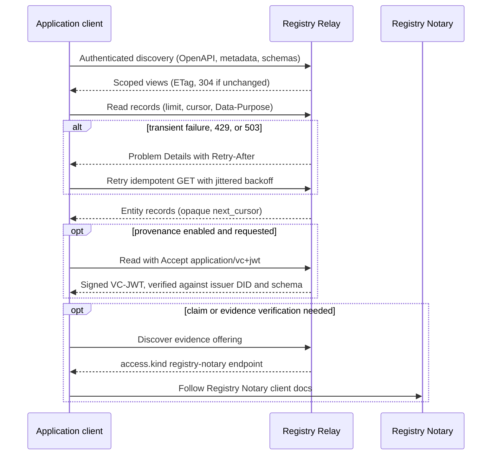
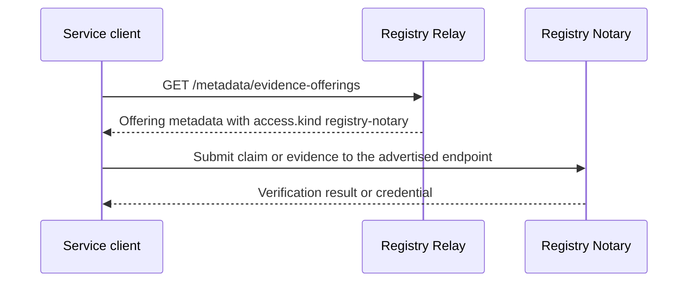

# Registry Relay Client Integration Guide

This guide is for application teams calling Registry Relay. It describes client
behavior for the V1 dataset-scoped REST API.

For concrete deployment-specific paths and schemas, fetch the runtime OpenAPI
document from the deployment at `GET /openapi.json`, or read the
[Registry Relay API reference](https://docs.registrystack.org/api/registry-relay.html).
Runtime OpenAPI is auth-gated by default unless `server.openapi_requires_auth`
is disabled for demos or controlled tooling.



*The typical client lifecycle: authenticated discovery, scoped reads with
conservative retries, optional response provenance, and handoff to Registry
Notary for verification. Each step is detailed in the sections below.*

## Integration Checklist

Before a client is allowed to consume Relay data, confirm:

- The caller has a named service identity in the deployment's auth system.
- The caller has only the dataset scopes required for its workflow.
- Row reads that serve a human or program decision send `Data-Purpose`.
- Collection reads include required filters where entities declare them.
- The client handles RFC 9457 Problem Details instead of parsing text messages.
- The client treats cursors, `ETags`, and provenance credentials as opaque values.
- Logs redact bearer tokens, API keys, query values for sensitive fields, raw
  row bodies, VC-JWT bodies, and Problem Details `detail`.

## Authentication

Relay deployments use one auth mode at startup:

- API key: send the raw key as `Authorization: Bearer <key>`.
- OIDC: send the access token as `Authorization: Bearer <jwt>`.

Do not try both headers in the same client profile. Choose the mode advertised
by the deployment operator.

Scopes are dataset-local and written as `<dataset_id>:<level>` (for example
`social_registry:rows`). Request only the scopes your workflow needs: a
`metadata` scope never implies row access, a row scope never implies aggregate
access, and the `evidence_verification` scope grants standards-adapter access
only, not a Relay-local verification execution endpoint. For the full scope
semantics see the [Registry Relay API reference](api.md#authentication).

## Purpose Header

Some entities require `Data-Purpose` for row or feature reads. Send a stable
purpose URI or controlled string that the operator can audit:

```http
Data-Purpose: https://data.example.gov/purposes/service-intake-check
```

The value is written verbatim into audit records. Purpose values are not
enforced or validated at the consultation layer; Registry Notary is the
purpose-certification layer. Do not put subject identifiers, free-text case
notes, bearer tokens, or other secrets in this header. For the full list of
entities that enforce this header and the resulting error code, see
the [Registry Relay API reference](api.md#purpose-headers).

## Discovery

Use scoped discovery before hard-coding dataset assumptions:

1. Fetch the runtime OpenAPI document for the authenticated caller.
2. Fetch metadata catalog views for visible datasets and entity schemas.
3. Cache metadata only as a private, principal-specific artifact.
4. Refresh discovery after a deployment, config reload, or permission change.

Metadata responses may include `ETag`. If a client sends `If-None-Match`, an
unchanged scoped view can return `304 Not Modified`. Shared caches must not
reuse one caller's metadata for another caller.

## Reading Records

Treat entity names and field names as deployment contract, not table names.
Table ids and source column names are private operator configuration.

Recommended client behavior:

- Always set an explicit `limit`.
- Preserve opaque `next_cursor` values exactly as returned.
- Restart pagination from the first page when filters, projection, purpose, or
  auth context changes.
- Handle `pagination.cursor_invalidated` by restarting the read with the same
  query intent.
- Avoid broad unfiltered reads unless the entity contract explicitly allows
  them.

Fields marked `sensitive: true` are audit-redacted. That flag is not an
authorization control and does not hide fields from authorized API responses.

## Aggregates

Aggregates are predeclared by the operator. Clients may discover available
measures, dimensions, defaults, disclosure controls, and structure before
executing an aggregate.

For JSON responses, handle suppression and masking as normal result states.
Suppressed groups are not transport failures.

CSV output is intended for operational exports and interoperability. When a
deployment supports CSV aggregate output, clients should preserve:

- response headers describing disclosure and freshness;
- the `Link: rel="describedby"` aggregate structure relation;
- CSV header names exactly as returned.

SDMX JSON output is intended for statistical tooling. Request it with
`?f=sdmx-json`, request body `"format": "sdmx-json"`, or
`Accept: application/vnd.sdmx.data+json;version=2.1`. SDMX messages declare
`https://json.sdmx.org/2.1/sdmx-json-data-schema.json`; clients should also
check the `meta.x-completeness` object before treating a cube as complete.

## Errors

Relay returns Problem Details for non-2xx responses. Log only safe fields:

- HTTP status
- `code`
- `title`
- request id, if present
- retry-related headers, if present

Avoid logging `detail` in production unless the operator has confirmed it is
redacted for that deployment.

Typical client handling:

| Code Family | Client Action |
| --- | --- |
| `auth.*` | Refresh credentials or fail closed |
| `entity.filter_required` | Add one of the required filters |
| `pagination.cursor_invalidated` | Restart pagination |
| `metadata.*` | Refresh discovery or report deployment mismatch |
| `aggregate.*` | Check aggregate structure, measure discovery, and caller scope |
| `provenance.*` | Fall back to plain JSON only if the workflow permits unsigned data |

## Retries

Use conservative retries:

- Retry idempotent GETs for transient transport failures, `429`, or `503`.
- Honor `Retry-After` when present.
- Use jittered exponential backoff.
- Do not retry requests that could create audit ambiguity unless the route
  contract explicitly says it is idempotent.

Relay is read-only for registry data, but retries still create extra audit
events and may repeat costly source reads.

## Signed Response Credentials

When signed response credentials are enabled, clients can request W3C VCDM 2.0
VC-JWT credentials with an accepted VC media type. Treat the returned compact
JWS as an opaque signed artifact and verify it with the issuer DID document and
published schemas.

These are signed response credentials, not W3C PROV-O. The `provenance` config
key governs the issuer configuration for backward compatibility, but the correct
public description is "signed response credentials".

Do not confuse Relay signed response credentials with Registry Notary evidence
verification. Relay can sign selected data responses. Registry Notary owns
claim evaluation, evidence verification, credential issuance workflows, and the
verification semantics behind evidence offerings.

## Registry Notary Handoff

Relay publishes evidence offering metadata for discovery and delegates all claim
and evidence verification to Registry Notary. The only evidence offering routes
in Relay are:

```http
GET /metadata/evidence-offerings
GET /metadata/evidence-offerings/{offering_id}
```

These routes require the caller's `metadata` scope for the owning dataset. They
return discovery records; they do not execute a check, compute claim hashes,
issue verification receipts, or disclose row data. There is no
`POST /evidence-offerings/{offering_id}/verifications` route in Relay.



*The discovery and verification boundary. Relay publishes evidence offering
metadata that points to a Notary; the client submits the claim or evidence to
that Notary, which performs verification. Relay makes no verification decision.*

When a client needs to verify claims or evidence:

1. Fetch `GET /metadata/evidence-offerings` (or the single-offering route by id)
   to discover available offerings.
2. Read the `access.kind: registry-notary` field and the advertised Notary
   endpoint or discovery URL.
3. Follow Registry Notary's client documentation for request shape, claim
   semantics, presentation, result verification, and credential issuance.

The `evidence_verification` scope is available as a distinct label for
standards adapters and integrations that need evidence-oriented access separate
from row reads. It does not grant metadata, rows, aggregates, admin reload, or a
Relay-local verification endpoint.

Use Registry Notary's documentation as the source of truth for verification
semantics, claim request bodies, result interpretation, credential issuance,
client retries, and verifier behavior:

- [Registry Notary client SDK guide](https://docs.registrystack.org/products/registry-notary/client-sdk-guide/)
- [Registry Notary documentation](https://docs.registrystack.org/products/registry-notary/)
