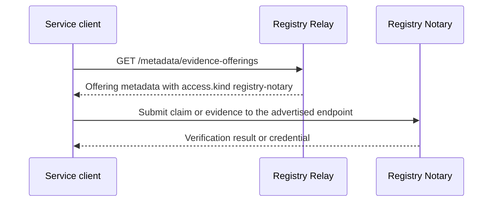

# Evidence Offering Discovery

Registry Relay publishes evidence offering metadata for discovery and delegates claim and evidence verification to Registry Notary. Relay exposes registry data from configured file and PostgreSQL sources.

The only evidence offering routes in Relay are:

```http
GET /metadata/evidence-offerings
GET /metadata/evidence-offerings/{offering_id}
```

Evidence offering metadata must point to Registry Notary with `access.kind: registry-notary`. Clients submit claims and evidence to the advertised Notary endpoint or discovery document. Relay does not compute claim hashes, make verification decisions, issue evidence verification receipts, or expose `POST /evidence-offerings/{offering_id}/verifications`.



*The discovery and verification boundary. Relay publishes evidence offering
metadata that points to a Notary; the client then submits the claim or evidence
to that Notary, which performs verification. Relay makes no verification
decision.*

The `evidence_verification` scope remains available as a distinct label for standards adapters and integrations that need evidence-oriented access. It does not grant metadata, rows, aggregates, admin reload, or a Relay-local verification endpoint.

Use Registry Notary's documentation as the source of truth for verification semantics, claim request bodies, result interpretation, credential issuance, client retries, and verifier behavior:

- [Registry Notary client SDK guide](https://docs.registrystack.org/products/registry-notary/client-sdk-guide/)
- [Registry Notary documentation](https://docs.registrystack.org/products/registry-notary/)
