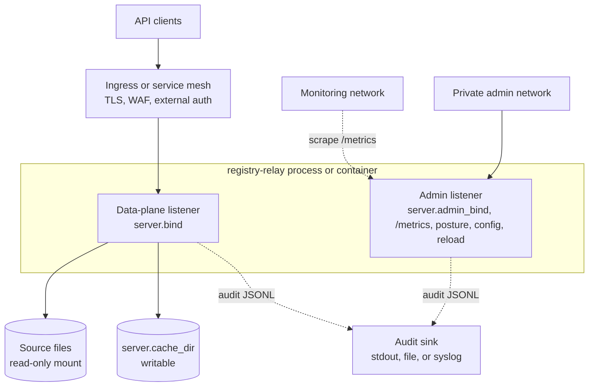

# registry-relay Operations Runbook

This runbook describes the V1 operating model for running Registry Relay in development, staging, and production-like deployments.

## Deployment Model

Recommended production topology:

- Run one `registry-relay` process or container per deployment unit.
- Bind the data plane on `server.bind`, usually `0.0.0.0:8080` in a container.
- Put TLS, WAF rules, and external auth policy at the ingress or service mesh layer.
- Keep source files mounted read-only.
- Keep `server.cache_dir` writable by the Relay runtime identity. In the
  production container, that is distroless non-root UID/GID `65532:65532`.
- Prefer stdout audit records in containers and let the platform log pipeline retain, rotate, and forward them.
- When `server.admin_bind` is enabled, expose it only on an internal address or private network policy.

Container defaults:

```text
/etc/registry-relay/config.yaml       default config path
/var/lib/registry-relay/data          recommended source-data mount
/var/lib/registry-relay/cache         default writable cache mount when configured
/var/log/registry-relay               audit file mount for VM-style deployments
```

The binary exits non-zero if config parsing or validation fails, if required API-key hash environment variables are missing, or if listeners cannot bind.



*Recommended production topology. TLS, WAF, and external auth sit at the
ingress. The admin listener carries metrics, posture, governed config, and
reload operations and is reachable only from the private admin and monitoring
networks. Source files are read-only; the cache is writable; the public
data-plane listener does not mount `/metrics`.*

## Production Hardening Checklist

Run this gate before promoting any deployment beyond local demo use. Items that
are fully covered by an existing section link to it; items unique to this
checklist carry a one-line note.

### Network Boundaries

- [ ] Public data-plane listener is behind TLS at the ingress or service mesh
  layer. See [Deployment Model](#deployment-model).
- [ ] `server.admin_bind` is bound only to a private interface or loopback; it
  is not reachable through the public ingress. See [Deployment
  Model](#deployment-model) and [Metrics](#metrics).
- [ ] `/metrics`, `/admin/v1/posture`, and reload routes are not accessible from
  `server.bind`. See [Admin Posture And Config Apply](#admin-posture-and-config-apply).
- [ ] Rate-limiting is configured at the ingress for broad metadata discovery
  and aggregate endpoints.
- [ ] `server.trust_proxy` is disabled unless the gateway sits behind documented
  trusted proxy CIDRs. See [Configure](#configure).

### Auth And Key Rotation

- [ ] OIDC is preferred for multi-service deployments; API keys are acceptable
  only when a rotation and storage workflow is in place. See [API-Key
  Provisioning And Rotation](#api-key-provisioning-and-rotation).
- [ ] Dataset scopes are granted narrowly: metadata, aggregate, rows,
  evidence-verification, and admin scopes are separate and not implied by one
  another. Verified in `config/example.yaml` (`scopes` entries).
- [ ] `scope_map` is reviewed whenever IdP role names change (OIDC deployments).
- [ ] Denied callers are tested for every exposed dataset and adapter before
  go-live.

### Secrets Handling

- [ ] API-key hashes, `audit.hash_secret_env` material, OIDC client secrets,
  database passwords, and provenance signing JWKs are stored in the platform
  secret manager, not in YAML, image layers, shell history, crash reports, or
  issue trackers. See [API-Key Provisioning And Rotation](#api-key-provisioning-and-rotation)
  and [Provenance Signer Rotation](#provenance-signer-rotation).
- [ ] Full environment dumps are disabled in diagnostic tooling.
- [ ] Provenance signing-key rotation includes a DID document overlap window
  long enough for existing credentials to expire. See [Provenance Signer
  Rotation](#provenance-signer-rotation).

### Source Data Mounts

- [ ] File sources are mounted read-only. See [Deployment Model](#deployment-model).
- [ ] Database credentials have read-only privileges.
- [ ] PostgreSQL sources are bounded by configured projections, filters, and
  limits; table ids, column names, source paths, and query text are not exposed
  through metadata unless explicitly published.
- [ ] `server.cache_dir` is writable only by the Relay service account (UID/GID
  `65532:65532` in the production container). See [Deployment Model](#deployment-model).

### Audit Sink

- [ ] An audit sink is configured before production use. See [Audit Sink And
  Rotation](#audit-sink-and-rotation).
- [ ] `audit.hash_secret_env` is set to at least 32 bytes of deployment-specific
  random secret material; the relay fails closed if it is missing or weak.
  Field confirmed present in `src/config/mod.rs` and `config/example.yaml`.
- [ ] Append-only external log storage (or independent tail-hash anchoring) is
  used where stronger integrity is required; the beta sinks do not protect
  against a writer that can rewrite the sink. See [Audit Sink And
  Rotation](#audit-sink-and-rotation).
- [ ] Identifier fields that need audit redaction carry `sensitive: true` in
  table or entity field config. Field confirmed in `src/config/mod.rs`. Note:
  `sensitive: true` is audit-only; it does not hide fields from authorized
  responses.
- [ ] Bearer tokens, raw API keys, raw query values, row bodies, VC-JWTs, and
  unreviewed `detail` text are not logged.

### Metadata And Provenance Posture

- [ ] Portable metadata is validated before deployment (`just
  metadata-validate-profiles`). See [Build And Release](#build-and-release).
- [ ] Runtime backend URLs, source paths, scope names, and table ids are absent
  from portable metadata manifests.
- [ ] Scoped runtime metadata is not placed in shared public caches.
- [ ] Provenance is enabled only when verifiers can resolve the configured
  schemas, contexts, and DID documents. See [Provenance Signer
  Rotation](#provenance-signer-rotation).
- [ ] Registry Notary evidence verification is kept separate from Relay response
  provenance.

### Container Runtime Policy

- [ ] Production images use the `Dockerfile` (distroless `cc-debian12:nonroot`,
  UID/GID `65532:65532`). `Dockerfile.demo` is not used as production runtime
  evidence.
- [ ] No shell, package manager, `curl`, or `wget` dependencies are present in
  the production runtime stage; healthcheck uses `registry-relay healthcheck`.
- [ ] Writable mounts (`server.cache_dir`, `audit.sink: file` path) are owned
  by UID/GID `65532:65532`. See [Deployment Model](#deployment-model).
- [ ] TLS client behavior is verified after any base-image change by exercising
  an HTTPS OIDC JWKS/discovery path or a PostgreSQL TLS connection.

### Readiness Gates

- [ ] Liveness (`/healthz`) and readiness (`/ready`) probes are configured in
  the orchestrator. See [Readiness And Probes](#readiness-and-probes).
- [ ] Startup time allows for the largest XLSX/Parquet ingest before readiness
  is declared. See [Readiness And Probes](#readiness-and-probes).
- [ ] Alerts are set on startup validation failures, source ingest failures,
  audit sink failures, auth provider failures, and provenance signer failures.
  See [Metrics](#metrics).
- [ ] Degraded-source behavior and readiness expectations are tested in staging
  with production-shaped data sizes.
- [ ] The exact config, binary version, feature flags, and metadata manifest are
  recorded for each deployment.

### Pre-Promotion Test Gate

Run the closest practical checks for the enabled feature set before promoting
any image:

```sh
just fmt-check
just lint
just test-default
just test
just build
just metadata-validate-profiles
```

When optional adapters are enabled, run focused all-feature integration tests
for those adapters before exposing them to consumers.

## Build And Release

Build a local release binary:

```sh
just build
```

Build a container image:

```sh
scripts/build-image.sh registry-relay:<version>
```

The helper verifies that the local `registry-manifest` build context is a clean
checkout at the reviewed commit. Set
`REGISTRY_RELAY_ALLOW_UNPINNED_LOCAL_CONTEXTS=1` only for local development
builds that will not be published.

The base image is built with no optional Cargo features. Standards-enabled
release or lab images must opt in explicitly:

```sh
REGISTRY_RELAY_FEATURES=spdci-api-standards,standards-cel-mapping,ogcapi-edr \
  scripts/build-image.sh registry-relay:<version>-standards
```

If release notes claim SP DCI, standards CEL mapping, or OGC EDR support, record
the standards-enabled image tag or digest in the release evidence.

The build requires the pinned `registry-platform`, `registry-manifest`, and
`crosswalk` source trees because Relay uses sibling path dependencies. For
local builds, keep those checkouts next to this repository or set
`REGISTRY_PLATFORM_DIR`, `REGISTRY_MANIFEST_DIR`, and `CROSSWALK_DIR` before
running `scripts/build-image.sh`.

Before promoting an image, inspect the effective config and verify that every env-backed `fingerprint.name` is supplied by the runtime environment and matches its signed commitment. Do not bake API keys or API-key hashes into the image.

If the runtime config uses `metadata.source.path`, validate the manifest and
runtime bindings before promotion:

```sh
just metadata-validate path/to/metadata.yaml
cargo test --test demo_configs_load
```

For standalone metadata publication, use `just metadata-publish` and publish the
generated `index.json` as the discovery entry point. See [metadata.md](metadata.md)
for the bundle layout.

For releases that claim DCAT-AP interoperability, run the
`dcat-ap-external-validation` GitHub Actions workflow or validate an
exported `/metadata/dcat/bregdcat-ap` with the SEMIC validator:

```sh
just validate-catalog-semic catalog=target/metadata.bregdcat-ap.jsonld
```

The release workflow uploads both the generated catalog and the SEMIC
JSON report as artifacts. Treat `dcatap.3_0_1_base` as the minimum
external profile; use stricter SEMIC profiles such as
`dcatap.3_0_1_full` when the deployment is intended to satisfy the full
European profile.

## Configure

Set the config path with `--config <path>` or `REGISTRY_RELAY_CONFIG`. The container image defaults to:

```sh
registry-relay --config /etc/registry-relay/config.yaml
```

Important configuration blocks:

- `server.bind`: public data-plane listener.
- `server.admin_bind`: optional admin listener. Intended for metrics, posture, governed config operations, and reload on a restricted network.
- `server.cache_dir`: writable cache for normalized Parquet files and ingest state.
- `server.cors.allowed_origins`: default deny when empty.
- `server.trust_proxy`: only enable when the gateway is behind trusted proxies and those proxy CIDRs are configured.
- `auth.api_keys`: key ids, hash env var names, and scopes.
- `config_trust`: optional local trust roots, anti-rollback state, and local approval state for governed signed config apply.
- `datasets[].source.path`: local file path inside the container or host.
- `datasets[].refresh`: `mtime`, `interval`, or `manual`.
- `audit`: audit sink and JSONL options.

Local-file startup config changes remain a rolling restart operation. Governed signed config apply is available on the private admin listener when the runtime handle and `config_trust` are installed. It can live-apply compatible public metadata changes, compatible provenance signing-key rotations, and locally approved root transitions that only change `config_trust.accepted_roots`; route-affecting, listener, auth, audit, dataset, standards, and most provenance shape changes still report `restart_required` and must be rolled through deployment. Dataset reload does not reload startup `config.yaml`.

## Operating With Registry Notary

Registry Relay is the protected registry consultation API. Registry Notary is
the claim evaluation, credential issuance, and attestation service. Relay can
publish metadata evidence offerings that point callers to Notary, but Relay
does not execute Notary claims. Notary calls Relay as an HTTP source when a
claim profile needs registry data.

Configure credentials on both sides:

- Relay must register a token hash for the Notary source caller, with only the
  dataset scopes needed by Notary claim profiles.
- Notary must register the caller token used by programs or wallets against
  Notary routes, and its source connector must reference the raw Relay token
  through an environment-backed `token_env`.
- Keep raw tokens and signing material out of YAML. Use service environment
  variables such as `REGISTRY_RELAY_CONFIG`, `REGISTRY_RELAY_BIND`,
  `REGISTRY_RELAY_LOG_FORMAT`, and `REGISTRY_RELAY_ENV_FILE`; use secret
  indirection fields ending in `_env` for token hashes, audit secrets, signing
  keys, database URLs, and source tokens.

For side-by-side local compose stacks, keep the public host ports distinct
while letting each container use its internal default listener. A common
convention is Relay on host `18080` mapped to container `8080`, and Notary on
host `18081` mapped to its container listener. Native local runs usually use
Relay `127.0.0.1:8080` and Notary `127.0.0.1:8081`; align source `base_url`
values with the network where Notary runs.

## API-Key Provisioning And Rotation

API-key config stores only:

- a stable key id;
- an environment variable name holding the SHA-256 fingerprint of the raw key;
- the key's scopes.

Recommended rotation procedure:

1. Generate a new random API key outside the gateway.
2. Store `sha256:<sha256(raw key)>` in the deployment secret store.
3. Add a new `auth.api_keys[]` entry or update the existing entry's `fingerprint` reference and commitment.
4. Apply the signed `client_credential_rotation` or `client_access_change` governed config bundle.
5. Confirm the new key can call the intended lowest-privilege endpoint.
6. Update the consumer to use the new raw key.
7. Remove the old key entry or old secret and restart or roll again.

Live keyring reload is not wired in V1. Treat key rotation as a rolling restart operation.

Never log raw keys, fingerprints, or full environment dumps. In issue reports, include only key ids and scope names.

## Signed Response Credential Signer Rotation

The signed response credential feature (W3C VCDM 2.0 VC-JWT; config key `provenance`, see [provenance.md](provenance.md)) introduces a signing key. The runtime contract is identical in shape to API-key rotation, but the recovery model is different: existing VCs signed under a retired key must still verify until they expire, so the DID Document keeps publishing those keys for a controlled window.

The signing key never lives in YAML. It is injected through the env var named by `provenance.issuer.signer.jwk_env`, holding a JSON-encoded private JWK. The public half goes in the DID Document; the private half stays in the secret store.

Production smoke for local software Ed25519 deployments:

1. Boot or roll the gateway with `REGISTRY_RELAY_PROVENANCE_JWK`
   injected by the runtime secret store.
2. Fetch `/.well-known/did.json` and
   `/schemas/entity-record/v1.json` from the public data-plane URL.
3. Request an entity-record VC with `Accept: application/vc+jwt` and a key
   scoped only for row reads.
4. Run `node scripts/verify_vc_jwt.mjs` against the saved VC, DID
   Document, expected issuer, expected `EntityRecord` claim type, and
   saved schema.
5. During rotation, save a pre-rotation VC, roll the new private JWK
   and `verification_method_id`, confirm the DID Document publishes
   both old and new `kid` values, then verify both old and new VCs.
   Remove the retired public key only after the longest configured
   `claim_validity` window has elapsed and repeat the DID fetch.

See [Production Smoke Checklist](provenance.md#production-smoke-checklist) for exact commands.

Rotation procedure (gateway mode):

1. Mint a new Ed25519 keypair for `EdDSA`. Store the new private JWK in the deployment secret store.
2. Add the new public JWK to the DID Document under a new `verificationMethod` id (e.g. `did:web:data.example.gov#issuance-2026q3`).
3. Move the currently active verification method to `provenance.issuer.retired_keys[]`, recording the `retired_after` RFC 3339 timestamp and the public JWK in its own env var.
4. Update `verification_method_id` to the new id and point the signer at the new material (`signer.jwk_env` for `software`, or the configured JWK file for `file_watch`).
5. Roll the gateway for local-file startup config changes. With governed signed config apply, Relay can live-apply an active provenance key-id flip when provenance was already enabled, issuer identity and route-affecting settings are unchanged, new local signer material is ready, and the old key is published in `retired_keys`. With `file_watch`, replacing file contents without a config change is only a same-public-key refresh; a different public key under the same `verification_method_id` is rejected so older VCs remain verifiable through the retired-key flow.
6. Confirm the new VCs verify with the new public JWK and that previously issued VCs (still inside their validity window) verify against the retired entry.
7. Once the longest applicable `claim_validity` window plus five minutes has elapsed since `retired_after`, drop the retired entry from config. Governed signed apply uses change class `signing_key_cleanup`; local-file startup config removes it on the next deploy.

Delegated mode follows the same steps, except the DID Document edits land on the ministry's side. Coordinate the cutover so the ministry publishes the new `verificationMethod` before the gateway starts signing with the corresponding private key.

Remote signing (`signer.kind: kms`) is reserved for a future backend and is rejected by V1 config validation. The supported production paths are local Ed25519 signing with a private JWK loaded from the configured secret environment variable (`software`) or from a configured local JWK file (`file_watch`).

Never log the JWK, the env var value, or any full environment dump. The provenance audit block intentionally records only `iss`, `kid`, `jti`, `claim_type`, `subject`, and the `iat`/`nbf`/`exp` triple, not the signed body or any signing material.

## Audit Sink And Rotation

Audit records are JSON Lines and are separate from operational logs. Operational logs go to stderr as readable text by default. Set `REGISTRY_RELAY_LOG_FORMAT=json` or `REGISTRY_RELAY_LOG_FORMAT=jsonl` when operational logs should be emitted as JSON Lines for collection or redirected files.

Current runtime behavior:

- The public and admin listeners cap accepted sockets with `server.max_connections`, close incomplete HTTP/1 headers after `server.http1_header_read_timeout`, and bound request-body reads with `server.request_body_timeout`. Direct HTTP/2 serving uses the same finite connection cap and keepalive timeout, but production deployments that terminate HTTP/2 at a reverse proxy must set bounded proxy header/body read timeouts and per-client connection limits before forwarding to the relay.
- `audit.sink: stdout` writes audit JSONL to stdout.
- `audit.sink: file` writes audit JSONL to the configured path and rotates in-process by `rotate.max_size_mb` and `rotate.max_files`.
- `audit.sink: syslog` ships audit JSONL to the local syslog Unix datagram socket.
- Audit output is always wrapped in `registry-platform-audit` envelopes with `prev_hash` and `record_hash` fields. These fields detect ordering gaps and accidental corruption in retained logs, but the beta file/stdout/syslog sinks do not protect against a writer that can rewrite the sink. Use an append-only external log store or independent tail-hash anchoring when stronger integrity is required. `audit.chain` is retained for config compatibility.
- HTTP request completion is logged at `info` with method, matched route template, request id, status, and latency. It does not log raw query strings, request bodies, auth headers, or row values.
- `REGISTRY_RELAY_LOG_FORMAT=json` switches stderr operational logs from text to JSONL.

File sink example:

```yaml
audit:
  sink: file
  format: jsonl
  hash_secret_env: REGISTRY_RELAY_AUDIT_HASH_SECRET
  path: /var/log/registry-relay/audit.jsonl
  rotate:
    max_size_mb: 100
    max_files: 14
```

For container deployments, `stdout` is still the simplest default because the platform log pipeline owns retention, rotation, access control, and SIEM forwarding. For VM deployments, use `file` when the gateway should own audit rotation locally, or `syslog` when the host forwards records to a central collector.

`audit.hash_secret_env` is required for runtime startup and must point to at least 32 bytes of deployment-specific random secret material. The relay fails closed when the setting is missing, empty, unset, or weak, so sensitive audit lookup hashes never silently downgrade to unkeyed SHA-256.

Audit records must not contain raw secrets or raw API keys. Mark identifier fields as `sensitive: true` in table or entity field config when query values should be deterministically hashed in audit rather than omitted entirely. The flag is audit-only in beta; it does not remove fields from authorized API responses.

**Data-Purpose audit semantics** (frozen, 2026-06-11 evidence-contracts decision record, D5): when the `Data-Purpose` header is present on a request, its value is always recorded verbatim in the audit trail (`purpose` field). Header presence can be required per entity via `require_purpose_header: true`; a missing header returns `400 auth.purpose_required`. Purpose values are not enforced or compared at the consultation layer; Registry Notary is the purpose-certification layer. Value-level allowlists, if ever added, will arrive as additive opt-in configuration.

## Dataset Refresh And Reload

Refresh modes:

- `mtime`: poll source file modification time and reload when it changes. The default poll interval is 60 seconds.
- `interval`: reload unconditionally on the configured interval.
- `manual`: reload only through an admin request.

The original source file is never modified. On ingest failure, the intended behavior is to keep serving the previously loaded table and mark readiness degraded for the failed resource.

Manual table reload:

```sh
curl -X POST -H "Authorization: Bearer $ADMIN_API_KEY" \
  http://127.0.0.1:8081/admin/v1/datasets/social_registry/tables/individuals_table/reload
```

Manual source-resource reload:

```sh
curl -X POST -H "Authorization: Bearer $ADMIN_API_KEY" \
  http://127.0.0.1:8081/admin/v1/reload
```

The reload-all response includes `status` and aggregate `counts` for total, succeeded, and failed resources. A non-zero failure count returns HTTP 500 with `status: "failed"`; inspect the audit and operational logs for the resource-level failure context. This route reloads configured source resources, not startup runtime config.

## Admin Posture And Config Apply

Admin capabilities and operations posture are read-only admin-listener routes with their own scope:

```sh
curl -H "Authorization: Bearer $OPS_READ_API_KEY" \
  http://127.0.0.1:8081/admin/v1/capabilities

curl -H "Authorization: Bearer $OPS_READ_API_KEY" \
  http://127.0.0.1:8081/admin/v1/posture
```

Use `?tier=restricted` only for trusted operations users who need the restricted projection. The default projection is redacted for broader operational sharing.

Governed config routes require a token with the independent `registry_relay:admin` scope:

```text
POST /admin/v1/reload
POST /admin/v1/config/verify
POST /admin/v1/config/dry-run
POST /admin/v1/config/apply
```

Treat `registry_relay:admin` as deployment authority. A holder can validate,
dry-run, apply, or reload runtime configuration, which can replace active data
sources, trust roots, scopes, and provenance settings.

`verify` and `dry-run` accept either inline `config_yaml` plus bundle metadata or a local signed TUF target reference. They validate the candidate and return:

```json
{
  "bundle_id": "test-bundle",
  "sequence": 5,
  "result": "verified",
  "posture_result": "not_applied",
  "applied": false,
  "restart_required": false
}
```

`apply` requires a signed TUF target and rejects inline config with `registry.admin.config.inline_apply_rejected`. The local signed target request shape is:

```json
{
  "tuf": {
    "root_path": "/etc/registry-relay/trust/root.json",
    "metadata_dir": "/etc/registry-relay/trust/metadata",
    "targets_dir": "/etc/registry-relay/trust/targets",
    "datastore_dir": "/var/lib/registry-relay/config-tuf",
    "target_name": "registry-relay.yaml"
  }
}
```

The remote signed target request shape uses the same trusted root and durable
datastore, but fetches TUF metadata and targets from guarded base URLs:

```json
{
  "tuf": {
    "root_path": "/etc/registry-relay/trust/root.json",
    "metadata_base_url": "https://config.example.gov/registry-relay/metadata/",
    "targets_base_url": "https://config.example.gov/registry-relay/targets/",
    "datastore_dir": "/var/lib/registry-relay/config-tuf",
    "target_name": "registry-relay.yaml"
  }
}
```

Remote sources are recorded as `signed_bundle_endpoint`; local repository
sources are recorded as `signed_bundle_file`. Remote admin requests must match
an operator-configured `config_trust.remote_tuf_repositories` entry before
Relay contacts the repository. The configured entry owns `root_path`,
`metadata_base_url`, `targets_base_url`, `datastore_dir`, and
`allow_dev_insecure_fetch_urls`; request bodies cannot introduce a new remote
repository or opt the server into insecure fetching. The default remote URL
policy requires safe HTTPS endpoints. HTTP loopback is accepted only with
`allow_dev_insecure_fetch_urls: true` in the configured allowlist entry for
tests and local development.

Break-glass requests are apply-only and must include all current fields:

```json
{
  "tuf": {
    "root_path": "/etc/registry-relay/trust/root.json",
    "metadata_dir": "/etc/registry-relay/trust/metadata",
    "targets_dir": "/etc/registry-relay/trust/targets",
    "datastore_dir": "/var/lib/registry-relay/config-tuf",
    "target_name": "registry-relay.yaml"
  },
  "break_glass": true,
  "break_glass_approval": {
    "approved_by": "ops@example.gov",
    "reason": "recover from bad live config",
    "approval_reference": "INC-4242",
    "emergency_change_class": "emergency_break_glass",
    "expires_at_unix_seconds": 1780000000,
    "rate_limit_identity": "registry-relay/relay-prod/production/default"
  }
}
```

Break-glass can waive only the previous-config-hash rollback check. It does not waive monotonic sequence, TUF signature and local trust-root authorization, expiry, emergency change-class authorization, or local rolling-window rate limits. The rolling-window policy comes from local `config_trust.break_glass_rate_limit`; requests that include `break_glass_rate_limit` are rejected. The audit record stores the approval reference, approver, emergency change class, expiry, and rate-limit identity; it stores a hash of `reason`, not the raw free text.

## Governed Config CLI

The `registry-relay config` command group operates governed signed config bundles from the command line. The two subcommands mirror the HTTP routes in [Admin Posture And Config Apply](#admin-posture-and-config-apply): `verify-bundle` validates a signed target in-process and `apply-bundle` posts an apply request to a running admin listener.

```text
registry-relay config verify-bundle <flags>
registry-relay config apply-bundle <flags>
```

Both subcommands accept either a local TUF repository (`--metadata-dir` plus `--targets-dir`) or a remote TUF repository (`--metadata-base-url` plus `--targets-base-url`). Local and remote flags cannot be mixed in one invocation. Flags accept both `--flag value` and `--flag=value` forms.

### config verify-bundle

`verify-bundle` loads the current config, resolves and TUF-verifies the signed config target, authorizes it against the local `config_trust` roots, compiles the candidate, and prints a JSON report to stdout. It does not check anti-rollback, apply the candidate, or contact a running gateway.

Flags:

- `--config`: path to the current config used as the verification baseline. Optional. Falls back to `REGISTRY_RELAY_CONFIG`, then `./config/example.yaml`.
- `--root-path`: path to the trusted TUF root JSON. Required.
- `--datastore-dir`: durable TUF client datastore directory. Required.
- `--target-name`: TUF target name of the config payload. Required.
- `--metadata-dir`: local TUF metadata directory. Required for a local source.
- `--targets-dir`: local TUF targets directory. Required for a local source.
- `--metadata-base-url`: remote TUF metadata base URL. Required for a remote source.
- `--targets-base-url`: remote TUF targets base URL. Required for a remote source.
- `--allow-dev-insecure-fetch-urls`: compatibility flag for HTTP loopback fetch URLs in local CLI verification. Admin HTTP remote fetches use the matching `config_trust.remote_tuf_repositories[].allow_dev_insecure_fetch_urls` value instead of the request value.

The report includes the resolved `bundle_id`, `stream_id`, `sequence`, `previous_config_hash`, `config_hash`, `posture_config_hash`, TUF `root_version` and `tuf_root_sha256`, source posture (`signed_bundle_file` or `signed_bundle_endpoint`), `change_classes`, and `signer_kids`.

Example with a local TUF repository:

```sh
registry-relay config verify-bundle \
  --config /etc/registry-relay/config.yaml \
  --root-path /etc/registry-relay/trust/root.json \
  --metadata-dir /etc/registry-relay/trust/metadata \
  --targets-dir /etc/registry-relay/trust/targets \
  --datastore-dir /var/lib/registry-relay/config-tuf \
  --target-name registry-relay.yaml
```

### config apply-bundle

`apply-bundle` builds an apply request from the signed target reference and posts it to `/admin/v1/config/apply` on the admin listener with a bearer token, then prints the parsed JSON response. The gateway performs TUF verification, trust-root authorization, anti-rollback (monotonic sequence and previous-config-hash), and any required local operator approval. A non-success HTTP status exits non-zero.

Flags:

- `--admin-url`: base URL of the admin listener, for example `http://127.0.0.1:8081`. Required. Must use `http` or `https`.
- `--admin-token-env`: name of the environment variable holding the `registry_relay:admin` bearer token. Required. The variable must be set and non-empty.
- `--root-path`: path to the trusted TUF root JSON. Required.
- `--datastore-dir`: durable TUF client datastore directory. Required.
- `--target-name`: TUF target name of the config payload. Required.
- `--metadata-dir`, `--targets-dir`: local TUF source pair (see verify-bundle).
- `--metadata-base-url`, `--targets-base-url`, `--allow-dev-insecure-fetch-urls`: remote TUF source flags (see verify-bundle).
- `--local-approval-reference`: local operator approval reference. Optional. Supply it when the change class requires a recorded local approval; the gateway resolves it server-side.

The CLI reads the bearer token only from the named environment variable; it is never passed as a flag. The apply-bundle subcommand does not send break-glass fields. Break-glass remains an HTTP-only apply path as described above.

Example posting a remote bundle to a running admin listener:

```sh
export RELAY_ADMIN_TOKEN=...  # registry_relay:admin bearer token
registry-relay config apply-bundle \
  --admin-url http://127.0.0.1:8081 \
  --admin-token-env RELAY_ADMIN_TOKEN \
  --root-path /etc/registry-relay/trust/root.json \
  --metadata-base-url https://config.example.gov/registry-relay/metadata/ \
  --targets-base-url https://config.example.gov/registry-relay/targets/ \
  --datastore-dir /var/lib/registry-relay/config-tuf \
  --target-name registry-relay.yaml
```

## Readiness And Probes

Use:

```text
GET /healthz
GET /ready
```

`/healthz` is liveness only and does not check datasets. `/ready` returns 200 only when configured resources have ingested successfully once the readiness watch is installed. On ingest failures it returns `503 application/problem+json` with failed or not-ready resources.

In orchestrators:

- Use `/healthz` for liveness.
- Use `/ready` for readiness and traffic gating.
- Give startup enough time for the largest XLSX/Parquet ingest.

## Metrics

When `server.admin_bind` is configured, the admin listener exposes:

```text
GET /metrics
```

The response is Prometheus-style `text/plain` suitable for scraping from the private admin network. The public data-plane listener does not mount `/metrics`.

Metrics are intentionally bounded. Request metrics use low-cardinality labels such as method, route or endpoint class, and status, plus request-duration buckets. Readiness metrics are gauges derived from the ingest readiness snapshot. Metrics must not include raw query values, raw bearer tokens, request ids, API-key ids, key fingerprints, `Data-Purpose` values, or dataset row content.

Recommended scrape posture:

- Scrape only the admin listener from a private monitoring network.
- Treat `/metrics` as operational telemetry, not an audit record or per-request trace.
- Use audit logs for security review and request-level accountability.
- Alert on readiness gauges and elevated 5xx/error counters before routing traffic away.

## Troubleshooting

Config fails at startup:

- Check YAML shape against [config/example.yaml](../config/example.yaml).
- Confirm every env-backed `fingerprint.name` variable is set.
- Confirm each referenced fingerprint value is a `sha256:<64 lowercase hex chars>` fingerprint and matches the signed commitment.
- Confirm ids are lower-snake and unique.
- Check vocabulary prefixes used by `concept_uri` and `conforms_to`.
- For `metadata.manifest.*` errors, validate the portable metadata manifest.
- For `runtime.binding.*` errors, compare runtime dataset, entity, field, filter, and relationship ids with the compiled metadata manifest.

Protected endpoint returns 401:

- Confirm the request has `Authorization: Bearer <key>` or `X-Api-Key`.
- Confirm the raw key hashes to one configured fingerprint.
- Confirm the process was restarted after key changes.

Protected endpoint returns 403:

- Confirm the key has the exact scope named by the entity access block.
- Remember that metadata, aggregate, rows, evidence verification, and admin scopes do not imply one another.
- For row or OGC feature endpoints on entities with `require_purpose_header: true`, include `Data-Purpose`.

Dataset or entity returns unknown-resource errors:

- Confirm the public path uses the entity `name`, not the backing table id.
- Confirm entity relationships target entities in the same dataset.
- Confirm field filters use exposed entity field names, not hidden storage columns.

Readiness is 503:

- Inspect stderr operational logs for ingest errors.
- Check the source file exists at the path visible to the container or process.
- For XLSX, ensure the configured sheet is a clean rectangular table. Use `header_row` and `data_range` when the file has surrounding notes.
- Confirm strict schema fields match the source columns and types.
- Confirm `server.cache_dir` is writable.

Audit records missing:

- In containers, check stdout, not stderr.
- Confirm `audit.include_health` if expecting health and ready records.
- For `audit.sink: file`, confirm the parent directory exists or can be created
  by the Relay runtime identity. In the production container, that is UID/GID
  `65532:65532`.
- For `audit.sink: syslog`, confirm the host exposes the expected Unix datagram socket (`/var/run/syslog` on macOS, `/dev/log` on other Unix platforms).

Caller expected a signed VC but received plain JSON:

- Confirm the request `Accept` header lists one of `provenance.accepted_media_types` (default `application/vc+jwt` or `application/jwt`).
- Confirm `provenance.enabled: true` in the loaded config and that the process was restarted after the config change.
- Confirm the configured signer material is available and valid: `signer.jwk_env` for `software`, or `signer.path` for `file_watch`. Missing or malformed material fails the signer at startup, not at request time.
- For `mode: delegated`, confirm the ministry's DID Document publishes the gateway's `verification_method_id`.

Admin reload fails:

- Confirm `server.admin_bind` is configured and reachable only from the private admin network.
- Confirm the key has the independent `admin` scope.
- Check the per-resource `error_code` in the reload-all response. Use the table-specific endpoint to retry one failed source after correcting the underlying data or connectivity issue.

Metrics missing:

- Confirm you are scraping the admin listener, not `server.bind`.
- Confirm `server.admin_bind` is configured and reachable from the monitoring network.
- Expect `/metrics` on the public listener to be unavailable. Depending on the auth stack, the response may be `401` rather than `404`.
