# Evidence: Minimum-Disclosure Assertion Service

Status: Approved Version 1 product contract
Date: 2026-08-09
Audience: Product, architecture, privacy, interoperability, and implementation stakeholders

Companion implementation note: [IMPLEMENTATION.md](IMPLEMENTATION.md)
Companion source-testing note: [SOURCE-TESTING.md](SOURCE-TESTING.md)

## Executive summary

Evidence is a small, sector-neutral service for producing minimum-disclosure assertion evidence from authoritative data sources. It is designed first for government deployments with constrained operational capacity, while remaining useful to EU public administrations and private-sector organizations modernizing existing applications.

In this note, **Evidence** names the product. Lowercase **evidence** and **assertion evidence** name the CCCEV-aligned domain object it produces.

Evidence is a greenfield product concept. It is not a rewrite, replacement mode, or reduced configuration of Registry Notary and does not inherit that product's architecture or feature set.

Given authenticated authority, an authorized purpose, a fixed requirement, and
the configured selector data needed by an authoritative provider, Evidence
obtains the necessary facts and returns the smallest sufficient JSON assertion.
An assertion may describe a property, classification, eligibility decision,
status, or relationship involving one or more role-bound subjects. A national
identifier is one possible selector, not a prerequisite.

The service is deliberately narrower than a data governance platform, API gateway, identity-matching service, workflow engine, credential suite, or policy decision platform. One service process may host many evidence definitions when they share one operator-controlled trust domain. Governed configuration, scripts, schemas, codelists, and fixtures form one trusted, atomic evidence bundle. A separate closed runtime file binds that bundle to process-local listener, filesystem, audit-storage, secret-mount, signer transport and pinned version, and TLS-trust paths without overriding evidence semantics or the governed active public key.

JSON is the native API and evidence representation. Requirements and evidence are aligned with CCCEV, using a documented Evidence JSON profile rather than RDF or XML. YAML declares fixed requirements, authorization conditions, source requests, trusted derivation parameters, concepts, and disclosure forms. A fixed source request reaches its source over one of two coequal transports: a fixed HTTP JSON request, or one reviewed SQL statement executed against a read-only SQLite extract file mounted beside the process. Trusted Rhai scripts execute inside the process to extract typed facts and derive declared concept values from a deterministic evaluation context. Rust retains control of authentication, authorization, networking, extract-file access, credentials, script capabilities and limits, output validation, disclosure enforcement, evidence construction, signing, and audit.

Version one produces assertion evidence with signed flattened JWS as the
default and durable-verification format. A governed authority grant may also
permit an explicitly requested, visibly unsigned JSON envelope for development
or consumers that cannot process JWS. Unsigned output is transport-authenticated
convenience data, not later-verifiable evidence and never a fallback from
signing failure. Evidence does not retrieve or deliver documents, issue holder
credentials, run a general policy engine, expose a public requester-entitlement
or definition catalog, or implement OOTS. It exposes an authenticated,
requester-scoped description of complete request shapes already authorized by
the deployed bundle, plus a closed public provider advertisement that another
service may index. The advertisement is neither searchable inside Evidence nor
a trust or access decision. Those
deferred capabilities remain separate future profiles and must not shape the
initial runtime beyond stable identifiers and transport-neutral domain objects.

Version one is accepted against four coequal initial assertion cases: adult status, controlled residence region, professional licence status, and legal-parent relationship. All four must pass the complete production path before the public contracts freeze. None is an implementation slice, privileged reference case, or part of the Rust domain model.

## 1. Product thesis

> Given authenticated authority, an authorized purpose, a predefined CCCEV-aligned requirement, and an authorized configured selector for each subject role, Evidence returns the smallest sufficient assertion in an authorized response format and persists no unnecessary source data.

The unit of behavior is a versioned requirement, not an arbitrary query. A requirement declares:

- its stable identity and revision;
- the legal, procedural, or contractual context in which it is meaningful;
- the purposes and requester classes that may invoke it;
- the subject roles, allowed selector profiles, and value origins that must be
  authorized;
- the semantic concepts it evaluates or provides;
- the authoritative source and fixed source request;
- the typed facts extracted from the source response;
- the trusted, requirement-specific Rhai derivation and its fixed parameters;
- the exact disclosure form permitted for each concept;
- the Evidence Type to which the result conforms;
- its observation, validity, audit, and failure rules.

Callers choose only among definitions, purposes, and selector profiles for
which they are already authorized. They may supply only the closed selector
values allowed by that authority path. They cannot supply expressions,
thresholds, field names, operators, JSON paths, source fields, scripts, response
projections, relationship types, or matching rules.

## 2. Target deployments

The core product is government-first and sector-neutral.

### Native government deployment

One binary runs on modest infrastructure, uses locally controlled configuration and audit sinks, and integrates with existing registries. It does not require Kubernetes, a message broker, a database server, OPA, or a service mesh. Reading a mounted SQLite extract needs none of those either: the file is opened read-only in process, Evidence stores nothing in it, and no database credential exists to be held.

### Enterprise and private-sector deployment

Evidence runs behind an existing gateway or identity boundary and produces assertions such as age eligibility, organization status, professional authorization, insurance coverage, or supplier compliance. It does not become a multi-tenant governance platform.

### EU deployment

The same core may later sit behind an OOTS Data Service boundary. OOTS RegRep XML, Evidence Broker and DSD registration, Semantic Repository profiles, preview, AS4, and OOTS retention rules remain in an explicit interoperability profile.

### Delegated software agents

AI agents may later invoke fixed evidence operations under an external, task-bound authority grant. The agent is an authenticated actor, not the source of authority. Agent protocols and orchestration remain outside the core.

These are profiles around one evidence engine, not separate product editions.

## 3. Goals

Evidence should:

- produce structured minimum-disclosure assertion evidence;
- use CCCEV as its semantic foundation;
- expose one simple JSON evidence operation and one authenticated discovery
  operation for complete requester-authorized request shapes;
- return signed audience-bound JWS by default, with unsigned JSON available
  only through explicit API selection plus governed bundle and grant
  permission, and with that audience-bound default displaced only where a
  requirement declares the holder-bound mode of section 8.6;
- support properties, classifications, statuses, eligibility results, and relationships;
- host many evidence definitions within one operator-controlled trust domain;
- use startup-only YAML configuration and trusted Rhai extraction and derivation scripts;
- execute fixed, least-privilege source requests through Rust;
- reuse platform audit and operational logging primitives where they fit;
- provide privacy-safe, tamper-evident audit records;
- minimize acquisition when the source supports it and always minimize disclosure;
- validate all definitions, scripts, and schemas before serving, and require
  complete fixtures before production or evidence-grade serving;
- prove source independence against materially different JSON API shapes;
- complement existing gateways, exchange layers, and workflow systems;
- remain small enough for a maintainer to trace an evidence request end to end.

## 4. Non-goals

Version one is not:

- a general-purpose data governance platform;
- a data lake, registry, evidence repository, or document service;
- a birth-certificate or other official-document generator;
- an API gateway, identity provider, consent service, or authorization server;
- a general identity-resolution, fuzzy or probabilistic matching, candidate-search, or deduplication service;
- a workflow, orchestration, or case-management engine;
- a general ETL, mapping, or query platform;
- a runtime policy engine or general PDP;
- a credential issuance protocol, OID4VCI, credential-status, or wallet service. The SD-JWT VC *response format* of section 15.6 and the holder-bound subject binding mode of section 15.8 are a serialization and a binding of the same assertion, and neither adds a credential lifecycle, a delivery protocol, or a credential status. Holder proof is verified by the relying party, through the portable verifier and its offline operator command, and never by the serving process, which issues no challenge and holds no presentation state;
- a multi-tenant SaaS control plane;
- a federation or delegated-evaluation protocol;
- an AI agent runtime, MCP server, or agent discovery service;
- an OOTS Evidence Broker, Data Service Directory, Semantic Repository, Preview Space, or AS4 Access Point;
- a replacement for source-system access control.

The query-platform line deserves stating precisely, because a source may
execute a reviewed SQL statement against a mounted extract. A query platform is
a system whose purpose is to accept a query at request time; Evidence accepts
none, over any transport. A statement is written into the bundle, covered by
the bundle hash, and reviewed as part of one disclosure surface. A caller
cannot write one, name a table or a column, add a predicate, widen a join, or
choose among statements beyond selecting a requirement it is already authorized
to invoke. This is the same reasoning that already admits a fixed HTTP request:
a bundle-fixed instruction to a source that no request input may reshape is not
a query language, whatever syntax it happens to be written in.

Document evidence, credential status and revocation, transaction-bound replay protection, OOTS execution, a public requester-entitlement or definition catalog, searchable, mutable, aggregate, or federated catalogs, response-led multi-source fulfillment, source-planning scripts, and the delegated-agent grant profile of section 15.3 are explicitly deferred. A multi-verifier holder credential is not among them: section 15.8 defines the declared holder-bound subject binding that produces one, together with the privacy analysis that binding requires, and it still adds no credential lifecycle and no delivery protocol. A fixed set of sources the bundle declares and orders is not response-led and is included under section 15.7. Deferring that profile does not defer the optional delegated actor identity of section 8.1: version one carries an actor in the authenticated authority context and authorizes it there, but consumes no agent grant record and exposes no agent-facing operations. The closed requester-scoped definition response is not a catalog or authorization source. The closed public provider advertisement remains allowed because it is a package-derived publication for indexing, not a catalog runtime.

## 5. Design principles

### 5.1 Fixed concepts instead of predicates

`adultStatus` is a versioned Information Concept with a fixed legal meaning. It is not a caller-defined predicate over a hidden date of birth.

A catalog of selectable thresholds such as `age >= 18`, `age >= 19`, and `age >= 20` would reconstruct the protected value. Evidence therefore exposes reviewed concepts, never a caller-supplied expression language. Trusted derivation code and parameters remain part of the atomic bundle and its combined disclosure review.

### 5.2 The deployment bundle is the disclosure boundary

Fixed requirements are not safe when their combined answers reveal more than any one answer. The complete simultaneously enabled bundle must be reviewed for:

- threshold ladders;
- overlapping categories;
- increasingly precise geographic partitions;
- jurisdiction variants;
- coexisting revisions;
- different entitlements held by the same requester;
- relationships whose combination reveals a protected identity or fact.

Rate controls and audit analysis may detect abuse, but they do not make an unsafe bundle safe.

The requirement is the unit of disclosure. Purpose, audience, and requester entitlement decide whether a requirement may be invoked at all; they never narrow the answer it returns. Two callers authorized for the same requirement receive the same concepts and disclosure forms whatever purpose each declared. A purpose that justifies only a coarser answer therefore needs its own requirement and its own place in this combined review.

### 5.3 Minimize across the lifecycle

Evidence distinguishes three source-access postures:

| Posture | Source behavior | Claim |
|---|---|---|
| `source-derived` | Source returns only the request-specific fact needed for concept derivation | Full acquisition and disclosure minimization |
| `field-projected` | Source returns a minimized set of fields from which the evaluator derives that fact | Strong acquisition and disclosure minimization |
| `record-transformed` | Legacy source returns a broader record | Disclosure minimization only |

Every source declares its posture. A single-source requirement inherits that
posture; a search-then-fetch requirement takes the weaker posture of its two
sources. `record-transformed` is a legitimate migration state, but it must not
be described as full lifecycle minimization.

Posture describes what crosses the boundary between a source and the evaluator.
For a source that runs a reviewed statement against a published extract, that
boundary is the statement's result set, so a statement computing the narrow
request-specific fact is `source-derived` on the same terms as an API returning
it. The later derivation may map that fact to the asserted concept. What the
extract itself contains is an acquisition decision the publisher made once,
before any request and outside Evidence. Section 9.2 states what that moves and
what it leaves in place.

For every posture:

1. Request only configured fields and selectors.
2. Keep source values in memory only for evaluation.
3. Construct responses from declared concepts and typed disclosure forms.
4. Persist no raw source response.
5. Exclude source values and disclosed values from logs and audit.

Configured provider lookup is compatible with this boundary. Evidence may send
an identifier or a closed compound selector such as name components and date of
birth. A reviewed requirement derivation may compare a separately authorized
selector with facts from one uniquely resolved authoritative record. Evidence
never requests a broad candidate list, scores or chooses a best match, or
treats a selector as proof of authority.

### 5.4 Keep the core transport-neutral

The evaluator consumes typed domain objects and returns typed assertion evidence. JSON, future OOTS XML, gateways, and agent-tool protocols are boundary representations. Rhai does not construct public responses.

### 5.5 Prefer immutable deployment artifacts

The governed bundle and closed runtime configuration are trusted deployment artifacts. They are validated at startup, scripts are compiled at startup, both inputs are mounted read-only, and each is identified by its own content hash. Version one has no runtime upload, mutation API, editor, approval workflow, hot reload, override layer, or fallback bundle.

### 5.6 One process means one trust domain

One process may serve many definitions, sources, and evidence types only when they share one operator, deployment lifecycle, audit boundary, and failure domain. Mutually distrustful issuers or customers use separate deployments.

### 5.7 Prove generality at the source boundary

Evidence must not be validated only against one idealized `person-facts` API.
The same Rust source layer and Rhai interfaces must handle materially different
source contracts, over both transports, without adding source-product concepts
to the core.

Version one proves this with small, sanitized compatibility mocks for:

- a flat REST JSON response;
- a paged, nested DHIS2 Tracker-style REST response;
- an OpenCRVS Version 2 Event Search-style JSON response using OAuth 2.0
  client credentials;
- a SQLite extract carrying a reserved publication table and the tables one
  reviewed statement reads.

These mocks reproduce only the boundary behavior Evidence consumes. They are
not emulators, conformance claims, or bundled vendor connectors. Optional
read-only tests against public demo systems follow the deterministic mock suite
and never gate ordinary CI.

DHIS2 and OpenCRVS names, data shapes, and behaviors are test concerns only.
Production Rust, Cargo features and dependencies, public configuration schemas,
routes, and CLI options remain source-product neutral. The runtime sees only a
generic fixed source request, a generic authentication profile or a read-only
file handle, bounded JSON, and Rhai extraction. A transport changes how facts
arrive and nothing else about what the core knows.

## 6. CCCEV-aligned assertion model

The Evidence JSON profile pins CCCEV 2.2.0 as its initial semantic reference. It uses selected CCCEV concepts with stricter runtime rules and explicit Evidence extensions.

### Requirement

A named, versioned prerequisite or information need. Implementations normally use a more specific CCCEV kind:

- **Criterion:** a condition to evaluate;
- **Information Requirement:** information to provide;
- **Constraint:** a limitation on a requirement or concept.

### Information Concept

A semantic fact needed by a requirement or provided by evidence, such as:

- adult status;
- residence region;
- professional licence status;
- organization registration status;
- legal-parent relationship confirmed;
- registered legal parents.

Each concept has a stable identifier, value schema, semantics, permitted disclosure form, and reference framework.

### Supported Value

A typed value supplied for an Information Concept. Version one supports closed schemas declared by the concept, including:

- boolean;
- controlled code or category;
- bounded integer or decimal;
- date or time bucket;
- audience-scoped entity reference;
- bounded lists of controlled codes or entity references.

Arbitrary JSON objects and caller-defined schemas are not accepted. A concept may define a reviewed structured value when its semantics require one, but the shape remains part of the trusted bundle.

Both entity-reference forms resolve only for the audience they were scoped to, so neither is available to a requirement that declares the holder-bound subject binding mode of section 8.6, which names no audience to scope them against.

### Evidence Type

A description of the assertion evidence expected for a requirement. Evidence Types may vary by jurisdiction or reference framework while supporting the same broader requirement.

### Evidence Type List

A CCCEV fulfillment alternative. Evidence Types within one list use `AND`; alternative lists use `OR`. Version one preserves these semantics in the conceptual and interchange model but does not execute multi-source or multi-evidence fulfillment.

### Evidence

The attributable assertion supporting a requirement. It includes:

- requirement and Evidence Type identifiers;
- legal issuer and technical provider;
- issued, observed, and optional validity times;
- role-bound subject bindings;
- audience and purpose context where appropriate;
- configuration revision;
- Supported Values.

Evidence extensions such as role-bound subject bindings, purpose, audience, and configuration revision are not presented as CCCEV-native properties. The JSON Schema must document the exact mapping between Evidence fields and CCCEV or Dublin Core properties.

### Reference Framework and jurisdiction

The legislation, policy, procedure, or contract from which a requirement derives. Jurisdiction and human-readable metadata belong to the definition bundle. Version one does not implement jurisdiction selection or a localization engine.

### Relationship assertions

Assertion evidence may involve more than one subject. Requirements declare fixed roles, cardinalities, and meanings.

For example, `confirm-legal-parentage` declares `child` and `candidate-parent` roles and returns a boolean `legal-parent-relationship-confirmed`. `identify-legal-parents` declares a `child` role and may return a bounded list of audience-scoped entity references.

`legal parent`, `biological parent`, `adoptive parent`, `guardian`, and `person with parental responsibility` are distinct concepts. A generic `parent` predicate is not accepted.

## 7. Runtime model

```mermaid
flowchart LR
    A["Requester"] --> B["JSON boundary"]
    B --> C["Authenticate and resolve authority context"]
    C --> D["Resolve and authorize selector profiles and values"]
    D -->|"authorized"| E{"Fixed acquisition kind"}
    D -->|"refused after authentication"| R["Write minimal authorization-refusal audit"]
    R --> S["Return generic 403"]
    E -->|"single"| F["Audit and execute one fixed source"]
    E -->|"search-then-fetch"| G["Audit and execute fixed search"]
    G --> H["Validate unique search FactSet"]
    H --> I["Audit and execute fixed fetch"]
    F --> J["Closed final lookup result"]
    I --> J
    J --> K["On match, Rhai derives declared concept values"]
    K --> L["Rust validates values and constructs evidence"]
    L --> M{"Authorized response format"}
    M -->|"signed"| N["Sign and serialize exact JWS"]
    M -->|"unsigned"| O["Serialize marked unsigned envelope"]
    N --> P["Write disclosure-release audit"]
    O --> P
    P --> Q["Return exact serialized response"]
```



The critical boundary is between derived concept values and public evidence. Rhai may return values only for concepts declared by the selected requirement. It cannot return evidence objects, create identifiers or subject bindings, select envelope fields, write audit events, or access signing material. Rust validates identifiers, types, codelists, cardinalities, sizes, and the exact output set before constructing evidence. Response protection and serialization are core-owned release steps after validation, not adapter capabilities or a second form of policy.

## 8. Authorization and subject authority

### 8.1 Authenticated authority context

Each deployment supports one reviewed authentication profile. It produces a normalized context containing:

- requester principal;
- configured requester attributes;
- optional delegated actor identity;
- authority basis and optional grant identifier;
- derived audience, which scopes the subject binding under the audience-scoped
  mode of section 8.6 and is not an input to a holder-bound one;
- permitted purposes and requirement revisions;
- permitted subject roles, selector profiles, and value origins.

Principals and attributes derive only from configured, validated sources. Missing required identity information denies the request. Evidence does not fall back to alternative token claims, request fields, or unsigned headers.

### 8.2 One authorization decision

Before source access, Rust binds one decision over:

```text
requester principal
+ optional delegated actor
+ requirement revision
+ purpose
+ subject roles, selector profiles, value origins, and authority
+ audience
```

Every element must be authorized together. Authorization for a purpose does not automatically authorize every subject, requirement revision, or audience.

The requirement's declared subject binding mode is part of the same decision. The bundle and the one matched authority path must each permit the holder-bound mode explicitly, and permitting a response format never permits a mode.

Exactly one authority path must match. No matching path denies, and two or more matching paths also deny rather than choosing between them. Startup validation confirms that every declared purpose, subject role, and selector profile has an authority path; it does not detect two paths covering the same combination, so an overlapping bundle is denied at request time rather than rejected at load.

### 8.3 Configured subject selectors

A subject selector is only input to a provider lookup. Possession of an
identifier, name, date of birth, record reference, or any other selector value
does not grant authority.

Each subject role admits one or more named selector profiles from trusted YAML.
A selector profile declares one exact field set, scalar types and bounds, value
provenance, and where it may be used by reviewed source preparation and
requirement derivation. If a provider
supports alternative sufficient data sets or an additional disambiguating
field, the bundle declares separate profiles instead of a conditional or
caller-built query. Examples include:

- one opaque civil-registration identifier;
- `given_name + family_name + birth_date`;
- locally meaningful name components and date of birth;
- a person selector plus a configured event or record disambiguator;
- two role-bound person selectors for a relationship lookup.

Field names are deployment-defined stable identifiers. `given_name`,
`family_name`, and `birth_date` are examples, not core Evidence vocabulary.
Version one selector values are bounded strings, full dates, integers,
booleans, or controlled codes. Selector objects, arrays, and arbitrary JSON are
not accepted. The core treats bounded name fields as opaque Unicode strings and
a date as a typed calendar value. It performs no case folding,
transliteration, phonetic comparison, fuzzy matching, confidence scoring, or
Western-name parsing.
Canonical selector serialization means deterministic encoding of the declared
typed field names and values. It does not mean semantic name normalization.

The public request names an allowed selector profile and supplies only that
profile's permitted values. Unknown, missing, extra, mistyped, or oversized
values are rejected before credentials are acquired or a source is contacted.
The caller cannot supply field names, operators, weights, thresholds,
normalization rules, or a query plan.

For a self or subject-bound flow, selector values should normally derive from
authenticated context or an authenticated grant and are omitted from the
request. An authorized caseworker flow may permit caller-supplied values for a
specific selector profile. Value origin is part of the subject-authority
profile and the authorization decision. These are distinct flows.

The authoritative provider owns record meaning and lookup cardinality under
its law and data-quality rules. Evidence accepts only the closed outcomes
`match`, `no_match`, and `ambiguous`. Only `match` may carry facts. A reviewed
requirement derivation may apply a deterministic, versioned comparison between
those facts and its authorized selectors. `ambiguous` never causes Evidence to
choose a candidate, and neither failed outcome exposes candidates, scores,
counts, or field-by-field diagnostics.

This boundary follows the useful part of the current Notary consultation
model: closed compiler-defined selector inputs, provider-owned cardinality,
and no candidate selection. It does not import Notary, Relay, evidence-pack,
PDP, or credential architecture into Evidence.

#### Research basis

The selector model is deliberately jurisdiction-neutral, but it reflects three
useful findings:

- OOTS sends an authenticated natural person's name and birth-date attributes
  to the Data Service, may omit a destination-specific person identifier, lets
  the Data Service apply national matching policy, and treats two or more
  results as failure rather than selecting one.
- UK GPG 45 models a claimed identity as a combination of attributes, commonly
  name, date of birth, and address, and keeps identity checking and assurance
  semantics distinct from the attribute data itself.
- The reviewed OOTS-derived gap spec records that a person identifier may have
  zero occurrences and that event evidence such as birth or marriage may need
  multiple role-bound persons or an additional configured record discriminator.

These references justify configurable compound selectors. They do not justify
shipping EU or UK field names, assurance rules, fuzzy algorithms, or civil-event
types in the Evidence core.

### 8.4 Consent, statutory authority, and delegation

Evidence consumes an authenticated authority context. Its basis may be statutory authority, organizational authority, consent, delegation, or an OOTS explicit request. A per-request grant reference is optional because statutory flows may derive authority from the requester and configured procedure. Evidence does not issue, manage, revoke, or infer that authority.

Where the basis is delegation, version one carries the actor identity in that context and confines an actor-bearing request to authority paths declared `delegated`. It does not resolve a delegating principal, enforce call constraints, or consume an agent grant record; section 15.3 covers those.

A caller-supplied consent or approval reference never creates authority by itself.

### 8.5 Existence disclosure

No-match, ambiguous-match, required-fact-missing, false, and source-unavailable
states must not accidentally disclose registry membership through status
codes, messages, or avoidable timing differences.

If a procedure is entitled to learn that a record exists or does not exist,
existence is modeled as a fixed, authorized concept. It is never an incidental
error detail. By default, `no_match` and `ambiguous` collapse to the same safe
public failure. The protected native audit may retain the closed `no_match` or
`ambiguous` class for accountability, but never a count, candidate, score, or
comparison diagnostic.

### 8.6 Subject binding modes

A subject binding is the opaque, role-bound handle an assertion carries in
place of selector values. It is derived over one canonical scope tuple:

```text
binding-key version
+ operator trust domain
+ binding scope
+ purpose
+ subject role
+ selector profile
+ the complete canonical selector field set and its values
```

The binding scope is the only element that varies between modes. The mode is
declared by the requirement inside the immutable bundle. Its vocabulary is
closed at two values and it carries no default:

| Mode | Binding scope | Declared by |
|---|---|---|
| `audience-scoped` | the audience derived from the authenticated context | absence, which is what a requirement that says nothing means |
| `holder-bound` | the RFC 7638 thumbprint of the holder public key the caller supplied | an explicit declaration on the requirement |

Each mode derives under its own domain constant, so the two derivations cannot
collide even under identical remaining inputs. Both emit into the one
`urn:evidence:subject` namespace; no second identifier namespace exists to
recognize. Both bind the operator trust domain, so the same scope under two
deployments never yields one handle; under the holder-bound mode that is what
keeps one wallet key unlinkable across deployments, since the audience that
separates them in the other mode is not one of its inputs. The holder input is
the thumbprint rather than the JWK bytes, so
member order, an added key identifier, and a declared algorithm change the JSON
without forking the binding for one key.

A binding is derived over the complete canonical role and selector bundle, not
over separate hashes of low-entropy fields. It is a request-binding handle, not
a public identifier and not an assertion that the selectors are globally
unique.

The derivation is keyed by a deployment secret in both modes. A relying party
therefore cannot recompute a binding under either mode and never attempts to.
It pins the expected role-bound bindings from independent trusted state, which
is the rule section 11.1 states for strict verification and which the holder
key does not relax.

Absence enables nothing. A requirement that declares no mode issues
audience-scoped assertions whatever the caller supplies, and no caller input
selects a mode. Section 15.8 states the holder-bound profile in full, including
the residual linkability that mode accepts and the presentation-side check it
requires.

## 9. Deployment bundle and source adapters

Governed configuration, scripts, schemas, codelists, mappings, and fixtures form
one atomic bundle. A separate closed runtime file owns only process-local
listener, filesystem, audit-storage, secret-mount, signer transport and pinned
version, and TLS-trust bindings. Both
inputs are startup-only, read-only, independently digested, and immutable for
the process lifetime. Runtime configuration is not an override layer and cannot
change service identity, trust domain, authentication or authority policy,
sources, requests, scripts, disclosure, rate limits, signing policy, or audit
fail-closed behavior. Readiness fails if either input is incomplete,
inconsistent, mutable, or cannot be validated.

Illustrative YAML:

```yaml
version: 1

service:
  provider_id: urn:example:data-service:evidence

signing:
  format: flattened-jws-json
  algorithm: ES256
  activePublicJwkFile: public-keys/<rfc7638-thumbprint>.jwk.json
  publishedPublicJwkFiles: []
  revokedKeyIds: []
  jwksPath: /.well-known/evidence/jwks.json
  maximumAssertionValiditySeconds: 300
  verifierClockSkewSeconds: 30

issuer:
  id: urn:example:authority:population-registry

selector_profiles:
  person-demographics-v1:
    fields:
      given_name: { type: string, maximum_bytes: 200 }
      family_name: { type: string, maximum_bytes: 200 }
      birth_date: { type: date }

sources:
  civil-registry:
    transport: http-json
    base_url: https://civil-registry.internal
    posture: field-projected
    tls_trust_profile: government-internal-pki
    authentication:
      kind: static-authorization
      token_ref: secret:file/civil-registry-token
    request:
      method: POST
      path: /v1/person-facts
      fixed_headers:
        - { name: Accept, value: application/json }
      selector_inputs:
        - role: subject
          alternatives:
            - profile: person-demographics-v1
              fields: [given_name, family_name, birth_date]
      prepare_script: adapters/civil-registry-prepare.rhai
      adapter_parameters:
        requested_fields: [date_of_birth]
        result_limit: 2
      adapter_parameters_schema: schemas/civil-registry-parameters.schema.yaml
      preparation_limits:
        query: forbidden
        json_body: required
      projection:
        - /total
        - /results/*/date_of_birth
      redirects: deny
      timeout: PT3S
      maximum_response_bytes: 65536
    response_schema: schemas/civil-registry-response.schema.yaml
    extract_script: adapters/civil-registry-extract.rhai
    fact_schema: schemas/civil-registry-facts.schema.yaml

requirements:
  - id: urn:example:requirement:adult-status:v1
    kind: criterion
    name: Adult status
    acquisition:
      kind: single
      source: civil-registry
    purposes:
      - benefit-eligibility
    requester_tags:
      - benefits-agency
    audience_from: requester
    subject_roles:
      - role: subject
        cardinality: one
        selector_profiles:
          - person-demographics-v1
    reference_frameworks:
      - urn:example:law:benefits-act
    evidence_type: urn:example:evidence-type:adult-status:v1
    observation_timezone: America/Santo_Domingo
    validity: PT24H
    derivation:
      script: derivations/adult-status.rhai
      parameters:
        minimum_age_years: 18
    concepts:
      - id: urn:example:concept:adult-status
        type: boolean
        disclose: value
```

### 9.1 Fixed source execution with reviewed request rendering

Rust owns everything that decides which source is reached, what is asked of it,
and how much may come back. The mechanisms differ by transport and the boundary
does not: a caller, a response, and a script hold authority over none of it,
and the one-request-per-stage ceiling and per-stage timeouts bind both. What
follows names each transport's instantiation of that one ownership rule.

For an `http-json` source, Rust owns scheme, host, method, the fixed path or
closed tagged selector or fetch prior-fact-bound path template, permitted query
and body channels, fixed headers, credentials, TLS trust, redirect policy,
response limits, and concurrency limits.

For a `sqlite-extract` source, Rust owns the extract file handle and the
read-only opening that produced it, the statement text, the authorizer verdict
on that statement, the binding of values into its declared parameters, the row
and step bounds it runs under, and the mapping of its result set into the
bounded JSON an extraction script receives.

After authorization and durable access-attempt audit, Rust supplies only the
source-required authorized selectors and the exact closed adapter context of
non-secret parameters plus empty or schema-validated prior facts to a reviewed
preparation script. The script renders the one request channel its transport
permits: ordered query pairs and at most one JSON body for `http-json`, or the
values of the parameters the statement declares it prepares for
`sqlite-extract`. It cannot choose the source, origin, path template or
path-binding origin, method, headers, credentials, redirects, retries,
pagination traversal, statement text, a parameter the statement fills from an
authorized selector, or another request.
Rust validates and encodes the complete result before any credential is
acquired and before any row is read.
This is deterministic request rendering, not caller-supplied templating or
dynamic source planning.

After bounded JSON parsing, Rust applies the source's non-empty extended JSON
Pointer projection before extraction. Unselected object keys are removed,
array order and length are preserved, and missing leaves remain missing. The
acquisition posture still describes the pre-projection wire response. Exact
projection grammar and conflict rules are part of the reviewed adapter ABI.

An extract source needs no separate projection step, because the statement's
select list is its projection. Rust maps the bounded result set into a JSON
tree of the declared column names, and nothing the statement did not select
exists to be removed from it.

Rust then validates the resulting tree against the source's required response
schema, a closed JSON Schema in the same subset as the adapter-parameter and
fact schemas. A response outside the shape the adapter was reviewed against is
a source-protocol failure and no script runs, so hand-written protocol checking
is not the only thing standing between a malformed response and fact
construction. What stays with the script is what a shape cannot state, such as
how a reported total agrees with the records returned and which values must
agree with the closed adapter parameters.

A Version 1 source must provide a bounded lookup that can establish zero, one,
or multiple results from the configured selector. If an existing system cannot
do that safely, a governed intermediary such as an existing integration layer
may expose the bounded lookup, and a published extract read through one
reviewed statement is such an intermediary. What Evidence does not do is
retrieve a registry or a broad candidate set at request time to compensate for
a source that cannot answer narrowly. An extract is written by its publisher,
on the publisher's schedule and by the publisher's decision; Evidence only
reads it, and section 9.2 states plainly what that arrangement moves and what
it does not.

The initial generic source-authentication profiles are HTTP Basic, a static
Authorization header, a static API-key header, and OAuth 2.0 client
credentials. All values come from secret references. The static Authorization
header carries the scheme the source names, defaulting to Bearer, because the
scheme is the origin's to choose. API-key header names are bundle-fixed and
cannot override authorization, routing, framing, cookie, forwarding, proxy, or
tracing headers. For OAuth, token acquisition is credential bootstrap rather
than an evidence-data source call, and a source authenticates either with a
client secret or with a private-key JWT assertion, the asymmetric form health
profiles require. Rust owns the fixed token endpoint, grant, client
authentication form, credential placement, audience, token lifetime handling,
bounds, and redaction. Rhai sees neither the credential flow, the signing key,
nor the resulting token.

The explicit local assurance profile may additionally use `kind: none` for a
source at one canonical numeric-loopback HTTP origin with an explicit non-zero
port. Rust sends no authentication header in that mode. Production and
evidence-grade bundles reject it, so this tutorial convenience is not an
unauthenticated deployment profile.

Bundle-fixed non-secret headers support media types, API versions, and tenant
selectors without giving scripts header authority. A source may name a logical
TLS trust profile whose private-CA file is bound by runtime configuration.
Hostname verification and fixed-origin verification remain mandatory; there is
no insecure or trust-all mode. Version 1 ignores ambient HTTP proxy environment
variables and has no application-level proxy configuration.

Those profiles and protections belong to `http-json`. An extract source has no
origin to reach and presents no credential, which the next section treats as
the point of the transport rather than a gap in it.

### 9.2 Reviewed read statements over a mounted extract

A `sqlite-extract` source executes one reviewed SQL statement against a
read-only SQLite file mounted beside the process. It is a coequal peer of
`http-json`, not a reduced mode of it. The same authorization decision precedes
it, the same durable access-attempt audit precedes its first row, it yields the
same closed lookup outcomes, and the same derivation, output validation,
signing, and release audit follow. A requirement acquires through one transport
or the other, and every rule outside acquisition reads the same either way.

Three properties decide SQLite rather than a client/server database.

Evidence never holds a database credential. The registry publishes a file and
Evidence opens it read-only. There is no grant to administer, no network path
from Evidence into a registry data tier, and no connection string in a secret
mount. A credential that does not exist cannot leak, expire unnoticed, or be
widened by a well-meaning administrator.

A statement can be proven safe before any row moves. SQLite's authorizer
callback runs while the statement is prepared and decides every action the
compiled statement would take, so Rust establishes that a statement cannot
write and cannot reach outside the file it was prepared against, rather than
trusting a reviewer to have noticed. No client/server database offers an
equivalent the client side can enforce.

One transport covers every source shape a registry actually holds. A CSV
export, a columnar file, a spreadsheet, or a dump from a general-purpose
relational database is one conversion command from an extract file, and none of
those formats becomes Evidence's problem. The conversion is the publisher's
step, run with the publisher's tools, on the publisher's side of the boundary.

Illustrative YAML, beside the HTTP source of the same bundle:

```yaml
sources:
  subject-extract:
    transport: sqlite-extract
    extractProfile: subject-registry-extract
    posture: source-derived
    maximumExtractAgeSeconds: 86400
    request:
      statement: queries/subject-facts.sql
      selectorInputs:
        - role: subject
          alternatives:
            - profile: person-demographics-v1
              fields: [given_name, family_name, birth_date]
      parameterBindings:
        birth_date:
          kind: selector
          role: subject
          profile: person-demographics-v1
          field: birth_date
      maximumRows: 2
    responseSchema: schemas/subject-extract-response.schema.yaml
    extractScript: adapters/subject-extract-extract.rhai
    factSchema: schemas/subject-extract-facts.schema.yaml
```

The statement is a bundle artifact covered by the bundle hash. The file is not:
the bundle names a logical extract and the closed runtime file binds it to a
path, exactly as it binds a private certificate authority. Republishing an
extract therefore leaves the bundle revision a relying party pinned unchanged,
which is why publication metadata and a declared maximum age are mandatory
rather than advisory. Binding a path is not a capability gate: a deployment
that mounts no extract runs no extract source, and no runtime switch turns this
transport on or off.

#### Full SQL is in scope

A statement may join, group, aggregate, use common table expressions, and use
window functions. What settles this is the category the statement belongs to.
It is a trusted, hash-identified bundle artifact reviewed as part of one
disclosure surface, in the same category as a Rhai derivation, and its
expressive power is bounded by review rather than by grammar. No invariant in
section 13 limits what a trusted bundle artifact may contain. Those that bound
what may be asked of a source bound what a caller may supply, so a reviewed
statement of any shape violates none of them. Invariant 8 anticipates this by
denying callers a query plan: a bundle-fixed statement is precisely the thing
the caller is denied a say in.

Pushing joins and aggregation into the statement improves minimum disclosure
rather than eroding it. A statement returning one count moves one number across
the process boundary. Fetching five hundred rows so that a script can count
them moves five hundred records into the process, into its memory, and into
whatever a later defect exposes. A join behaves the same way: the narrow answer
computed inside the extract is smaller than the two wide inputs that would
otherwise have to cross.

A statement that returns one aggregate is `source-derived` on the same terms as
an API returning that aggregate: the narrow fact is what crossed the source
boundary. A later derivation may map that fact to the asserted concept without
changing what the source returned.

#### The authorizer is a safety boundary, not a disclosure declaration

Rust installs an authorizer that denies unconditionally: every write action,
`ATTACH` and `DETACH`, every `PRAGMA`, extension loading, non-deterministic
functions, and time functions. A denied action fails the bundle at load, before
the deployment serves anything. It is never a request-time failure, because
nothing at request time can change which actions a statement takes.

There is deliberately no per-table or per-column read allowlist. Review of the
statement is the disclosure control. A second list of readable tables would be
a weaker restatement of what the reviewed statement already says, held
somewhere else and free to drift from it. The authorizer answers whether a
statement can do harm; review answers whether it should be asked at all.

#### One clock

`date('now')`, `time('now')`, and every other ambient time function are denied.
Rust binds its own evaluation instant to the reserved `evidence_now` parameter,
and a statement needing the current instant reads that parameter.

Evidence has exactly one clock. A second clock inside SQL would not honour the
pinned evaluation instant that offline fixture runs depend on, so identical
inputs could produce different assertions on two runs and a fixture could pass
in the morning and fail at midnight with nothing having changed. This is the
rule that already keeps ambient time out of Rhai, applied to the transport that
would otherwise reintroduce it.

The reserved value is canonical whole-second UTC text. A statement comparing it
lexically with stored timestamps must require those stored values in the same
exact `YYYY-MM-DDTHH:MM:SSZ` form. General RFC 3339 text permits fractional
seconds, and a fractional value in the same second does not sort
chronologically against the shorter whole-second form.

#### An extract is a published snapshot

An extract is a snapshot its publisher released, not a live authoritative read.
An assertion derived from one is exactly as current as the file, and the design
states that rather than papering over it.

Every extract carries a reserved metadata table declaring `publishedAt`,
`publisher`, and `extractId`. A file without it is refused at startup. The
table is required rather than inferred, because a filesystem modification time
is an artifact of the filesystem: a copy, a restore, a container image build,
or a backup agent rewrites it, and none of those events is a statement by the
publisher about when the data was true. All three values are source data. The
Version 1 conformance rule is that they may reach the bounded extraction input
when selected, but must never reach audit, logs, errors, or operator
diagnostics. Those channels identify the bundle-governed `extractProfile`,
which is sufficient to locate the deployment binding without copying a
publisher-controlled value across the diagnostic boundary.

A bundle declares `maximumExtractAgeSeconds` for each extract source. The
runtime compares it against `publishedAt` and refuses before any row is read,
so an extract past its declared age fails as an unavailable dependency under
its own safe category instead of yielding a confidently signed assertion about
a world that has moved. The comparison runs for every evaluation, not only at
startup, so a process that has been running longer than its own tolerance
refuses rather than serving out of a file it has already outlived.

Staleness tolerance is bundle-declared because it is a property of the
question, not of the deployment. A fact that cannot change once it is recorded
is indifferent to a file published a week ago. A status that can be revoked at
any moment is not, and the same week makes the same answer wrong. An
operator-tuned tolerance would let a deployment quietly widen the window on the
questions least able to afford it, so the requirement that knows why the window
exists is the thing that declares it.

#### What mounting an extract moves

An extract on the deployment host is registry data outside the registry, and no
amount of statement review changes that. What the transport does is move the
acquisition decision to the publisher and make it explicit: the publisher
chooses what the file contains, releases it under a stated identity and
instant, and hands over nothing else. Evidence never retrieves the file, never
reads more than the statement selects, and never writes to it.

The consequences belong to the deployment that mounts it. An extract carrying
columns no statement reads is a publication defect the runtime cannot detect
and review must catch, and it belongs to the same combined disclosure review as
the bundle that reads it. Host-level protection of the file is an operator
obligation of the same weight as protection of the audit store and the signing
path. Saying so is the honest alternative to claiming that a read-only mount
minimizes acquisition. It does not, and this transport does not pretend
otherwise.

### 9.3 Rhai extraction and derivation

Version one uses two small Rhai interfaces in the same process:

```text
prepare(source_required_selectors, adapter_context) -> RequestParts
extract(source_response, adapter_context) -> LookupResult
derive(facts, declared_authorized_selectors, evaluation_context)
    -> array<DerivedConceptValue>
```

`adapter_context` has exactly `parameters` and `prior_facts`. Parameters are
closed trusted bundle data. Prior facts are empty for single and search stages;
for a fixed fetch they are the closed search FactSet after Rust schema
validation. Scripts cannot select the acquisition or source sequence.

`LookupResult` is a closed tagged union:

```text
match(FactSet) | no_match | ambiguous
```

The source adapter maps a bounded provider response into that union. Facts are
valid only on `match`; Rust rejects facts attached to another outcome, a match
without the required facts, unknown outcomes, broad candidate arrays, scores,
counts, or diagnostics. Derivation runs only for `match` and converts facts
plus only the authorized selector roles and fields declared by the derivation
into values for the concepts declared by the selected requirement. It may
apply a reviewed deterministic
relationship rule, such as exact membership of a stable candidate identifier
in a complete authoritative parent set after exact returned-record binding to
the authorized child selector. Scripts do not execute requests,
authorize access, choose a disclosure profile, or construct Evidence.

The immutable evaluation context contains only deterministic inputs owned by the trusted bundle and runtime:

- observation instant;
- legal local date and time resolved from the configured IANA timezone;
- fixed, typed definition parameters;
- bounded references to bundle codelists required by the derivation.

Selectors are supplied as a separate explicit derivation argument and contain
only the roles, profiles, and values already authorized for the selected
requirement. The evaluation context contains no requester, actor, purpose,
audience, authority grant, credential, source client, signing material, or
audit handle. A requirement with different legal semantics uses a different
versioned definition rather than branching on caller context.

Rhai receives no ambient access to:

- filesystem;
- environment variables;
- credentials;
- network;
- clock or randomness;
- process execution;
- application logging;
- audit sinks;
- signing keys.

Scripts compile at startup and are identified by bundle hash. Each invocation receives fresh local state. Explicit limits apply to operations, call depth, strings, collections, modules, and result size.

A future `plan(context) -> SourceCall` hook requires a separate design and a demonstrated source that cannot use a fixed request. It is not a hidden extension point in version one.

### 9.4 Rhai primitives

Rust supplies a small standard library of pure, deterministic, bounded primitives to Rhai. Initial primitives cover:

- typed calendar dates, instants, and durations;
- date and time comparison and calendar-safe arithmetic over runtime-supplied legal local values;
- bounded numeric comparison and bucketing;
- controlled-code and codelist lookup;
- bounded list and set membership;
- explicit missing-value handling.

Primitive names and behavior are domain-neutral. Rust does not expose operations named `adult_status`, `age_at_least`, `licence_active`, or `legal_parent`. Country-specific and requirement-specific meaning stays in trusted Rhai, YAML parameters, reference-framework metadata, and fixtures.

Primitives perform no I/O, authorization, logging, audit, signing, or response construction. New primitives require a generic need demonstrated by more than one definition shape, bounded behavior, and focused tests. Adding a new evidence definition should normally require no Rust change.

### 9.5 Output validation

Rust accepts a derivation result only when its concept identifiers exactly match the selected requirement's permitted output set and every value satisfies its declared type, codelist, cardinality, and size. Arbitrary JSON objects and undeclared metadata are rejected.

This makes the trusted bundle responsible for domain semantics while keeping
disclosure enforcement in the core. A trusted script can still be semantically
wrong, so production and evidence-grade requirements carry positive, negative,
boundary, missing-data, and anti-reconstruction fixtures that run before
readiness. The explicit local authoring profile may omit a fixture reference;
it retains the real authenticated, bounded-source, signed, and audited runtime
and marks every result as local.

### 9.6 Source compatibility contract

The source layer is accepted only when the same core passes every reference
shape described in section 5.7, across both transports. The contract suite
verifies:

- exact Rust-owned method, URL, selector, projection, headers, body, timeout,
  redirect, and response-size behavior for an HTTP source;
- exact Rust-owned statement text, authorizer verdict, parameter binding, row
  and step bounds, and result-to-JSON mapping for an extract source, including
  bundle-load refusal of a denied action, startup refusal of a file without
  publication metadata, refusal of an extract past its declared maximum age
  before any row is read, and the reserved evaluation instant standing in for
  every ambient time function;
- authentication injection without exposing credentials to YAML values, Rhai,
  logs, audit, errors, or test output;
- zero, one, and multiple-match behavior without an unintended existence
  oracle;
- identifier selectors, compound selectors without an identifier, and
  multi-role selectors using deployment-defined field names;
- flat objects, nested attribute arrays, pagination metadata, event-index
  declarations, provider error envelopes, and missing or malformed facts;
- safe handling of `401`, `403`, `429`, `5xx`, timeout, redirect, invalid JSON,
  wrong media type, and oversized responses, and of a missing, unreadable, or
  corrupt extract, an exhausted row or step bound, and a stale extract;
- no change to the Evidence API, model, evaluator, signing, or audit path when
  the source shape or the transport changes.

Compatibility fixtures are hand-authored from public API documentation and use
invented subjects and values. Live responses, public-demo subject identifiers,
credentials, and tokens are never committed. The detailed mock and optional
live-smoke rules are in [SOURCE-TESTING.md](SOURCE-TESTING.md).

No source-product test profile creates a production module, type, enum variant,
feature flag, dependency, configuration field, route, CLI option, or branch.
Provider request and response variants remain ordinary bounded JSON rather than
runtime subsystems.

The executor prefers count plus one minimized result when a provider supports
it. Otherwise it may request at most two minimally projected results so the
adapter can distinguish a unique match from ambiguity. It never follows pages
or performs broad candidate retrieval. Rhai must return `ambiguous` when two
results are present and cannot compare them to choose one. An extract source
reaches the same place through its declared row bound: a statement bounded at
two rows separates a unique match from ambiguity without a candidate set ever
existing.

## 10. Policy model

Version one has no policy language and no policy-engine abstraction.

YAML declares:

- permitted purposes;
- requester identities or tags;
- subject roles, selector profiles, and value origins;
- audience derivation;
- requirement revisions;
- Evidence Types;
- disclosure forms;
- validity rules.

Rust evaluates these declarations with fail-closed semantics. Requirement-specific Rhai derivation is not policy execution: it receives no requester or authority context and cannot alter authorization, disclosure shape, subject binding or its declared mode, audience, or evidence construction. Rego or a separate Rhai policy interface may be reconsidered only when a concrete deployment rule cannot be expressed without changing Rust. That future decision must not weaken the fixed requirement and core-owned validation and projection boundaries.

## 11. Native JSON API

Version one exposes one singular evidence operation and one bounded
multi-subject request-batch operation:

```text
POST /v1/evidence
POST /v1/evidence/batch
```

Illustrative request:

```json
{
  "requestNonce": "r1N1mq48U3PpZ5keuZEgmA5KMC2KDrF1hT6640koy6I",
  "requirement": "urn:example:requirement:adult-status:v1",
  "purpose": "benefit-eligibility",
  "subjects": [
    {
      "role": "subject",
      "selector": {
        "profile": "person-demographics-v1",
        "values": {
          "given_name": "Amina",
          "family_name": "Diallo",
          "birth_date": "1984-02-10"
        }
      }
    }
  ]
}
```

`requestNonce` is the required canonical unpadded base64url encoding of exactly
32 independently generated random bytes, represented as exactly 43 ASCII
characters. It is echoed into Evidence for request-response correlation and
challenge-style transaction binding when a verifier supplies the independently
retained expected value. The runtime does not store it, reject reuse, or claim
one-time use, same-transaction replay prevention, presenter binding, or
server-observed uniqueness. The nonce is not part of the stable subject binding
and is absent from authorization, rate-limit labels, Rhai, source requests,
audit, logs, metrics, and traces. Callers must not encode identifiers,
selectors, secrets, or document digests into this uninterpreted random value.

A request against a requirement declaring the holder-bound mode of section 8.6
carries this nonce under exactly the same rules, and the assertion does not echo
it, because a holder-bound assertion names no relying party to correlate it
with. None of that changes: the runtime still does not store it, and the
presenter binding that mode provides is proven to the relying party by a
key-binding JWT over the relying party's own challenge, never by this value.

The request selects a configured purpose and selector profile. It supplies
selector values only where the active authority profile permits caller
selection. A context-derived selector uses the same profile but omits `values`;
Rust obtains them from the authenticated context or grant. Request fields do
not create authority. Audience derives from the authenticated context. It
scopes the subject binding only under the audience-scoped mode of section 8.6.

`subjects` is an unordered set encoded as a JSON array. Each role must appear
exactly once with the configured profile. Rust resolves entries by role,
rejects duplicate, missing, unknown, or wrong-profile roles, and constructs its
internal and evidence subject arrays in the requirement's declaration order.
Callers do not need to reproduce bundle order.

The schema for `values` is closed by the named profile. The example names are
ordinary bounded strings and the date is a typed full date. Rust attaches no
universal meaning to those field names and does not normalize or compare their
contents. A reviewed derivation may compare only the selector roles and fields
explicitly declared by that requirement.

Missing `Accept`, `Accept: */*`, or exact `Accept: application/jose+json`
selects the default flattened JWS JSON Serialization. Exact
`Accept: application/vnd.registrystack.evidence-unsigned+json` selects unsigned
JSON only when the immutable bundle enables it and the complete matched
authority grant permits it.
Duplicate, combined, parameterized, weighted, or unknown negotiation returns
`406 Not Acceptable` before source access. Every response varies on `Accept`
and remains `no-store`.

The following is the decoded JWS payload and the nested Evidence object used by
the unsigned envelope:

```json
{
  "schema": "registry.assertion-evidence/v1",
  "requestNonce": "r1N1mq48U3PpZ5keuZEgmA5KMC2KDrF1hT6640koy6I",
  "id": "urn:ulid:01K1EXAMPLE0000000000000000",
  "type": "Evidence",
  "supportsRequirement": "urn:example:requirement:adult-status:v1",
  "isConformantTo": "urn:example:evidence-type:adult-status:v1",
  "issuedBy": "urn:example:authority:population-registry",
  "providedBy": "urn:example:data-service:evidence",
  "issuedAt": "2026-08-02T12:00:00Z",
  "observedAt": "2026-08-02T12:00:00Z",
  "validUntil": "2026-08-03T12:00:00Z",
  "purpose": "benefit-eligibility",
  "audience": "urn:example:agency:benefits",
  "configurationRevision": "sha256:requirement-digest",
  "subjects": [
    {
      "role": "subject",
      "binding": "audience-scoped-subject-binding"
    }
  ],
  "supportedValues": [
    {
      "providesValueFor": "urn:example:concept:adult-status",
      "value": true
    }
  ]
}
```

This example is audience-scoped and abbreviated. Every assertion states its declared `subjectBinding`. An audience-scoped one carries `audience` and the echoed `requestNonce` together, as this example does. A holder-bound one carries neither, and names its holder key in the confirmation claim of the serialization that section 8.6 restricts it to.

The JWS object contains `protected`, `payload`, and `signature` members. `payload` is the base64url encoding of the exact UTF-8 JSON evidence bytes. This avoids a separate JSON canonicalization contract and does not duplicate the evidence object beside its signature.

The unsigned success is deliberately distinct:

```json
{
  "schema": "registry.unsigned-evidence-envelope/v1",
  "type": "UnsignedEvidenceEnvelope",
  "integrityProtection": "none",
  "warning": "not-cryptographically-verifiable",
  "evidence": {
    "schema": "registry.assertion-evidence/v1",
    "requestNonce": "r1N1mq48U3PpZ5keuZEgmA5KMC2KDrF1hT6640koy6I",
    "type": "Evidence"
  }
}
```

The nested object is complete on the wire; it is abbreviated in this example.
The fixed outer schema and markers ensure stored unsigned output does not claim
a JWS proof. The JWS verifier rejects this representation. A separate unsigned
parser may check schema and policy but returns an explicitly unverified result.
Version one never uses JWS `alg: none`, an empty signature, or a JWS-shaped
unsigned object.

### 11.1 Response integrity and verification

Every deployment supports signed JWS and uses it by default. Unsigned JSON is a
separately governed response format selected only by exact API media
negotiation and permitted by both the bundle and matched authority grant.
Runtime configuration cannot enable it. A signed request never falls back to
unsigned output after a signing, key, serialization, audit, or dependency
failure.

A requirement declaring the holder-bound mode of section 8.6 is the one place
the signed JWS default does not apply, because that mode serves only the SD-JWT
VC serialization of section 15.6 and its batch envelope. The response is signed
under this section's keys and header rules either way; what changes is which
serialization carries the signature, and unsigned JSON remains unavailable to
that mode under any permission.

The protected JWS header contains an allowlisted `alg`, a required `kid`, a
media-type identifier, and the payload content type. Version one uses ES256
over P-256. Each service `kid` is the 43-character RFC 7638 thumbprint of its
exact public JWK. The bundle governs one `activePublicJwkFile`, zero or more
`publishedPublicJwkFiles`, and an explicit `revokedKeyIds` denylist. Active and
published keys appear in `/.well-known/evidence/jwks.json`; a revoked
identifier can be neither active nor published and is never returned. A
predecessor remains published for at least the maximum assertion validity plus
allowed clock skew during planned rotation. Emergency revocation removes it
immediately, and denylisting takes precedence over cached key selection.

Runtime signing is a separate process-local binding. Local assurance resolves
one P-256 private JWK through `signer.kind: local-jwk`. Production and
evidence-grade use `signer.kind: transit` over a workload-local Unix socket,
with a pinned nonzero Vault/OpenBao Transit key version and no provider token
in Evidence. Transit reports `ecdsa-p256`, signing enabled, `derived=false`,
`exportable=false`, and `allow_plaintext_backup=false`. The provider public key
must equal the governed active public JWK, and startup performs a sign-and-
verify test. Private key material never appears in the bundle, Rhai, logs,
audit, or public errors. Configuration and key state do not hot reload.

The published JWKS is key discovery, not a trust anchor. A verifier obtains the provider identity and JWKS location through trusted deployment configuration or governed metadata, then allowlists the algorithm and resolves `kid` only within that trusted key set. It never follows a message-provided `jku`, `x5u`, or equivalent remote key URL.

The signature covers the request nonce, issuer, technical provider, Evidence
Type, requirement, purpose, audience, role-bound subjects, Supported Values, the
requirement's configuration revision, evidence identifier, and all observation
and validity times because those fields are inside the payload.

For a holder-bound assertion the same rule covers what that payload holds: it
names no audience and echoes no request nonce, it states its binding mode, and
its confirmation key sits inside the signed credential beside the subjects that
key is bound to.

Verification proves that the technical provider controlling the referenced key signed the exact payload. It does not by itself prove the source fact is true, confer legal notarization, or create a qualified electronic signature. Where the assertion is holder-bound under section 15.8, it also does not prove that the party presenting the assertion is the holder it was bound to. The signature establishes that the assertion was issued against the confirmation key it names; possession of the matching private key is proven only by a key-binding JWT the relying party itself verifies against a challenge it issued and retained. A valid issuer signature is therefore necessary and never sufficient, and a relying party that accepts one on its own has skipped the check the mode exists to make. Governance must establish that the technical provider is authorized to produce evidence for the named legal issuer.

Signing occurs after core-owned projection. For JWS, Rust signs and serializes
the final immutable response bytes. For unsigned output, Rust constructs and
serializes the final immutable envelope bytes. The fail-closed
disclosure-release audit is durably accepted only after that serialization and
before those exact bytes are returned. The audit records the closed response
protection mode and records a signing key id only for JWS. Signing-key absence
makes readiness fail for every deployment. A runtime signing failure returns
`503 Service Unavailable`; it never downgrades to unsigned evidence.

Strict signed verification checks the trusted key and exact payload, the
expected issuer, provider, requirement, Evidence Type, purpose, audience,
configuration revision, validity interval, request nonce, expected role-bound
opaque subject bindings, and the expected concept identifiers, value forms,
and cardinalities. Expectations come from the relying procedure, previously
trusted bindings, or a trusted requirement contract, never by copying values
from the JWS being checked. A relying party that needs later verification
retains those expectations and its trusted key snapshot with the exact JWS.
Cryptographic authenticity remains distinguishable from current validity after
the assertion expires.

Version one does not add nonce storage. The echoed request nonce proves
correlation with a request retained by the relying party, not freshness,
single use, or replay prevention. An assertion is a time-bounded statement,
addressed to a named audience under the audience-scoped mode and to whoever
holds the confirmation key under the holder-bound one, and it is not a one-time
authorization token under either. Neither is a key-binding proof: comparing the
nonce a relying party issued is not consuming it. A consumer that treats an
assertion as authorization for a non-repeatable action owns that action's
replay control until a separate transaction-bound profile is defined.

### 11.2 Relationship assertion example

A legal-parent confirmation uses the same operation and model:

```json
{
  "requestNonce": "r1N1mq48U3PpZ5keuZEgmA5KMC2KDrF1hT6640koy6I",
  "requirement": "urn:example:requirement:confirm-legal-parentage:v1",
  "purpose": "school-enrolment",
  "subjects": [
    {
      "role": "child",
      "selector": {
        "profile": "civil-record-reference-v1",
        "values": {
          "record_reference": "opaque-child-reference"
        }
      }
    },
    {
      "role": "candidate-parent",
      "selector": {
        "profile": "person-demographics-v1",
        "values": {
          "given_name": "Binta",
          "family_name": "Diallo",
          "birth_date": "1960-06-15"
        }
      }
    }
  ]
}
```

The response binds both roles and returns only
`legal-parent-relationship-confirmed: true|false`. It does not return selector
profiles or values, a birth certificate, names, dates of birth, addresses, or
unrelated family relationships. Each role's subject binding is derived over the
complete canonical role and selector bundle under the requirement's declared
binding mode, as section 8.6 defines, and not over separate hashes of
low-entropy fields. It is a request-binding handle, not a public identifier or
an assertion that the selectors are globally unique.

### 11.3 Failure semantics

Public failures use stable problem codes and safe descriptions. Source responses, selectors, policy inputs, script data, and protected values are never reflected into error bodies.

Transient dependency failure returns `503 Service Unavailable` and may include `Retry-After`. Version one has no job queue or generic asynchronous state.

`no_match`, `ambiguous`, and fact-missing behavior follows the requirement's
reviewed existence-disclosure rule. The safe default makes `no_match` and
`ambiguous` publicly indistinguishable. False evidence after a unique match is
a successful assertion, not an error.

### 11.4 Operational endpoints

```text
GET /v1/evidence-definitions
GET /health
GET /ready
GET /.well-known/evidence/jwks.json
```

Readiness confirms that the governed bundle compiled, the runtime file and every
logical path/trust binding validated, required credentials and signing material
are available, the audit sink accepts writes, and required source dependencies
satisfy the deployment posture.

### 11.5 Offline authoring

```text
evidence check
evidence evaluate --fixture <path>
```

Before production or evidence-grade use, every requirement ships with positive,
negative, missing-data, source-failure, existence-disclosure, and
anti-reconstruction fixtures. Offline evaluation does not require a running
server or source network.

### 11.6 Discovery and publication

The set of definitions a requester may use is the intersection of the exact
deployed bundle revision and the caller's verified authority context. It
depends on requirement, purpose, audience, the complete role/profile/origin
tuple, and any token-owned selector values together. A process-wide catalog
would overstate availability and reveal definitions or selector structure that
another requester is not entitled to know.

`GET /v1/evidence-definitions` authenticates the caller and returns only
complete request shapes that match exactly one authority path. Each item
contains a stable complete-definition handle, the requirement's configuration
revision, requirement, Evidence Type, purpose, effective response formats,
reference frameworks, stable output handles, concepts, required or optional
status, forms and list bounds, complete subject
roles, selector profiles, value origins, safe selector field types and
bounds, and the requirement's declared subject binding mode, so a client learns
before requesting whether the assertion it will receive is audience-scoped or
holder-bound. Controlled-code fields expose the governed scheme identity and
version, never the configured code values. A client selects one whole item; it
must not form a request by combining metadata across items.

An unentitled caller receives an empty list. A shape whose authority decision
is ambiguous is omitted because the corresponding evidence request would be
denied. A shape depending on missing or invalid authenticated-context or grant
selector material is also omitted. Discovery uses the ordinary
per-principal request-rate budget but performs no source credential resolution,
provider access, signing, or evidence-data audit write.

The response must omit source origins and identifiers, paths, projections,
scripts, adapter parameters, secret references, internal requester tags,
authority-profile identifiers, selector values, codelist values, unrelated
definitions, and every other bundle field not on its explicit allowlist.
Possessing discovery metadata, a requirement identifier, or selector values
never creates authority. `POST /v1/evidence` authenticates and authorizes the
complete tuple again.

The public `GET /.well-known/oauth-protected-resource` document binds the exact
`service.publicOrigin` to one authorization-server issuer, the Evidence JWKS,
and header-only Bearer transport. It contains no definition or entitlement
data. The generated OpenAPI describes both operations. Operators separately publish
static onboarding material for token acquisition, human labels, procedural and
legal context, endpoint trust, and verifier policy through an existing API
catalog, developer portal, configuration repository, or bilateral process.
The JWKS endpoint publishes verification keys only. Version one has no public,
cross-requester, searchable, mutable, or federated definition catalog and no
registration editor or `describe` CLI command.

### 11.7 Multi-subject request batch

`POST /v1/evidence/batch` evaluates between one and sixteen ordered,
audience-scoped requests for one common requirement and purpose. Each item has
its own canonical, pairwise-distinct `requestNonce` and complete `subjects`
array. The audience comes only from the one authenticated token and is common
to every item. The caller opts into the route's only representation with exact
`Accept: application/vnd.registrystack.evidence.request-batch+json`.

The service authenticates once, reserves one evaluation instant, and charges
the principal's rate bucket atomically for the complete item count. It validates
and authorizes every item before credential resolution or source I/O. A failed
validation, authorization, or atomic rate charge aborts the outer request and
starts no source call. Authority is still decided per item, so items may
legitimately resolve through different grants or authority kinds.

The response is the closed `registry.evidence-request-batch/v1`
`EvidenceRequestBatchResponse`. Its `items` are in exact request order. An
available result carries one flattened JWS under the ordinary signed Evidence
profile. Every condition that singular evaluation already exposes as
`evidence_not_available` becomes that closed outcome for the item, including
`no_match`, `ambiguous`, required-fact-missing, and
derivation-input-unresolved, plus an exact source-declared unresolved outcome
from a singular or search stage. Mixed and all-unavailable
envelopes return `200`. Every other failure aborts the outer request through the
existing safe Problem Details contract, and no completed item is released.
Unsigned, SD-JWT VC, and holder-bound formats are not accepted on this route.
The exact serialized envelope is capped at 1 MiB.

Ordinary execution evaluates items sequentially in request order and supports
every existing audience-scoped acquisition. An HTTP JSON source with one fixed
path may optionally declare a one-call batch block. Rust chooses that strategy
before any I/O only when the bundle and runtime both enable `source-batch`, the
requirement uses `single`, the source carries the block, and the complete item
set fits its ceiling. A source block without both capability gates is a startup
error. An omitted block, an item count above its ceiling, SQLite, path
templates, and multi-stage acquisitions stay sequential. Once optimized
execution begins, no failure retries through sequential fanout.

An HTTP JSON source may optionally declare one exact source-neutral unresolved
Problem Details tuple. This does not make 404 a lookup result in general. Only
an exact 404 `application/problem+json` response with the duplicate-free closed
six-member shape and exact configured status, type, and code becomes a
data-free unresolved transport outcome. Omission, mismatch, malformed shape,
oversize, or any other status remains a dependency failure. A singular or
search-stage outcome collapses to Evidence unavailable and the neutral audit
decision `unresolved`; a fetch or member reached after unique search remains a
dependency failure. No problem body or trace reaches scripts, evidence, audit,
or logs.

This operation is independent of holder-bound issuance batch. That profile
accepts several holder keys on `POST /v1/evidence`, performs one acquisition and
derivation, and emits several credentials for one subject evaluation. The
request-batch route instead evaluates several audience-scoped subject sets,
issues only signed JWS results, accepts no holder keys, and never selects the
holder-bound batch media type.

## 12. Audit and operational logging

Operational logs describe service health and performance. They may contain:

- route template;
- operation identifier;
- duration;
- status category;
- safe internal error category.

They must not contain request bodies, selector profiles or values, source
responses, Supported Values, credentials, tokens, authority grants, or Rhai
inputs.

Audit records establish accountable access. Reusable platform primitives may provide tamper-evident envelopes, keyed pseudonymization, redaction helpers, sinks, and chain verification.

Authorized-material audit events contain only reviewed fields:

- operation identifier and phase;
- requirement and bundle revision;
- purpose code;
- pseudonymized requester and optional actor;
- selector profile identifiers and one pseudonymized complete selector bundle
  per role, only where correlation is required;
- authority type and optional pseudonymized grant reference;
- source and adapter identifiers;
- decision code;
- response-protection mode;
- disclosed concept identifiers, never values;
- evidence identifier on release and signing key identifier only on
  cryptographically protected release;
- timing and safe error category.

The multi-subject request batch uses the distinct
`registry.evidence.audit.request-batch/v1` shape. Each physical source call has
one access event naming its bounded item indices and `itemGroups`. A group
contains the items sharing one identical authority object and ordered
pseudonymized subject set. Groups partition the event's relevant item indices,
so different grants or authority kinds remain explicit without repeating the
same pseudonymous set for each optimized item. Sequential execution normally
has one item per access event; optimized execution names every item carried by
its one call.

One terminal release records `itemGroups` for every item plus ordered outcomes,
with an evidence identifier exactly for each `evidence` outcome. It records a
signing key identifier exactly when at least one assertion was signed, never on
an all-unavailable release. An abort after authorization records one value-free
terminal failure with a safe category and no item, authority, subject, source,
outcome, evidence, signing, or disclosure material. Batch-native audit never
records request nonces, raw selectors, facts, bodies, flattened JWS members, or
other signed material. The full exact envelope is serialized and size-checked
first, the terminal release is durably accepted second, and those same bytes
are returned third.

After successful authentication, an authorization refusal produces a separate
minimal native event with the
`registry.evidence.audit.authorization-refusal/v1` discriminator before
Evidence returns the generic `403`. That event contains only the operation and
event identifiers, assurance profile, bundle revision, a scoped requester
pseudonym, an optional actor pseudonym, the closed `not-authorized` decision and
safe error category, and timestamp and duration.
It omits the untrusted requested requirement, purpose, subjects, unmatched
authority, selector information, response protection, source, and evaluation
material. The requester pseudonym remains keyed and domain-separated; none of
its scope inputs is stored in the refusal event. Its scope binds the operator
trust domain, requested purpose, and authenticated audience so refusals do not
create a cross-purpose or cross-audience identifier.

That scope is the same under both subject binding modes. A refusal can be
written before any requirement has been matched, so no declared binding mode is
reliably in scope when one is recorded, and an audience-free refusal pseudonym
would name a denied principal identically to every relying party that refused
it. The requester pseudonym in a refusal event therefore stays audience-scoped
whether or not the requirement the caller was reaching for declares the
holder-bound mode. That holds for every refusal, including the ones written
after a requirement has been matched: the rule is a property of the event, not
of how far the request travelled before it was denied. The refusal event names
no holder key, because its content is fixed and minimal and no holder key is
among the fields it carries.

Audit pseudonyms use keyed, domain-separated hashing with separate requester,
actor, authority, and subject domains. A subject pseudonym covers the canonical
role, selector-profile id, ordered field names, and complete value bundle. The
native audit never stores raw selector values or separate hashes for names,
dates of birth, addresses, identifiers, or other low-entropy fields. Scoping
prevents unnecessary cross-purpose linking and includes a key version for
controlled rotation. Plain hashes and globally stable subject pseudonyms are
prohibited.

A holder-bound release scopes its audit material to the operator trust domain
and requested purpose under a distinct domain separator, in place of the
audience that is not one of its inputs. It is never scoped to the holder key,
which stays out of audit entirely. Omitting the audience makes that pseudonym
stable across issuances for the same subject, purpose, and selector values,
which is a deliberate accountability property and the residual risk section 15.8
states rather than hides. It remains scoped, keyed, and versioned, so it is not
a globally stable subject pseudonym.

The audit chain key and identifier-pseudonym key are HKDF-separated subkeys of
the audit master. The subject-binding master is a distinct reference and must
also resolve to distinct bytes. Audit-master rotation starts a new epoch: stop
and drain, verify and record the old head and both configuration revisions,
archive the old runtime, master, segments, and head, then increment
`hashKeyVersion`, select a fresh audit path, and restart only after the complete
check. A new master is never appended to an existing chain.

Three audit gates are fail-closed:

1. An authenticated authorization-refusal event must be durably accepted
   before the generic `403` is returned.
2. The access-attempt event must be durably accepted before the first source
   read of each physical call. On the request-batch route this is the distinct
   batch-native access event covering that call's item indices.
3. The disclosure-release event must be durably accepted after final response
   serialization and before those exact bytes are released.

Failure to append any required event changes the outward result to the generic
`503` service-unavailable problem. Denial and transient-failure events after
authorization are attempted without reflecting protected inputs once
authorization has produced the privacy-safe material required by their native
schema. Authentication, malformed-request, and invalid-selector failures remain
operational-only. A deployment-specific compliance profile may require separate
edge telemetry, more reviewed metadata, or retention, but it cannot silently
change the native privacy contract.

## 13. Trust and privacy invariants

Version one must preserve these invariants:

1. Only predefined, versioned requirements can be evaluated.
2. Callers cannot provide thresholds, expressions, scripts, JSON paths, source fields, relationship types, or response projections.
3. The complete enabled bundle is reviewed as one disclosure surface.
4. Authentication derives principals and attributes only from configured validated sources; missing data denies.
5. One authorization decision binds requester, optional actor, requirement revision, purpose, selector profile and value origin for every subject role, subject authority, and audience.
6. Selector profiles and values are provider-lookup inputs, never proof of authority.
7. Caller-provided consent, approval, or grant references never create authority.
8. Callers cannot choose selector field names, operators, weights, thresholds, normalization, or query plans.
9. Source calls are fixed by trusted configuration and executed only by Rust.
10. Provider lookup has only `match`, `no_match`, and `ambiguous`; Evidence never returns or chooses candidates.
11. Rhai returns one closed lookup result and declared typed concept values only.
12. Rust rejects undeclared concept identifiers, extra fields, and values that violate configured types, codelists, cardinalities, or sizes.
13. Missing facts, undefined decisions, script failures, audit failures, and evaluation failures deny or return a safe transient failure.
14. Raw source responses are never persisted or logged.
15. No selector value, source value, or disclosed value appears in operational logs or native audit records.
16. No-match and ambiguous behavior cannot accidentally disclose registry membership.
17. Every subject binding is derived under one declared scope: the intended
    audience for an audience-scoped requirement, and the holder key for a
    holder-bound one. Each mode derives under its own domain constant, into the
    one subject namespace, keyed by a deployment secret and bound to the
    deployment. No binding is globally linkable. A holder-bound binding is
    linkable across verifiers only for as long as the holder reuses one key,
    which is the holder's decision and the residual risk section 15.8 states.
18. Configuration is immutable for the lifetime of a serving process.
19. One process serves one operator-controlled trust domain.
20. Rate controls are defense in depth and never substitute for safe concept design or authorization.
21. Signed flattened JWS over the exact Evidence payload is mandatory at bundle
    and grant scope, available to every authorized grant, and the default
    response. Unsigned output is available only through its exact media type
    when both the immutable bundle and complete matched grant permit it. A
    holder-bound requirement narrows what it serves to the SD-JWT VC
    serialization and its batch envelope; that narrowing is per requirement, so
    the bundle and every grant reaching it still permit signed JWS for every
    other requirement they serve.
22. Missing or failed signing never falls back to an unsigned response, and no
    failure in one permitted format falls back to another format, to a partial
    release, or to an unprotected one.
23. Private signing-key material is core-owned and is never exposed to deployment-bundle values, Rhai, logs, audit, or errors.
24. A signature authenticates the technical provider and payload integrity; it does not silently assert legal-signature status or source truth.
25. Public evidence is constructed only by the core after derivation output passes the complete requirement contract.
26. Every request carries one exact 32-byte random nonce that is never stored
    or exposed to scripts, sources, diagnostics, or native audit. An
    audience-scoped assertion echoes it beside the audience, and the two
    payload members are present together or absent together. A holder-bound
    assertion carries neither, because it names no relying party to correlate
    with at issuance.
27. Verification compares expectations held in independent trusted state, never
    values copied from the assertion under verification. Strict signed
    verification of an audience-scoped assertion compares the nonce, the
    audience, the subjects, and the output contract. Presentation verification
    of a holder-bound credential compares the subjects and the output contract,
    the purpose as signed issuance provenance, and the audience and nonce the
    relying party itself put in the challenge it issued and retained. Subject
    bindings are pinned under both modes, because a relying party can recompute
    one under neither.
28. Unsigned output is a separately typed, visibly unprotected envelope that
    cannot enter the signed-verification path or claim later verifiability.
29. Final immutable response bytes exist before the disclosure-release audit
    is durably accepted and are the exact bytes released afterward.
30. Every authorization refusal after successful authentication is durably
    recorded as a standalone minimal native event before the generic `403` is
    returned. Audit failure returns a generic `503`, and the event never records
    untrusted request or unmatched-authority material.
31. A holder-bound assertion is issued only when the immutable bundle declares
    the mode on the requirement and the one complete matched grant permits the
    mode explicitly. Permitting a serialization is never permitting a binding
    mode. The formats such a requirement may serve are the intersection of the
    bundle's permission, that grant's permission, and the mode's own allowlist,
    and a request outside that intersection is refused through the ordinary
    format denial, which never reveals which layer withheld it.
32. A holder-bound issuance batch release is one authorization decision, one
    source acquisition, and
    one derivation, then one member per distinct holder key under a ceiling the
    bundle declares. Keys are distinct by RFC 7638 thumbprint and a duplicate
    is refused before source access. Each member carries its own subject
    binding, confirmation key, identifier, and independent disclosure salts. A
    failure on any member releases nothing, and the whole release is recorded
    by exactly one terminal disclosure-release event.
33. Presentation verification fails closed. An absent, malformed, or
    unverifiable key-binding JWT, a signer other than the confirmation key, and
    a mismatched challenge audience, nonce, or presentation digest each report
    the one key-binding class and reject the presentation. A presentation whose
    issuer signature verifies and whose key binding does not is never accepted
    as an issuer-only assertion, and key binding is checked before any policy
    comparison runs, so a failed possession proof never becomes an oracle for a
    policy expectation.
34. A multi-subject request batch authenticates once, uses one evaluation
    instant, and charges rate cost equal to its complete item count atomically.
    Every item is validated and authorized before any source I/O, and failure
    of any such gate starts no acquisition and releases no partial result.
35. Each request-batch item is evaluated in request order and produces exactly
    one ordered response member. Every class the singular collapse contract
    exposes as `evidence_not_available` becomes that item outcome; every other
    failure aborts the outer request through the existing safe problem
    contract.
36. Optional source batching has two independent authorizers, the governed
    bundle and runtime, and one source-local batch declaration. Rust selects the
    strategy before I/O. Omission, ineligibility, or a batch above the source
    ceiling selects sequential execution from the start; an optimized attempt
    never retries through fanout. Opaque slots and exact extraction bijection
    prevent result substitution, omission, and duplication.
37. A request-batch operation emits one access event per physical source call
    and exactly one terminal event. Grouped item indices bind every access and
    release to per-item authority plus complete subject-set pseudonyms. The
    exact bounded envelope is serialized before durable release audit and
    returned byte-for-byte afterward, with no nonce, selector, fact, body, or
    signed material in audit.

## 14. Complementary deployment patterns

### Standalone

Evidence exposes HTTPS directly using one supported authentication profile and a configured durable audit sink. Production exposure includes per-principal rate controls.

### WSO2 or another API gateway

The gateway manages API publication, authentication protocol integration, rate controls, and routing. Evidence independently validates the configured identity context and enforces requirement, purpose, subject-authority, and disclosure rules.

### X-Road

Evidence is exposed behind a provider Security Server or calls a source through X-Road. X-Road provides trusted exchange and transaction protections. Evidence remains responsible for deriving, protecting, and releasing the minimized assertion.

### OpenFn

An OpenFn workflow calls Evidence as one atomic step and routes the minimized result. Evidence does not absorb workflow branching, business retries, or destination writes.

## 15. Future profiles and guarded extensions

The following capabilities require separate profiles or design decisions. They are not latent version-one features.

### 15.1 OOTS assertion-evidence profile

Evidence may implement all or part of a Data Service operated by an Evidence Provider. The competent authority remains legally responsible for the derived evidence. Creator, issuing authority, technical provider, and cryptographic signer remain explicit roles.

Each minimized assertion used through OOTS is governed as an Evidence Type in its own right. It must be mapped by the Evidence Broker to the applicable requirement and exposed by the DSD as a Data Service Evidence Type. An adult-status assertion is not silently reclassified as a birth certificate.

OOTS may carry Evidence assertion JSON as the main evidence attachment when `application/json` is registered for the selected Data Service Evidence Type. When `sdg:ConformsTo` is present, it identifies the applicable OOTS Semantic Repository data model.

The boundary receives RegRep XML together with authenticated AS4 message context. It validates official XSD, Schematron, codelists, and profile rules, then maps to the canonical request. Existing Evidence Broker, DSD, Semantic Repository, Preview Space, and AS4 Access Point infrastructure remains external.

OOTS uses a separate audit and retention profile. Its legal logging and non-repudiation obligations do not silently change native audit behavior.

Traditional document evidence, MIME attachments containing certificates, translations, and annexes remain a later document-evidence profile.

### 15.2 Transaction-bound use profile

Core JWS signing plus the caller nonce supports integrity and limited
transaction binding when the named audience independently retains and checks
its challenge during the assertion's validity period. It does not make an
assertion single-use, bind a holder or presenter, prove that the server has not
seen the nonce before, or prevent reuse with the same expected nonce.

A later transaction-bound profile may add server-issued challenges, one-time
consumption, holder or presenter binding, and replay state when a concrete
relying-party action requires them. Those semantics are designed together and
do not alter ordinary assertions by default. No bespoke signature or challenge
format is introduced.

Presenter binding does not wait on that profile. Section 15.8 binds a presenter
to a credential without any server state, by moving the check to presentation
where the relying party verifies possession against a challenge it issued and
retained itself. What stays here is everything that would need server state:
server-issued challenges, one-time consumption, and replay prevention.

### 15.3 Delegated-agent profile

An AI agent is an authenticated workload actor operating under an external authority grant. The grant binds:

- delegating principal;
- agent workload identity;
- fixed requirement;
- purpose;
- subject authority;
- audience;
- validity and call constraints.

The agent invokes fixed operations such as `getAdultStatus` or `confirmLegalParentage`. It cannot submit a free-form evidence query. Prompt text, conversation history, model names, and agent reasoning never enter Evidence or audit.

An MCP or other tool facade may compile static tool descriptions from the trusted bundle and call the JSON API. It remains outside the core. Direct delivery to the relying party may allow the agent to receive only a receipt rather than the assertion value.

### 15.4 Document evidence

A later document profile may retrieve and transiently deliver an existing official artifact. It does not make Evidence a document repository or certificate generator. Multipart responses, artifact integrity, supplementary documents, and retention require a separate design.

### 15.5 Bounded acquisition, not dynamic source planning

Version one includes two closed acquisition kinds. `single` executes one fixed
source. `search-then-fetch` executes one fixed search and, only after a unique
schema-valid match, one fixed fetch. The fetch receives the validated search
FactSet as transient `prior_facts`; Rust may bind a declared scalar fact to a
complete fetch path segment. The response cannot select a source, origin,
method, credential, or additional call. Section 15.7 adds one further closed
kind, gated by an operator, that widens the fixed fetch into a declared set;
that section preserves the same refusal, and every count it raises stays a
property of the bundle rather than of a response.

Script-selected sources, URLs, methods, headers, credentials, retries,
pagination traversal, response-led routing, a call no bundle declared, general
workflow orchestration, and a richer policy language remain separate proposals.
None is added merely as an extension seam.

### 15.6 Audience-scoped SD-JWT VC response format

This profile adds one additional response format for the assertion Version one
already produces. It does not add a credential product, a credential lifecycle,
or an issuance protocol.

The distinction the profile rests on: SD-JWT VC is a *serialization*, while
OID4VCI is a *delivery protocol*. The serialization is a pure function of an
already-constructed assertion. The delivery protocol requires credential
offers, pre-authorized codes, issuer-held nonces, deferred issuance, and the
persistent state to hold them. Version one's stateless single-process property
is load-bearing for its security argument, so this profile takes the
serialization and refuses the protocol.

#### What the profile adds

A third member of the closed response-format vocabulary, selected by the exact
`application/dc+sd-jwt` media type, permitted only when the immutable bundle
and the one complete matched authority grant both allow it. Format selection
creates no permission. Everything before serialization is unchanged: the same
authorization decision, the same fixed source execution, the same bounded
derivation, the same output validation, the same audience-scoped subject
binding, the same durable access and disclosure-release audit ordering.

The assertion is emitted under RFC 9901 and the pinned SD-JWT VC draft v18 as
an ES256-signed JWT carrying `_sd` digests, followed by the salted disclosures. The signing key, key
identifier, JWKS publication, and rotation rules are exactly those of the
signed-JWS format. No second key and no second key ceremony are introduced.

An optional caller-supplied public P-256 JWK becomes the `cnf` claim, so the
assertion can be presented later with key binding. Evidence issues; it does not
receive, validate, or reason about presentations. Key-binding JWT validation is
the relying party's responsibility.

#### The trusted third party

A third party triggering issuance is not a new trust model. It is the
authenticated authority context of section 8.1 with a grant reference under
section 8.4, which already admits statutory, organizational, consent, and
delegated bases. The triggering party authenticates as itself, its grant names
the requirement, purpose, audience, and subject authority, and the holder key
travels in the request. Evidence still makes exactly one authorization
decision and still does not issue, manage, revoke, or infer authority.

#### The subject stays audience-scoped under this profile

`sub` is the audience-scoped subject binding of section 8.6. The credential is
therefore meaningful to the relying party named in `audience` and to no other.
This is a deliberate limit of this profile, not an omission: a holder-scoped
subject identifier creates an identifier correlatable across verifiers for as
long as the holder reuses one key, and section 13 does not concede that
property without an argument for it. A multi-verifier holder credential is a
separate profile with its own privacy analysis, not an increment on this one.
Section 15.8 is that separate profile and carries that analysis. It changes
nothing here: a requirement that does not declare the holder-bound mode issues
exactly what this profile describes.

The consequence must be stated plainly in adopter-facing material. This
profile targets RFC 9901 and the pinned SD-JWT VC draft v18 so a later wallet
adapter can use the standard representation. Compatibility with any wallet's
parsing, holding, or presentation behavior remains unclaimed until that
wallet's pinned verifier passes the opt-in full-signature compatibility
harness. The profile does not produce a credential that is meaningful to an
arbitrary verifier.

Outside local assurance, enabling this format requires `service.providerId`
to be the stable HTTPS origin of the Evidence deployment. JWT VC Issuer
Metadata publishes that exact `issuer` and an exact `jwks_uri`; it does not
inline keys.

#### Profile non-goals

None of the following is added by this profile, stubbed, flagged, or left as a
seam, and none of them reaches a requirement that has not declared the
holder-bound mode of section 15.8:

- OID4VCI in any part: credential offers, pre-authorized codes, authorization
  or token endpoints, `c_nonce`, proof-of-possession challenges, credential
  endpoints, or deferred issuance;
- persistent issuance state, an application database, or any store beyond the
  existing stateless request-nonce echo;
- status lists, revocation, suspension, or a credential-status endpoint;
  freshness remains expiry through `validUntil`;
- presentation-side verification or key-binding JWT validation. The relying
  party verifier this product already ships is extended to the second format,
  and it checks exactly what it checks for the signed JWS: issuer authenticity
  against a pinned key set, and the output contract. It never evaluates a
  presentation, a key-binding JWT, or a holder's possession of the confirmed
  key;
- wallet onboarding, wallet attestation, or trust-list membership;
- a second signing key, algorithm, or key ceremony;
- holder-scoped or otherwise cross-verifier subject identifiers;
- reissuance, refresh, batch issuance, or credential identifiers that persist
  beyond the response.

#### Claims that remain out of the credential

Selector profiles, selector values, source identity, source responses, adapter
identity, grant identifiers, and requester identity never appear in the
credential, in a disclosure, or in credential-visible metadata. The disclosure
set is exactly the assertion's supported values. Everything the payload of the
signed-JWS format withholds, this format withholds identically.

### 15.7 Fixed multi-source acquisition

Section 15.5 stops a chained acquisition at two calls. Some questions cannot be
answered inside that ceiling, because the facts they need are held by more than
one register and no single one of them returns the others. This profile adds
one closed acquisition kind for exactly that shape and adds nothing else.

Unlike the other profiles in this section, this one is implemented. It was
originally written with an adopter gate ahead of it, and that gate was waived
by a deliberate product decision rather than met. Its Version 1 non-goals and
this section's refusals are unaffected by that decision and remain in force.

#### What the kind adds

`search-then-fetch-set` executes one fixed search and then, only after a unique
schema-valid match, between two and four declared fetch members, sequentially,
in the order the bundle declares them. The ceiling is one plus the declared
member count, at most five evidence-data requests, and it is a property of the
bundle rather than of any response.

Each member declares `factInputs`, a closed allowlist of search fact names, and
receives only that projection of the validated search FactSet. The derivation
receives the union of the search FactSet and every member FactSet. Bundle load
proves the fact names pairwise disjoint across all stages, so the union is a
merge that can never overwrite a stage's fact with another's.

Everything outside acquisition is unchanged: the same authentication, the same
single authorization decision, the same fixed request execution, the same
bounded derivation, the same output validation, the same minimum-disclosure
assertion, the same signing, the same audit ordering.

#### The acquisition plan is a value

The ordered acquisition is a pure function of the bundle: no request input, no
response, and no clock takes part in deriving it. The runtime executes that
value, the offline fixture harness iterates the same value, and adopter tooling
prints it, so what an adopter inspects before deployment and what serves in
production cannot drift apart.

This shape is well-understood prior art rather than a novel invention. GraphQL
federation compiles a static plan of fetch nodes before executing anything, and
each node declares the exact fields it needs from earlier fetches; that
declaration is `factInputs` under another name. Two halves of that prior art
are deliberately refused. Federation compiles its plan from the client's
operation, while this plan is compiled from the bundle alone, because a
request-shaped plan is a client-controlled source sequence and scripts are
already forbidden one. Federation also fans a fetch out once per entity in a
result array, which is response-led width and is precisely what section 15.5
refuses.

Members are structurally independent: their inputs come only from the search,
and their outputs are disjoint by construction. Executing them concurrently
would therefore need no contract change. Sequential execution in declared order
is nonetheless the decision, because it keeps audit ordering, budget
accounting, and stop-at-first-failure deterministic. Parallel execution is not
implemented and is not a seam.

#### Enabling the kind is a deployment decision

The kind is gated twice. A bundle declares the gated acquisition kinds it uses,
and an operator separately enables them in the runtime configuration. A bundle
that uses the kind while the operator has not enabled it is refused before the
deployment serves anything. Absent means enabled nothing, so a deployment that
never made this decision keeps serving exactly what it served before.

The declaration gates one requirement at a time. A requirement acquiring
through a frozen Version 1 form is unaffected by a sibling requirement adopting
a gated form, including in the configuration revision a relying party pinned.

#### Four rules an adopter has to know

Zero results stay `no_match`. The kind introduces no absence-as-fact rule. A
member that must answer a negative gets it from a register that positively
attests set completeness, and the derivation refuses when the attestation is
not present and true. An empty response is meaningful because of the
attestation, never because it was empty. This is the easiest thing to get wrong
here, because the kind hands the derivation a far richer fact union than a
single call ever did, which makes reading a missing record as a negative look
reasonable.

The allowlist is the only control on the request-body channel. A prior fact can
leave the process through a declared path or query binding, which bundle load
inspects statically, or through the JSON body a member's request preparation
builds, which it cannot. For the body channel the projection is the whole
control, and it is sufficient because preparation is handed the projected map
and nothing else, so it cannot name a fact outside its allowlist. An
implementer reading the startup checks will otherwise assume the binding check
guards the body. It does not, which is why the property is proven against
outbound request bytes.

Member distinctness is over source identifiers. Two members may name two
configured sources that share a base URL and path and differ only in
preparation, extraction, and fact schema, which is the correct expression when
one register answers two questions about two different references. Distinctness
is therefore declaration hygiene and audit legibility, not an amplification
bound. The width ceiling and the acquisition budget are the amplification
bounds.

The budget must cover credential acquisition. A source credential cache is per
configured source, so a cold acquisition can pay one credential exchange per
stage in addition to the stage's own request.

#### The budget and what it does not cover

One required `maximumAcquisitionMilliseconds`, between one and thirty seconds,
covers the whole acquisition. Exhaustion fails the request as an unavailable
dependency under its own safe category, and the audit event names the last
stage the process actually executed. An audit event asserting an access attempt
against a source that was never contacted would itself be an audit-integrity
defect.

The budget deliberately bounds the source exchanges and the transitions between
stages, and never crosses a durable audit append. The audit chain hashes a
record before the write it belongs to completes, so cancelling a task inside
that write drops already-hashed lines and leaves a chain that no longer matches
its own tail, while the process keeps serving. A refusal is recoverable and a
silently broken chain is not, so the budget yields to the audit trail rather
than the reverse. Per-source timeouts stay independently enforced; whichever
bound fires first wins, and the two are reported as distinct categories.

#### Accepted limitations

Response time still varies with how far an acquisition got before it stopped.
Stopping at the first unresolved member is observable to an adversary in a
network position as a shorter response, and no mitigation exists at this layer.
The alternative, always executing every declared member, would multiply
disclosure to sources for no gain to the relying party. The limitation is
stated rather than mitigated.

The bound on what one derivation accepts is enforced offline as a count of
declared fact names and at runtime as a byte size. Only the first is a property
of the bundle. A union of individually valid stage extractions can exceed the
byte bound, which fails the request after every stage has already executed. No
offline rule can predict it, because it is a property of the responses.

An assertion that consumes a provider's own aggregate as a value, rather than
as a cardinality guard, reaches a minimum-disclosure rule that predates this
profile and is not resolved by it. The existing rule forbids a count beyond a
closed outcome in a derivation or a public surface. Whether an attested
aggregate consumed as a declared concept input is distinguishable from a
candidate count used for cardinality control is a separate decision with its
own privacy analysis. This profile does not make it, and an adopter should not
read the wider fact union as having made it.

#### Profile non-goals

None of the following is added, stubbed, flagged, or left as a seam: a member
count chosen by a response, pagination or result traversal, a member that
selects the next source, retries, parallel member execution, a third chained
shape inside one requirement, or any reading of absence as a fact.

### 15.8 Holder-bound subject binding profile

This profile adds one declared subject binding mode to the assertion Version
one already produces. It is a sibling of section 15.6 rather than an increment
on it: that profile refuses a cross-verifier subject and keeps that limit, and
this one accepts a cross-verifier subject under an explicit declaration and
carries the privacy analysis the decision requires. Neither adds a credential
product, a credential lifecycle, or an issuance protocol.

The profile contract is frozen, a status it carries only because the runtime,
the verifier, and every negative test it names exist. A contract frozen ahead
of its tests is an aspiration rather than a guarantee, and the recorded status
is the record of which one it currently is.

#### What the mode changes

A requirement in the immutable bundle may declare the holder-bound mode of
section 8.6. Under that declaration:

- the subject binding derives from the RFC 7638 thumbprint of a holder public
  key the caller supplies, under the domain constant
  `registry-evidence/subject-binding/holder/v1`, which is distinct from the
  audience-scoped constant so the two derivations cannot collide;
- the audience is not a derivation input. The same holder key, trust domain,
  purpose, role, selector profile, and selector values yield the same binding
  whichever caller requested it, so a party that only triggers issuance cannot
  poison the binding with its own identity;
- the assertion carries neither `audience` nor `requestNonce`. There is no
  relying party to echo a nonce to at issuance, and freshness at presentation
  is the relying party's own challenge. The two payload members are present
  together or absent together, never one alone;
- `subjectBinding` is stated in every assertion under either mode, so a
  consumer never infers a mode from an omission;
- the permitted formats narrow to the SD-JWT VC serialization and its batch
  envelope, and the confirmation key becomes required rather than optional;
- both entity-reference value forms are prohibited, because each projects a
  protected seed through an HMAC that takes the audience as an input and both
  degenerate without one. The prohibition is per requirement, so an
  audience-scoped requirement in the same bundle keeps both forms;
- the audience check moves from issuance to presentation, where the relying
  party verifies a key-binding JWT under RFC 9901 section 4.3 against a
  challenge it issued itself.

Everything before serialization is unchanged: the same authentication, the same
single authorization decision, the same fixed source execution, the same
bounded derivation, the same output validation, the same durable access and
disclosure-release audit ordering.

Nothing about the mode is caller-selected. The bundle declares it on the
requirement and the one complete matched grant permits it explicitly, and
permitting a serialization is never permitting a mode.

#### The trust chain

The binding is an HMAC under a deployment secret, so a relying party cannot
derive it and must pin it, exactly as it pins an audience-scoped one.
Possession is proven separately. Three links close the chain, and no one of
them is sufficient:

| Link | Established by |
|---|---|
| subject binding to confirmation key | The issuer signature. Both sit inside the signed JWT, so neither can be swapped for the other. |
| subject binding to what the relying party expects | The expected subject set in the verification policy, pinned from independent trusted state and unchanged from the audience-scoped path. |
| presenter to confirmation key | The key-binding JWT signature, verified against the confirmation key alone. |

Because the third link is what proves possession, a relying party need not know
the holder key in advance. An expected holder key thumbprint is therefore an
optional additional expectation that authenticates a pre-established holder.
Requiring it would force every relying party into an out-of-band holder
registration it may not have.

#### What a verified presentation proves

A verified key-binding JWT proves that the presenter held the private key of
the confirmation key when that JWT was signed, over exactly the presented
bytes, for the audience and nonce the relying party chose.

It proves nothing else. Nonce equality is not nonce consumption: the same
presentation bytes verify again, and again, against the same stateless policy.
RFC 9901 section 7.3 places the challenge lifecycle in the surrounding
protocol, so issuing a challenge, retaining it, and retiring it belong to the
relying party. Nothing here is replay prevention, and adopter-facing material
must not describe it as replay prevention.

A presentation whose issuer signature verifies and whose key binding does not
is rejected. It is never reported as an issuer-only success, and key binding is
checked before any policy comparison runs, so a failed possession proof never
becomes an oracle for a policy expectation.

#### Batch release

A holder-bound release may carry several assertions at once, one per distinct
holder key, under a ceiling the bundle declares. That is one authorization
decision, one source acquisition, and one derivation, followed by a per-member
construction and signature. Keys are distinct by RFC 7638 thumbprint, so the
same coordinates carrying a different key identifier or a different declared
algorithm are one key and are refused before source access rather than
silently collapsing the release to one holder. Each member carries its own
subject binding, confirmation key, identifier, and independent disclosure
salts. A failure on any member releases nothing; there is no partial batch and
no per-member fallback. The whole release is recorded by exactly one terminal
disclosure-release event, because a failed append after an earlier one would
leave a durable record describing a credential that was never released. The
envelope is issuance-only: nothing consumes it at verification, and each member
is verified individually as an ordinary holder-bound credential.

#### Privacy analysis

Invariant 17 states the scope each binding is derived under and stops there.
Under this mode it no longer carries the whole privacy property on its own, and
this analysis carries the rest.

**The service does not create linkability; it delegates the decision to the
holder.** Under the holder-bound mode the service stops deciding which
verifiers may correlate a subject and hands that decision to the holder, who
chooses which credential to present, to whom, and how often to reuse a key. The
mechanism is the scope tuple of section 8.6 with the holder thumbprint in the
scope position, derived under
`registry-evidence/subject-binding/holder/v1` and keyed by the deployment
secret. The same holder key under a different trust domain or a different
binding-key version yields a different binding, so the delegation is bounded by
deployment rather than global. The derivation input is the thumbprint rather
than the JWK bytes, so serialization variance cannot fork the binding for one
key.

**The residual risks, in full.** Holder key reuse is the correlator, and the
service can neither prevent nor detect it: a holder presenting one key to
several verifiers is correlatable across them, and that is the cost of the
delegation rather than a defect in it. `purpose` is a low-cardinality attribute
disclosed to every verifier the credential reaches. Selector values remain
derivation inputs, so a binding is a persistent pseudonym for one holder key,
purpose, role, selector profile, and selector value tuple, and repeating the
same request with the same key returns the same binding. The holder-bound audit
pseudonym omits the audience and is therefore stable across issuances for the
same subject, which is a deliberate accountability property, stated rather than
hidden. Batch members share an issuance timestamp, which is itself a
correlator. The audience a verifier checks at presentation is asserted by that
verifier in its own challenge and is never issuer-signed, which is a privacy
gain and an accountability loss together: no issuance record names the verifier
a credential later reached.

**What batch buys, and what it does not.** Batch reduces deterministic
key-based linkability. A holder presenting a different member to each verifier
does not hand those verifiers a shared subject binding. It does not make
credentials unlinkable: members share that issuance timestamp, and they share
purpose, requirement, Evidence Type, configuration revision, and the disclosed
values. The limit of the issuer's own knowledge is equally precise. The issuer
knows that one requester submitted these keys together. Without issuance-time
proof of possession it does not know that the keys belong to one holder, and
this profile claims no more than that.

**The honest limitations.** There is no status list, no revocation, no
suspension, and no expiry beyond `validUntil`. Whoever holds both a credential
and the matching private key can use it until `validUntil` passes, and the
service can neither learn that a credential leaked nor withdraw one. Freshness
is the relying party's own challenge lifecycle, which the relying party owns
and which comparing a nonce does not perform. Full SD-JWT VC or OID4VCI
conformance is not claimed, and compatibility with any wallet's parsing,
holding, or presentation behavior remains unclaimed on exactly the terms
section 15.6 already sets.

#### Profile non-goals

None of the following is added by this profile, stubbed, flagged, or left as a
seam:

- OID4VCI in any part: credential offers, pre-authorized codes, authorization
  or token endpoints, `c_nonce`, proof-of-possession challenges, credential
  endpoints, or deferred issuance;
- status lists, revocation, suspension, or a credential-status endpoint;
- server-side challenge, presentation, or replay state, persistent issuance
  state, an application database, or any store;
- wallet onboarding, wallet attestation, or trust-list membership;
- holder key generation, holding, escrow, or recovery by the service;
- reissuance, refresh, or credential identifiers that persist beyond the
  response;
- a second subject-binding namespace, an unbound binding mode, or any binding
  mode outside the closed two-value vocabulary of section 8.6.

Presentation verification is the relying party's, performed through the
portable verifier this product already ships and its offline operator command.
The serving process issues no challenge, consumes no nonce, and holds no
presentation state.

## 16. Initial assertion cases

### Adult status

Input fact: date of birth or source-derived adult status.
Output: boolean.
Purpose: prove unary minimum disclosure, calendar arithmetic, and legal-time
boundaries.
Primary risk: threshold reconstruction and date-boundary errors.

### Residence region

Input fact: official residence code or bounded address field.
Output: controlled administrative-region code.
Purpose: prove code mapping and geographic coarsening.
Primary risk: overly precise disclosure and unversioned mapping tables.

### Professional licence status

Input facts: licence state and validity dates.
Output: active boolean and controlled expiry bucket.
Purpose: prove multiple concepts and time bucketing.
Primary risk: disclosure of exact dates or licence history.

### Legal-parent relationship

Input roles: child and candidate parent.
Output: legal-parent-relationship-confirmed boolean.
Purpose: prove multi-subject, role-bound assertions.
Primary risk: subject substitution, relationship ambiguity, and family-graph disclosure.

All four cases are mandatory full-path acceptance definitions. Each passes
offline evaluation and the production HTTP path, including authentication,
authorization, response-format permission, source access, access audit, output
gating, evidence construction, signed and explicitly permitted unsigned
response paths, release audit, and verification. The public contracts do not
freeze until all four pass together. None becomes a Rust domain type, built-in
derivation, special route, or preferred implementation order.

## 17. Version-one release scope

Version one is one synchronous assertion service with signed JWS as the
mandatory default and includes:

- one `registry-evidence` crate, one `evidence` binary, and one serving process,
  with the portable `registry-evidence-verifier` library the runtime depends on
  for the response formats, the payload contract, and relying-party
  verification;
- one operator-controlled trust domain;
- all four initial assertion cases as complete test-only acceptance bundles;
- conformance fixtures for every Version 1 Supported Value form;
- multiple enabled evidence definitions in one process;
- two coequal generic evidence-data transports: one fixed HTTP JSON request
  executor, and one reviewed-statement executor over a read-only mounted SQLite
  extract with a prepare-time authorizer verdict, required publication
  metadata, a bundle-declared maximum extract age, declared row and step
  bounds, and the reserved evaluation instant in place of an ambient clock;
- generic Basic, static Authorization header, static API-key header, and OAuth
  2.0 client-credentials authentication for HTTP sources using secret
  references, the OAuth client authenticating by secret or by private-key JWT
  assertion, and no credential of any kind for an extract source;
- credential-free HTTP source access only for explicit local authoring at a
  canonical numeric-loopback origin;
- fixed non-secret request headers, Rust-owned tagged selector/prior-fact path templates,
  and logical private-CA trust profiles without script transport authority;
- explicit `source-derived`, `field-projected`, and `record-transformed`
  acquisition postures with no overclaiming of minimization;
- one strict OIDC access-token reference profile;
- one reviewed statutory-agency subject-authority profile;
- configured identifier, compound demographic, and multi-role selector profiles
  with provider-owned `match`, `no_match`, and `ambiguous` outcomes;
- bounded Rhai extraction and requirement-specific derivation;
- generic Rust-provided date, time, codelist, numeric, and collection primitives;
- Rust-owned validation of derived values, evidence construction, and projection;
- authenticated `GET /v1/evidence-definitions` requester-scoped discovery and
  `POST /v1/evidence` singular assertions plus bounded audience-scoped
  `POST /v1/evidence/batch` requests with one fixed-size nonce per ordered
  subject set;
- unauthenticated `GET /catalog.jsonld` provider publication as deterministic,
  packaged Registry Discovery profile bytes derived only from a closed public allowlist,
  with no source, authorization, signing, or audit execution;
- one active ES256/P-256 service signing key with RFC 7638 identity, explicit
  published and revoked key sets, default flattened JWS JSON responses, a
  governed explicitly selected unsigned envelope, and a public JWKS endpoint;
- keyed JSONL audit on explicitly durable storage, including minimal
  authenticated authorization refusals, fail-closed before a refusal response,
  source access, and evidence release;
- offline bundle checking and fixture evaluation;
- adopter tooling that starts an incomplete local authoring project, compiles
  one explicit production target into a create-only candidate, and delegates
  bundle checking and fixture evaluation to the real `evidence` binary;
- per-question governance metadata and one sanitized fixture required for a
  production build, without a new runtime configuration schema or evaluator;
- a target-host handoff in which operators independently provision secrets,
  run `doctor`, fixture evaluation, startup, retained-response verification,
  and audit-chain verification;
- Registry Mint as an optional separately authored issuer, with only a
  read-only mechanical Evidence/Mint compatibility check;
- a documented Docker Compose adapter that mounts the candidate bundle
  unchanged without generating Compose, container, or cloud deployment output;
- deterministic source-contract mocks for flat REST, DHIS2 Tracker-style REST,
  OpenCRVS Version 2 Event Search-style JSON, and a sanitized SQLite extract;
- generated JSON Schema and OpenAPI artifacts;
- focused authorization, minimization, existence, isolation, signing-failure,
  signature-verification, codelist, multi-concept, multi-subject, and
  date-boundary tests.

It does not include:

- public, cross-requester, searchable, mutable, or federated catalog endpoints;
- nonce or replay storage of any kind. A request nonce is echoed and compared
  statelessly, and a relying party compares a key-binding nonce without
  consuming it;
- server-issued challenge flows, one-time consumption, or a credential
  lifecycle. Section 15.8's holder-bound mode binds a presenter through the
  confirmation key and a key-binding JWT the relying party verifies against its
  own challenge; the serving process issues no challenge, consumes no nonce,
  and holds no presentation state;
- evidence retention;
- a policy engine;
- document evidence;
- OOTS runtime types;
- response-led multi-source fulfillment, where a response chooses how many
  sources are called or which one comes next. A fixed set of declared members,
  bounded and ordered by the bundle and enabled by the operator, is included
  under section 15.7;
- source-planning scripts;
- conversion of `.evidence/dev` local state into production inputs;
- generated production secrets, callers, approval, promotion, deployment, or
  remote mutation commands;
- target overlays, inheritance, templating, shared defaults, or secret
  expansion;
- generated Compose, Kubernetes, Helm, Terraform, cloud-specific, or other
  orchestrator manifests;
- application-level or ambient-environment HTTP proxy routing;
- federation;
- runtime configuration mutation;
- an application database unless the selected audit sink requires an external
  durable service; a mounted extract is a read-only source input, never a store
  the service owns, writes, or keeps state in.

## 18. Delivery sequence

`IMPLEMENTATION.md` owns the detailed phase exit gates and Definition of Done.
The complete Version 1 sequence is:

### Phase 0: freeze contracts, acceptance definitions, and DoD

- Review and accept this concept note.
- Define the CCCEV-to-JSON mapping.
- Define the governed-bundle and runtime YAML schemas, selector-profile
  contract, ownership split, and atomic bundle layout.
- Define the closed lookup-result and derivation Rhai ABIs.
- Define the initial domain-neutral primitive set and its resource bounds.
- Define the normalized authority context.
- Define the flattened JWS profile, signer identity, key discovery, rotation, and verifier rules.
- Create golden fixtures for boolean, code, category, and role-bound relationship assertions.
- Define negative fixtures for bundle-level inference and existence disclosure.
- Define the source-shape compatibility mocks for both transports and their
  exact request, authentication, cardinality, and failure expectations.
- Define identifier-only, compound no-identifier, additional-disambiguator,
  and multi-role selector fixtures with authorization and redaction
  expectations.
- Define all four initial assertion cases before production architecture is
  written.
- Map each security invariant to a threat, enforcement point, and negative
  test.

### Phase 1: generic offline kernel

- Parse and validate the bundle.
- Compile the source-adapter and requirement-derivation Rhai scripts.
- Validate selector profiles and map source fixtures to closed lookup outcomes.
- Run all four initial assertion cases through the same evaluator.
- Reject undeclared, mistyped, oversized, or incomplete concept values before evidence construction.
- Construct deterministic JSON evidence and sign it with a fixture key.
- Verify that payload or protected-header modification invalidates the signature.
- Prove that raw source facts cannot enter evidence, logs, audit, or errors.

### Phase 2: generic source boundary

- Add fixed HTTP JSON source execution, fixed headers, tagged selector/prior-
  fact path templates, private-CA trust profiles, and generic Basic, static
  Authorization header, static API-key header, and OAuth 2.0 client-credentials
  authentication in both its client-secret and private-key JWT forms.
- Add reviewed-statement execution over a read-only mounted extract, with the
  prepare-time authorizer, the bound evaluation instant, publication-metadata
  and maximum-age refusals, and declared row and step bounds.
- Run flat REST, paged nested REST, OpenCRVS Event Search-shaped contracts, and
  a sanitized extract file through one source layer.
- Prove the selector matrix, zero, one, and multiple lookup outcomes, and no
  broad candidate retrieval or candidate choice.
- Prove at least one definition can change source shapes using YAML and Rhai
  only.
- Reject DHIS2 or OpenCRVS code, dependencies, features, or public contract
  variants outside test and fixture paths.

### Phase 3: trust, authorization, audit, and signing

- Add the selected authentication profile.
- Add selector value-origin, subject-authority, and authorization enforcement.
- Add a standalone minimal native audit event for every authorization refusal
  after successful authentication, durably accepted before the generic `403`.
- Add production signing-key resolution, fail-closed signing, and public JWKS publication.
- Add durable audit before source access and before release.
- Run all four cases through every trust boundary.

### Phase 4: native HTTP service and operations

- Add the evidence and operational endpoints, limits, safe errors, readiness,
  rate controls, and generated public contracts.
- Run all four cases through the real router while multiple definitions are
  enabled in one process.

### Phase 5: privacy, isolation, and schema freeze

- Prove minimization, selector confidentiality, no-match and ambiguity
  behavior, combined disclosure safety, cross-definition isolation, failure
  closure, and signature verification.
- Attempt optional read-only public-demo smoke tests after deterministic mocks.
- Freeze Version 1 schemas only when the complete acceptance set passes.

### Phase 6: runtime release readiness

- Complete operator and verifier guidance and all applicable package,
  contract, dependency, and workspace gates.
- Satisfy the frozen runtime Definition of Done rows on one revision.

### Phase 7: production build and optional Mint handoff

- Keep the editable local project and `.evidence/dev` state outside production
  inputs while compiling one explicit target into a closed candidate.
- Require exact governance metadata, stable concept identifiers, and complete
  synthetic fixtures without adding a domain branch or a second evaluator.
- Use the real Evidence binary for candidate validation and fixture execution,
  then perform target-host startup, verification, and audit proof with
  independently provisioned secrets.
- Support either external HTTPS OIDC or separately authored Mint. The optional
  paired check remains mechanical and read-only.
- Document the bare-binary journey and Compose adapter without generating
  deployment artifacts.

Stop implementation before every future profile in section 15. Future work
requires a new approved concept and plan.

## 19. Success criteria

The concept succeeds if:

- a requirement is understandable from one YAML definition, small Rhai extraction and derivation scripts, and its fixtures;
- the Rust core contains no adult-status, residence, licence, or parent-specific response path;
- the Rust core contains no domain operation named for adult status, age thresholds, licence state, residence, or parentage;
- every disclosed value maps to one declared Information Concept;
- every subject binding maps to one fixed role;
- each role uses one authorized, closed selector profile and selector value
  origin, including at least one profile that requires no identifier;
- source calls request no unnecessary fields in source-derived or field-projected cases;
- record-transformed cases are identified honestly;
- no raw selector, source, or disclosed value appears in logs, audit, or errors;
- authorization binds requester, purpose, requirement revision, each role's
  selector profile and value origin, subject authority, and audience;
- an authenticated authorization refusal is durably accountable without
  recording the untrusted request tuple or fabricating a matched authority;
- one process safely serves multiple definitions within one trust domain;
- adding a code or relationship assertion requires no new subsystem;
- flat REST, paged nested REST, event-index source shapes, and a mounted
  extract require no source-product domain code in Rust;
- an extract source holds no credential, refuses a file without publication
  metadata, refuses an extract past its declared maximum age before reading a
  row, and cannot load a bundle whose statement the authorizer denies;
- all four initial assertion cases pass the complete production path on the
  same revision before public contracts freeze;
- production code, dependencies, features, configuration schemas, routes, and
  CLI options contain no DHIS2 or OpenCRVS specialization;
- JSON clients do not need to understand CCCEV RDF or XML;
- operators can validate the complete bundle before deployment;
- relying parties can verify every signed assertion using a governed trusted
  public key and independent expected nonce, subjects, and output contract;
- unsigned responses are visibly unprotected, explicitly authorized, and
  rejected by signed-verification tooling;
- signing-key absence or failure can never produce an unsigned success response;
- the service remains small enough for a maintainer to trace a request end to end.

## 20. Principal risks

### Scope expansion

Catalogs, policy, documents, workflow, credentials, transaction proofs, and interoperability can each grow into separate platforms. Future capabilities stay in named profiles with demonstrated adopters.

### Signature overclaim and key operations

A valid JWS can be mistaken for legal notarization or proof that the underlying registry fact is correct. Documentation and field semantics keep legal issuer, technical provider, and signer distinct. Signing failure is fail-closed, private key material never enters the deployment bundle, and public keys remain available through the assertion validity window.

### False minimization claims

Redacting after fetching a complete record minimizes disclosure but not acquisition. Every definition declares its source-access posture. A mounted extract moves the acquisition decision to its publisher rather than removing it, and section 9.2 states what that leaves on the deployment host.

### Cross-definition inference

Individually safe assertions may combine into a reconstruction attack. Bundle validation, review, authorization, and negative fixtures treat the bundle as one disclosure surface.

### Subject substitution and existence oracles

Identifiers and compound demographic fields are not authority. Closed
role-bound selector profiles, authorization over value origin, pre-source
denial, bounded failed-attempt controls, and collapsed no-match or ambiguous
failures prevent broken object-level authorization and incidental
registry-membership disclosure.

### Matching scope creep

Fetching a broad candidate set for scoring or best-match selection would
increase acquisition and turn Evidence into an identity-resolution service.
The provider owns record meaning and lookup cardinality. Evidence accepts only
the closed cardinality outcome plus minimized facts on one unique match. A
reviewed deterministic requirement rule may compare those facts with an
independently authorized role selector without creating a general matcher.

### Script and configuration capability creep

Convenience functions can gradually give Rhai request planning, credentials, authorization context, logging, or response construction. The two-function ABI and domain-neutral primitive allowlist remain closed.

### Shared-process blast radius

One slow source or expensive script can affect other definitions. Bounded execution, response sizes, timeouts, and per-source concurrency limits are required before serving multiple definitions.

### Profile concerns entering the core

OOTS, transaction-bound proof, agent, and document requirements can distort the native model. Profiles translate at the boundary and do not introduce their protocols into the evaluator.

### Accidental source-product coupling

A convenient first API can turn its pagination, identifiers, field names, or
authentication flow into hidden core assumptions. The source contract matrix
keeps those details in fixed configuration, generic credential handling, and
Rhai extraction. Public demo checks supplement but never replace deterministic
mocks.

## 21. Decisions made

This concept fixes the following decisions:

1. The product name is Evidence; lowercase evidence denotes the CCCEV-aligned domain object.
2. Version one produces assertion evidence only.
3. JSON is the native request and evidence representation.
4. CCCEV 2.2.0 is the initial semantic reference.
5. Definitions and authorization declarations use startup-only YAML.
6. Rhai performs source extraction and requirement-specific derivation.
7. Rust provides only bounded, deterministic, domain-neutral Rhai primitives.
8. Rust owns networking, extract-file access, credentials, authorization, output validation, evidence construction, projection, signing, and audit.
9. Version one has no policy engine.
10. Signed flattened JWS over the exact Evidence payload is mandatory at bundle
    and grant scope and is the default response. Exact API negotiation may
    select a distinctly typed unsigned envelope only when the immutable bundle
    and complete matched grant permit it. A requirement declaring the
    holder-bound subject binding mode narrows itself to the SD-JWT VC
    serialization and its batch envelope, without relaxing the bundle-and-grant
    mandate for every other requirement they serve. No signed-path failure falls
    back to unsigned output.
11. One process serves one operator-controlled trust domain.
12. The reference implementation is one `registry-evidence` crate and one `evidence` binary,
    beside the portable `registry-evidence-verifier` response-verification
    library the runtime depends on. The library is not a second runtime.
13. The governed evidence bundle is the disclosure-review boundary; closed
    runtime bindings cannot override it.
14. General identity resolution, broad candidate retrieval, scoring or
    selection, consent issuance, federation, documents, OOTS execution, and
    agent authorization are outside version one. Configured provider lookup
    and reviewed deterministic requirement comparison over one uniquely
    resolved authoritative record are inside version one.
15. Adult status, residence region, professional licence status, and
    legal-parent relationship are coequal full-path acceptance definitions,
    not Rust product concepts or implementation phases.
16. Source independence is proven in tests with flat REST, DHIS2 Tracker-style
    REST, and OpenCRVS Version 2 Event Search-style JSON mocks and with a
    sanitized SQLite extract, before any live demo test. No named source
    product enters production code or public contracts.
17. Public demo tests are read-only, explicit, local-only, and non-gating;
    credentials, tokens, live responses, and demo-subject identifiers are not
    repository artifacts.
18. Subject lookup uses trusted, closed selector profiles. Field names and
    exact sets are deployment-defined, so an identifier-only profile and a
    compound profile such as name components plus date of birth use the same
    core.
19. Each selector profile has one exact field set. Alternative sufficient input
    sets or additional disambiguators use separate profiles.
20. The authoritative provider owns record meaning and lookup cardinality.
    Evidence recognizes only `match`, `no_match`, and `ambiguous`, never
    performs broad candidate retrieval, scoring, or selection, and releases
    facts only on `match`. A reviewed derivation may apply a deterministic,
    versioned rule to matched facts and authorized selectors.
21. Raw selector values and per-field quasi-identifier hashes are forbidden in
    logs and native audit. Where audit correlation is needed, one scoped keyed
    pseudonym covers the complete canonical role and selector bundle.
22. Evidence-definition discovery uses authenticated
    `GET /v1/evidence-definitions`, which returns only complete request shapes
    matching exactly one authority path for the verified caller and exact
    bundle revision. Static onboarding owns token acquisition, human and legal
    context, and verifier trust; OpenAPI describes the wire contract, RFC 9728
    metadata binds the public resource to its authorization server and JWKS,
    and JWKS provides key discovery. Discovery metadata never creates
    authority, and no public or cross-requester definition catalog exists.
23. Each request carries one exact 32-byte random nonce. The service does not
    store, consume, or uniqueness-check it. An audience-scoped assertion echoes
    it, and strict signed verification compares it with an independently
    retained expected value. A holder-bound assertion does not echo it, and the
    nonce a relying party compares at presentation is the one it put in its own
    challenge.
24. Strict verification also requires independently trusted expected subject
    bindings and output concepts. Copying expectations from the same response
    is not verification.
25. Every authorization refusal after successful authentication is a
    standalone minimal native audit event. Authentication, malformed-request,
    and invalid-selector failures remain operational-only, and audit failure
    changes the outward refusal result from `403` to `503`.
26. A source uses one of two coequal transports: a fixed HTTP JSON request, or
    one reviewed SQL statement executed against a read-only mounted SQLite
    extract. The statement is a bundle artifact, a prepare-time authorizer
    proves it cannot write or leave its file, Rust supplies the only clock
    through a reserved parameter, and an extract without publication metadata
    or past its bundle-declared maximum age is refused before any row is read.
27. `POST /v1/evidence/batch` is a bounded audience-scoped evaluation envelope,
    not the holder-bound issuance batch. It returns ordered signed JWS or
    `evidence_not_available` outcomes, applies all admission gates before I/O,
    and never releases a partial envelope.
28. A fixed-path HTTP JSON source may declare an optional one-call batch
    optimization. It requires bundle and runtime `source-batch` capability,
    uses the closed `prepare_batch/2` and `extract_batch/2` ABIs, and otherwise
    leaves all transport authority and fallback behavior with Rust.

## 22. Production deployment decisions

The product boundary stays closed. Each production deployment still supplies
or confirms these governed choices without changing public schemas or runtime
semantics:

1. What issuer, audience, token type, algorithm allowlist, and principal claim define the first deployment's OIDC profile?
2. How does that deployment convey and govern subject authority?
3. Which selector profiles, exact field sets, value origins, and public
   cardinality-disclosure rules does the first deployment authorize?
4. What exact source contract and acquisition posture does the first production
   deployment use?
5. Which source-authentication profiles does that deployment enable?
6. Which Version 1 Evidence Types and fixed CCCEV-aligned concepts does the
   deployment enable?
7. Which durable audit sink is the first production target?
8. What legal timezone and observation-time rules govern each time-dependent
   production requirement?
9. Which Vault/OpenBao Transit deployment, local proxy, pinned key version, and
   operator policy provide the required non-exportable P-256 signing key?
10. How will relying parties obtain and pin the Evidence provider's verification trust?
11. Which permitted existence-disclosure behavior applies to each enabled
    requirement under the closed public problem contract?
12. For each extract source, who publishes the extract, on what cadence, and to
    which mounted path, so that publication reliably stays inside the maximum
    age its requirement declares?

Item 7 chooses where a deployment puts durable storage, not which sink to
build. The chain head is recovered from local segments at startup and held in
process memory, so a write-only external receiver can only mirror a local
system of record, never replace it. A shipped copy is verified with the same
keyed HMAC that wrote it, which makes the verifying key the forging key: an
off-host reader who does not hold the audit master cannot check the chain, and
one who does could reconstruct it. Signed checkpoints over the chain head would
close that gap, and the trigger for designing them is a deployment that names an
external auditor who must establish continuity without trusting the operator,
under a key custody boundary distinct from the service signing key. Absent that
party, checkpoints add a second custody boundary and a record shape the closed
audit schema does not admit, while proving nothing the operator cannot already
prove.

## 23. Working references

- SEMIC, [Core Criterion and Core Evidence Vocabulary 2.2.0](https://semiceu.github.io/CCCEV/releases/2.2.0/).
- European Commission, [OOTS Technical Design Documents v2.0.1, Chapter 4: Evidence Exchange](https://ec.europa.eu/digital-building-blocks/sites/spaces/TDD/pages/973932908/Chapter+4+Evidence+Exchange+v2.0.1+July+2026).
- European Commission, [OOTS Identity and Record Matching](https://ec.europa.eu/digital-building-blocks/sites/pages/viewpage.action?pageId=797081682).
- European Commission, [OOTS Evidence Request Syntax Mapping](https://ec.europa.eu/digital-building-blocks/sites/spaces/TDD/pages/973932961/4.5.1+-+Evidence+Request+Syntax+Mapping+v2.0.1+July+2026).
- European Commission, [OOTS Evidence Response Syntax Mapping](https://ec.europa.eu/digital-building-blocks/sites/spaces/TDD/pages/973932951/4.5.2+-+Evidence+Response+Syntax+Mapping+v2.0.1+July+2026).
- European Commission, [OOTS eDelivery Profiling and Configuration](https://ec.europa.eu/digital-building-blocks/sites/spaces/TDD/pages/973932931/4.7+-+eDelivery+Profiling+and+Configuration+v2.0.1+July+2026).
- European Commission, [OOTS Evidence Exchange Logging](https://ec.europa.eu/digital-building-blocks/sites/spaces/TDD/pages/973932926/4.8+-+Evidence+Exchange+Logging+v2.0.1+July+2026).
- Rhai, [Maximum Number of Operations](https://rhai.rs/book/safety/max-operations.html).
- IETF, [JSON Web Signature](https://www.rfc-editor.org/rfc/rfc7515.html).
- IETF, [JSON Web Key](https://www.rfc-editor.org/rfc/rfc7517.html).
- OAuth 2.0, [Token Exchange](https://www.rfc-editor.org/rfc/rfc8693.html).
- OAuth 2.0, [Rich Authorization Requests](https://www.rfc-editor.org/rfc/rfc9396.html).
- X-Road, [Data Exchange](https://x-road.global/data-exchange).
- OpenFn, [Workflows](https://docs.openfn.org/documentation/build/workflows).
- DHIS2, [Tracker API 2.43](https://docs.dhis2.org/en/develop/using-the-api/dhis-core-version-243/tracker.html).
- OpenCRVS, [Record Search clients](https://documentation.opencrvs.org/v1.8/technology/interoperability/create-a-client/record-search-clients).
- OpenCRVS, [Authenticate a client](https://documentation.opencrvs.org/technology/interoperability/authenticate-a-client).
- UK Government, [How to check someone's identity, GPG 45 version 1.0](https://www.gov.uk/government/publications/how-to-check-someones-identity-1-0).
- UK Government, [Data taxonomy, data model and data dictionary for GPG 45](https://www.gov.uk/government/publications/uk-digital-verification-services-trust-framework-data-schema-1-0/data-taxonomy-data-model-and-data-dictionary-for-gpg-45).
- Registry Notary, [Consultation identity and outcomes](https://github.com/registrystack/registry-stack/blob/v0.16.3/products/notary/docs/identity-and-record-matching.md).
- Internal design input, `jurisdiction-neutral-evidence-packs-gap-spec-2026-06-19.md`, reviewed 2026-08-02.
