# Evidence: Minimum-Disclosure Assertion Service

Status: Approved Version 1 product contract
Date: 2026-08-02
Audience: Product, architecture, privacy, interoperability, and implementation stakeholders

Companion implementation note: [IMPLEMENTATION.md](IMPLEMENTATION.md)
Companion source-testing note: [SOURCE-TESTING.md](SOURCE-TESTING.md)

## Executive summary

Evidence is a small, sector-neutral service for producing minimum-disclosure assertion evidence from authoritative data sources. It is designed first for government deployments with constrained operational capacity, while remaining useful to EU public administrations and private-sector organizations modernizing existing applications.

In this note, **Evidence** names the product. Lowercase **evidence** and **assertion evidence** name the CCCEV-aligned domain object it produces.

Evidence is a greenfield product concept. It is not a rewrite, replacement mode, or reduced configuration of Registry Notary and does not inherit that product's architecture or feature set.

Given authenticated authority, an authorized purpose, a fixed requirement, and
the configured selector data needed by an authoritative provider, Evidence
obtains the necessary facts and returns the smallest sufficient JSON assertion.
An assertion may describe a property, classification, eligibility decision,
status, or relationship involving one or more role-bound subjects. A national
identifier is one possible selector, not a prerequisite.

The service is deliberately narrower than a data governance platform, API gateway, identity-matching service, workflow engine, credential suite, or policy decision platform. One service process may host many evidence definitions when they share one operator-controlled trust domain. Governed configuration, scripts, schemas, codelists, and fixtures form one trusted, atomic evidence bundle. A separate closed runtime file binds that bundle to process-local listener, filesystem, audit-storage, secret-mount, and TLS-trust paths without overriding evidence semantics.

JSON is the native API and evidence representation. Requirements and evidence are aligned with CCCEV, using a documented Evidence JSON profile rather than RDF or XML. YAML declares fixed requirements, authorization conditions, source requests, trusted derivation parameters, concepts, and disclosure forms. Trusted Rhai scripts execute inside the process to extract typed facts and derive declared concept values from a deterministic evaluation context. Rust retains control of authentication, authorization, networking, credentials, script capabilities and limits, output validation, disclosure enforcement, evidence construction, signing, and audit.

Version one produces assertion evidence with signed flattened JWS as the
default and durable-verification format. A governed authority grant may also
permit an explicitly requested, visibly unsigned JSON envelope for development
or consumers that cannot process JWS. Unsigned output is transport-authenticated
convenience data, not later-verifiable evidence and never a fallback from
signing failure. Evidence does not retrieve or deliver documents, issue holder
credentials, run a general policy engine, expose a public or dynamic catalog, or
implement OOTS. It does expose an authenticated, requester-scoped description of
complete request shapes already authorized by the deployed bundle. Those
deferred capabilities remain separate future profiles and must not shape the
initial runtime beyond stable identifiers and transport-neutral domain objects.

Version one is accepted against four coequal initial assertion cases: adult status, controlled residence region, professional licence status, and legal-parent relationship. All four must pass the complete production path before the public contracts freeze. None is an implementation slice, privileged reference case, or part of the Rust domain model.

## 1. Product thesis

> Given authenticated authority, an authorized purpose, a predefined CCCEV-aligned requirement, and an authorized configured selector for each subject role, Evidence returns the smallest sufficient assertion in an authorized response format and persists no unnecessary source data.

The unit of behavior is a versioned requirement, not an arbitrary query. A requirement declares:

- its stable identity and revision;
- the legal, procedural, or contractual context in which it is meaningful;
- the purposes and requester classes that may invoke it;
- the subject roles, allowed selector profiles, and value origins that must be
  authorized;
- the semantic concepts it evaluates or provides;
- the authoritative source and fixed source request;
- the typed facts extracted from the source response;
- the trusted, requirement-specific Rhai derivation and its fixed parameters;
- the exact disclosure form permitted for each concept;
- the Evidence Type to which the result conforms;
- its observation, validity, audit, and failure rules.

Callers choose only among definitions, purposes, and selector profiles for
which they are already authorized. They may supply only the closed selector
values allowed by that authority path. They cannot supply expressions,
thresholds, field names, operators, JSON paths, source fields, scripts, response
projections, relationship types, or matching rules.

## 2. Target deployments

The core product is government-first and sector-neutral.

### Native government deployment

One binary runs on modest infrastructure, uses locally controlled configuration and audit sinks, and integrates with existing registries. It does not require Kubernetes, a message broker, a database, OPA, or a service mesh.

### Enterprise and private-sector deployment

Evidence runs behind an existing gateway or identity boundary and produces assertions such as age eligibility, organization status, professional authorization, insurance coverage, or supplier compliance. It does not become a multi-tenant governance platform.

### EU deployment

The same core may later sit behind an OOTS Data Service boundary. OOTS RegRep XML, Evidence Broker and DSD registration, Semantic Repository profiles, preview, AS4, and OOTS retention rules remain in an explicit interoperability profile.

### Delegated software agents

AI agents may later invoke fixed evidence operations under an external, task-bound authority grant. The agent is an authenticated actor, not the source of authority. Agent protocols and orchestration remain outside the core.

These are profiles around one evidence engine, not separate product editions.

## 3. Goals

Evidence should:

- produce structured minimum-disclosure assertion evidence;
- use CCCEV as its semantic foundation;
- expose one simple JSON evidence operation and one authenticated discovery
  operation for complete requester-authorized request shapes;
- return signed audience-bound JWS by default, with unsigned JSON available
  only through explicit API selection plus governed bundle and grant permission;
- support properties, classifications, statuses, eligibility results, and relationships;
- host many evidence definitions within one operator-controlled trust domain;
- use startup-only YAML configuration and trusted Rhai extraction and derivation scripts;
- execute fixed, least-privilege source requests through Rust;
- reuse platform audit and operational logging primitives where they fit;
- provide privacy-safe, tamper-evident audit records;
- minimize acquisition when the source supports it and always minimize disclosure;
- validate all definitions, scripts, schemas, and fixtures before serving;
- prove source independence against materially different JSON API shapes;
- complement existing gateways, exchange layers, and workflow systems;
- remain small enough for a maintainer to trace an evidence request end to end.

## 4. Non-goals

Version one is not:

- a general-purpose data governance platform;
- a data lake, registry, evidence repository, or document service;
- a birth-certificate or other official-document generator;
- an API gateway, identity provider, consent service, or authorization server;
- a general identity-resolution, fuzzy or probabilistic matching, candidate-search, or deduplication service;
- a workflow, orchestration, or case-management engine;
- a general ETL, mapping, or query platform;
- a runtime policy engine or general PDP;
- a verifiable credential, OID4VCI, SD-JWT VC, holder-proof, or credential-status service;
- a multi-tenant SaaS control plane;
- a federation or delegated-evaluation protocol;
- an AI agent runtime, MCP server, or agent discovery service;
- an OOTS Evidence Broker, Data Service Directory, Semantic Repository, Preview Space, or AS4 Access Point;
- a replacement for source-system access control.

Document evidence, holder credentials, transaction-bound replay protection, OOTS execution, public or federated catalogs, multi-source fulfillment, source-planning scripts, and delegated-agent access are explicitly deferred. The closed requester-scoped definition response is not a catalog or authorization source.

## 5. Design principles

### 5.1 Fixed concepts instead of predicates

`adultStatus` is a versioned Information Concept with a fixed legal meaning. It is not a caller-defined predicate over a hidden date of birth.

A catalog of selectable thresholds such as `age >= 18`, `age >= 19`, and `age >= 20` would reconstruct the protected value. Evidence therefore exposes reviewed concepts, never a caller-supplied expression language. Trusted derivation code and parameters remain part of the atomic bundle and its combined disclosure review.

### 5.2 The deployment bundle is the disclosure boundary

Fixed requirements are not safe when their combined answers reveal more than any one answer. The complete simultaneously enabled bundle must be reviewed for:

- threshold ladders;
- overlapping categories;
- increasingly precise geographic partitions;
- jurisdiction variants;
- coexisting revisions;
- different entitlements held by the same requester;
- relationships whose combination reveals a protected identity or fact.

Rate controls and audit analysis may detect abuse, but they do not make an unsafe bundle safe.

The requirement is the unit of disclosure. Purpose, audience, and requester entitlement decide whether a requirement may be invoked at all; they never narrow the answer it returns. Two callers authorized for the same requirement receive the same concepts and disclosure forms whatever purpose each declared. A purpose that justifies only a coarser answer therefore needs its own requirement and its own place in this combined review.

### 5.3 Minimize across the lifecycle

Evidence distinguishes three source-access postures:

| Posture | Source behavior | Claim |
|---|---|---|
| `source-derived` | Source returns the final fact | Full acquisition and disclosure minimization |
| `field-projected` | Source returns only facts needed for derivation | Strong acquisition and disclosure minimization |
| `record-transformed` | Legacy source returns a broader record | Disclosure minimization only |

Every requirement declares its posture. `record-transformed` is a legitimate migration state, but it must not be described as full lifecycle minimization.

For every posture:

1. Request only configured fields and selectors.
2. Keep source values in memory only for evaluation.
3. Construct responses from declared concepts and typed disclosure forms.
4. Persist no raw source response.
5. Exclude source values and disclosed values from logs and audit.

Configured provider lookup is compatible with this boundary. Evidence may send
an identifier or a closed compound selector such as name components and date of
birth. A reviewed requirement derivation may compare a separately authorized
selector with facts from one uniquely resolved authoritative record. Evidence
never requests a broad candidate list, scores or chooses a best match, or
treats a selector as proof of authority.

### 5.4 Keep the core transport-neutral

The evaluator consumes typed domain objects and returns typed assertion evidence. JSON, future OOTS XML, gateways, and agent-tool protocols are boundary representations. Rhai does not construct public responses.

### 5.5 Prefer immutable deployment artifacts

The governed bundle and closed runtime configuration are trusted deployment artifacts. They are validated at startup, scripts are compiled at startup, both inputs are mounted read-only, and each is identified by its own content hash. Version one has no runtime upload, mutation API, editor, approval workflow, hot reload, override layer, or fallback bundle.

### 5.6 One process means one trust domain

One process may serve many definitions, sources, and evidence types only when they share one operator, deployment lifecycle, audit boundary, and failure domain. Mutually distrustful issuers or customers use separate deployments.

### 5.7 Prove generality at the source boundary

Evidence must not be validated only against one idealized `person-facts` API.
The same Rust source executor and Rhai interfaces must handle materially
different JSON contracts without adding source-product concepts to the core.

Version one proves this with small, sanitized compatibility mocks for:

- a flat REST JSON response;
- a paged, nested DHIS2 Tracker-style REST response;
- an OpenCRVS Version 2 Event Search-style JSON response using OAuth 2.0
  client credentials.

These mocks reproduce only the boundary behavior Evidence consumes. They are
not emulators, conformance claims, or bundled vendor connectors. Optional
read-only tests against public demo systems follow the deterministic mock suite
and never gate ordinary CI.

DHIS2 and OpenCRVS names, data shapes, and behaviors are test concerns only.
Production Rust, Cargo features and dependencies, public configuration schemas,
routes, and CLI options remain source-product neutral. The runtime sees only
generic fixed HTTP requests, generic authentication profiles, bounded JSON,
and Rhai extraction.

## 6. CCCEV-aligned assertion model

The Evidence JSON profile pins CCCEV 2.2.0 as its initial semantic reference. It uses selected CCCEV concepts with stricter runtime rules and explicit Evidence extensions.

### Requirement

A named, versioned prerequisite or information need. Implementations normally use a more specific CCCEV kind:

- **Criterion:** a condition to evaluate;
- **Information Requirement:** information to provide;
- **Constraint:** a limitation on a requirement or concept.

### Information Concept

A semantic fact needed by a requirement or provided by evidence, such as:

- adult status;
- residence region;
- professional licence status;
- organization registration status;
- legal-parent relationship confirmed;
- registered legal parents.

Each concept has a stable identifier, value schema, semantics, permitted disclosure form, and reference framework.

### Supported Value

A typed value supplied for an Information Concept. Version one supports closed schemas declared by the concept, including:

- boolean;
- controlled code or category;
- bounded integer or decimal;
- date or time bucket;
- audience-scoped entity reference;
- bounded lists of controlled codes or entity references.

Arbitrary JSON objects and caller-defined schemas are not accepted. A concept may define a reviewed structured value when its semantics require one, but the shape remains part of the trusted bundle.

### Evidence Type

A description of the assertion evidence expected for a requirement. Evidence Types may vary by jurisdiction or reference framework while supporting the same broader requirement.

### Evidence Type List

A CCCEV fulfillment alternative. Evidence Types within one list use `AND`; alternative lists use `OR`. Version one preserves these semantics in the conceptual and interchange model but does not execute multi-source or multi-evidence fulfillment.

### Evidence

The attributable assertion supporting a requirement. It includes:

- requirement and Evidence Type identifiers;
- legal issuer and technical provider;
- issued, observed, and optional validity times;
- role-bound subject bindings;
- audience and purpose context where appropriate;
- configuration revision;
- Supported Values.

Evidence extensions such as role-bound subject bindings, purpose, audience, and configuration revision are not presented as CCCEV-native properties. The JSON Schema must document the exact mapping between Evidence fields and CCCEV or Dublin Core properties.

### Reference Framework and jurisdiction

The legislation, policy, procedure, or contract from which a requirement derives. Jurisdiction and human-readable metadata belong to the definition bundle. Version one does not implement jurisdiction selection or a localization engine.

### Relationship assertions

Assertion evidence may involve more than one subject. Requirements declare fixed roles, cardinalities, and meanings.

For example, `confirm-legal-parentage` declares `child` and `candidate-parent` roles and returns a boolean `legal-parent-relationship-confirmed`. `identify-legal-parents` declares a `child` role and may return a bounded list of audience-scoped entity references.

`legal parent`, `biological parent`, `adoptive parent`, `guardian`, and `person with parental responsibility` are distinct concepts. A generic `parent` predicate is not accepted.

## 7. Runtime model

```mermaid
flowchart LR
    A["Requester"] --> B["JSON boundary"]
    B --> C["Authenticate and resolve authority context"]
    C --> D["Resolve and authorize selector profiles and values"]
    D --> E["Write access-attempt audit"]
    E --> F["Rhai renders bounded request parts"]
    F --> G["Rust validates request parts and resolves credentials"]
    G --> H["Rust executes one fixed-authority source request"]
    H --> I["Authoritative source"]
    I --> J["Rhai maps response to a closed lookup result"]
    J --> K["On match, Rhai derives declared concept values"]
    K --> L["Rust validates values and constructs evidence"]
    L --> M{"Authorized response format"}
    M -->|"signed"| N["Sign and serialize exact JWS"]
    M -->|"unsigned"| O["Serialize marked unsigned envelope"]
    N --> P["Write disclosure-release audit"]
    O --> P
    P --> Q["Return exact serialized response"]
```



The critical boundary is between derived concept values and public evidence. Rhai may return values only for concepts declared by the selected requirement. It cannot return evidence objects, create identifiers or subject bindings, select envelope fields, write audit events, or access signing material. Rust validates identifiers, types, codelists, cardinalities, sizes, and the exact output set before constructing evidence. Response protection and serialization are core-owned release steps after validation, not adapter capabilities or a second form of policy.

## 8. Authorization and subject authority

### 8.1 Authenticated authority context

Each deployment supports one reviewed authentication profile. It produces a normalized context containing:

- requester principal;
- configured requester attributes;
- optional delegated actor identity;
- authority basis and optional grant identifier;
- derived audience;
- permitted purposes and requirement revisions;
- permitted subject roles, selector profiles, and value origins.

Principals and attributes derive only from configured, validated sources. Missing required identity information denies the request. Evidence does not fall back to alternative token claims, request fields, or unsigned headers.

### 8.2 One authorization decision

Before source access, Rust binds one decision over:

```text
requester principal
+ optional delegated actor
+ requirement revision
+ purpose
+ subject roles, selector profiles, value origins, and authority
+ audience
```

Every element must be authorized together. Authorization for a purpose does not automatically authorize every subject, requirement revision, or audience.

Exactly one authority path must match. No matching path denies, and two or more matching paths also deny rather than choosing between them. Startup validation confirms that every declared purpose, subject role, and selector profile has an authority path; it does not detect two paths covering the same combination, so an overlapping bundle is denied at request time rather than rejected at load.

### 8.3 Configured subject selectors

A subject selector is only input to a provider lookup. Possession of an
identifier, name, date of birth, record reference, or any other selector value
does not grant authority.

Each subject role admits one or more named selector profiles from trusted YAML.
A selector profile declares one exact field set, scalar types and bounds, value
provenance, and where it may be used by reviewed source preparation and
requirement derivation. If a provider
supports alternative sufficient data sets or an additional disambiguating
field, the bundle declares separate profiles instead of a conditional or
caller-built query. Examples include:

- one opaque civil-registration identifier;
- `given_name + family_name + birth_date`;
- locally meaningful name components and date of birth;
- a person selector plus a configured event or record disambiguator;
- two role-bound person selectors for a relationship lookup.

Field names are deployment-defined stable identifiers. `given_name`,
`family_name`, and `birth_date` are examples, not core Evidence vocabulary.
Version one selector values are bounded strings, full dates, integers,
booleans, or controlled codes. Selector objects, arrays, and arbitrary JSON are
not accepted. The core treats bounded name fields as opaque Unicode strings and
a date as a typed calendar value. It performs no case folding,
transliteration, phonetic comparison, fuzzy matching, confidence scoring, or
Western-name parsing.
Canonical selector serialization means deterministic encoding of the declared
typed field names and values. It does not mean semantic name normalization.

The public request names an allowed selector profile and supplies only that
profile's permitted values. Unknown, missing, extra, mistyped, or oversized
values are rejected before credentials are acquired or a source is contacted.
The caller cannot supply field names, operators, weights, thresholds,
normalization rules, or a query plan.

For a self or subject-bound flow, selector values should normally derive from
authenticated context or an authenticated grant and are omitted from the
request. An authorized caseworker flow may permit caller-supplied values for a
specific selector profile. Value origin is part of the subject-authority
profile and the authorization decision. These are distinct flows.

The authoritative provider owns record meaning and lookup cardinality under
its law and data-quality rules. Evidence accepts only the closed outcomes
`match`, `no_match`, and `ambiguous`. Only `match` may carry facts. A reviewed
requirement derivation may apply a deterministic, versioned comparison between
those facts and its authorized selectors. `ambiguous` never causes Evidence to
choose a candidate, and neither failed outcome exposes candidates, scores,
counts, or field-by-field diagnostics.

This boundary follows the useful part of the current Notary consultation
model: closed compiler-defined selector inputs, provider-owned cardinality,
and no candidate selection. It does not import Notary, Relay, evidence-pack,
PDP, or credential architecture into Evidence.

#### Research basis

The selector model is deliberately jurisdiction-neutral, but it reflects three
useful findings:

- OOTS sends an authenticated natural person's name and birth-date attributes
  to the Data Service, may omit a destination-specific person identifier, lets
  the Data Service apply national matching policy, and treats two or more
  results as failure rather than selecting one.
- UK GPG 45 models a claimed identity as a combination of attributes, commonly
  name, date of birth, and address, and keeps identity checking and assurance
  semantics distinct from the attribute data itself.
- The reviewed OOTS-derived gap spec records that a person identifier may have
  zero occurrences and that event evidence such as birth or marriage may need
  multiple role-bound persons or an additional configured record discriminator.

These references justify configurable compound selectors. They do not justify
shipping EU or UK field names, assurance rules, fuzzy algorithms, or civil-event
types in the Evidence core.

### 8.4 Consent, statutory authority, and delegation

Evidence consumes an authenticated authority context. Its basis may be statutory authority, organizational authority, consent, delegation, or an OOTS explicit request. A per-request grant reference is optional because statutory flows may derive authority from the requester and configured procedure. Evidence does not issue, manage, revoke, or infer that authority.

A caller-supplied consent or approval reference never creates authority by itself.

### 8.5 Existence disclosure

No-match, ambiguous-match, required-fact-missing, false, and source-unavailable
states must not accidentally disclose registry membership through status
codes, messages, or avoidable timing differences.

If a procedure is entitled to learn that a record exists or does not exist,
existence is modeled as a fixed, authorized concept. It is never an incidental
error detail. By default, `no_match` and `ambiguous` collapse to the same safe
public failure. The protected native audit may retain the closed `no_match` or
`ambiguous` class for accountability, but never a count, candidate, score, or
comparison diagnostic.

## 9. Deployment bundle and source adapters

Governed configuration, scripts, schemas, codelists, mappings, and fixtures form
one atomic bundle. A separate closed runtime file owns only process-local
listener, filesystem, audit-storage, secret-mount, and TLS-trust bindings. Both
inputs are startup-only, read-only, independently digested, and immutable for
the process lifetime. Runtime configuration is not an override layer and cannot
change service identity, trust domain, authentication or authority policy,
sources, requests, scripts, disclosure, rate limits, signing policy, or audit
fail-closed behavior. Readiness fails if either input is incomplete,
inconsistent, mutable, or cannot be validated.

Illustrative YAML:

```yaml
version: 1

service:
  provider_id: urn:example:data-service:evidence

signing:
  format: jws-json
  algorithm: EdDSA
  key_ref: secret:evidence-signing-key
  jwks_path: /.well-known/evidence/jwks.json

issuer:
  id: urn:example:authority:population-registry

selector_profiles:
  person-demographics-v1:
    fields:
      given_name: { type: string, maximum_bytes: 200 }
      family_name: { type: string, maximum_bytes: 200 }
      birth_date: { type: date }

sources:
  civil-registry:
    transport: http-json
    base_url: https://civil-registry.internal
    posture: field-projected
    tls_trust_profile: government-internal-pki
    authentication:
      kind: static-bearer
      token_ref: secret:file/civil-registry-token
    request:
      method: POST
      path: /v1/person-facts
      fixed_headers:
        - { name: Accept, value: application/json }
      selector_inputs:
        - role: subject
          alternatives:
            - profile: person-demographics-v1
              fields: [given_name, family_name, birth_date]
      prepare_script: adapters/civil-registry-prepare.rhai
      adapter_parameters:
        requested_fields: [date_of_birth]
        result_limit: 2
      adapter_parameters_schema: schemas/civil-registry-parameters.schema.yaml
      preparation_limits:
        query: forbidden
        json_body: required
      projection:
        - /total
        - /results/*/date_of_birth
      redirects: deny
      timeout: PT3S
      maximum_response_bytes: 65536
    extract_script: adapters/civil-registry-extract.rhai
    fact_schema: schemas/civil-registry-facts.schema.yaml

requirements:
  - id: urn:example:requirement:adult-status:v1
    kind: criterion
    name: Adult status
    source: civil-registry
    purposes:
      - benefit-eligibility
    requester_tags:
      - benefits-agency
    audience_from: requester
    subject_roles:
      - role: subject
        cardinality: one
        selector_profiles:
          - person-demographics-v1
    reference_frameworks:
      - urn:example:law:benefits-act
    evidence_type: urn:example:evidence-type:adult-status:v1
    observation_timezone: America/Santo_Domingo
    validity: PT24H
    derivation:
      script: derivations/adult-status.rhai
      parameters:
        minimum_age_years: 18
    concepts:
      - id: urn:example:concept:adult-status
        type: boolean
        disclose: value
```

### 9.1 Fixed source execution with reviewed request rendering

Rust owns scheme, host, method, the fixed path or closed selector-bound path
template, permitted query and body channels, fixed headers, credentials, TLS
trust, redirect policy, timeouts, response limits, concurrency limits, and the
one-request ceiling.

After authorization and durable access-attempt audit, Rust supplies only the
source-required authorized selectors and closed non-secret parameters to a
reviewed preparation script. The script renders ordered query pairs and at
most one JSON body. It cannot choose the source, origin, path template or path
binding, method, headers, credentials, redirects, retries, pagination
traversal, or another request.
Rust validates and encodes the complete result before credential acquisition.
This is deterministic request rendering, not caller-supplied templating or
dynamic source planning.

After bounded JSON parsing, Rust applies the source's non-empty extended JSON
Pointer projection before extraction. Unselected object keys are removed,
array order and length are preserved, and missing leaves remain missing. The
acquisition posture still describes the pre-projection wire response. Exact
projection grammar and conflict rules are part of the reviewed adapter ABI.

A Version 1 source must provide a bounded lookup that can establish zero, one,
or multiple results from the configured selector. If an existing system cannot
do that safely, a governed intermediary such as an existing integration layer
may expose the bounded lookup. Evidence does not download a registry or a broad
candidate set to compensate.

The initial generic source-authentication profiles are HTTP Basic, static
Bearer, static API-key header, and OAuth 2.0 client credentials. All values come
from secret references. API-key header names are bundle-fixed and cannot
override authorization, routing, framing, cookie, forwarding, proxy, or tracing
headers. For OAuth, token acquisition is credential bootstrap rather than an
evidence-data source call. Rust owns the fixed token endpoint, grant,
credential placement, token lifetime handling, bounds, and redaction. Rhai sees
neither the credential flow nor the resulting token.

Bundle-fixed non-secret headers support media types, API versions, and tenant
selectors without giving scripts header authority. A source may name a logical
TLS trust profile whose private-CA file is bound by runtime configuration.
Hostname verification and fixed-origin verification remain mandatory; there is
no insecure or trust-all mode. Version 1 ignores ambient HTTP proxy environment
variables and has no application-level proxy configuration.

### 9.2 Rhai extraction and derivation

Version one uses two small Rhai interfaces in the same process:

```text
prepare(source_required_selectors, adapter_parameters) -> RequestParts
extract(source_response, adapter_parameters) -> LookupResult
derive(facts, declared_authorized_selectors, evaluation_context)
    -> array<DerivedConceptValue>
```

`LookupResult` is a closed tagged union:

```text
match(FactSet) | no_match | ambiguous
```

The source adapter maps a bounded provider response into that union. Facts are
valid only on `match`; Rust rejects facts attached to another outcome, a match
without the required facts, unknown outcomes, broad candidate arrays, scores,
counts, or diagnostics. Derivation runs only for `match` and converts facts
plus only the authorized selector roles and fields declared by the derivation
into values for the concepts declared by the selected requirement. It may
apply a reviewed deterministic
relationship rule, such as exact membership of a stable candidate identifier
in a complete authoritative parent set after exact returned-record binding to
the authorized child selector. Scripts do not execute requests,
authorize access, choose a disclosure profile, or construct Evidence.

The immutable evaluation context contains only deterministic inputs owned by the trusted bundle and runtime:

- observation instant;
- legal local date and time resolved from the configured IANA timezone;
- fixed, typed definition parameters;
- bounded references to bundle codelists required by the derivation.

Selectors are supplied as a separate explicit derivation argument and contain
only the roles, profiles, and values already authorized for the selected
requirement. The evaluation context contains no requester, actor, purpose,
audience, authority grant, credential, source client, signing material, or
audit handle. A requirement with different legal semantics uses a different
versioned definition rather than branching on caller context.

Rhai receives no ambient access to:

- filesystem;
- environment variables;
- credentials;
- network;
- clock or randomness;
- process execution;
- application logging;
- audit sinks;
- signing keys.

Scripts compile at startup and are identified by bundle hash. Each invocation receives fresh local state. Explicit limits apply to operations, call depth, strings, collections, modules, and result size.

A future `plan(context) -> SourceCall` hook requires a separate design and a demonstrated source that cannot use a fixed request. It is not a hidden extension point in version one.

### 9.3 Rhai primitives

Rust supplies a small standard library of pure, deterministic, bounded primitives to Rhai. Initial primitives cover:

- typed calendar dates, instants, and durations;
- date and time comparison and calendar-safe arithmetic over runtime-supplied legal local values;
- bounded numeric comparison and bucketing;
- controlled-code and codelist lookup;
- bounded list and set membership;
- explicit missing-value handling.

Primitive names and behavior are domain-neutral. Rust does not expose operations named `adult_status`, `age_at_least`, `licence_active`, or `legal_parent`. Country-specific and requirement-specific meaning stays in trusted Rhai, YAML parameters, reference-framework metadata, and fixtures.

Primitives perform no I/O, authorization, logging, audit, signing, or response construction. New primitives require a generic need demonstrated by more than one definition shape, bounded behavior, and focused tests. Adding a new evidence definition should normally require no Rust change.

### 9.4 Output validation

Rust accepts a derivation result only when its concept identifiers exactly match the selected requirement's permitted output set and every value satisfies its declared type, codelist, cardinality, and size. Arbitrary JSON objects and undeclared metadata are rejected.

This makes the trusted bundle responsible for domain semantics while keeping disclosure enforcement in the core. A trusted script can still be semantically wrong, so every requirement carries positive, negative, boundary, missing-data, and anti-reconstruction fixtures that run before readiness.

### 9.5 Source compatibility contract

The source layer is accepted only when the same core passes all three reference
shapes described in section 5.7. The contract suite verifies:

- exact Rust-owned method, URL, selector, projection, headers, body, timeout,
  redirect, and response-size behavior;
- authentication injection without exposing credentials to YAML values, Rhai,
  logs, audit, errors, or test output;
- zero, one, and multiple-match behavior without an unintended existence
  oracle;
- identifier selectors, compound selectors without an identifier, and
  multi-role selectors using deployment-defined field names;
- flat objects, nested attribute arrays, pagination metadata, event-index
  declarations, provider error envelopes, and missing or malformed facts;
- safe handling of `401`, `403`, `429`, `5xx`, timeout, redirect, invalid JSON,
  wrong media type, and oversized responses;
- no change to the Evidence API, model, evaluator, signing, or audit path when
  the source shape changes.

Compatibility fixtures are hand-authored from public API documentation and use
invented subjects and values. Live responses, public-demo subject identifiers,
credentials, and tokens are never committed. The detailed mock and optional
live-smoke rules are in [SOURCE-TESTING.md](SOURCE-TESTING.md).

No source-product test profile creates a production module, type, enum variant,
feature flag, dependency, configuration field, route, CLI option, or branch.
Provider request and response variants remain ordinary bounded JSON rather than
runtime subsystems.

The executor prefers count plus one minimized result when a provider supports
it. Otherwise it may request at most two minimally projected results so the
adapter can distinguish a unique match from ambiguity. It never follows pages
or performs broad candidate retrieval. Rhai must return `ambiguous` when two
results are present and cannot compare them to choose one.

## 10. Policy model

Version one has no policy language and no policy-engine abstraction.

YAML declares:

- permitted purposes;
- requester identities or tags;
- subject roles, selector profiles, and value origins;
- audience derivation;
- requirement revisions;
- Evidence Types;
- disclosure forms;
- validity rules.

Rust evaluates these declarations with fail-closed semantics. Requirement-specific Rhai derivation is not policy execution: it receives no requester or authority context and cannot alter authorization, disclosure shape, subject binding, audience, or evidence construction. Rego or a separate Rhai policy interface may be reconsidered only when a concrete deployment rule cannot be expressed without changing Rust. That future decision must not weaken the fixed requirement and core-owned validation and projection boundaries.

## 11. Native JSON API

Version one exposes one evidence operation:

```text
POST /v1/evidence
```

Illustrative request:

```json
{
  "requestNonce": "r1N1mq48U3PpZ5keuZEgmA5KMC2KDrF1hT6640koy6I",
  "requirement": "urn:example:requirement:adult-status:v1",
  "purpose": "benefit-eligibility",
  "subjects": [
    {
      "role": "subject",
      "selector": {
        "profile": "person-demographics-v1",
        "values": {
          "given_name": "Amina",
          "family_name": "Diallo",
          "birth_date": "1984-02-10"
        }
      }
    }
  ]
}
```

`requestNonce` is the required canonical unpadded base64url encoding of exactly
32 independently generated random bytes, represented as exactly 43 ASCII
characters. It is echoed into Evidence for request-response correlation and
challenge-style transaction binding when a verifier supplies the independently
retained expected value. The runtime does not store it, reject reuse, or claim
one-time use, same-transaction replay prevention, presenter binding, or
server-observed uniqueness. The nonce is not part of the stable subject binding
and is absent from authorization, rate-limit labels, Rhai, source requests,
audit, logs, metrics, and traces. Callers must not encode identifiers,
selectors, secrets, or document digests into this uninterpreted random value.

The request selects a configured purpose and selector profile. It supplies
selector values only where the active authority profile permits caller
selection. A context-derived selector uses the same profile but omits `values`;
Rust obtains them from the authenticated context or grant. Request fields do
not create authority. Audience derives from the authenticated context.

`subjects` is an unordered set encoded as a JSON array. Each role must appear
exactly once with the configured profile. Rust resolves entries by role,
rejects duplicate, missing, unknown, or wrong-profile roles, and constructs its
internal and evidence subject arrays in the requirement's declaration order.
Callers do not need to reproduce bundle order.

The schema for `values` is closed by the named profile. The example names are
ordinary bounded strings and the date is a typed full date. Rust attaches no
universal meaning to those field names and does not normalize or compare their
contents. A reviewed derivation may compare only the selector roles and fields
explicitly declared by that requirement.

Missing `Accept`, `Accept: */*`, or exact `Accept: application/jose+json`
selects the default flattened JWS JSON Serialization. Exact
`Accept: application/vnd.registrystack.evidence-unsigned+json` selects unsigned
JSON only when the immutable bundle enables it and the complete matched
authority grant permits it.
Duplicate, combined, parameterized, weighted, or unknown negotiation returns
`406 Not Acceptable` before source access. Every response varies on `Accept`
and remains `no-store`.

The following is the decoded JWS payload and the nested Evidence object used by
the unsigned envelope:

```json
{
  "schema": "registry.assertion-evidence/v1",
  "requestNonce": "r1N1mq48U3PpZ5keuZEgmA5KMC2KDrF1hT6640koy6I",
  "id": "urn:ulid:01K1EXAMPLE0000000000000000",
  "type": "Evidence",
  "supportsRequirement": "urn:example:requirement:adult-status:v1",
  "isConformantTo": "urn:example:evidence-type:adult-status:v1",
  "issuedBy": "urn:example:authority:population-registry",
  "providedBy": "urn:example:data-service:evidence",
  "issuedAt": "2026-08-02T12:00:00Z",
  "observedAt": "2026-08-02T12:00:00Z",
  "validUntil": "2026-08-03T12:00:00Z",
  "purpose": "benefit-eligibility",
  "audience": "urn:example:agency:benefits",
  "configurationRevision": "sha256:bundle-digest",
  "subjects": [
    {
      "role": "subject",
      "binding": "audience-scoped-subject-binding"
    }
  ],
  "supportedValues": [
    {
      "providesValueFor": "urn:example:concept:adult-status",
      "value": true
    }
  ]
}
```

The JWS object contains `protected`, `payload`, and `signature` members. `payload` is the base64url encoding of the exact UTF-8 JSON evidence bytes. This avoids a separate JSON canonicalization contract and does not duplicate the evidence object beside its signature.

The unsigned success is deliberately distinct:

```json
{
  "schema": "registry.unsigned-evidence-envelope/v1",
  "type": "UnsignedEvidenceEnvelope",
  "integrityProtection": "none",
  "warning": "not-cryptographically-verifiable",
  "evidence": {
    "schema": "registry.assertion-evidence/v1",
    "requestNonce": "r1N1mq48U3PpZ5keuZEgmA5KMC2KDrF1hT6640koy6I",
    "type": "Evidence"
  }
}
```

The nested object is complete on the wire; it is abbreviated above. The fixed
outer schema and markers ensure stored unsigned output does not claim a JWS
proof. The JWS verifier rejects this representation. A separate unsigned parser
may check schema and policy but returns an explicitly unverified result. Version
one never uses JWS `alg: none`, an empty signature, or a JWS-shaped unsigned
object.

### 11.1 Response integrity and verification

Every deployment supports signed JWS and uses it by default. Unsigned JSON is a
separately governed response format selected only by exact API media
negotiation and permitted by both the bundle and matched authority grant.
Runtime configuration cannot enable it. A signed request never falls back to
unsigned output after a signing, key, serialization, audit, or dependency
failure.

The protected JWS header contains an allowlisted `alg`, a required `kid`, a media-type identifier, and the payload content type. Version one starts with one configured active signing key and publishes its public key through `/.well-known/evidence/jwks.json`. Retired public keys remain available for at least the maximum assertion validity plus allowed clock skew. Private key material is resolved through a secret or signing-provider reference and never appears in YAML, Rhai, logs, audit, or public errors.

The published JWKS is key discovery, not a trust anchor. A verifier obtains the provider identity and JWKS location through trusted deployment configuration or governed metadata, then allowlists the algorithm and resolves `kid` only within that trusted key set. It never follows a message-provided `jku`, `x5u`, or equivalent remote key URL.

The signature covers the request nonce, issuer, technical provider, Evidence
Type, requirement revision, purpose, audience, role-bound subjects, Supported
Values, bundle revision, evidence identifier, and all observation and validity
times because those fields are inside the payload.

Verification proves that the technical provider controlling the referenced key signed the exact payload. It does not by itself prove the source fact is true, confer legal notarization, create a qualified electronic signature, or turn the assertion into a holder credential. Governance must establish that the technical provider is authorized to produce evidence for the named legal issuer.

Signing occurs after core-owned projection. For JWS, Rust signs and serializes
the final immutable response bytes. For unsigned output, Rust constructs and
serializes the final immutable envelope bytes. The fail-closed
disclosure-release audit is durably accepted only after that serialization and
before those exact bytes are returned. The audit records the closed response
protection mode and records a signing key id only for JWS. Signing-key absence
makes readiness fail for every deployment. A runtime signing failure returns
`503 Service Unavailable`; it never downgrades to unsigned evidence.

Strict signed verification checks the trusted key and exact payload, the
expected issuer, provider, requirement, Evidence Type, purpose, audience,
configuration revision, validity interval, request nonce, expected role-bound
opaque subject bindings, and the expected concept identifiers, value forms,
and cardinalities. Expectations come from the relying procedure, previously
trusted bindings, or a trusted requirement contract, never by copying values
from the JWS being checked. A relying party that needs later verification
retains those expectations and its trusted key snapshot with the exact JWS.
Cryptographic authenticity remains distinguishable from current validity after
the assertion expires.

Version one does not add nonce storage. The echoed request nonce proves
correlation with a request retained by the relying party, not freshness,
single use, or replay prevention. An assertion is a time-bounded statement for
a named audience, not a one-time authorization token. A consumer that treats
an assertion as authorization for a non-repeatable action owns that action's
replay control until a separate transaction-bound profile is defined.

### 11.2 Relationship assertion example

A legal-parent confirmation uses the same operation and model:

```json
{
  "requestNonce": "r1N1mq48U3PpZ5keuZEgmA5KMC2KDrF1hT6640koy6I",
  "requirement": "urn:example:requirement:confirm-legal-parentage:v1",
  "purpose": "school-enrolment",
  "subjects": [
    {
      "role": "child",
      "selector": {
        "profile": "civil-record-reference-v1",
        "values": {
          "record_reference": "opaque-child-reference"
        }
      }
    },
    {
      "role": "candidate-parent",
      "selector": {
        "profile": "person-demographics-v1",
        "values": {
          "given_name": "Binta",
          "family_name": "Diallo",
          "birth_date": "1960-06-15"
        }
      }
    }
  ]
}
```

The response binds both roles and returns only
`legal-parent-relationship-confirmed: true|false`. It does not return selector
profiles or values, a birth certificate, names, dates of birth, addresses, or
unrelated family relationships. An audience-scoped subject binding is derived
over the complete canonical role and selector bundle, not separate hashes of
low-entropy fields. It is a request-binding handle, not a public identifier or
an assertion that the selectors are globally unique.

### 11.3 Failure semantics

Public failures use stable problem codes and safe descriptions. Source responses, selectors, policy inputs, script data, and protected values are never reflected into error bodies.

Transient dependency failure returns `503 Service Unavailable` and may include `Retry-After`. Version one has no job queue or generic asynchronous state.

`no_match`, `ambiguous`, and fact-missing behavior follows the requirement's
reviewed existence-disclosure rule. The safe default makes `no_match` and
`ambiguous` publicly indistinguishable. False evidence after a unique match is
a successful assertion, not an error.

### 11.4 Operational endpoints

```text
GET /v1/evidence-definitions
GET /health
GET /ready
GET /.well-known/evidence/jwks.json
```

Readiness confirms that the governed bundle compiled, the runtime file and every
logical path/trust binding validated, required credentials and signing material
are available, the audit sink accepts writes, and required source dependencies
satisfy the deployment posture.

### 11.5 Offline authoring

```text
evidence check
evidence evaluate --fixture <path>
```

Every requirement ships with positive, negative, missing-data, source-failure, existence-disclosure, and anti-reconstruction fixtures. Offline evaluation does not require a running server or source network.

### 11.6 Discovery and publication

The set of definitions a requester may use is the intersection of the exact
deployed bundle revision and the caller's verified authority context. It
depends on requirement, purpose, audience, the complete role/profile/origin
tuple, and any token-owned selector values together. A process-wide catalog
would overstate availability and reveal definitions or selector structure that
another requester is not entitled to know.

`GET /v1/evidence-definitions` authenticates the caller and returns only
complete request shapes that match exactly one authority path. Each item
contains bundle revision, issuer, provider, requirement, Evidence Type,
purpose, reference frameworks, output concepts and forms, complete subject
roles, selector profiles, value origins, and safe selector field types and
bounds. Controlled-code fields expose the governed scheme identity and
version, never the configured code values. A client selects one whole item; it
must not form a request by combining metadata across items.

An unentitled caller receives an empty list. A shape whose authority decision
is ambiguous is omitted because the corresponding evidence request would be
denied. A shape depending on missing or invalid authenticated-context or grant
selector material is also omitted. Discovery uses the ordinary
per-principal request-rate budget but performs no source credential resolution,
provider access, signing, or evidence-data audit write.

The response must omit source origins and identifiers, paths, projections,
scripts, adapter parameters, secret references, internal requester tags,
authority-profile identifiers, selector values, codelist values, unrelated
definitions, and every other bundle field not on its explicit allowlist.
Possessing discovery metadata, a requirement identifier, or selector values
never creates authority. `POST /v1/evidence` authenticates and authorizes the
complete tuple again.

The generated OpenAPI describes both operations. Operators separately publish
static onboarding material for token acquisition, human labels, procedural and
legal context, endpoint trust, and verifier policy through an existing API
catalog, developer portal, configuration repository, or bilateral process.
The JWKS endpoint publishes verification keys only. Version one has no public,
cross-requester, searchable, mutable, or federated definition catalog and no
registration editor or `describe` CLI command.

## 12. Audit and operational logging

Operational logs describe service health and performance. They may contain:

- route template;
- operation identifier;
- duration;
- status category;
- safe internal error category.

They must not contain request bodies, selector profiles or values, source
responses, Supported Values, credentials, tokens, authority grants, or Rhai
inputs.

Audit records establish accountable access. Reusable platform primitives may provide tamper-evident envelopes, keyed pseudonymization, redaction helpers, sinks, and chain verification.

The audit event contains only reviewed fields:

- operation identifier and phase;
- requirement and bundle revision;
- purpose code;
- pseudonymized requester and optional actor;
- selector profile identifiers and one pseudonymized complete selector bundle
  per role, only where correlation is required;
- authority type and optional pseudonymized grant reference;
- source and adapter identifiers;
- decision code;
- disclosed concept identifiers, never values;
- evidence identifier and signing key identifier on release;
- timing and safe error category.

Audit pseudonyms use keyed, domain-separated hashing with separate requester,
actor, authority, and subject domains. A subject pseudonym covers the canonical
role, selector-profile id, ordered field names, and complete value bundle. The
native audit never stores raw selector values or separate hashes for names,
dates of birth, addresses, identifiers, or other low-entropy fields. Scoping
prevents unnecessary cross-purpose linking and includes a key version for
controlled rotation. Plain hashes and globally stable subject pseudonyms are
prohibited.

Two writes are fail-closed:

1. The access-attempt event must be durably accepted before the first source read.
2. The disclosure-release event must be durably accepted after final response
   serialization and before those exact bytes are released.

Denial and transient-failure events are attempted without reflecting protected inputs once authorization has produced the privacy-safe audit material required by the native schema. Authentication failures, unmatched-authority failures, and invalid-selector failures happen before a complete authorized authority and selector bundle exist; the core does not fabricate a native event from that untrusted or protected request material. A deployment-specific compliance profile may require separate edge telemetry, more reviewed metadata, or retention, but it cannot silently change the native privacy contract.

## 13. Trust and privacy invariants

Version one must preserve these invariants:

1. Only predefined, versioned requirements can be evaluated.
2. Callers cannot provide thresholds, expressions, scripts, JSON paths, source fields, relationship types, or response projections.
3. The complete enabled bundle is reviewed as one disclosure surface.
4. Authentication derives principals and attributes only from configured validated sources; missing data denies.
5. One authorization decision binds requester, optional actor, requirement revision, purpose, selector profile and value origin for every subject role, subject authority, and audience.
6. Selector profiles and values are provider-lookup inputs, never proof of authority.
7. Caller-provided consent, approval, or grant references never create authority.
8. Callers cannot choose selector field names, operators, weights, thresholds, normalization, or query plans.
9. Source calls are fixed by trusted configuration and executed only by Rust.
10. Provider lookup has only `match`, `no_match`, and `ambiguous`; Evidence never returns or chooses candidates.
11. Rhai returns one closed lookup result and declared typed concept values only.
12. Rust rejects undeclared concept identifiers, extra fields, and values that violate configured types, codelists, cardinalities, or sizes.
13. Missing facts, undefined decisions, script failures, audit failures, and evaluation failures deny or return a safe transient failure.
14. Raw source responses are never persisted or logged.
15. No selector value, source value, or disclosed value appears in operational logs or native audit records.
16. No-match and ambiguous behavior cannot accidentally disclose registry membership.
17. Subject bindings are scoped to the intended audience and do not create globally linkable identifiers.
18. Configuration is immutable for the lifetime of a serving process.
19. One process serves one operator-controlled trust domain.
20. Rate controls are defense in depth and never substitute for safe concept design or authorization.
21. Signed flattened JWS over the exact Evidence payload is mandatory,
    available to every authorized grant, and the default response. Unsigned
    output is available only through its exact media type when both the
    immutable bundle and complete matched grant permit it.
22. Missing or failed signing never falls back to an unsigned response.
23. Private signing-key material is core-owned and is never exposed to deployment-bundle values, Rhai, logs, audit, or errors.
24. A signature authenticates the technical provider and payload integrity; it does not silently assert legal-signature status or source truth.
25. Public evidence is constructed only by the core after derivation output passes the complete requirement contract.
26. Every request carries one exact 32-byte random nonce that is echoed into
    Evidence but never stored or exposed to scripts, sources, diagnostics, or
    native audit.
27. Strict signed verification compares the nonce, subjects, and output
    contract against independent trusted expectations, not values copied from
    the assertion under verification.
28. Unsigned output is a separately typed, visibly unprotected envelope that
    cannot enter the signed-verification path or claim later verifiability.
29. Final immutable response bytes exist before the disclosure-release audit
    is durably accepted and are the exact bytes released afterward.

## 14. Complementary deployment patterns

### Standalone

Evidence exposes HTTPS directly using one supported authentication profile and a configured durable audit sink. Production exposure includes per-principal rate controls.

### WSO2 or another API gateway

The gateway manages API publication, authentication protocol integration, rate controls, and routing. Evidence independently validates the configured identity context and enforces requirement, purpose, subject-authority, and disclosure rules.

### X-Road

Evidence is exposed behind a provider Security Server or calls a source through X-Road. X-Road provides trusted exchange and transaction protections. Evidence remains responsible for deriving, protecting, and releasing the minimized assertion.

### OpenFn

An OpenFn workflow calls Evidence as one atomic step and routes the minimized result. Evidence does not absorb workflow branching, business retries, or destination writes.

## 15. Future profiles and guarded extensions

The following capabilities require separate profiles or design decisions. They are not latent version-one features.

### 15.1 OOTS assertion-evidence profile

Evidence may implement all or part of a Data Service operated by an Evidence Provider. The competent authority remains legally responsible for the derived evidence. Creator, issuing authority, technical provider, and cryptographic signer remain explicit roles.

Each minimized assertion used through OOTS is governed as an Evidence Type in its own right. It must be mapped by the Evidence Broker to the applicable requirement and exposed by the DSD as a Data Service Evidence Type. An adult-status assertion is not silently reclassified as a birth certificate.

OOTS may carry Evidence assertion JSON as the main evidence attachment when `application/json` is registered for the selected Data Service Evidence Type. When `sdg:ConformsTo` is present, it identifies the applicable OOTS Semantic Repository data model.

The boundary receives RegRep XML together with authenticated AS4 message context. It validates official XSD, Schematron, codelists, and profile rules, then maps to the canonical request. Existing Evidence Broker, DSD, Semantic Repository, Preview Space, and AS4 Access Point infrastructure remains external.

OOTS uses a separate audit and retention profile. Its legal logging and non-repudiation obligations do not silently change native audit behavior.

Traditional document evidence, MIME attachments containing certificates, translations, and annexes remain a later document-evidence profile.

### 15.2 Transaction-bound use profile

Core JWS signing plus the caller nonce supports integrity and limited
transaction binding when the named audience independently retains and checks
its challenge during the assertion's validity period. It does not make an
assertion single-use, bind a holder or presenter, prove that the server has not
seen the nonce before, or prevent reuse with the same expected nonce.

A later transaction-bound profile may add server-issued challenges, one-time
consumption, holder or presenter binding, and replay state when a concrete
relying-party action requires them. Those semantics are designed together and
do not alter ordinary assertions by default. No bespoke signature or challenge
format is introduced.

### 15.3 Delegated-agent profile

An AI agent is an authenticated workload actor operating under an external authority grant. The grant binds:

- delegating principal;
- agent workload identity;
- fixed requirement;
- purpose;
- subject authority;
- audience;
- validity and call constraints.

The agent invokes fixed operations such as `getAdultStatus` or `confirmLegalParentage`. It cannot submit a free-form evidence query. Prompt text, conversation history, model names, and agent reasoning never enter Evidence or audit.

An MCP or other tool facade may compile static tool descriptions from the trusted bundle and call the JSON API. It remains outside the core. Direct delivery to the relying party may allow the agent to receive only a receipt rather than the assertion value.

### 15.4 Document evidence

A later document profile may retrieve and transiently deliver an existing official artifact. It does not make Evidence a document repository or certificate generator. Multipart responses, artifact integrity, supplementary documents, and retention require a separate design.

### 15.5 Dynamic source planning and policy

Version one includes deterministic rendering of query pairs and one JSON body
under a Rust-fixed transport plan. Script-selected sources, URLs, methods,
headers, credentials, retries, pagination traversal, response-led requests,
multi-call orchestration, and a richer policy language remain separate
proposals. None is added merely as an extension seam.

## 16. Initial assertion cases

### Adult status

Input fact: date of birth or source-derived adult status.
Output: boolean.
Purpose: prove unary minimum disclosure, calendar arithmetic, and legal-time
boundaries.
Primary risk: threshold reconstruction and date-boundary errors.

### Residence region

Input fact: official residence code or bounded address field.
Output: controlled administrative-region code.
Purpose: prove code mapping and geographic coarsening.
Primary risk: overly precise disclosure and unversioned mapping tables.

### Professional licence status

Input facts: licence state and validity dates.
Output: active boolean and controlled expiry bucket.
Purpose: prove multiple concepts and time bucketing.
Primary risk: disclosure of exact dates or licence history.

### Legal-parent relationship

Input roles: child and candidate parent.
Output: legal-parent-relationship-confirmed boolean.
Purpose: prove multi-subject, role-bound assertions.
Primary risk: subject substitution, relationship ambiguity, and family-graph disclosure.

All four cases are mandatory full-path acceptance definitions. Each passes
offline evaluation and the production HTTP path, including authentication,
authorization, response-format permission, source access, access audit, output
gating, evidence construction, signed and explicitly permitted unsigned
response paths, release audit, and verification. The public contracts do not
freeze until all four pass together. None becomes a Rust domain type, built-in
derivation, special route, or preferred implementation order.

## 17. Version-one release scope

Version one is one synchronous assertion service with signed JWS as the
mandatory default and includes:

- one `registry-evidence` crate, one `evidence` binary, and one serving process;
- one operator-controlled trust domain;
- all four initial assertion cases as complete test-only acceptance bundles;
- conformance fixtures for every Version 1 Supported Value form;
- multiple enabled evidence definitions in one process;
- one generic fixed HTTP JSON evidence-data request executor;
- generic Basic, static Bearer, static API-key header, and OAuth 2.0
  client-credentials source authentication using secret references;
- fixed non-secret request headers, Rust-owned selector-bound path templates,
  and logical private-CA trust profiles without script transport authority;
- explicit `source-derived`, `field-projected`, and `record-transformed`
  acquisition postures with no overclaiming of minimization;
- one strict OIDC access-token reference profile;
- one reviewed statutory-agency subject-authority profile;
- configured identifier, compound demographic, and multi-role selector profiles
  with provider-owned `match`, `no_match`, and `ambiguous` outcomes;
- bounded Rhai extraction and requirement-specific derivation;
- generic Rust-provided date, time, codelist, numeric, and collection primitives;
- Rust-owned validation of derived values, evidence construction, and projection;
- authenticated `GET /v1/evidence-definitions` requester-scoped discovery and
  one `POST /v1/evidence` assertion operation with a required fixed-size
  request nonce;
- one active EdDSA reference signing key, default flattened JWS JSON responses,
  a governed explicitly selected unsigned envelope, and a public JWKS endpoint;
- keyed JSONL audit on explicitly durable storage, fail-closed before source access and before release;
- offline bundle checking and fixture evaluation;
- deterministic source-contract mocks for flat REST, DHIS2 Tracker-style REST,
  and OpenCRVS Version 2 Event Search-style JSON;
- generated JSON Schema and OpenAPI artifacts;
- focused authorization, minimization, existence, isolation, signing-failure,
  signature-verification, codelist, multi-concept, multi-subject, and
  date-boundary tests.

It does not include:

- public, cross-requester, searchable, mutable, or federated catalog endpoints;
- nonce or replay storage beyond stateless request-nonce echo and comparison;
- holder credentials, server-issued challenge flows, one-time consumption, or
  presenter binding;
- evidence retention;
- a policy engine;
- document evidence;
- OOTS runtime types;
- multi-source fulfillment;
- source-planning scripts;
- application-level or ambient-environment HTTP proxy routing;
- federation;
- runtime configuration mutation;
- an application database unless the selected audit sink requires an external durable service.

## 18. Delivery sequence

`IMPLEMENTATION.md` owns the detailed phase exit gates and Definition of Done.
The complete Version 1 sequence is:

### Phase 0: freeze contracts, acceptance definitions, and DoD

- Review and accept this concept note.
- Define the CCCEV-to-JSON mapping.
- Define the governed-bundle and runtime YAML schemas, selector-profile
  contract, ownership split, and atomic bundle layout.
- Define the closed lookup-result and derivation Rhai ABIs.
- Define the initial domain-neutral primitive set and its resource bounds.
- Define the normalized authority context.
- Define the flattened JWS profile, signer identity, key discovery, rotation, and verifier rules.
- Create golden fixtures for boolean, code, category, and role-bound relationship assertions.
- Define negative fixtures for bundle-level inference and existence disclosure.
- Define the three source-shape compatibility mocks and their exact request,
  authentication, cardinality, and failure expectations.
- Define identifier-only, compound no-identifier, additional-disambiguator,
  and multi-role selector fixtures with authorization and redaction
  expectations.
- Define all four initial assertion cases before production architecture is
  written.
- Map each security invariant to a threat, enforcement point, and negative
  test.

### Phase 1: generic offline kernel

- Parse and validate the bundle.
- Compile the source-adapter and requirement-derivation Rhai scripts.
- Validate selector profiles and map source fixtures to closed lookup outcomes.
- Run all four initial assertion cases through the same evaluator.
- Reject undeclared, mistyped, oversized, or incomplete concept values before evidence construction.
- Construct deterministic JSON evidence and sign it with a fixture key.
- Verify that payload or protected-header modification invalidates the signature.
- Prove that raw source facts cannot enter evidence, logs, audit, or errors.

### Phase 2: generic source boundary

- Add fixed HTTP JSON source execution, fixed headers, selector-bound path
  templates, private-CA trust profiles, and generic Basic, static Bearer,
  static API-key header, and OAuth 2.0 client-credentials authentication.
- Run flat REST, paged nested REST, and OpenCRVS Event Search-shaped contracts
  through one source executor.
- Prove the selector matrix, zero, one, and multiple lookup outcomes, and no
  broad candidate retrieval or candidate choice.
- Prove at least one definition can change source shapes using YAML and Rhai
  only.
- Reject DHIS2 or OpenCRVS code, dependencies, features, or public contract
  variants outside test and fixture paths.

### Phase 3: trust, authorization, audit, and signing

- Add the selected authentication profile.
- Add selector value-origin, subject-authority, and authorization enforcement.
- Add production signing-key resolution, fail-closed signing, and public JWKS publication.
- Add durable audit before source access and before release.
- Run all four cases through every trust boundary.

### Phase 4: native HTTP service and operations

- Add the evidence and operational endpoints, limits, safe errors, readiness,
  rate controls, and generated public contracts.
- Run all four cases through the real router while multiple definitions are
  enabled in one process.

### Phase 5: privacy, isolation, and schema freeze

- Prove minimization, selector confidentiality, no-match and ambiguity
  behavior, combined disclosure safety, cross-definition isolation, failure
  closure, and signature verification.
- Attempt optional read-only public-demo smoke tests after deterministic mocks.
- Freeze Version 1 schemas only when the complete acceptance set passes.

### Phase 6: release readiness and stop

- Complete operator and verifier guidance and all applicable package,
  contract, dependency, and workspace gates.
- Satisfy every Definition of Done row in `IMPLEMENTATION.md` on one revision.
- Stop implementation before every future profile in section 15. Future work
  requires a new approved concept and plan.

## 19. Success criteria

The concept succeeds if:

- a requirement is understandable from one YAML definition, small Rhai extraction and derivation scripts, and its fixtures;
- the Rust core contains no adult-status, residence, licence, or parent-specific response path;
- the Rust core contains no domain operation named for adult status, age thresholds, licence state, residence, or parentage;
- every disclosed value maps to one declared Information Concept;
- every subject binding maps to one fixed role;
- each role uses one authorized, closed selector profile and selector value
  origin, including at least one profile that requires no identifier;
- source calls request no unnecessary fields in source-derived or field-projected cases;
- record-transformed cases are identified honestly;
- no raw selector, source, or disclosed value appears in logs, audit, or errors;
- authorization binds requester, purpose, requirement revision, each role's
  selector profile and value origin, subject authority, and audience;
- one process safely serves multiple definitions within one trust domain;
- adding a code or relationship assertion requires no new subsystem;
- flat REST, paged nested REST, and event-index source shapes require no
  source-product domain code in Rust;
- all four initial assertion cases pass the complete production path on the
  same revision before public contracts freeze;
- production code, dependencies, features, configuration schemas, routes, and
  CLI options contain no DHIS2 or OpenCRVS specialization;
- JSON clients do not need to understand CCCEV RDF or XML;
- operators can validate the complete bundle before deployment;
- relying parties can verify every signed assertion using a governed trusted
  public key and independent expected nonce, subjects, and output contract;
- unsigned responses are visibly unprotected, explicitly authorized, and
  rejected by signed-verification tooling;
- signing-key absence or failure can never produce an unsigned success response;
- the service remains small enough for a maintainer to trace a request end to end.

## 20. Principal risks

### Scope expansion

Catalogs, policy, documents, workflow, credentials, transaction proofs, and interoperability can each grow into separate platforms. Future capabilities stay in named profiles with demonstrated adopters.

### Signature overclaim and key operations

A valid JWS can be mistaken for legal notarization or proof that the underlying registry fact is correct. Documentation and field semantics keep legal issuer, technical provider, and signer distinct. Signing failure is fail-closed, private key material never enters the deployment bundle, and public keys remain available through the assertion validity window.

### False minimization claims

Redacting after fetching a complete record minimizes disclosure but not acquisition. Every definition declares its source-access posture.

### Cross-definition inference

Individually safe assertions may combine into a reconstruction attack. Bundle validation, review, authorization, and negative fixtures treat the bundle as one disclosure surface.

### Subject substitution and existence oracles

Identifiers and compound demographic fields are not authority. Closed
role-bound selector profiles, authorization over value origin, pre-source
denial, bounded failed-attempt controls, and collapsed no-match or ambiguous
failures prevent broken object-level authorization and incidental
registry-membership disclosure.

### Matching scope creep

Fetching a broad candidate set for scoring or best-match selection would
increase acquisition and turn Evidence into an identity-resolution service.
The provider owns record meaning and lookup cardinality. Evidence accepts only
the closed cardinality outcome plus minimized facts on one unique match. A
reviewed deterministic requirement rule may compare those facts with an
independently authorized role selector without creating a general matcher.

### Script and configuration capability creep

Convenience functions can gradually give Rhai request planning, credentials, authorization context, logging, or response construction. The two-function ABI and domain-neutral primitive allowlist remain closed.

### Shared-process blast radius

One slow source or expensive script can affect other definitions. Bounded execution, response sizes, timeouts, and per-source concurrency limits are required before serving multiple definitions.

### Profile concerns entering the core

OOTS, transaction-bound proof, agent, and document requirements can distort the native model. Profiles translate at the boundary and do not introduce their protocols into the evaluator.

### Accidental source-product coupling

A convenient first API can turn its pagination, identifiers, field names, or
authentication flow into hidden core assumptions. The source contract matrix
keeps those details in fixed configuration, generic credential handling, and
Rhai extraction. Public demo checks supplement but never replace deterministic
mocks.

## 21. Decisions made

This concept fixes the following decisions:

1. The product name is Evidence; lowercase evidence denotes the CCCEV-aligned domain object.
2. Version one produces assertion evidence only.
3. JSON is the native request and evidence representation.
4. CCCEV 2.2.0 is the initial semantic reference.
5. Definitions and authorization declarations use startup-only YAML.
6. Rhai performs source extraction and requirement-specific derivation.
7. Rust provides only bounded, deterministic, domain-neutral Rhai primitives.
8. Rust owns networking, credentials, authorization, output validation, evidence construction, projection, signing, and audit.
9. Version one has no policy engine.
10. Signed flattened JWS over the exact Evidence payload is mandatory and the
    default. Exact API negotiation may select a distinctly typed unsigned
    envelope only when the immutable bundle and complete matched grant permit
    it. No signed-path failure falls back to unsigned output.
11. One process serves one operator-controlled trust domain.
12. The reference implementation is one `registry-evidence` crate and one `evidence` binary.
13. The governed evidence bundle is the disclosure-review boundary; closed
    runtime bindings cannot override it.
14. General identity resolution, broad candidate retrieval, scoring or
    selection, consent issuance, federation, documents, OOTS execution, and
    agent authorization are outside version one. Configured provider lookup
    and reviewed deterministic requirement comparison over one uniquely
    resolved authoritative record are inside version one.
15. Adult status, residence region, professional licence status, and
    legal-parent relationship are coequal full-path acceptance definitions,
    not Rust product concepts or implementation phases.
16. Source independence is proven in tests with flat REST, DHIS2 Tracker-style
    REST, and OpenCRVS Version 2 Event Search-style JSON mocks before any live demo
    test. No named source product enters production code or public contracts.
17. Public demo tests are read-only, explicit, local-only, and non-gating;
    credentials, tokens, live responses, and demo-subject identifiers are not
    repository artifacts.
18. Subject lookup uses trusted, closed selector profiles. Field names and
    exact sets are deployment-defined, so an identifier-only profile and a
    compound profile such as name components plus date of birth use the same
    core.
19. Each selector profile has one exact field set. Alternative sufficient input
    sets or additional disambiguators use separate profiles.
20. The authoritative provider owns record meaning and lookup cardinality.
    Evidence recognizes only `match`, `no_match`, and `ambiguous`, never
    performs broad candidate retrieval, scoring, or selection, and releases
    facts only on `match`. A reviewed derivation may apply a deterministic,
    versioned rule to matched facts and authorized selectors.
21. Raw selector values and per-field quasi-identifier hashes are forbidden in
    logs and native audit. Where audit correlation is needed, one scoped keyed
    pseudonym covers the complete canonical role and selector bundle.
22. Evidence-definition discovery uses authenticated
    `GET /v1/evidence-definitions`, which returns only complete request shapes
    matching exactly one authority path for the verified caller and exact
    bundle revision. Static onboarding owns token acquisition, human and legal
    context, and verifier trust; OpenAPI describes the wire contract and JWKS
    provides key discovery. Discovery metadata never creates authority, and no
    public or cross-requester catalog exists.
23. Each request carries one exact 32-byte random nonce echoed into Evidence.
    The service does not store, consume, or uniqueness-check it, and strict
    signed verification compares it with an independently retained expected
    value.
24. Strict verification also requires independently trusted expected subject
    bindings and output concepts. Copying expectations from the same response
    is not verification.

## 22. Production deployment decisions

The product boundary stays closed. Each production deployment still supplies
or confirms these governed choices without changing public schemas or runtime
semantics:

1. What issuer, audience, token type, algorithm allowlist, and principal claim define the first deployment's OIDC profile?
2. How does that deployment convey and govern subject authority?
3. Which selector profiles, exact field sets, value origins, and public
   cardinality-disclosure rules does the first deployment authorize?
4. What exact source contract and acquisition posture does the first production
   deployment use?
5. Which source-authentication profiles does that deployment enable?
6. Which Version 1 Evidence Types and fixed CCCEV-aligned concepts does the
   deployment enable?
7. Which durable audit sink is the first production target?
8. What legal timezone and observation-time rules govern each time-dependent
   production requirement?
9. Which supported signing algorithm and key provider fit the first deployment?
10. How will relying parties obtain and pin the Evidence provider's verification trust?
11. Which permitted existence-disclosure behavior applies to each enabled
    requirement under the closed public problem contract?

## 23. Working references

- SEMIC, [Core Criterion and Core Evidence Vocabulary 2.2.0](https://semiceu.github.io/CCCEV/releases/2.2.0/).
- European Commission, [OOTS Technical Design Documents v2.0.1, Chapter 4: Evidence Exchange](https://ec.europa.eu/digital-building-blocks/sites/spaces/TDD/pages/973932908/Chapter+4+Evidence+Exchange+v2.0.1+July+2026).
- European Commission, [OOTS Identity and Record Matching](https://ec.europa.eu/digital-building-blocks/sites/pages/viewpage.action?pageId=797081682).
- European Commission, [OOTS Evidence Request Syntax Mapping](https://ec.europa.eu/digital-building-blocks/sites/spaces/TDD/pages/973932961/4.5.1+-+Evidence+Request+Syntax+Mapping+v2.0.1+July+2026).
- European Commission, [OOTS Evidence Response Syntax Mapping](https://ec.europa.eu/digital-building-blocks/sites/spaces/TDD/pages/973932951/4.5.2+-+Evidence+Response+Syntax+Mapping+v2.0.1+July+2026).
- European Commission, [OOTS eDelivery Profiling and Configuration](https://ec.europa.eu/digital-building-blocks/sites/spaces/TDD/pages/973932931/4.7+-+eDelivery+Profiling+and+Configuration+v2.0.1+July+2026).
- European Commission, [OOTS Evidence Exchange Logging](https://ec.europa.eu/digital-building-blocks/sites/spaces/TDD/pages/973932926/4.8+-+Evidence+Exchange+Logging+v2.0.1+July+2026).
- Rhai, [Maximum Number of Operations](https://rhai.rs/book/safety/max-operations.html).
- IETF, [JSON Web Signature](https://www.rfc-editor.org/rfc/rfc7515.html).
- IETF, [JSON Web Key](https://www.rfc-editor.org/rfc/rfc7517.html).
- OAuth 2.0, [Token Exchange](https://www.rfc-editor.org/rfc/rfc8693.html).
- OAuth 2.0, [Rich Authorization Requests](https://www.rfc-editor.org/rfc/rfc9396.html).
- X-Road, [Data Exchange](https://x-road.global/data-exchange).
- OpenFn, [Workflows](https://docs.openfn.org/documentation/build/workflows).
- DHIS2, [Tracker API 2.43](https://docs.dhis2.org/en/develop/using-the-api/dhis-core-version-243/tracker.html).
- OpenCRVS, [Record Search clients](https://documentation.opencrvs.org/v1.8/technology/interoperability/create-a-client/record-search-clients).
- OpenCRVS, [Authenticate a client](https://documentation.opencrvs.org/technology/interoperability/authenticate-a-client).
- UK Government, [How to check someone's identity, GPG 45 version 1.0](https://www.gov.uk/government/publications/how-to-check-someones-identity-1-0).
- UK Government, [Data taxonomy, data model and data dictionary for GPG 45](https://www.gov.uk/government/publications/uk-digital-verification-services-trust-framework-data-schema-1-0/data-taxonomy-data-model-and-data-dictionary-for-gpg-45).
- Registry Notary, [Consultation identity and outcomes](../../products/notary/docs/identity-and-record-matching.md).
- Internal design input, `jurisdiction-neutral-evidence-packs-gap-spec-2026-06-19.md`, reviewed 2026-08-02.
