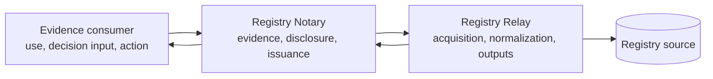

# Architecture overview

Registry Notary is the Registry Stack evidence product. It authenticates the
caller, enforces service policy, evaluates claims, applies disclosure, and can
issue a credential. It is not a registry, source connector, or integration
runtime.

## Deployment topologies

A Registry Stack project represents one registry trust domain. One environment
may activate at most one logical Relay and one logical Notary, with identical
replicas and coordinated replacement generations permitted.

- A Relay-only deployment exposes governed source capabilities without Notary.
- A Notary-only deployment supports source-free self-attested evidence.
- A combined deployment lets Notary derive claims from its project's single Relay.

When both products are present, Notary receives no registry destination or
credential. It invokes compiler-produced Relay consultation profiles and
verifies their full semantic contract before serving.

## Registry-backed request lifecycle

1. Notary authenticates the caller and checks scope, purpose, relationship,
   and service policy before any Relay call.
2. Notary maps the closed request grammar to one compiler-pinned consultation.
3. Relay validates its workload token, purpose, inputs, and `contract_hash`
   before source access.
4. Relay returns `match`, `no_match`, or `ambiguous`, plus typed minimized
   outputs only on `match` and closed acquisition provenance.
5. Notary derives direct and CEL evidence claims, applies disclosure, and
   either returns the result or issues an allowed credential.
6. The evidence consumer determines how the returned evidence is used. The
   decision owner applies any requirement, decision, workflow, or action
   policy.
7. Each product writes its own redacted audit record. The evaluation id and
   consultation id support restricted cross-service reconciliation.

Notary never treats a Relay failure as `no_match`. Ambiguity, denial, source,
verification, availability, or contract failure aborts the affected
consultation group. Raw Relay errors are not exposed as claim values.

## Source-free and delegated evidence

`self_attested` evidence performs no Relay or source I/O. Its rules and
dependency closure must remain source-free. Delegated authorization is a
separate Notary authorization decision, not a consumer decision. Where a
delegated relationship is proved by Relay, Notary still pins the exact
consultation and performs all authorization checks before invoking it.

## Product boundaries

Relay owns source authentication, network policy, HTTP and protocol helpers,
Rhai source adaptation, typed outputs, and acquisition provenance. Notary owns
caller authentication, purpose and legal basis, consent policy, reusable
evidence claims, CEL evidence derivation, disclosure, credential profiles,
signing, and issuance. The evidence consumer determines how returned evidence is
used, and the decision owner remains accountable for requirements, eligibility,
qualification, prioritization, approval, referral, payment, workflow, and
action policy. Their state and audit authority remain separate.

Notary may attest a decision that an authoritative source has already made.
That claim is a source-owned decision and must be named and documented as such;
Notary does not recompute it as consumer policy.
