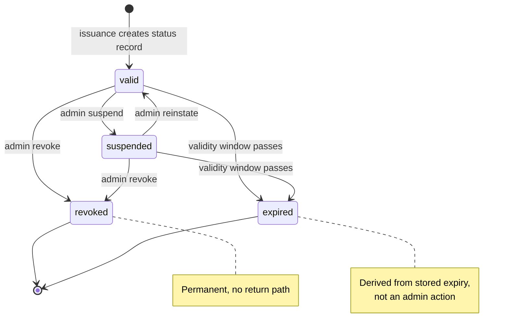

# Credential lifecycle and status

> **Page type:** How-to · **Product:** Registry Notary · **Layer:** credential · **Audience:** operator

Registry Notary issues SD-JWT VC credentials with explicit expiry. Live
credential status is optional. This guide explains the default lifecycle, when
to enable status, what status means, and how to run it.

## Default lifecycle

By default, issued credentials are status-free:

- No `status` claim is added to the SD-JWT VC payload.
- No revocation list or status-list profile is published.
- Verifiers rely on issuer trust, holder binding, and credential expiry.
- Credential profiles default to 600 seconds of validity when
  `validity_seconds` is omitted; set an explicit validity period that matches
  the use case for wallet-facing profiles.

The top-level `evidence.max_credential_validity_seconds` sets the issuing
agency's local ceiling, and profile validity must be between 1 second and that
maximum. Self-attestation profiles are also bounded by
`subject_access.token_policy.max_credential_validity_seconds`.

This lets operators keep offer codes, access tokens, proofs, and evidence
freshness short while issuing wallet-held credentials with a practical validity
window. Enable live status or another revocation/lifecycle surface for
deployments that need longer-lived credentials.

## When to enable status

Enable credential status when verifiers need to check a live lifecycle state
after issuance, for example:

- A credential may need temporary suspension.
- A credential may need revocation before its expiry.
- A verifier policy requires live issuer status.
- An operator wants a bounded audit trail for lifecycle actions.

Do not enable status only because it is familiar from other credential systems.
It adds an online dependency for verifiers and creates an operational store that
must be kept available for the retention window.

## Configuration

```yaml
credential_status:
  enabled: true
  base_url: https://notary.example.gov
  retention_seconds: 86400
```

Fields:

- `enabled`: adds status records during issuance and includes a status claim in
  issued credentials.
- `base_url`: public HTTPS origin used to build status URLs. Use plain HTTP only
  for local or lab deployments.
- `retention_seconds`: how long status records are retained.

Credential status uses the global `state` backend. Production and
multi-instance deployments use the Notary-owned PostgreSQL state schema. An
explicit local, single-instance configuration can use `state.storage:
in_memory`, which loses status rows on restart.

## Credential payload

When status is enabled, issued SD-JWT VC payloads include the IETF Token Status
List `status.status_list` claim. The status-list URI is anchored at the public
base URL:

```json
{
  "status": {
    "status_list": {
      "idx": 0,
      "uri": "https://notary.example.gov/v1/credentials/urn:ulid:01HX.../status"
    }
  }
}
```

Registry Notary uses one status-list token per credential in this profile. The
same URL returns a signed `application/statuslist+jwt` token when requested with
`Accept: application/statuslist+jwt`, and retains the JSON lifecycle response
for operational compatibility.

`status` is a reserved top-level credential claim. It cannot be configured as a
selectively disclosable OID4VCI projection, so a holder cannot remove the live
status requirement while presenting the credential.

## Status values

The public status response can report:

| Status | Meaning |
| --- | --- |
| `valid` | The credential has an active status record and is not expired. |
| `suspended` | The operator has temporarily disabled the credential. |
| `revoked` | The operator has permanently revoked the credential. |
| `expired` | The credential lifetime has passed. This can be derived from the stored expiry. |

Only `valid`, `suspended`, and `revoked` are mutable lifecycle states. `expired`
is derived from time.



*Credential status lifecycle. Admin mutation moves a credential between `valid`,
`suspended`, and `revoked`; `expired` is derived from the stored expiry rather
than set by an operator.*

## Privacy boundary

Status records intentionally contain lifecycle metadata only:

- Credential id.
- Issuer or service metadata needed by Notary.
- Credential profile id.
- Issued-at and expires-at timestamps.
- Last-updated timestamp.
- Current lifecycle status.

Status records must not contain:

- Subject ids.
- Holder DIDs or holder public keys.
- Claim values.
- SD-JWT disclosures.
- Source rows.
- Raw access tokens or proof JWTs.

This lets a verifier check lifecycle state without turning the status store into
a second registry of personal data.

## Status operations

Status operations are exposed as:

- Public status retrieval at the credential's status URL.
- Admin status mutation for operators with `registry_notary:admin`.

Use the SDK methods where possible so your integration does not depend on route
names directly:

- Rust: `credential_status(...)` and `update_credential_status(...)`.
- Node.js and Python wrappers expose only the read-only status lookup
  (`credentialStatus` / `credential_status`); the admin status mutation is
  available via Rust or HTTP only.

Admin mutation accepts a new status value of `valid`, `suspended`, or
`revoked`.

## Operational model

Credential issuance creates the status record after the credential id and
expiry are known. If the status store cannot write the record, issuance fails
closed: Notary returns an issuance error instead of a credential that
references a missing live status URL.

Treat status retrieval as public verifier traffic. Status mutation is an
admin operation; limit it to trusted operator tooling.

Readiness fails when the PostgreSQL state backend is unavailable or its schema,
role, write authority, or durability contract cannot be attested. That is
preferable to issuing status-bearing credentials that cannot be checked or
updated reliably.

## Retention

Set `retention_seconds` to cover:

- Maximum credential validity.
- Expected verifier clock skew.
- Any grace period required by the relying party.
- Audit or dispute window for lifecycle actions.

For the current 600-second credential ceiling, 24 hours is usually enough for
test and pilot deployments. Production policies may require longer status
retention even though the credential itself is short lived.

Do not shorten retention while outstanding credentials still reference status
URLs unless verifiers have agreed to treat missing status records as expired or
invalid.

## Verifier policy

Make verifier policy explicit:

- Accept status-free credentials only from profiles that are expected to be
  status-free.
- For status-bearing credentials, fetch the `status.status_list.uri` with
  `Accept: application/statuslist+jwt` only when its origin exactly matches the
  verifier's configured trusted HTTPS status origin. Validate the signed token,
  issuer, type, lifetime, index, and require the indexed value to be `0x00`
  (`VALID`).
- Fail closed on `0x01` (`INVALID`), `0x02` (`SUSPENDED`), missing status,
  malformed status, an untrusted origin, or network failure. A status-bearing
  credential is not valid when its live status cannot be verified.
- Apply credential expiry even when status returns `valid`.

Registry Notary does not currently publish aggregated status lists or external
revocation-list profiles. The supported status profile is documented in
[`sd-jwt-vc-conformance-profile.md`](sd-jwt-vc-conformance-profile.md).

## Rollout checklist

- Confirm every credential profile that needs status is issued by a deployment
  with `credential_status.enabled: true`.
- Confirm `credential_status.base_url` is the public issuer URL verifiers can
  reach.
- Install and attest the Notary-owned PostgreSQL state schema before serving.
- Back up status rows with the rest of the Notary correctness state.
- Confirm `/ready` fails when the status backend is unavailable.
- Run one credential issuance and verify the payload has a status URL.
- Fetch that status URL and confirm `valid`.
- Mutate a test credential to `suspended` or `revoked` with an admin credential.
- Confirm audit records exist for issuance and mutation without raw personal
  data.

## Troubleshooting

| Symptom | Likely cause | Check |
| --- | --- | --- |
| Issued credential has no status claim | `credential_status.enabled` is false in the issuing deployment | Check expanded config |
| Status URL points at localhost | `credential_status.base_url` was copied from a local config | Set public HTTPS base URL |
| Status is missing after restart | `state.storage: in_memory` was used | Install and use PostgreSQL correctness state |
| Admin update is unauthorized | Missing `registry_notary:admin` scope | Check caller scopes or OIDC scope mapping |
| Verifier sees `expired` quickly | Profile validity is short or clocks differ | Check `validity_seconds`, verifier clock, and expiry policy |
| Readiness fails after enabling status | PostgreSQL is unavailable or state attestation failed | Run `registry-notary state doctor` and check the named state configuration field |
