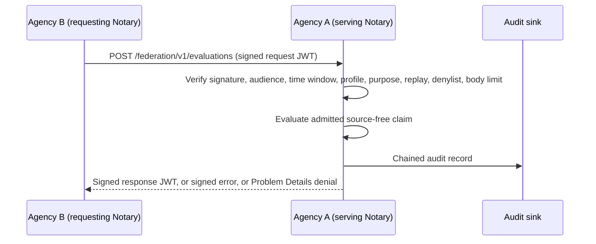

# Federated evaluation operator guide

> **Page type:** How-to · **Product:** Registry Notary · **Layer:** federation · **Audience:** operator

This guide shows the minimum static-peer setup for delegated evaluation.
It covers static peer configuration, inbound request verification, and the
documented limits of the current implementation: no outbound Notary connector,
no dynamic trust registration, and explicit in-memory state suitable for local,
single-process development only.

## What this enables

One trusted Notary can call another trusted Notary:

```text
Agency B -> signed request JWT -> Agency A /federation/v1/evaluations
Agency B <- signed response JWT <- Agency A
```

The serving Notary verifies the request, enforces local peer policy, evaluates
an admitted source-free claim only after policy passes, emits audit, and
returns a signed result.



*The delegated evaluation exchange. Every check runs before claim evaluation,
and an audit write failure prevents a successful signed response.*

## Required environment

Set these before starting the serving Notary:

```bash
export REGISTRY_NOTARY_AUDIT_HASH_SECRET='change-me-audit-hash-secret'
export REGISTRY_NOTARY_FEDERATION_RESPONSE_JWK='{"kty":"OKP","crv":"Ed25519","d":"...","x":"...","alg":"EdDSA"}'
export REGISTRY_NOTARY_PAIRWISE_SUBJECT_HASH_SECRET='change-me-pairwise-secret'
```

Do not reuse the pairwise subject hash secret for audit hashing, cookies,
credential signing, or federation response signing. Federation response
signing references a named key from `evidence.signing_keys`, so the same local
JWK and PKCS#11 providers are used for evidence and federation signatures.

## Minimal config shape

```yaml
evidence:
  signing_keys:
    federation-response:
      provider: local_jwk_env
      alg: EdDSA
      kid: agency-a-fed-1
      status: active
      private_jwk_env: REGISTRY_NOTARY_FEDERATION_RESPONSE_JWK

federation:
  enabled: true
  node_id: did:web:agency-a.example.gov
  issuer: https://agency-a.example.gov
  jwks_uri: https://agency-a.example.gov/federation/jwks.json
  federation_api: https://agency-a.example.gov/federation/v1
  supported_protocol_versions:
    - registry-notary-federation/v0.1
  inbound_body_limit_bytes: 16384
  max_request_lifetime_seconds: 300
  clock_leeway_seconds: 60
  signing:
    signing_key: federation-response
  pairwise_subject_hash:
    secret_env: REGISTRY_NOTARY_PAIRWISE_SUBJECT_HASH_SECRET
  response_shaping:
    minimum_denial_latency_ms: 250
  emergency_denylist:
    node_ids: []
    kids: []
  peers:
    - node_id: did:web:agency-b.example.gov
      issuer: https://agency-b.example.gov
      jwks_uri: https://agency-b.example.gov/.well-known/jwks.json
      # Local Compose demos may use allow_insecure_private_network: true with
      # an HTTP service URL. Production peer JWKS URLs must use HTTPS.
      allowed_protocol_versions:
        - registry-notary-federation/v0.1
      allowed_purposes:
        - https://purpose.example.gov/social-protection/service-delivery
      allowed_profiles:
        - disability_status_predicate
      evaluation_scopes:
        - disability_registry:evidence_verification
  evaluation_profiles:
    - id: disability_status_predicate
      ruleset: disability-status-v1
      claim_id: disability_status
      subject_id_type: national_id
      max_claim_result_age_seconds: 3600
```

The local `peers` block is authoritative. Manifest metadata helps partners
configure each other, but it does not grant access.

`evaluation_scopes` are the scopes assigned to the authenticated federation
principal when authorizing the selected local claim. They do not grant registry
or Relay source access. `max_claim_result_age_seconds` bounds the age of the
local claim result's `issued_at` timestamp.

The current federation endpoint cannot select a claim with
`evidence_mode.type: registry_backed`. Startup rejects that composition because
federation audit does not yet carry the Notary evaluation id and Relay
consultation ids needed for end-to-end reconciliation. The existing federation
MVP is therefore limited to admitted source-free/self-attested claims.
Relay-backed federation is deferred until the audit boundary is implemented as
one complete feature. Notary has no direct registry-source fallback.

`allow_insecure_private_network` is a development and lab escape hatch for
private Compose networks. It allows HTTP peer JWKS fetches through the shared
bounded-fetch policy while still blocking cloud metadata targets. Do not enable
it for production federation.

## Request requirements

Send `POST /federation/v1/evaluations` with:

- `Content-Type: application/jwt`
- compact JWS serialization
- protected header `typ = registry-notary-request+jwt`
- `alg = EdDSA`
- `kid` present in the configured peer JWKS
- payload claims `iss`, `sub`, `aud`, `iat`, `nbf`, `exp`, `jti`, `protocol`,
  `action`, `profile`, `purpose`, and `request`

The serving Notary rejects the request before claim evaluation when signature,
audience, time window, profile, purpose, replay, emergency denylist, or body
limit checks fail.

## Response requirements

Successful responses are compact signed JWTs with:

- protected header `typ = registry-notary-response+jwt`
- `iss` and `sub` for the serving Notary
- `aud` for the requesting peer node id
- `request_jti` copied from the request
- `result.subject_ref.hash` as a pairwise `hmac-sha256:` handle

Stale claim results return HTTP 200 with a signed top-level `error` object.
Transport denials use RFC 9457 Problem Details JSON and do not prove whether
the subject exists.

## Correctness state

Replay protection uses the global Notary correctness-state backend. Production
and multi-instance deployments use the Notary-owned PostgreSQL schema. Local,
single-process development can select in-memory state explicitly:

```yaml
deployment:
  profile: local
  multi_instance: false
state:
  storage: in_memory
```

Do not run active-active federation with in-memory state. Install the
PostgreSQL schema and run `registry-notary state doctor` before enabling
privileged federation traffic. See
[`postgresql-state-operations.md`](postgresql-state-operations.md) for role,
installation, backup, restore, and upgrade procedures.

## Verification checklist

Also confirm:

- federation routes are absent when `federation.enabled` is false;
- the peer JWKS contains the request signing `kid`;
- raw subject identifiers do not appear in audit JSONL;
- audit write failure prevents a successful signed response;
- replaying the same request `jti` returns a denial.
