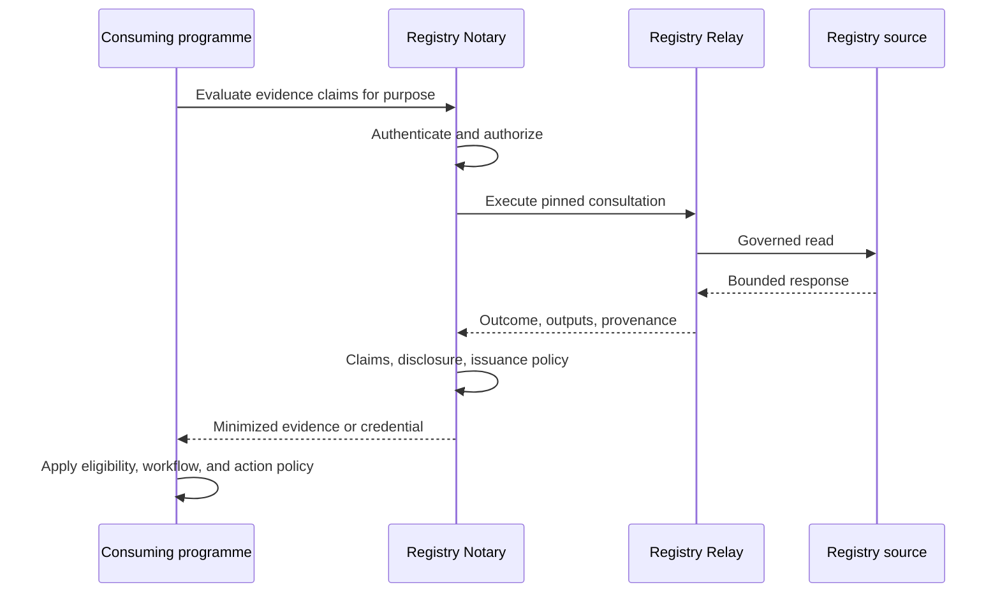
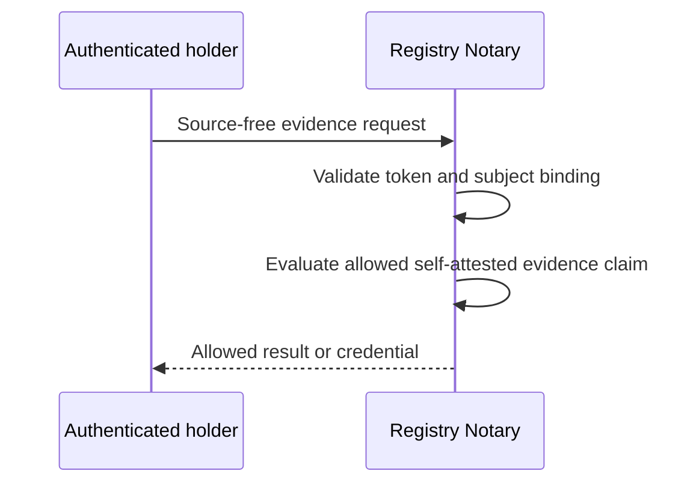
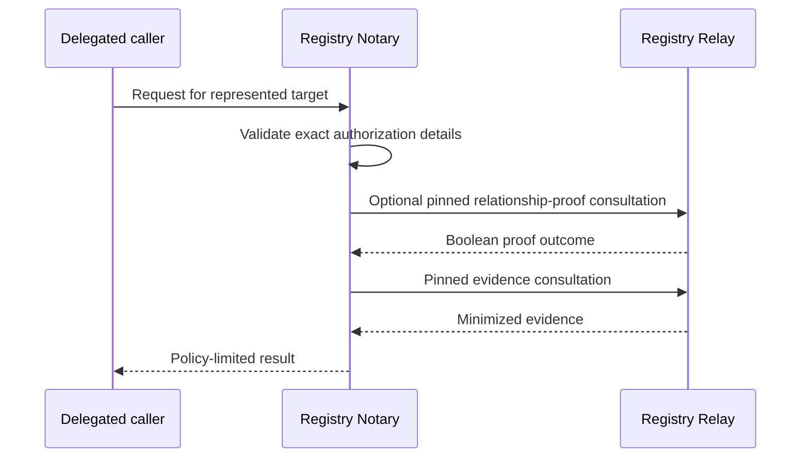

# Registry Notary scenario patterns

## Registry-backed evaluation

One consultation can support several direct and CEL evidence claims. Relay
returns typed outputs, Notary owns evidence meaning and disclosure, and the
consuming programme owns its eligibility and action rules.

## Self-attested Notary-only evaluation

This topology performs no Relay or registry-source call. The identity token
authorizes subject-bound access; it does not establish programme eligibility.

## Delegated evaluation

The proof consultation proves only the configured requester-target edge. It
does not add scopes or grant source authority. Binding or scope failure must
make zero Relay calls.

## Credential issuance

Credential issuance reuses an allowed evaluation. The credential profile owns
claim membership, format, holder binding, validity, and disclosure. A direct
output claim is not issued on `no_match`; ambiguity or failure never issues.

## Unsupported composition

A project does not join independent registry trust domains. Cross-registry
composition requires separately governed projects and explicit federation or
an external workflow. Notary does not execute source adapters or general
orchestration.
