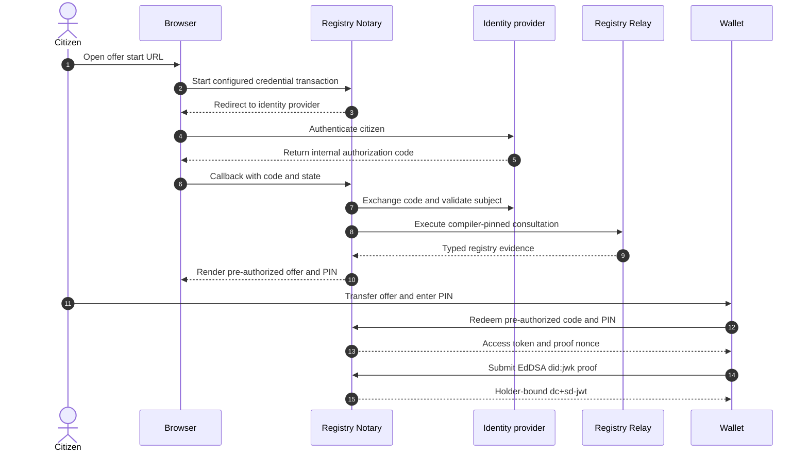

# OID4VCI wallet interoperability

> **Page type:** How-to · **Product:** Registry Notary · **Layer:** credential · **Audience:** operator, integrator

Registry Notary exposes an issuer-initiated pre-authorized code flow for
issuing registry-backed `dc+sd-jwt` credentials to holder wallets. Source-free
`self_attested` claims remain evaluation-only and cannot appear in an OID4VCI
credential configuration.

## Supported 1.0 profile

The wallet facade supports:

- registry-backed claims whose exact compiler-pinned Relay execution is stored
  in a Notary transaction;
- `dc+sd-jwt` credentials;
- EdDSA or ES256 issuer signing, selected by the credential profile;
- EdDSA JWT holder proof with `did:jwk` binding;
- an issuer-initiated pre-authorized code grant;
- one credential per immediate response.

It does not support wallet-facing authorization-code grants, a public nonce
route, response next nonces, ES256 holder proof, source-free issuance, EUDI or
HAIP profiles, PAR, DPoP, or wallet attestation.

The eSignet authorization code used during the browser callback is internal to
Notary's identity-provider login. The wallet never receives or redeems it.

## Topology and prerequisites

Deploy one Notary for each Relay authority. Notary owns its transaction,
pre-authorized code, proof replay, evaluation, audit, and credential-status
state. Use the Notary-owned PostgreSQL schema for production or multiple
instances. In-memory state is for explicit local single-process use only.

Before enabling the wallet facade:

- configure the Relay connection and compile the claim consultation pins;
- configure `subject_access` for the identity-provider binding claim;
- bind every OID4VCI configuration to one mutually valid registry-backed claim
  and credential profile;
- configure separate signing keys for identity-provider client assertions,
  Notary access tokens, and credentials;
- expose HTTPS issuer, callback, token, credential, and Type Metadata URLs;
- set the Notary state backend and rate limits.

See the [operator configuration reference](operator-config-reference.md) and
[credential issuance migration](credential-issuance-migration.md).

## End-to-end developer check

1. Open this URL in the citizen's browser:

   ```text
   https://notary.example.gov/oid4vci/offer/start?credential_configuration_id=<id>
   ```

2. Complete the configured identity-provider login.
3. After the callback succeeds, scan or paste the rendered
   `openid-credential-offer://` URI into the wallet.
4. Enter the separately displayed numeric PIN when the wallet asks for the
   `tx_code`.
5. Confirm that the wallet redeems the offer at `/oid4vci/token` and calls
   `/oid4vci/credential` with an EdDSA `did:jwk` proof.
6. Verify the returned credential with the issuer JWKS and the expected holder
   binding.

A successful check establishes all of these observations:

- issuer metadata is reachable at
  `/.well-known/openid-credential-issuer`;
- Type Metadata is reachable at `/.well-known/vct/{vct_path}`;
- metadata advertises `dc+sd-jwt`, `did:jwk`, EdDSA holder proof, and the
  configured EdDSA or ES256 issuer algorithm;
- metadata has a `/oid4vci/token` endpoint and no nonce endpoint;
- the offer contains exactly the
  `urn:ietf:params:oauth:grant-type:pre-authorized_code` grant;
- the default offer contains a numeric `tx_code` description;
- the token response supplies the proof nonce bound to that transaction;
- the credential response has no next-nonce fields;
- the SD-JWT VC has the expected `iss`, `vct`, EdDSA `did:jwk` holder binding,
  and registry-backed disclosures.



## Transaction code modes

The secure default is:

```yaml
oid4vci:
  pre_authorized_code:
    enabled: true
    pre_authorized_code_ttl_seconds: 300
    tx_code:
      required: true
      input_mode: numeric
      length: 6
```

Codes are short-lived and single-use. Wrong PIN attempts are bounded per offer,
and invalid-code attempts are rate limited per client address.

Some wallet versions, including the Walt compatibility profile, cannot present
a transaction code. Make that weaker mode explicit:

```yaml
oid4vci:
  pre_authorized_code:
    enabled: true
    pre_authorized_code_ttl_seconds: 300
    tx_code:
      required: false
```

The TTL must be no more than 300 seconds in this mode. An offer without a PIN is
bearer credential material until redemption. A person who steals the
unredeemed offer can use it during that window. Keep the offer out of logs,
analytics, screenshots, browser synchronization, and support messages. The
code remains single-use and redemption remains rate limited.

## Metadata and Type Metadata

Issuer metadata is derived from active Notary configuration. Wallets should
assert exact values rather than infer capability from permissive schema fields:

- `credential_issuer` equals the configured public issuer;
- `token_endpoint` equals the Notary token endpoint;
- every credential configuration has `format: dc+sd-jwt`;
- `cryptographic_binding_methods_supported` is exactly `[did:jwk]`;
- JWT `proof_signing_alg_values_supported` is exactly `[EdDSA]`;
- the issuer algorithm is exactly the active profile algorithm;
- `vct` is the configured public HTTPS identifier;
- no nonce endpoint is advertised.

Notary serves Type Metadata at both the configured `vct` URL and the
`/.well-known/vct/{vct_path}` form used by wallets. It describes each projected
claim and its selective-disclosure behavior. `status` is a reserved top-level
claim and cannot be projected as a selectively disclosable value.

## Credential request and response

The wallet sends one proof using either the supported single-proof shape or the
single-entry proof-array shape. Multiple proofs and mixed shapes are rejected.
The proof must be fresh, have the Notary issuer as audience, contain the
transaction-bound nonce from the token response, use EdDSA, and identify the
holder as `did:jwk`.

The response contains the immediate credential in its compatibility envelope.
It does not return a new proof nonce. The wallet or verifier should check:

- issuer signature and configured issuer algorithm;
- expected `vct` and credential lifetime;
- exact EdDSA `did:jwk` holder binding;
- SD-JWT disclosure hashes;
- live status when the credential contains a status claim.

For a status-bearing credential, verification fails closed on an unavailable,
untrusted, malformed, expired, suspended, revoked, or otherwise invalid status
response. Status retrieval is restricted to the configured exact HTTPS trusted
origin.

## Security invariants

- Notary creates the offer only after the identity binding and registry-backed
  evaluation succeed.
- The credential endpoint reloads the stored transaction and verifies the
  active claim, profile, purpose, contract hash, Relay ULID, acquisition time,
  and claim provenance before signer access.
- Wallet input cannot select a free-form subject or replace stored evidence.
- Pre-authorized codes, access tokens, proof nonces, and transaction bindings
  are time bounded and replay protected.
- Identity-provider codes, wallet grants, access tokens, proof JWTs, subjects,
  registry rows, and disclosures must not appear in logs.

## Compatibility evidence

Record the wallet and verifier product, exact version, configuration override,
artifact digest, and observed result for every external run. Local source tests
cover EdDSA and ES256 issuer variants with an EdDSA `did:jwk` holder. External
wallet, verifier, OIDF, EUDI, or HAIP conformance remains candidate-only until a
frozen candidate artifact and immutable evidence are published.

## Troubleshooting

| Symptom | Likely cause | Check |
| --- | --- | --- |
| OID4VCI routes are unavailable | The facade or pre-authorized flow is disabled | Expanded config and startup diagnostics |
| Configuration is rejected | A source-free, delegated, mixed, or one-sided credential binding remains | Claim evidence mode, profile bindings, and OID4VCI projections |
| Offer is not rendered | Identity binding, Relay execution, or stored transaction creation failed | Sanitized audit records and Relay availability |
| Wallet asks for a different grant | Wallet does not support issuer-initiated pre-authorized code | Wallet version and imported offer |
| PIN is rejected | Wrong, expired, replayed, or locked offer | Offer age and rate-limit diagnostics |
| Wallet cannot send a PIN | Compatibility profile needs explicit bearer-offer mode | `tx_code.required: false` and TTL no more than 300 seconds |
| Proof is rejected | Unsupported algorithm or binding, stale proof, wrong audience, or nonce mismatch | Wallet proof header and claims |
| Credential is denied after token redemption | Stored registry transaction is missing, stale, or does not match active compiler pins | Re-run the browser journey under one project generation |
| Wallet cannot verify | Issuer JWKS, `kid`, algorithm, `vct`, holder binding, or status mismatch | Active signing profile and verifier diagnostics |
| Multiple instances disagree | In-memory correctness state is in use | Install and select Notary-owned PostgreSQL state |
