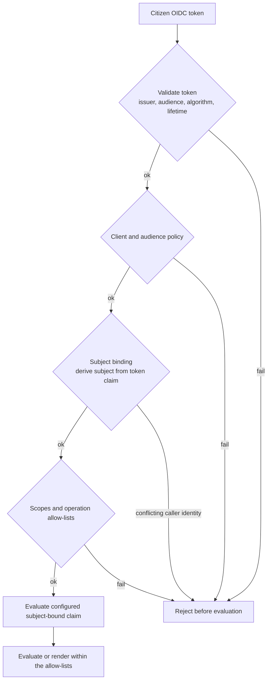

# Self-attestation operator guide

> **Page type:** How-to · **Product:** Registry Notary · **Layer:** evaluation, credential · **Audience:** operator

Self-attestation lets a citizen use their own OIDC token to evaluate or render
only the claims that policy allows. It can authorize credential issuance only
when every credential claim is registry-backed and the stored evaluation
retains the exact compiler-pinned Relay execution provenance. Source-free
claims are evaluation-only. The subject is bound to the token.
This guide is for operators configuring that flow with an identity provider and
relying-party or wallet clients. Registry-backed citizen evidence requires a
separately compiled Relay consultation and service policy.

Use [`oid4vci-wallet-interop.md`](oid4vci-wallet-interop.md) when the caller is
a wallet using the OID4VCI facade. Use this guide for the shared
self-attestation policy that sits underneath wallet and non-wallet citizen
flows.

## Security goal

The core guarantee is that a citizen token can only be used for the exact self
authorized by policy, and only for explicitly allowed claims, purposes,
formats, disclosures, and credential profiles.

The credential-profile allow-lists apply only to registry-backed claims. They
do not turn a `self_attested` claim into issuable evidence.

Notary validates the token, checks client and audience policy, checks subject
binding, checks scopes and operation allow-lists, then evaluates only the
configured subject-bound claims.



*Self-attestation gates a request through token validation, client and audience
policy, subject binding, and scope and operation allow-lists. Any gate failure
rejects the request before claim evaluation.*

For `/v1/evaluations`, citizen callers do not need to send their own target
identity. Registry Notary derives `requester`, `target`, and
`relationship: self` from the verified subject-binding token claim. Conflicting
caller-supplied identity context is rejected before claim evaluation.

## When to use it

Use self-attestation when:

- A citizen portal evaluates allowed evidence claims for the token-bound
  subject before the programme applies its own eligibility policy.
- A wallet flow issues a credential for the token-bound subject from a
  compiler-pinned Relay-backed evaluation.
- The identity provider can provide a stable, reviewed subject-binding claim.
- The evidence service accepts token-bound subject access for the configured purpose.

Self-attestation authorizes subject-bound access to configured evidence. The
identity token is not evidence of programme eligibility, and Registry Notary
does not turn it into an eligibility decision.

Do not use it when:

- The token has no trustworthy subject identifier.
- The same endpoint needs to evaluate arbitrary subjects for a case worker or
  service. Use machine auth for that.
- Claims require batch evaluation. Batch evaluation is not supported for self-attestation.
- The source owner has not approved citizen-token driven access.
- A Registry-backed claim cannot use a compiler-pinned Relay consultation whose
  inputs are bound to the authenticated requester or target identifiers.

## Identity provider requirements

Before enabling the flow, confirm with the identity-provider owner:

- Access tokens are JWTs Notary can verify through a JWKS URL.
- Tokens have a stable issuer and audience.
- The wallet or citizen client has a stable client id or audience.
- The token carries a claim that exactly identifies the registry subject.
- The token signing algorithm is explicit and stable. Configure the algorithm
  your provider actually uses, such as `EdDSA` or `RS256`, and do not mix
  symmetric and asymmetric algorithms in one deployment.
  RS256 JWKS keys must use a 2048-8192-bit RSA modulus.
- Token lifetime, auth age, assurance, and clock skew can satisfy your policy.
- External scopes can be mapped to the Notary scopes you require.

Avoid using `sub` as a civil identifier unless the identity-provider owner has
confirmed it is the right identifier for source lookups. If you do use `sub`,
set `allow_sub_as_civil_id: true` so the config records that decision.

## OIDC auth config

Self-attestation requires an `auth.oidc` block. There is no authentication mode selector:

```yaml
auth:
  oidc:
    issuer: https://idp.example.gov
    jwks_url: https://idp.example.gov/.well-known/jwks.json
    audiences:
      - registry-notary-citizen
    allowed_clients:
      - citizen-portal
    allowed_algorithms:
      - EdDSA
    allowed_token_types:
      - JWT
    scope_claim: scope
    scope_separator: " "
    scope_map:
      citizen.attest:
        - registry_notary:self_attest
    principal_claim: sub
    leeway: 60s
```

The `auth` block is additive, so OIDC can coexist with static `api_keys` for
machine clients. Static `bearer_tokens` cannot coexist with OIDC because both
use the `Authorization: Bearer` transport. Keep machine credentials out of a
citizen-facing deployment unless a reviewed use case requires both, and grant
every credential only its exact scopes.

## Subject binding

Subject binding is the most important part of the config:

```yaml
subject_access:
  subject_binding:
    token_claim: civil_id
    claim_source: access_token
    request_field: subject_id
    id_type: UIN
    normalize: exact
```

Rules:

- `token_claim` must be present in the configured token source.
- `claim_source` is `access_token` by default. Use `userinfo` only when
  `auth.oidc.userinfo_endpoint` is configured and reviewed. The pre-authorized-code
  flow resolves the same binding claim from its own RP login, so when
  `claim_source: userinfo` it additionally requires
  `oid4vci.pre_authorized_code.esignet.userinfo_url` (the callback fetches the
  userinfo JWS with the eSignet access token).
- `request_field` is currently `subject_id`.
- `id_type` should match the source lookup identifier type.
- `normalize` must be `exact`.

Exact matching is deliberate. Do not rely on case folding, punctuation removal,
or local identifier normalization unless that behavior is implemented and
reviewed as part of the product.

## Citizen client policy

Restrict which OIDC clients can use the flow:

```yaml
subject_access:
  citizen_clients:
    allowed_client_ids:
      - citizen-portal
    allowed_audiences:
      - registry-notary-citizen
```

At least one client id or audience is required. Any allowed audience must also
appear in `auth.oidc.audiences`. If `auth.oidc.allowed_clients` is nonempty,
each self-attestation client id must also be listed there.

## Token policy

Set explicit policy ceilings:

```yaml
subject_access:
  token_policy:
    required_acr_values:
      - urn:example:loa:substantial
    assurance_claim_source: access_token
    max_auth_age_seconds: 600
    max_access_token_lifetime_seconds: 900
    max_evaluation_age_seconds: 300
    max_credential_validity_seconds: 31536000
    max_clock_leeway_seconds: 60
```

Guidance:

- Keep access-token lifetime short for public citizen flows.
- Keep evaluation age short so a registry-backed credential is issued from
  fresh evidence.
- Set credential validity to the period the issuing agency wants verifiers to
  accept the wallet-held VC. Use credential status or another lifecycle surface
  for long-lived credentials.
- Keep clock leeway small and ensure `auth.oidc.leeway` does not exceed
  `max_clock_leeway_seconds`.
- Use `required_acr_values` when the identity provider can represent assurance
  level reliably.

## Allowed operations and claims

Every self-attestation surface is allow-listed:

```yaml
subject_access:
  allowed_operations:
    evaluate: true
    render: false
    issue_credential: true
    batch_evaluate: false
  allowed_purposes:
    - wallet_credential_issuance
  allowed_claims:
    - birth-record-exists
  allowed_formats:
    - application/vnd.registry-notary.claim-result+json
  allowed_disclosures:
    - value
    - redacted
  credential_profiles:
    - birth_record_sd_jwt
```

Rules:

- Enable only operations the citizen flow actually needs.
- `issue_credential: true` requires every allowed claim and credential-profile
  claim to use `registry_backed`. Use `issue_credential: false` for a
  source-free service.
- Include the canonical claim-result JSON format for the internal evaluation
  that backs issuance. The named credential profile separately selects
  `application/dc+sd-jwt` as the credential output.
- `batch_evaluate` must remain false; batch evaluation is not supported.
- `allowed_claims` must reference existing claims.
- `credential_profiles` must reference existing profiles.
- Credential profiles must use DID holder binding, proof of possession, and
  `did:jwk`.
- Claims and profiles must agree that the credential profile can issue that
  claim.

## Delegated self-attestation

Delegated subject access is available only when
`subject_access.delegation.enabled: true` and
`subject_access.delegation.allowed_relationships` contains the requested
relationship. Each allowed relationship names one compiler-pinned Relay-backed
`proof_claim` and its exact claims, purposes, formats, disclosures, and
no credential profiles. Delegated self-attestation is evaluation and rendering
only in 1.0. Both `/v1/credentials` and the OID4VCI credential endpoint reject
delegated evaluations. Keep delegation disabled unless that relationship proof
and its scoped authorization-details contract have been reviewed.

Configuration load rejects a delegated relationship `credential_profiles`
entry or a credential-profile binding on a delegated claim. To keep delegated
evaluation, remove that credential capability. To issue a credential, model a
separate registry-backed, non-delegated claim and bind it through
`subject_access.credential_profiles`.

## Scope policy

Use scope policy to require citizen tokens to carry an explicit permission:

```yaml
subject_access:
  scope_policy: required
  required_scopes:
    - registry_notary:self_attest
```

`scope_policy` values:

- `required`: required scopes must be present.
- `optional`: scopes may be present, but policy still records what is expected.
- `disabled`: no required scopes; `required_scopes` must be empty.

Prefer `required` for shared or public deployments. Use `disabled` only for
controlled demos where client and audience policy are sufficient.

## Wallet origins

For browser-based wallets or portals, list exact HTTPS origins:

```yaml
subject_access:
  allowed_wallet_origins:
    - https://wallet.example.gov
```

Wildcards are rejected. HTTP origins are rejected. Empty origins are acceptable
for non-browser or backend-mediated flows where CORS is not part of the path.

## Rate limits

Rate-limit counters use the configured Notary state plane. PostgreSQL shares
the counters across replicas; explicit local in-memory state keeps them in the
process:

```yaml
subject_access:
  rate_limits:
    invalid_token_per_client_address_per_minute: 20
    per_principal_per_minute: 30
    subject_mismatch_per_principal_per_hour: 5
    per_holder_per_hour: 20
    credential_issuance_per_principal_per_hour: 10
```

All values must be greater than zero. These application limits are guardrails,
but public deployments should also use gateway and identity-provider controls.

## Evidence and purpose review

`self_attested` claims perform no Relay or registry-source I/O.
`registry_backed` claims use only their exact compiler-pinned consultations.
Confirm that:

- every `self_attested` claim and dependency is source-free;
- no `self_attested` claim appears in `allowed_claims`, a credential profile,
  or an OID4VCI projection when credential issuance is configured;
- every `registry_backed` claim maps Relay inputs only from the authenticated
  requester or target identifiers;
- claim and request purposes are stable and auditable;
- caller scopes, client ids, audiences, formats, disclosures, and any
  registry-backed credential profiles are narrowly allow-listed; and
- the evidence service does not present self-attestation as registry-verified evidence; and
- the consuming programme, not Registry Notary, owns eligibility, entitlement,
  prioritization, referral, payment, and workflow decisions.

Use [`source-claim-modeling-guide.md`](source-claim-modeling-guide.md) to
review the evidence boundary.

## Rollout checklist

- OIDC issuer, JWKS, audience, and client id are stable.
- The subject-binding claim is reviewed and present in test tokens.
- `normalize: exact` is acceptable for the identifier format.
- `scope_policy: required` is used unless there is a documented reason not to.
- All allow-lists are narrow and reference existing claims and profiles.
- Source-free services set `issue_credential: false` and configure no
  credential profiles or OID4VCI credential configurations.
- Batch is disabled.
- Credential profiles use DID holder binding with proof of possession.
- Wallet origins are exact HTTPS origins, or empty for non-browser flows.
- Gateway and identity-provider rate limits are in place.
- PostgreSQL correctness state is installed when multiple processes can serve
  holder-proof or nonce traffic.
- `doctor` passes, then a controlled self-attestation test passes with a test
  subject.

## Troubleshooting

| Symptom | Likely cause | Check |
| --- | --- | --- |
| Config validation fails | OIDC is missing or a static bearer token is also configured | `auth.oidc`, `auth.bearer_tokens` |
| Token rejected | Issuer, audience, client id, algorithm, or scope mismatch | Token header and claims, `auth.oidc`, `scope_map` |
| Subject mismatch | Token claim is missing or caller-supplied identity context conflicts with the derived subject | `subject_binding.token_claim`, token claims, request body identity fields |
| Userinfo subject not found | `claim_source: userinfo` without a usable endpoint or issuer | `auth.oidc.userinfo_endpoint`, `userinfo_issuers` |
| Delegation config rejected | Delegated authorization does not match the compiled service policy | Check requester, target, relationship, purpose, and authorization details |
| Delegated credential config rejected | A delegated relationship or delegated claim still carries a credential-profile binding | Remove the delegated credential capability, or use a registry-backed non-delegated credential claim |
| Credential config rejected | A source-free claim or mixed profile was exposed for issuance | Use only mutually bound `registry_backed` claims in `allowed_claims`, credential profiles, and OID4VCI projections |
| Credential issuance denied after upgrade | The evaluation is legacy, source-free, or its stored Relay execution pins do not match | Re-evaluate the exact registry-backed claims under the active configuration |
| Batch request denied | Batch evaluation is not supported for self-attestation | Keep `batch_evaluate: false` |
| Works locally but fails active-active | `state.storage: in_memory` is process-local | Add gateway limits and install PostgreSQL correctness state |
