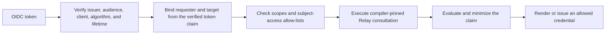

# Subject access operator guide

> **Page type:** How-to · **Product:** Registry Notary · **Layer:** evaluation, credential · **Audience:** operator

Subject access lets an authenticated person evaluate, render, or receive
credentials from policy-approved Registry Relay evidence about themselves.
The identity token authorizes access. It is not evidence and never supplies a
claim value.

Every Notary claim must derive from at least one compiler-pinned Relay
consultation. Notary does not support caller-authored or source-independent
claim issuance or evaluation.

## Security goal

An OIDC token can be used only:

- for the exact subject bound by the configured token claim;
- by an allowed client and audience;
- for explicitly allowed operations, purposes, claims, formats, disclosures,
  and credential profiles;
- with Relay consultation inputs bound to the authenticated requester or
  target identifiers; and
- within the configured token, evaluation, and credential age limits.



Any failed gate rejects the request. Caller-supplied identity fields cannot
override the token-bound subject.

## When to use it

Use subject access when:

- a person needs evidence about their own registry record;
- a wallet flow needs a credential backed by current registry evidence;
- the identity provider supplies a stable, reviewed subject identifier; and
- the source owner has approved token-bound access for the configured purpose.

Use machine authentication for caseworker or service access to arbitrary
subjects. Batch evaluation is a machine-client operation and is unavailable to
subject-access principals.

## OIDC authentication

Configure the external identity provider:

```yaml
auth:
  oidc:
    issuer: https://idp.example.gov
    jwks_url: https://idp.example.gov/.well-known/jwks.json
    audiences: [registry-notary-citizen]
    allowed_clients: [citizen-portal]
    allowed_algorithms: [EdDSA]
    allowed_token_types: [JWT]
    scope_claim: scope
    scope_separator: " "
    scope_map:
      citizen.evidence:
        - registry_notary:subject_access
    principal_claim: sub
    leeway: 60s
```

OIDC can coexist with static API keys for machine clients. Static bearer
tokens cannot coexist with OIDC because both use the `Authorization: Bearer`
transport.

## Subject binding

Bind the authenticated identity to the registry lookup identifier:

```yaml
subject_access:
  enabled: true
  subject_binding:
    token_claim: civil_id
    claim_source: access_token
    request_field: subject_id
    id_type: UIN
    normalize: exact
```

- Use `userinfo` only when the endpoint and signed response are configured and
  reviewed.
- Avoid using `sub` as a civil identifier unless the identity-provider owner
  confirms that it is appropriate. If selected, set
  `allow_sub_as_civil_id: true`.
- Keep `normalize: exact`. Identifier transformations belong at an explicitly
  reviewed boundary.

## Client and token policy

```yaml
subject_access:
  citizen_clients:
    allowed_client_ids: [citizen-portal]
    allowed_audiences: [registry-notary-citizen]
  token_policy:
    required_acr_values: [urn:example:loa:substantial]
    assurance_claim_source: access_token
    max_auth_age_seconds: 600
    max_access_token_lifetime_seconds: 900
    max_evaluation_age_seconds: 300
    max_credential_validity_seconds: 31536000
    max_clock_leeway_seconds: 60
```

Keep public-client tokens and stored evaluations short-lived. Credential
validity is a separate issuer policy and should be paired with credential
status when long-lived credentials are required.

## Allowed operations

```yaml
subject_access:
  allowed_operations:
    evaluate: true
    render: true
    issue_credential: true
    batch_evaluate: false
  allowed_purposes: [wallet_credential_issuance]
  allowed_claims: [birth-record-exists]
  allowed_formats:
    - application/vnd.registry-notary.claim-result+json
  allowed_disclosures: [value, redacted]
  credential_profiles: [birth_record_sd_jwt]
  required_scopes: [registry_notary:subject_access]
  allowed_wallet_origins: [https://wallet.example.gov]
```

All referenced claims must be Relay-backed. Credential profiles must agree
with each claim's allow-list and require the configured holder binding and
proof of possession.

## Delegated subject access

Delegated access lets an authenticated requester act for a configured target
only after a separate Relay-backed relationship proof passes.

```yaml
subject_access:
  delegation:
    enabled: true
    allowed_relationships:
      - relationship_type: guardian
        proof_claim: guardian-link-established
        target_id_type: civil_registration_id
        max_proof_age_seconds: 300
        allowed_claims: [dependent-birth-record-exists]
        allowed_purposes: [dependent-record-access]
        allowed_formats:
          - application/vnd.registry-notary.claim-result+json
        allowed_disclosures: [predicate]
```

The request uses `access_mode: delegated_subject_access`. The requester and
target identifiers are bound independently, and `proof_claim` must be a
compiler-pinned Relay-backed boolean claim.

Direct `/v1/credentials` issuance does not accept delegated evaluations.
Representative credential issuance requires the explicit OID4VCI digitally
authenticated representative ceremony.

## Operational checks

Before enabling subject access:

1. Run `registry-notary doctor --config <path>`.
2. Verify every allowed claim references the intended Relay consultation and
   exact target identifier mapping.
3. Confirm client, audience, scope, purpose, disclosure, and credential
   allow-lists with the source and identity-provider owners.
4. Exercise subject mismatch, stale token, wrong client, wrong audience,
   disallowed claim, Relay unavailable, and relationship-proof failure paths.
5. Confirm audit output contains pseudonymous identifiers only.
6. Confirm rate limits and wallet CORS origins match the deployment posture.

Use [OID4VCI wallet interop](oid4vci-wallet-interop.md) for wallet protocol
configuration and
[representative credential issuance](representative-credential-issuance.md)
for the representative ceremony.
